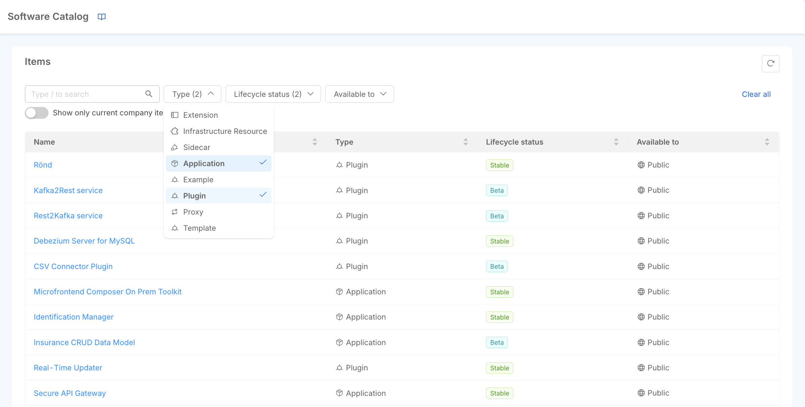
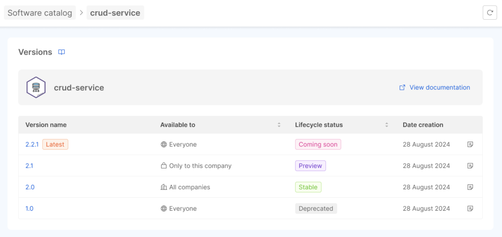
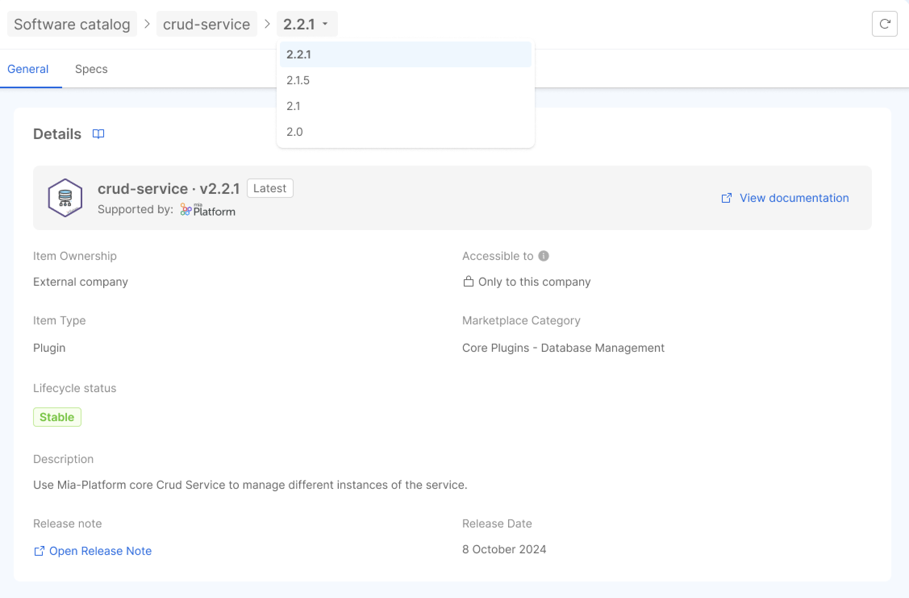

Mia-Platform Software Catalog tracks and stores information about all the components that make up your infrastructure. You can view all the items by navigating to `Software Catalog > All Items`. Additionally, you can explore the item details.

## Items discovery

Upon accessing the Software Catalog frontend, users are directed to the main section of the catalog, where they will find a search bar that serves as the starting point for navigating through the items. Given the extensive range of items that can be retrieved with this tool, users can refine their search results by setting the search context and utilizing advanced filtering options.

### Advanced filters

The advanced filters enable users to refine their search based on the following criteria.

- *Type*: filter items by their specific type or category.
- *Lifecycle status*: narrow down items according to their current lifecycle phase (e.g., Coming Soon, Stable, Deprecated).
- *Availability*: this filter determines whether an item is accessible to all companies, visible to any user accessing the Console (even unauthenticated users), or restricted to the current company only.

Additionally, users can toggle between viewing items that are specific to the company they are working in or all available items. 

## Item details navigation

After locating the desired resource from the search results, you can click on it to access its details page.

At the top of the page, a breadcrumb navigation trail provides users with a straightforward way to navigate between different items and their respective versions. This intuitive feature allows for seamless exploration of related resources, enhancing the overall user experience within the Software Catalog.

### Versions

If the item selected supports versioning, the first page will display a list of available versions. Each version includes key information such as the release date and, if available, a release note. For more details on versioning and how to manage it, please refer to [this documentation](/software-catalog/manage-items/overview.md#versioned-resources).

By selecting a version, you are taken to the details specific to that version. From there, you can continue to navigate between versions or other related items using the breadcrumb navigation at the top of the page, ensuring a smooth transition between different resources.

### Item detail

The item detail page, which features two tabs.

- **General**: this tab presents an initial Details section containing essential information about the item, including its name, general information, useful links, and tags.
- **Assets**: this tab displays a JSON representation containing detailed information specific to the item.

These organized sections ensure that users can quickly find the information they need regarding the item and its specifications.

