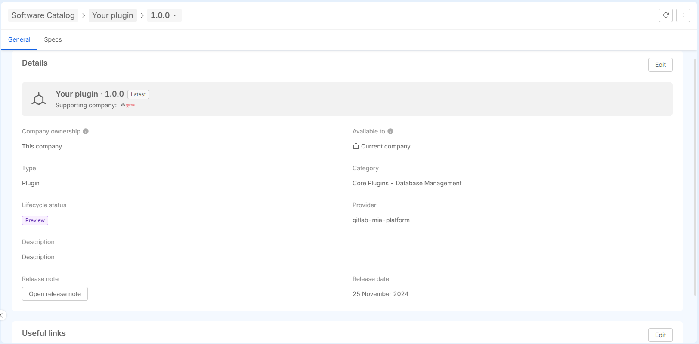

:::info
Editing items is only possible for users with the necessary permissions: Project Administrator or Company Owner.
:::

You can only modify the metadata of an item. To edit an item’s metadata, go to the General tab, where you'll find the `Edit` buttons. Clicking these buttons will open a modal allowing you to make changes to the metadata.

