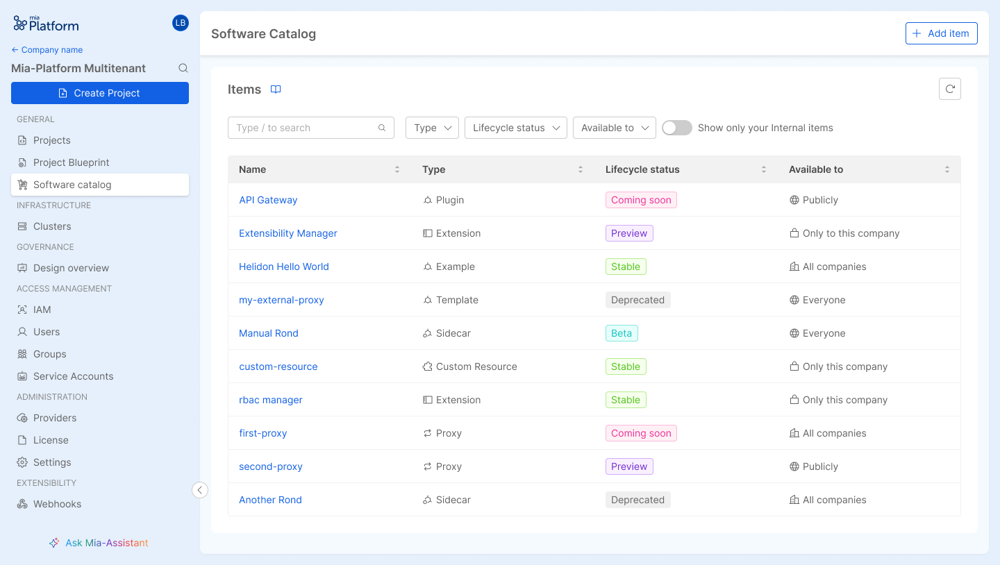

The Mia-Platform Software Catalog is a centralized solution that enables organizations to track, manage, and document the software within their ecosystem. It serves as a single source of truth, offering visibility into software ownership, metadata, lifecycle status, and versions, ensuring accountability throughout the entire software landscape of the organization.

Here are the **key challenges** that a software catalog addresses.

- **Lack of visibility**: without a centralized system, it’s difficult to keep track software assets and their health, leading to confusion and inefficiency.
- **Duplication of efforts**: without a software catalog, teams may unknowingly develop or maintain duplicate services or tools, wasting time and resources.
- **Onboarding and knowledge transfer**: new team members or teams may struggle to understand the existing software ecosystem without a complete catalog, which can slow down the onboarding and knowledge transfer process. 
- **Accountability and ownership**: without defined ownership details, it becomes challenging to assign responsibility for maintaining and updating software, leading to delays in issue resolution.

## Items

An **item** is the basic unit of the Software Catalog and represents a software resource available for use within Mia-Platform projects.

### Item types

The catalog supports the following item types:

- *plugin*: a ready-to-use microservice that can be easily integrated;
- *template*: a basic repository with boilerplate code to start creating a microservice;
- *example*: a pre-configured model with business logic, ready to modify for custom needs;
- *application*: a set of resources that includes plugins, templates, examples and other components;
- *infrastructure Resource*: defines custom objects beyond the standard Console-supported resources;
- *sidecar*: a secondary container that enhances microservices with features like security, logging, or data synchronization;
- *proxy*: centralizes external API access and cross-namespace microservice communication, simplifying configuration;
- *extension*: expands the Console with custom sections.

Please refer to [this documentation](/software-catalog/manage-items/overview.md#item-types) for more details on item types.

### Items Versioning

:::info
This feature is currently available for the Plugin, Infrastructure Resource, Example and Template types.
:::

The versioning system in the Software Catalog provides detailed control over the different iterations of each item. For technical details on how versioning works, please refer to [this documentation](/software-catalog/manage-items/overview.md#versioned-resources).

Each version includes key information, such as the release date and whether it is marked as the latest version. Additionally, if available, you can view the associated release notes to understand what changes or improvements were made in that particular version.

In cases where a version is listed as *N/A*, it indicates a default version for an item that supports versioning but has not yet had any versions added. New versions can be introduced if needed.

### Items Lifecycle

Each item in the Software Catalog is associated with a lifecycle status that reflects its current phase of development and maintenance. The available lifecycle statuses are:

- coming soon
- preview
- beta
- stable
- deprecated

For a more detailed explanation of each status, please refer to the [dedicated section](/software-catalog/manage-items/overview.md#the-release-stage-of-an-item) of the documentation.

A lifecycle status indicates where an item stands in its lifecycle, from its initial creation to its active use, and eventually to being deprecated when it's no longer maintained or supported. This helps users quickly understand the maturity and stability of an item.
