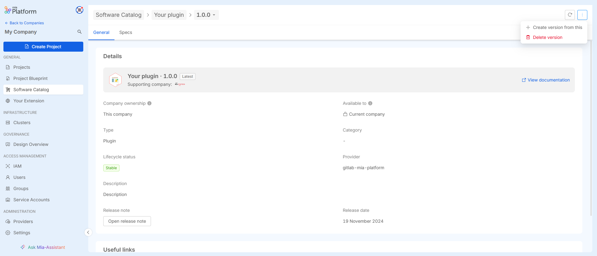

# Create your own Marketplace Item

In this tutorial, we will learn how to publish a new item on your own company's Marketplace and manage its lifecycle using the [Software Catalog](/software-catalog/overview.md).

We will also explore the differences between using the Software Catalog to manage marketplace items and the alternative approach of using [miactl](/cli/miactl/10_overview.md).

## Introduction

:::caution
To follow this tutorial, you must have a `Company` where you are the `Company Owner`.
:::

The Mia-Platform Software Catalog is a centralized solution for tracking, managing, and documenting software across an organization. It ensures visibility into ownership, metadata, lifecycle, and versions, serving as a single source of truth.

This tutorial guides you in creating a new marketplace `item`, also called a `Component`, of type `Plug-in`, with visibility restricted to your company.

For creating an item with different visibility levels, refer to [this guide](/software-catalog/catalog-and-marketplace/overview.md).
To learn more about the different item types available in the Mia-Platform Marketplace, see [this guide](/software-catalog/manage-items/overview.md#item-types).

This tutorial covers all the steps from creating a new item to managing versioning using both approaches: Software Catalog and miactl. This allows you to understand the differences between the two methods.

## Create a new Marketplace Plug-In 

### Using the Software Catalog UI

To create a new item in the marketplace using the `Software Catalog`, follow these steps:

1. **Enter the Company** – First, go to the company where you want to create the component. Then, click on the `Software Catalog` menu.

2. **Click `Add Item`** – This opens a simple form to guide you through the creation process.

3. **Choose the `Item Type`** – Select the type of item you want to create. This determines the required fields and attributes.


4. **Enter Metadata** – Fill in basic details like:
   1. `Name` - choose the name for your plug-in
   2. `Item ID` - it is prefilled based on the choosed name but you can edit it by enable the flag `Edit Item ID manually`
   3. `Description` - describe your item
   4. `Lifecycle Status` - for a detailed explanation of all the options, refere to [this guide](/software-catalog/overview.md#items-lifecycle)
   5. `Category` - choose the category for your new item
   6. `Version Name` - choose the version for your item (for example: `1.0.0`)
   7. `Release Note Type` - choose if you want to handle the releases notes using `Markdown` or `External Link`
   8. `Repository URL` - add the link to the item's source code.

For a detailed explanation of the required metadata please refere to [this guide](/software-catalog/manage-items/overview.md#how-to-configure-a-new-item).

5. **Define the item's assets** - which are the information needed by the Mia-Platform console to start-up and deploy your item on the runtime properly, like:
   1. `Container Ports` for each service included in the plug-in (typically a plug-in contains only one service)
   2. `Default Environment Variables`
   3. `Default Resources` which are the definition for `cpuLimits` and `memoryLimits`
   4. `Default ConfigMap`
   5. `Name` that is the name of the service
   6. `Description`
   7. `Repository Url` which is the url to the source code of the service
   8. `Docker Image` 

:::caution
The `Asstes` object have a different spec based on the `Item Type` the exaple provided in this guide is related to the components of item `Plug-In`
:::

For reference this is the `Assets` object configuration for an hypothetical plugin:

```json
{
  "services": {
    "my-own-marketplace-component": {
      "name": "my-own-marketplace-component",
      "componentId": "my-own-marketplace-component",
      "description": "Example of a simple marketplace plug-in.",
      "repositoryUrl": "<your-repository-url>",
      "dockerImage": "<your-docker-image>",
      "containerPorts": [
        {
          "name": "http",
          "from": 80,
          "to": 3000,
          "protocol": "TCP"
        }
      ],
      "type": "plugin",
      "defaultEnvironmentVariables": [
        {
          "name": "LOG_LEVEL",
          "valueType": "plain",
          "value": "{{LOG_LEVEL}}"
        },
        {
          "name": "HTTP_PORT",
          "valueType": "plain",
          "value": "3000"
        }
      ],
      "defaultResources": {
        "cpuLimits": {
          "max": "400m",
          "min": "100m"
        },
        "memoryLimits": {
          "max": "300Mi",
          "min": "70Mi"
        }
      },
      "defaultConfigMaps": [
        {
          "name": "my-own-marketplace-component-config",
          "mountPath": "/home/node/app/config",
          "viewAsReadOnly": true,
          "link": {
            "targetSection": "config"
          },
          "files": []
        }
      ]
    }
  }
}
```

:::caution
The `componentId` and `name` fields must be equal. 
:::

1. **Complete the process** – Follow the on-screen instructions, then save and submit the item to add it to the marketplace.



### Using miactl

:::caution
Using `miactl` requires setting up the CLI beforehand. For more details, refer to [this guide](/cli/miactl/20_setup.md).
:::

:::info
For testing purpose you can use your own account to create context and log-in the Mia-Platform Console using miactl. 
For production purpose the use of a `Service Account` with the `Company Owner` permission is recommended. To know more about service accounts follow this [documentation page](/development_suite/identity-and-access-management/manage-service-accounts.md).
:::

The main difference between creating an item with miactl and using the Software Catalog is that, besides setting up miactl (either locally or on a pipeline runner), you also need a manifest that defines the properties of your plug-in.

The key distinction between the `Assets` object (used in the Software Catalog) and the `manifest.json` (used with miactl) is that the manifest not only includes the properties related to the plug-in's services but also contains all the metadata that, when using the Software Catalog, is set through the graphical interface.

Here an example of how a `manifest.json` to be used with miactl looks like:

```json
{
    "name" : "My Own Marketplace Component",
    "itemId" : "my-own-marketplace-component",
    "description" : "Example of a simple marketplace plug-in.",
    "type" : "plugin",
    "categoryId": "demo",
    "image" : {
        "localPath": "../../images/my-own-marketplace-component.png"
    },
    "supportedByImage" : {
        "localPath": "../../images/acme_company.png"
    },
    "documentation" : {
        "type" : "externalLink",
        "url" : "https://docs.mia-platform.eu/"
    },
    "version": {
      "name": "1.0.0",
      "releaseNote": "Initial release"
    },
    "repositoryUrl" : "<your-repository-url>",
    "resources" : {
        "services" : {
            "my-own-marketplace-component" : {
                "type" : "plugin",
                "name" : "my-own-marketplace-component",
                "dockerImage" : "<your-docker-image>",
                "componentId" : "my-own-marketplace-componen",
                "defaultDocumentationPath" : "/documentation/json",
                "containerPorts" : [
                    {
                        "name" : "http",
                        "from" : 80,
                        "to" : 3000,
                        "protocol" : "TCP"
                    }
                ],
                "defaultLogParser": "mia-json"
            }
        }
    },
    "tenantId" : "<your-tenant-id>"
}
```

Once the `manifest.json` is ready, the following commands are needed to release the new plug-in on the marketplace.

```bash

> miactl context auth miactl-bot --client-id $CLIENT_ID --client-secret $CLIENT_SECRET
> miactl context set my-context --company-id $COMPANY_ID --endpoint $CONSOLE_URL --auth-name miactl-bot
> miactl context use my-context
> miactl marketplace apply -f ./manifest.json

```

## Update your Marketplace Plug-In

### Using the Software Catalog UI

:::caution
For versioned items, such as plug-ins, only the metadata can be modified directly. To update the Assets object, a new version of the component must be created.
:::


To create a new version of a component using the Software Catalog, follow these steps:

1. **Open the Component Page** – Navigate to the page of the component you want to update.
2. **Click `Add New Version`** – This will open a modal window.
3. **Select the Base Version** – Choose the existing version from which to generate the new one.
4. **Modify Metadata and Assets** – The selected version’s metadata and assets will be duplicated, allowing you to update them with the values for the new version.


Once updated, save and publish the new version as needed.

To know more about how to create new version for marketplace read the dedicated [documentation page](/software-catalog/manage-items/software-catalog-ui/update/overview.md).

### Using miactl

The process of updating a marketplace component using miactl is straightforward and similar to the creation process.

First of all, download and save the latest version of the item configuration:

```bash

> miactl marketplace get ITEM_ID > myAwesomeService.json

```

If you don't know the item id, use the `miactl marketplace list` command to list all the Marketplace Items.

Once you have the manifest, modify the fields you need and the publish the new version using the following command:

```bash

> miactl marketplace apply -f myAwesomeService.json

```

If everything works well you will see the following outcome:

```bash
1 of 1 items have been successfully applied:

  ID                        ITEM ID             NAME                 STATUS   

  65368hf0c91d871a87afbcbf  my-awesome-service  My Awesome Service   Updated

```
To know more about how to update a marketplace component using miactl read this [documentation page](/software-catalog/manage-items/mia-ctl/update/overview.md).

## Conclusion

In this tutorial, we explored the differences between managing a marketplace component, specifically a plug-in, using the `Software Catalog UI` and `miactl`.

The Software Catalog offers a significant advantage in terms of ease of use and accessibility. Through its graphical interface, you can quickly view, modify, and create marketplace items without complexity.

However, as the number of components grows, managing everything manually becomes impractical. In such cases, miactl enables a [declarative and automated approach](/software-catalog/manage-items/declarative-approach.md) to handling all marketplace components efficiently.

Both approaches are valuable:

1. The `Software Catalog UI` is ideal for quick checks and simple modifications.
2. `miactl` is better suited for structured management of multiple items at scale.


