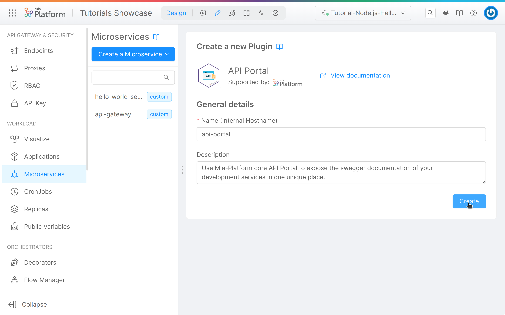
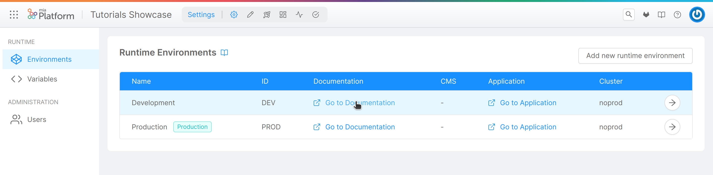

import VideoBox from "./../../../src/components/VideoBox";

In this tutorial, we will learn how to use the [_API Portal_](/runtime_suite/api-portal/overview.md), a user-friendly interface that allows developers to easily visualize and test their microservices endpoints. It is built on top of the [OpenAPI 2.0](https://swagger.io/specification/v2/)/[OpenAPI 3.0](https://swagger.io/specification/) Specification, which is a standard format for describing RESTful APIs.

## What we will build

We will continue the previous tutorial adding inside the project the _API Portal_ [plugin](/runtime_suite/mia-platform-plugins.md), from the [_Marketplace_](/marketplace/overview_marketplace.md). Also we will understand how to view the documentation testing the endpoints.
At least we will add the [_Swagger Aggregator_](/runtime_suite/swagger-aggregator/overview.md) to join multiple Open Api specification documents in a single place. Amazing, it isn't?

In particular, we will:

- Create the _API Portal_ plugin;
- Create the _Swagger Aggregator_ plugin;
- Configure the endpoint to be called by the _API Portal_;
- Open the interface and test the endpoints;

## Prerequisites

:::info
If you have already done the [previous tutorial](/tutorial/microservices/hello_world.mdx), you can skip this section.
:::

Before starting, we will assume that, you already have a clean project in Mia-Platform Console. In order to know how to create a project on Mia-Platform Console, read [this guide](/development_suite/set-up-infrastructure/create-project.mdx).

The project must:

- Be integrated with a [deploy pipeline](/development_suite/deploy/pipeline-configuration.md);
- Have an [ingress route](/paas/traefik.md) with "api-gateway" as `service`.
- Be aware of your project domains. If the project links has been configured, you can find them in the "Environments" section of the "Project Settings", under the "Application" column.

:::tip
If your are using a Mia-Platform Console in PaaS and the project has been created using the "Mia-Platform Basic Project Template", the project is already configured as needed.
:::

Moreover, you need at least:

- `developer` role on the project you want to use to reproduce the steps;
- `maintainer` role on the environment of the project you want to deploy on.

## Install required plugins

In order to start the tutorial, you must be in the _design_ section of the project in the [Microservices section](/development_suite/api-console/api-design/services.md) from the left side menu.

### API Portal

To create the plugin:

1. Click on the _Create a Microservice_ button;
1. In the dropdown menu, select _From Marketplace_ option;
1. On the right side, you will see a catalogue of plugin, templates and examples;
1. Type **API portal** in the search bar;
1. Select the card from the list of result;
1. Click on the _Create_ button applying the default fields.
1. Save the changes by committing.

### Swagger Aggregator

In the case multiple microservices are running in the same project, that is the most of the cases, it could be usefull to access to all their documentation in one single place. For that we need the [_Swagger Aggregator_](/runtime_suite/swagger-aggregator/overview.md) plugin!

Its main purpose is to retrieve all the OpenAPI specifications of each selected service and merge them together so that they can be served in one place via the API portal.

In order to create the plugin:

1. Click on the _Create a Microservice_ button;
1. In the dropdown menu, select _From Marketplace_ option;
1. On the right side, you will see a catalogue of plugin, templates and examples;
1. Type **Swagger Aggregator** in the search bar;
1. Select the card from the list of result;
1. Click on the _Create_ button applying the default fields.
1. Save the changes by committing.

### Configure plugins endpoints

The last step needed to configure the plugins is to create the necessary endpoints that are required by the console to make the whole process work. This consists of going to the _endpoints_ section and creating:

1. `/documentations/api-portal` pointing to "api-portal" microservice;
1. `/documentations/api-portal/api` pointing to "swagger-aggregator" microservice.

:::info
If you still don't know how to create an endpoint look at the [first tutorial](/tutorial/microservices/hello_world.mdx#expose-the-hello-world-microservice-api)!
:::

## Configure the services to be documented

Before testing the API Portal we need to configure the services and endpoints to give the API portal the acknowledge of the services whose documentation we want.

### Configure the service

To configure the services you want to be included in the API Portal:

1. Click on the _Microservices_ section;
1. Select the service to configure, in this case _hello-world-service_;
1. Under the _details_ section fill the **API documentation path** with the service endpoint that expose the Open Api configuration, in this case `/documentation/json`;
1. Save the changes by committing.

:::caution
Be sure to remove this path from `api-gateway`, `api-portal` and `swagger-aggregator` services!
:::

### Configure the endpoint

To configure the endpoint:

1. Click on the _Endpoints_ section;
1. Select the endpoint to configure, in this case _/greetings_;
1. Under the _Endpoint settings_ section in the _Documentation_ tab check the `Show in API Portal`;
1. Save the changes by committing.

:::caution
Be sure to remove those flags from `/documentations/api-portal` and `/documentations/api-portal/api` endpoints!
:::

Repeat this operations for each service and endpoint you want to show in the API Portal.

## Open the interface and test the endpoint

The last step is to open the API portal interface. Firstly, go to the _environments_ section, open the Environment's menu item and select "Go to Documentation" of the wanted environment, as shown in the image below:

After clicking the link, this interface will be displayed. Here you will find and search for each endpoint exposed by API Portal, you can also try the endpoint as you can see in the following example:

In conclusion, using the API Portal can greatly improve the development and documentation process for your APIs. It enables a smooth and efficient workflow for your development team and facilitate communication with external developers who may be using your APIs. Overall, it is a valuable step in ensuring the success and maintainability of your API projects.
