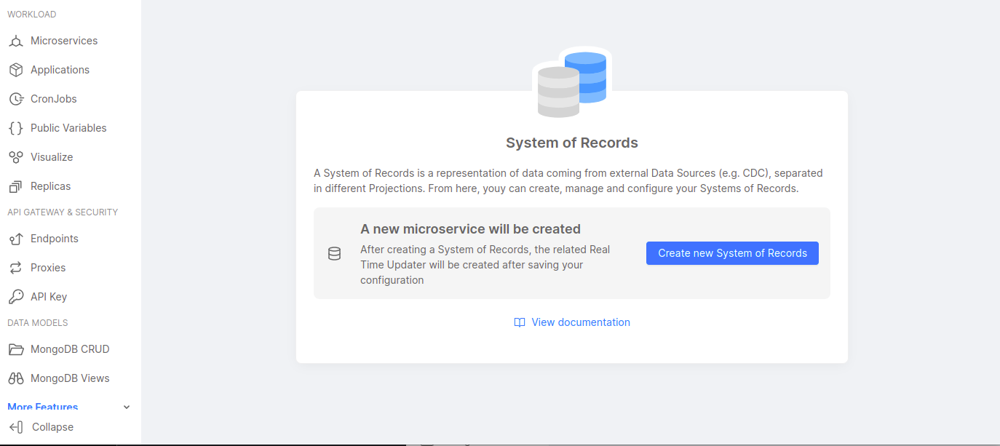
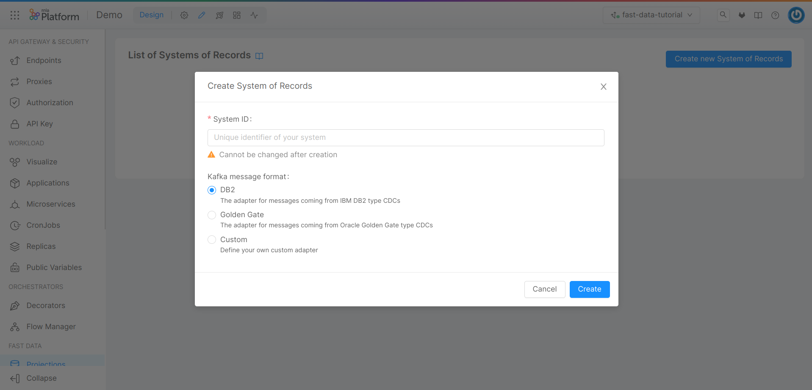
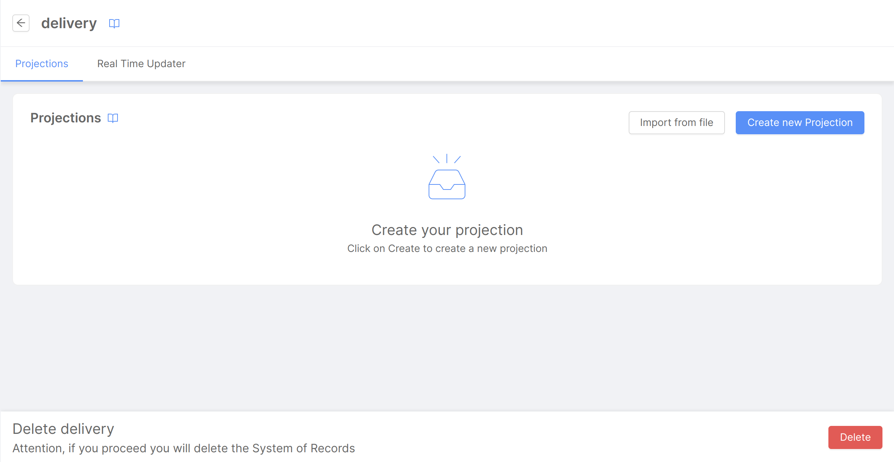
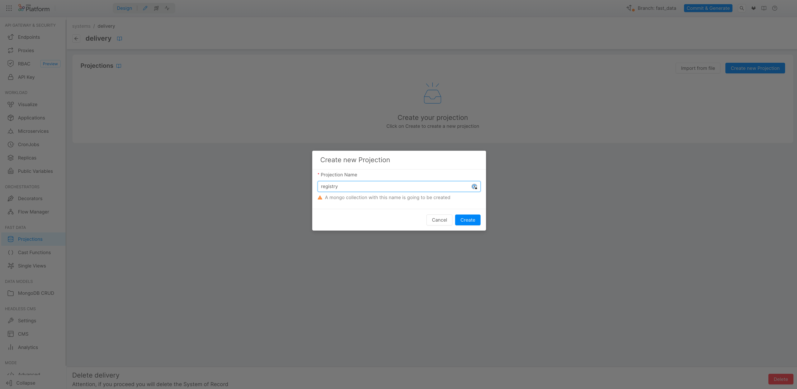
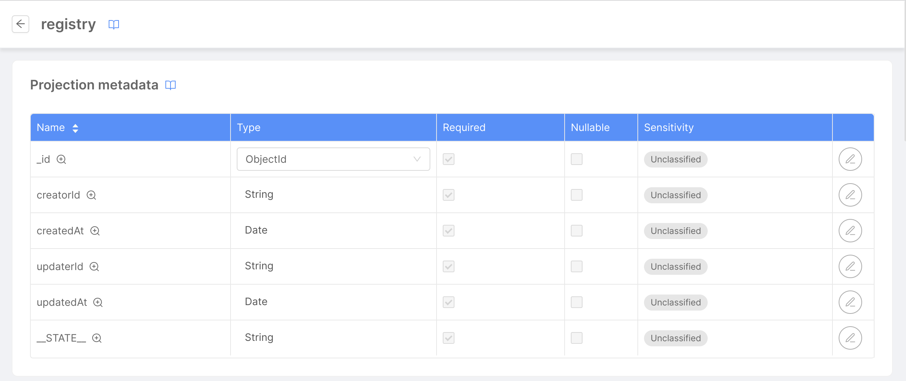
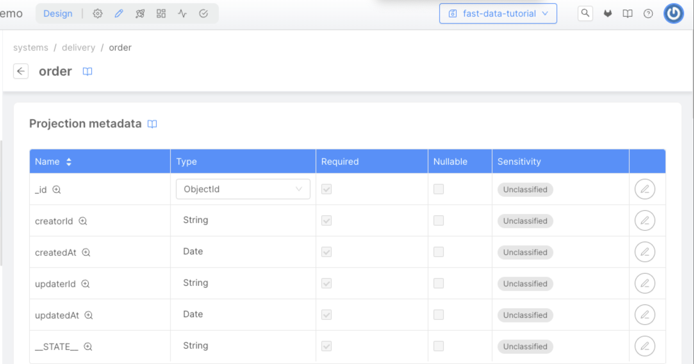
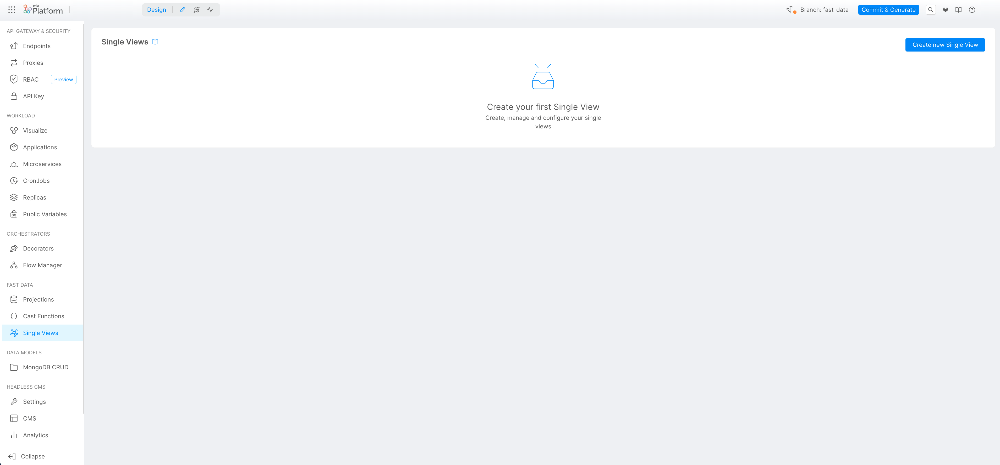
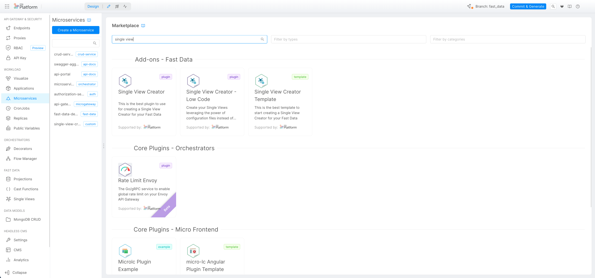
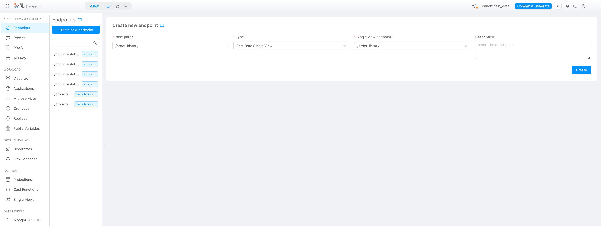

import VideoBox from './../../../src/components/VideoBox'

**Fast Data** is an event-driven architecture that allows you to collect data, manipulate and aggregate it from your systems in near real-time using a data stream approach.
  
## What We Will Build

In this tutorial, you will create a simple Single View using two different data sources.
In particular, you will:
  - Generate two Projections where we'll store the data;
  - Connect two endpoints to the Projections;
  - Create a Single View Low Code that will aggregate the data from the two projections;
  - Create an endpoint that will consume the data from the Single View .

## Prerequisites  
  
Before starting this tutorial, you need to be familiar with the concepts of [Fast Data architecture](../../../docs/fast_data/architecture.md), including [Projections](../../../docs/fast_data/configuration/projections.md), [Single View](../../../docs/fast_data/configuration/single_views.md), and Kafka (including producers and consumers).
For the technical part of this tutorial, an up-and-running Kafka cluster is required.

## Projections
The Projection is an architectural object that is responsible for storing the data in a persistent storage. The goal of the Projection is to have a fast and scalable way to decouple the data from the source system.
Ideally, the Projection should be able to store the data in a persistent storage like a data projection. We will use this projection to have an easy way to read a 1:1 copy of the data from the source systems. We will use this copy to also aggregate the data from the source systems, using the Single View Creator.

The architectural component responsible for creating and updating the projection is the Real Time Updater. To simplify, this microservice is a Kafka consumer that will consume the data from the source systems and will update the projection.

In this tutorial we can imagine a simple delivery platform where the data are the registry and the order of the customers.
So, for this tutorial we will create two projections, one for the registry and one for the order. 

Before starting to create projections, we need to create the System of Records (SoR) representing the source system we want to connect to.

To create a SoR follow the steps below: 
1. Open the page Projection in the Fast Data section of our left menu; 
2. Click on the button "Create new System of Records"; 

3. In the dialog, choose the name and the type of the SOR (for this tutorial we will use the Low Code configuration);

4. Now we can create the projections inside this System of Records.


### Registry Projection
The first projection we will create is the registry, this projection will store the data of the registries.

Inside a System of Records page we need to click on the "Create new Projection" button  choose the Projection's name and click on "Create".
 

Once the projection is created, you will be redirected to the page of the registry projection.  
In this page, we can see the Kafka topics for each environment. The Kafka topics will be used by the Real Time Updaters to receive the data from the Source Systems, and to update the projections.
In the same page we can also see the data schema for the projection and any other configurations related to it. 
 

#### Fields
Now we need to define the fields that we want to store in the Projection.


Inside this tutorial we will use the following fields:

:::info
It's mandatory to define at least one field and at last one primary key.
:::

| Field           | Type   | Description                                                       |
|-----------------|--------|-------------------------------------------------------------------|
| **registry_id** | String | The registry ID. This field is required and it's the Primary Key. |
| **name**        | String | The name of the customer to whom the registry refers.             |
| **email**       | String | The email of the customer to whom the registry refers.            |
| **phone**       | String | The phone of the customer to whom the registry refers.            |
| **address**     | String | The address of the customer to whom the registry refers.          |
| **city**        | String | The city of the customer to whom the registry refers.             |
| **state**       | String | The State of the customer to whom the registry refers.            |

 

:::info
By default, the Projection will be created with a Kafka topic that will be used to send the data to the Projection. The Kafka topic can be changed in the Projection's configuration. The only requirement is that the Kafka topic must be unique inside the project.
Any Kafka Topics used in the Fast Data need to be already created at deploy time. The Fast Data is not responsible for their creation on the cluster Kafka.
:::
#### Kafka Topics
- **mia-platform.advocacy-DEV-delivery-registry.json**: the topic that will be used to send the data to the registry projection in DEV environment
- **mia-platform.advocacy-PROD-delivery-registry.json**: the topic that will be used to send the data to the registry projection in PROD environment

### Order Projection
The second projection we will create is the order one. This projection will store the data of the user's orders.
Again, inside a System of Records page we need to click on the button "Create new Projection", choose the Projection name and click on create.


Once the projection is created, we can see the page of the order projection.



:::info
It's mandatory to define at least one field and at last one primary key.
:::

#### Fields
| Field           | Type   | Description                                                    |
|-----------------|--------|----------------------------------------------------------------|
| **order_id**    | String | The order ID. This field is required and it's the Primary Key. |
| **name**        | String | The name of the product.                                       |
| **price**       | Number | The price of the product.                                      |
| **date**        | Date   | The date when the order was placed.                            |
| **registry_id** | String | The registry ID of the customer who placed the order.          |

:::info
By default, the Projection will be created with a Kafka topic that will be used to send the data to the Projection. The Kafka topic can be changed in the Projection's configuration. The only requirement is that the Kafka topic must be unique inside the project.
:::

#### Kafka Topics
- **mia-platform.advocacy-DEV-delivery-order.json**: the topic that will be used to send the data to the registry projection in DEV environment
- **mia-platform.advocacy-PROD-delivery-order.json**: the topic that will be used to send the data to the registry projection in PROD environment

### Microservice Realtime Updater Configuration
Now we have one System of Records and two Projections. Mia-Platform Console will create a microservice that will consume the data from the source systems, and that will update the Projections.
This microservice is called Real-Time Updater, and it will be responsible for updating the Projection. This microservice will be available in the Microservice section, after the saving of the configuration of your project.


Now we need to configure all the parameters of the microservice. Here is an example of the fields that we need to configure:

- **PROJECTIONS_DATABASE_NAME**: the name of the database that will be used to store the data of the Projections
- **PROJECTIONS_CHANGES_COLLECTION_NAME**: the name of the collection that will be used to store the changes of the Projections (the default is fd-pc-SoR in our case fd-pc-Delivery)
- **KAFKA_BROKERS**: the list of the kafka brokers that will be used to send the data to the Projections
- **KAFKA_GROUP_ID**: the group id that will be used to consume the data from the source systems
- **KAFKA_SASL_USERNAME**: the username that will be used to login to the kafka brokers
- **KAFKA_SASL_PASSWORD**: the password that will be used to login to the kafka brokers 
- **KAFKA_SASL_MECHANISM**: the mechanism that will be used to login to the kafka brokers

There are other parameters that we can configure. If you need to know more about the parameters of the microservice, you can [read the documentation of the Real-Time Updater](../../../docs/fast_data/configuration/realtime_updater/common.md).

#### Microservice Variables
After the basic configuration of the microservice, we need to configure two configMaps: one is the ER Schema, and the other is the Projection Changes Schema.

The ER Schema is a configMap that represent a classic entity-relationship model, so it is used to know how the data of different projections are connected to each others.

The Projection Changes Schema is a configMap that represent the path that goes from a projection to another projection.  
This configMap will be used to find the Single View key that needs to be updated.  
In our example, each Projection contains the Single View key, so we need to configure the Projection Changes Schema to read only the projection that contains the updated data and then get the registry_id.


In this example, one Customer (stored in the Registry Projection) can have multiple Orders (stored in the Order Projection).

#### ER-Schema

Here we can see the ER-Schema of the Registry Projection and the Order Projection, based on our example:

```json {4,6,10} showLineNumbers
{
  "version": "1.0.0",
  "config": {
    "registry": {
      "outgoing": {
        "order": {
          "conditions": {
            "registry_to_order": {
              "condition": {
                "registry_id": "registry_id"
              },
              "oneToMany": true
            }
          }
        }
      }
    }
  }
}
```

In this example we can see that the relationship goes from registry to order.   
The relationship condition is represented by the condition:  
- registry_id *(from order)*: registry_id *(from the updated registry)*.  

The condition is used to generate a `where` condition inside a MongoDB query. 
In this case the condition is "where the registry_id inside order projection equals to the value of the registry_id field of the registry projection".


#### Projection Changes Schema Delivery
The Projection Changes Schema is a configMap that represents the path that goes from an entity to another entity, and it is used to find the Single View key. 
We will talk about the Single View key in the next section, but remember that the Single View key is the primary key of our Single View, and we need to obtain the Single View key from the updated Projection (or that follows the ER Schema until we reach a projection that contains the Single View key).

The reason why we need to configure this configMap is that, when we will update each Projection, we need to know the Single View keys to update.
 
Inside our example we can see that the Single View key is the registry_id, so we need to configure the Projection Changes Schema to know each path that goes from the projection to each other projection that contains the Single View key.
In this example, we have the registry_id in both the Registry Projection and in the Order Projection, so we need to configure the Projection Changes Schema to read the registry_id from the updated Projection.

```json {4,7,9,13,15} showLineNumbers
{
  "version": "1.0.0",
  "config": {
    "orderHistory": {
      "paths": [
        {
          "path": [ "registry" ],
          "identifier": {
            "registry_id": "registry_id"
          }
        },
        {
          "path": [ "order" ],
          "identifier": {
            "registry_id": "registry_id"
          }
        }
      ]
    }
  }
}
```

In our case, to update the orderHistory Single View there are two ways:
- if we update the projection Registry (on snippet line 7), then we can read the registry_id directly from the projection Registry;
- if we update the projection Order, then we can read the registry_id directly from the projection Order.

:::info
Of course we can use more complex examples, like the following one:  


We have the registry, the order and the product. Each order can have multiple products. Inside the product there is not the Single View key: to obtain it, we need to follow the ER-Schema that goes from product to order (and obtain the registry_id property).

We can have a configuration like the following one:
```json 
{
  "version": "1.0.0",
  "config": {
    "orderHistory": {
      "paths": [
        {
          "path": [ "product", "orders" ],
          "identifier": {
            "registry_id": "registry_id"
          }
        }
      ]
    }
  }
}
```
In the example above, if the products inside our Product Projection are updated, we will follow an ER-Schema to move from the Product to the Order Projection: from the Order Projection we can obtain the registry_id of the Single View key.
:::

### Expose Projection Endpoints
At this point, we have configured the microservice, we already have one system of records and two projections, but we need to expose the Projection endpoints. It is not mandatory to expose the Projection endpoints to create, update and work with the Single View, but if you want to expose the raw data stored in the projection you need to create the endpoints.

In the Endpoint section we can click to the **Create new endpoint** button to create the Projection's endpoints.


Inside the creation page we can choose the endpoint path. Inside the type we need to select "Fast Data Projection", and in the Fast Data Projection dropdown menu we can choose the Projection that we want to expose.
We can create two different endpoints, one for the registry and one for the order.

:::info
Remember that the endpoint connected to the Fast Data will create just the read endpoint: so, we can't create, update, and delete the data stored in the Projection using a REST request.
:::
### Testing Projection

Now it's time to save and deploy the new configuration.


After that, we can try to send message to the Kafka Topic created in the previous steps, and we can see the data stored in the Projection using the APIs available in the [API Documentations](../../../docs/development_suite/api-portal/api-documentations)

## Single View
The Single View is an architectural object that it's used to store the aggregate data from the Projections. The goal of the Single View is to store the data already aggregated and ready to use from the Projection.
A good approach is to store the data in Single Views dedicated to each channel and each use. For example, if inside the client we use the data from the registry and the order in the same interface, we can create a Single View called "registry_and_order" and store all the useful data in this Single View.

In this tutorial our Single View is called "OrderHistory" and we will create an object schema with the registry information and the orders information linked to the registry.
So, for this tutorial we will create one Single View called "OrderHistory".

### Order History 
Inside our Single View, each document is an object that contains the registry information about the user, and the information about the orders associated to the user.

We need to open the Single Views page in the Fast Data section of our left menu, then click on the **Create new Single View** button, and we can create a new Single View called "orderHistory".


Here we can choose the name of the Single View.

#### Fields
Now we need to create the fields of the Single View, inside this tutorial we will create the following fields:  
  
| Field           | Type             | Description                                                       |
|-----------------|------------------|-------------------------------------------------------------------|
| **registry_id** | String           | The registry ID. This field is required and it's the Primary Key. |
| **name**        | String           | The name of the customer to whom the registry refers.             |
| **city**        | String           | The city of the customer to whom the registry refers.             |
| **state**       | String           | The State of the customer to whom the registry refers.            |
| **orders**      | Array of objects | The orders associated to the registry.                            |
  
  
:::info
Of course we can create more fields. Here we omitted the email, phone and address fields because we don't need to expose them in our Single View.
:::


#### Strategies
Now we need to create the strategies of the Single View. Strategies are used to define when the data need to be updated in a Single View. For example, when we update the registry we need to update the Single View information. 
In this tutorial we will create two strategies: the first one is for the registry's update and the second one is for the order's update.

Inside our Single View "orderHistory", click on the **Add link to strategy** button.


Now we will choose the System Of Records and the Projection that we want to link to the Strategy; in our case, "delivery" and "registry".


Last but not least, we need to choose the Strategy Source. In this case we will use the "Low Code" strategy, then we can click on the **Create** button.


Then we can create the strategy also to the Order Projection, following the same process.


:::info
We need to define one strategy for each projection, because when the projection is affected by a change, we need to calculate which single views are impacted. This is made possible by the strategies. With the "Low Code Strategy" the system will automatically calculate the impacted single views.
:::

### Microservice Single View Creator Configuration
Now we have configured the Single View, but we need to configure the microservice to create the Single View. This microservice is called "Single View Creator", and it's available in the microservice Marketplace.


Here we have two different plugins: the first one is for the Single View Creator, and the second one is for the Single View Creator Low Code. For this tutorial, we will use the second one.

:::info 
The Single View Creator Low Code plugin is a microservice s used to leverage the power of configuration files, instead of writing all the code on your own!
:::

Now we need to configure all the parameters of the microservice, here an example of the fields that we need to configure:

- **PROJECTIONS_CHANGES_COLLECTION**: if you have set a custom projection change collection name from advanced, then set its name. Otherwise, it is fd-pc-SYSTEM_ID where SYSTEM_ID is the id of the System of Records this single view creator is responsible for.
- **SINGLE_VIEWS_COLLECTION**: should be the name of the single view which your single view creator is responsible for
- **SINGLE_VIEWS_ERRORS_COLLECTION**: it is the name of a MongoDB CRUD you want to use as collection to the single view errors.
- **SINGLE_VIEWS_PORTFOLIO_ORIGIN**: should be equals to the SYSTEM_ID you have set in PROJECTIONS_CHANGES_COLLECTION
- **KAFKA_BROKERS_LIST**: the list of the kafka brokers that will be used to send the data to the Projections
- **KAFKA_SVC_EVENTS_TOPIC**: topic used to queue Single View Creator state changes (e.g. single view creation)
- **SEND_BA_TO_KAFKA**: true if you want to send to Kafka the before-after information about the update changes of the single view
- **KAFKA_GROUP_ID**: the group id that will be used to consume the data from the source systems
- **KAFKA_SASL_USERNAME**: the username that will be used to login to the kafka brokers
- **KAFKA_SASL_PASSWORD**: the password that will be used to login to the kafka brokers 
- **KAFKA_SASL_MECHANISM**: the mechanism that will be used to login to the kafka brokers


After the basic configuration of the microservice we need to configure three configMap:
  * **Single View Key**: this is the key that will be used to store the Single View
  * **ER-Schema**: the ER Schema (should be the same as the one used in the Projection Microservice)
  * **Aggregation**: the aggregation that will be used to calculate the Single View
  
#### Single View Key
It takes in input the identifier of the projection change, and it returns the key object used to select the document of the Single View collection that need to be updated.

In the Low Code Single View Creator we need to set the following json:
```json
{
  "version": "1.0.0",
  "config": {
    "registry_id": "registry_id"
  }
}
```
The config's condition is represented by:
  * registry_id (from the Single View document): registry_id (obtained from the Projection Change document)

#### ER-Schema
The ER-Schema is the same one we used in the Projection Microservice. We can duplicate the configMap, or we can use a [Shared ConfigMap](../../../docs/development_suite/api-console/api-design/services#shared-configmaps).

To simplify, here' the same ER-Schema used in the [Projection ER-Schema](../../../docs/tutorial/fast_data/fast_data_low_code_tutorial#er-schema):
```json {4,7,9,13,15} showLineNumbers
{
  "version": "1.0.0",
  "config": {
    "orderHistory": {
      "paths": [
        {
          "path": [ "registry" ],
          "identifier": {
            "registry_id": "registry_id"
          }
        },
        {
          "path": [ "order" ],
          "identifier": {
            "registry_id": "registry_id"
          }
        }
      ]
    }
  }
}
```

#### Aggregation 
The aggregation is the configMap that will be used to explain how the Single View will be calculated. In this configuration we will get our dependencies from the projection and the description about how we want to map the dependencies to the Single View schema.  

In our case, we will map registry_id, name, city and state from the Registry Projection, and the order list from the Order Projection.


```json {4,6,10,14,22} showLineNumbers
{
  "version": "1.0.0",
  "config": {
    "SV_CONFIG": {
      "dependencies": {
        "registry": {
          "type": "projection",
          "on": "_identifier"
        },
        "ORDERS": {
          "type": "config"
        }
      },
      "mapping": {
        "registry_id": "registry.registry_id",
        "name": "registry.name",
        "city": "registry.city",
        "state": "registry.state",
        "orders": "ORDERS"
      }
    },
    "ORDERS": {
      "joinDependency": "order",
      "dependencies": {
        "order": {
          "type": "projection",
          "on": "registry_to_order"
        }
      },
      "mapping": {
        "id": "order.order_id",
        "price": "order.price",
        "name": "order.name",
        "date": "order.date"
      }
    }
  }
}
```

- **The "SV_CONFIG"** is the name of our Single View.
  - **The "dependencies"** are the dependencies that will be used to calculate the Single View.
    - **The "registry"** is the dependency that will be used to get the registry information directly from the Projection with the condition, using the identifier of the Projection Change as search condition to the Projection document.
    - **The "ORDERS"** is a calculated dependency that will be descripted further.
  - **The "mapping"** are the fields from the Registry Projection that will be used to calculate the registry fields in the Single view.
    - **The "registry_id"** is the field registry_id from the Registry projection.
    - **The "name"** is the field name from the Registry projection.
    - **The "city"** is the field city from the Registry projection.
    - **The "state"** is the field state from the Registry projection.
    - **The "orders"** is the calculated field that will be used to get the order list from the Order Projection.
- **ORDERS** is the configMap that will be used to explain how the order list will be calculated.
  - **The "joinDependency"** is used to define that this dependency is a 1:N (1 registry to N orders), and to define that the property returned will be an array of "order" objects 
  - **The "dependencies"** are the dependencies that will be used to calculate the order list.
    - **The "order"**  is the dependency that will be used to get the order information directly from the Projection, with the condition explained in the ER-Schema (registry_to_order) as search condition to the Projection documents.
  - **The "mapping"** is the fields from the Order Projection that will be used to calculate the order fields in the array of orders returned from the ORDERS config.
    - **The "id"** is the field id from the Order projection.
    - **The "price"** is the field price from the Order projection.
    - **The "name"** is the field name from the Order projection.
    - **The "date"** is the field date from the Order projection.

### Expose Single View Endpoints
Now we have the Projections, the Single View and each configuration ready to be used, we need to expose the Single View endpoints.

1. Return to the *Endpoints* menu on the left;
2. Select **Create new endpoint**;
3. Choose the Base Path;
4. Choose **Single View** as Type; 
5. Select from the list the name of our Single View, in this case /orderHistory.



Now we can Commit & Generate our changes, deploy, and try our [Fast Data](../../../docs/fast_data/architecture.md) sending data from the Kafka Topic, and see the result in the Single View using the endpoints.

