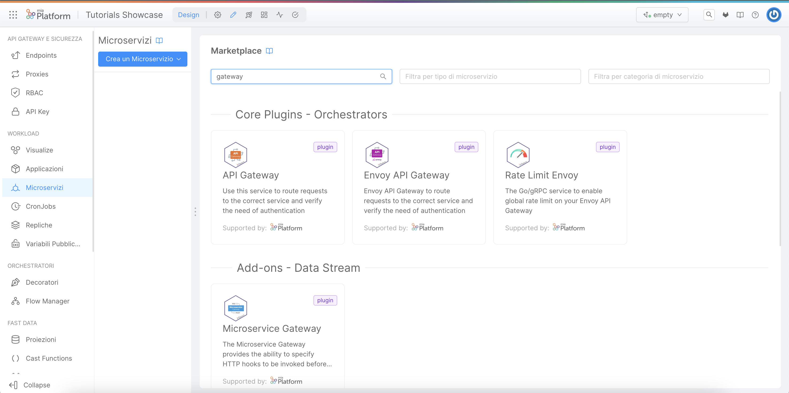

import VideoBox from "./../../../src/components/VideoBox";

intro

## What we will build

In this tutorial, we will create a simple Hello World service starting from a marketplace example. We will expose the "Hello World" endpoint outside the cluster.
In particular, we will:

- Create a gateway service from a Marketplace plugin;
- Make our gateway reachable from outside the cluster;
- Deploy the project and test the reachability;
- Create a new microservice from a Marketplace example;
- Expose our microservice API by creating an endpoint;
- Deploy the project and test the result by contacting it via `curl`.

## Prerequisites

Before starting we must have an empty project in our Mia-Platform Console. In order to know how to create a project on Mia-Platform Console, read [this guide](/development_suite/set-up-infrastructure/create-project.mdx).
Moreover, be sure:

- you have at least `developer` role on the project you want to use to reproduce the steps;
- you have at least `maintainer` role on the environment of the project you want to deploy on.

## Create a gateway service

In order to start the tutorial you must be in the design section of the project.

Select **Microservices** from the menu on the left:

The Microservices screen is composed by four different tabs.

In the left area you can find a button to add new microservices and the list of the services currently included in the project. In our case this list is empty since we have started from scratch.

In order to choose your API Gateway service:

- Click on the "Create a Microservice" button.
- In the dropdown menu, select "From Marketplace" option
- On the right side, you will see a catalogue of plugin, templates and examples
- Type "API Gateway" in the search bar
- Select "API Gateway" from the list of result.
- Click on the "Create" applying the default fields values.

<!-- TODO add a short description of the nginx api gateway and the link to its full documentation -->

:::tip
You can select your preferred API Gateway for your projects. We are using the nginx-based "API Gateway" for this tutorial.
:::

## Make our gateway reachable from outside the cluster;

## Deploy the project and test the reachability;

## Create a new microservice from a Marketplace example;

## Expose our microservice API by creating an endpoint;

## Deploy the project and test the result by contacting it via `curl`.
