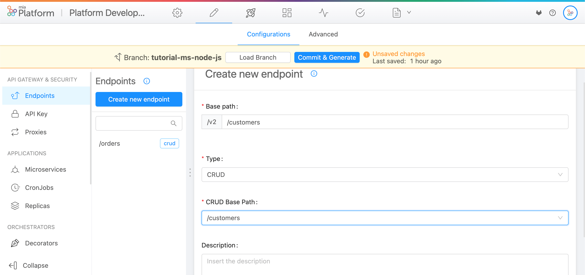

import VideoBox from './../../../src/components/VideoBox'

In this tutorial we'll see how to create and expose a Node.js Microservice using [Node.js template](../../marketplace/templates/mia_templates) from the [Marketplace](../../marketplace/overview_marketplace).

## What We’ll Build

In this tutorial we'll develop a simple **Node.js microservice that exposes a route** through the [Mia-Platform API Gateway](../../runtime_suite/api-gateway).

Specifically, we'll write an API that, when invoked, will reply based on the value of an [environment variable](../../development_suite/set-up-infrastructure/env-var).
Moreover we'll create a **CRUD for storing customers and orders** and develop a Microservice that **calculates the shipping cost for a specific order**. If the order belongs to a new customer the shipping cost is reduced, otherwise, a default cost is applied.

## Prerequisites

We’ll assume that you have some familiarity with **JavaScript** and **Node.js**, but you can follow along even if you're coming from a different programming language. All concepts explained following are valid for all languages and frameworks.

Prepare your favorite IDE to interact with Git repositories.

## Create CRUDs

First of all open your project, and create the following [MongoDB CRUD](../../development_suite/api-console/api-design/crud_advanced.md) collections. In order to do this follow these steps:

### Customers CRUD

1. In the [Console](../../development_suite/overview-dev-suite) select your project.
2. Select _Design section_.
3. Select the branch _master_.
4. Go to section [MongoDB CRUD](../../development_suite/api-console/api-design/crud_advanced.md) and click _Create new CRUD_.
5. Insert the name `customers` and press _Create_.
6. Now you have to set your collection fields. Scroll to the _Fields_ section and click _Add New_ to create the following fields:

:::tip
You can accelerate the field creation process by [importing them from JSON](../../development_suite/api-console/api-design/crud_advanced#how-to-create-the-fields-of-your-crud-by-importing-a-json).
In order to do this download <a download target="_blank" href="/docs_files_to_download/orders.json"> orders crud JSON</a> and <a download target="_blank" href="/docs_files_to_download/customers.json"> customers crud JSON</a>.
:::

| **Field name**          | **Type** |
| ----------------------- | -------- |
| **name** (required)     | String   |
| **lastname** (required) | String   |
| **newCustomer**         | Boolean  |

### Orders CRUD

Create `orders` CRUD with the following fields:

| **Field name**      | **Type**         |
| ------------------- | ---------------- |
| **date** (required) | Date             |
| **orderItems**      | Array of Objects |
| **customerId**      | ObjectId         |

:::info
Check out [this tutorial](../../getting_started/quick_rest_api) and see this short [video](../../getting_started/video_pills/video_pills#how-to-create-a-crud) to learn how to create and expose CRUDs
:::


Now you should expose your collection through an Endpoint and create your first API.

1. Go to section [Endpoints](../../development_suite/api-console/api-design/endpoints.md) and click _Create new endpoint_. Then enter the following information:

   - `/customers` as **Base path**.
   - `CRUD` as **Type**.
   - Select `customers` as **CRUD**.

2. Click _Create_. You have just created your first API!
   The detail view shows other configurations that we'll use later. Scroll down to the _Routes_ section to see an overview of the routes of your API.

3. Create a new endpoint with the following information:

   - `/orders` as **Base path**.
   - `CRUD` as **Type**.
   - Select `orders` as **CRUD**.



4. To confirm changes just press **Commit & Generate**. We suggest writing a proper title for each commit, in this case, we can type in `Created CRUDs "customer", "orders" and the related endpoints`. We can choose an existing branch or create a new one.

:::caution
All items in the design area **are not saved** until you click **Commit & Generate**. You can create different entities and then save all the work only at the end.
Upon configuration save, the Console will generate updates for the Kubernetes configuration files in your project repository.
:::

:::info
Check out the [endpoint documentation](../../development_suite/api-console/api-design/endpoints.md) for more information about the section and to discover all the potentialities of this feature.
:::

## Create the Microservice from the Marketplace Template

:::tip
Watch this short video to learn how it's easy to create a Node.js Microservice from templates
:::

<VideoBox videoName={'createNodeMS'} />

A Microservice can be created starting from existing Templates. Starting from a Mia-Platform Template or using Mia-Platform Service Libraries has many advantages and allows your microservice to be compliant with all best practices(such as testing, logging, health routes, etc).

In the [Marketplace](../../marketplace/overview_marketplace.md) you can find a list of Examples or Templates powered and supported by Mia-Platform that allows you to set-up microservices with a tested and pre-defined function.

We'll create a microservice from [Node.js template](https://github.com/mia-platform-marketplace/Node.js-Custom-Plugin-Template/):

1. Go to section [Microservices section](../../development_suite/api-console/api-design/services.md) and click _Create a Microservice_.
1. Search the template `Node.js Template`, then select it.
1. Now enter the following information:
   - `get-shipping-cost` as **Name**.
   - Select the suggested option as **Docker Image Name**.
1. In the detail, go to the _Microservice configuration_ section and set **Memory Request Limit** to `150` and **CPU Limit** to `100`.

Now you have to expose the microservice:

1. Go to [Endpoints](../../development_suite/api-console/api-design/endpoints.md) section and click _Create new endpoint_. Then enter the following information:

   - `/shipping-cost-service` as **Base path**.
   - `Microservice` as **Type**.
   - Select `get-shipping-cost` as **Microservice**.

1. Click _Create_.
1. Commit the changes

## The code base

:::info
The complete code of the microservice developed in this tutorial is available on [Mia-Platform GitHub](https://github.com/mia-platform/Node.js-Microservice-Tutorial).
:::

You can get access to your newly created microservice repository from the Microservice detail page, by clicking on _View Repository_ button. The _Clone_ button allows you to easily see SSH and HTTPS urls to clone the repository in your local machine.

Let's take a look at the codebase and let's get ready to code our microservice.

Clone the repository, and open the project with your favorite IDE. The code base it's structured as follows:


The project includes the following packages:

- [@mia-platform/custom-plugin-lib](https://github.com/mia-platform/custom-plugin-lib): The [Mia service Node.js library](../../libraries/overview_service_libraries) that helps the creation and the interactions of microservices within Mia-Platform.
- [ESlint](https://eslint.org/): a lint tool with [the config for Mia-Platform JavaScript Style](https://github.com/mia-platform/eslint-config-mia). Naturally, you can use whatever you like.
- [Nock](https://github.com/nock/nock): HTTP server mocking and expectations library that helps to write tests
- [Tap](https://node-tap.org/): a test library
- [pre-commit](https://pre-commit.com/): a library for managing pre-commit hooks

The project also includes several NPM scripts, later in the course we will see when and why to run them.

## Health routes

Let's go back to the Console, specifically go to the microservice detail page. You can see several configuration fields (check out this [page](../../development_suite/api-console/api-design/services#manage-microservices) for more details), in particular the _probes_ section define the [health routes](../../guidelines/microservice_vademecum#health-routes) for the Kubernetes pod:

- The _Readiness path_ provides k8s with information about when the container is ready to receive incoming traffic. The default route is `/-/ready`.
- The _Liveness path_ provides k8s with information about when the container is in a healthy state. The default route is `/-/healthz`.

These routes are called automatically by Kubernetes and the microservice you just created has a default implementation provided by the [@mia-platform/custom-plugin-lib](https://github.com/mia-platform/custom-plugin-lib) library.

:::info
Check out [Kubernetes official documentation](https://kubernetes.io/docs/tasks/configure-pod-container/configure-liveness-readiness-startup-probes/) for more details about probes.
:::

## API Documentation

Another important field in the microservice configuration is the _API documentation path_. This is the route called to fetch the automatically generated API Documentation to be shown in the [API Portal](https://docs.mia-platform.eu/docs/development_suite/api-portal/api-documentations). Even in this case, you don't have to write any code, this route is already integrated in the microservice.

As of now, our microservice doesn't expose any custom route. Later we'll see how to configure documentation for any route.

Now we'll try to deploy the Console project.

## Deploy

By [deploying](../../development_suite/deploy/deploy) your Console project a new Kubernetes Pod will be created for your custom service. In this case we'll also release the previously created CRUDs:

1. Go to section _Deploy_ and click _Create new CRUD_.
2. As environment select _Development_
3. Select the correct branch. You can see the related last commits.
4. Click _Deploy_

A pipeline will be triggered by the Console to start the deploy of your project.

## The API Portal

After the deploy the [API Portal](../../development_suite/api-portal/api-documentations.md) allows us to see the API Documentations for the chosen environments.

To access it, select the _Docs_ tab in the top menu and select `Development`, as the environment you deployed to:


For now, we can see the default exposed routes of CRUDs that we can use to read and manipulate the data of relative MongoDB collection. Later, here we'll see the routes of the microservice that we'll expose.

## How to test? Let's write tests!

Now, we have to implement the route that calculates the shipping cost for a specific order. We could have started by writing the code first, but Mia-Platform strongly encourages the use of Test Driven Development.  
Writing tests first allows us to focus on the needed requirements and in addition, makes the code easier to evolve over time. After each change, we can run tests to check if everything still works.

Let's write a simple test for `/hello` route:

Let's get back on the IDE and open `test/index.test.js` file and replace the "Insert your tests..." comment with the following code:

```js
t.test('GET /hello', (t) => {
  t.test('Correct message', async (t) => {
    const response = await fastify.inject({
      method: 'GET',
      url: '/hello',
    })
    t.equal(response.statusCode, 200)
    t.same(JSON.parse(response.payload), {
      message: 'Hello by your first microservice',
    })
  })
  t.end()
})
```

In this code, we are using the [Tap](https://node-tap.org/) library to write a test for the base success case.

Now run tests using the proper NPM script command, in your terminal enter:

```zsh
npm run test
```

The tests should fail because the route is not implemeted yet.

Later in the tutorial we'll come back to write tests and exploring the topic.

:::info Node Tap
Check out the [official documentation](https://node-tap.org/docs/getting-started/) for details about Tap features
:::

## Let's code! Implement a route

Open the `index.js` file:

```js
'use strict'

const customService = require('@mia-platform/custom-plugin-lib')()

module.exports = customService(async function index(service) {
  /*
   * Insert your code here.
   */
})
```

First we import the [Mia service Node.js library](../../libraries/overview_service_libraries), which creates the infrastructure ready to accept the definition of routes and decorators. The library is **built on [Fastify](https://www.fastify.io/)**.
The function returned by require, `customService`, expects an async function to initialize and configure the `service`.

[`service`](https://www.fastify.io/docs/latest/Server/) is a Fastify instance, that is decorated by the library to help you interact with Mia-Platform resources. You can use service to register any Fastify routes, custom decorations and plugin.

`addRawCustomPlugin` is a function that requires the HTTP method, the path of the route and a handler.

First, we'll add a simply hello world route that if called return a simply string, the `index.js`. Starting writing the route handler:

1. Create a `handlers` folder at the root of the project
1. In this folder add a file named as`hello.js` and write this code:

```js
'use strict'

async function handler() {
  return {
    message: 'Hello by your first microservice',
  }
}

const schema = {
  response: {
    200: {
      type: 'object',
      properties: {
        message: {
          type: 'string',
        },
      },
    },
  },
}

module.exports = {
  handler,
  schema,
}
```

The file must export a function, the **handler**, and optionally a **JSON schema to validate the incoming request and the response** returned by the route. This schema is used to automatically generate an error if the validation fails and to generate the API documentation for the API Portal. Check out [Fastify documentation](https://www.fastify.io/docs/v2.2.x/Validation-and-Serialization/) for more details.
In this case the response will be an object with a `message` property.  
In the handler we'll simply return the message object. **It's not necessary specify any HTTP code**, as default if no error occurs the response will have **status code 200**.

Now let's get back to `index.js` file and add the route `GET` `/hello` handled by the function previously written:

```js
'use strict'

const customService = require('@mia-platform/custom-plugin-lib')()
const hello = require('./handlers/hello')

module.exports = customService(async function index(service) {
  service.addRawCustomPlugin('GET', '/hello', hello.handler, hello.schema)
})
```

Import `hello.js` file and use `addRawCustomPlugin` to add the route. Thus function requires the **HTTP method, the path of the route and a handler and an optionally JSON schema**.

Now that the route is completed run again the tests writing in the terminal the properly NPM script command:

```zsh
npm run test
```

Now the tests should be ok and you should see in the terminal the following messages:


## Implement the route

Now we have to implement the route `GET /get-shipping-cost`. This route will receive an `orderId` in the query string and return the correct shipping cost.

### Write the tests

Let's start writing a simple test for `GET /get-shipping-cost` route.  
To simplify we will show only one test: the correct calculation of the shipping cost for a new customer. You can find the other tests (no new customer, customer/order not found) in the [tutorial repository](https://github.com/mia-platform/Node.js-Microservice-Tutorial).

Open `test/index.test.js` file and on the top add the [Nock](https://github.com/nock/nock) module:

```js
...
const lc39 = require('@mia-platform/lc39')
const nock = require('nock')

nock.disableNetConnect()
```

We'll use it for mocks the call to the CRUD. In this way, we can simulate responses from HTTP requests. `nock.disableNetConnect()` indeed disable the real HTTP requests.

Now add the following test to `tests/index.test.js` file:

```js
const t = require('tap')
const lc39 = require('@mia-platform/lc39')
const nock = require('nock')

const NEW_CUSTOMER_SHIPPING_COST = 5000

...

  t.test('GET /get-shipping-cost', t => {
    const CRUD_URL = 'http://crud-service'

    t.test('New customer shipping cost', async t => {
      const orderId = '1'

      const mockedOrder = {
        customerId: '2',
      }

      const { customerId } = mockedOrder

      const mockedCustomer = {
        customerVATId: customerId,
        newCustomer: true,
      }

      const getOrderScope = nock(CRUD_URL)
        .get(`/orders/${orderId}`)
        .reply(200, mockedOrder)

      const getCustomerScope = nock(CRUD_URL)
        .get(`/customers/${customerId}`)
        .reply(200, mockedCustomer)

      const response = await fastify.inject({
        method: 'GET',
        url: '/get-shipping-cost',
        query: {
          orderId,
        },
      })
      t.equal(response.statusCode, 200)
      t.same(JSON.parse(response.payload), { shippingCost: NEW_CUSTOMER_SHIPPING_COST })

      // Check if the mocked requests have been really called by the handler
      getOrderScope.done()
      getCustomerScope.done()
    })
    t.end()
  })
```

In this code we have tested that the shipping cost for a new customer will be correctly returned.

### Write the handler

Now let's write the route handler: into the `handlers` folder add a file named `getShippingCost.js` as done previously.

First, define the schema for request and response:

```js
...

const schema = {
  querystring: {
    type: 'object',
    properties: {
      orderId: { type: 'string' },
    },
  },
  response: {
    '200: {
      type: 'object',
      properties: {
        shippingCost: { type: 'number' },
      },
    },
    '4xx': {
      type: 'object',
      properties: {
        error: { type: 'string' },
      },
    },
    '5xx': {
      type: 'object',
      properties: {
        error: { type: 'string' },
      },
    },
  },
}
```

The route will accept an `orderId` and return the relative shipping cost if all goes ok. In case of error, it will return an appropriate response.

Now we have to start to write the handler, specifically our function will have to:

1. Read from CRUD `orders` the order indicated by the query params
1. Read from CRUD `customers` the customer related to the order
1. If the customer document has the field `newCustomer` set as _true_ return a value, otherwise return another. For now, we'll hardcode these values, later we'll get them from environment variables.

The code will be the following:

```js
const DEFAULT_SHIPPING_COST = 1000
const NEW_CUSTOMER_SHIPPING_COST = 5000

// Get query params
const { orderId } = req.query

// Get proxy for interact with the Crud Service
const proxy = req.getDirectServiceProxy('crud-service', { protocol: 'http' })

const allowedStatusCodes = [200]

let orderCrudRes

try {
  orderCrudRes = await proxy.get(`/orders/${orderId}`, null, {
    allowedStatusCodes,
  })
} catch (error) {
  reply.code(404).send({
    error: 'Order does not exist',
  })
  return
}

let order = orderCrudRes.payload

let customerCrudRes

try {
  customerCrudRes = await proxy.get(`/customers/${order.customerId}`, null, {
    allowedStatusCodes,
  })
} catch (error) {
  reply.code(404).send({
    error: 'Customer does not exist',
  })
  return
}

const customer = customerCrudRes.payload

const { newCustomer } = customer

return {
  shippingCost: newCustomer
    ? NEW_CUSTOMER_SHIPPING_COST
    : DEFAULT_SHIPPING_COST,
}
```

With the `getDirectServiceProxy` method we have got a proxy for a platform service without passing through the [Microservice Gateway](../../runtime_suite/microservice-gateway). In this case, we have got a proxy for [CRUD Service](../../runtime_suite/crud-service/overview_and_usage) and use it to read documents from CRUDs collection.

`allowedStatusCodes` options allow to defines which status codes of the response are accepted. If the response status code is not contained in this array, the promise will be rejected.

:::info Crud Service
To take in deeper how to use API exposed by the CRUD Service check out the [CRUD Endpoints Documentation](../../runtime_suite/crud-service/overview_and_usage#crud-endpoints)
:::

### Add the route

Let's go back to `index.js` file and add the route `GET /get-shipping-cost` handled by the function written previously:

```js
'use strict'

const customService = require('@mia-platform/custom-plugin-lib')()
const hello = require('./handlers/hello')
const getShippingCost = require('./handlers/getShippingCost')

module.exports = customService(async function index(service) {
  service.addRawCustomPlugin('GET', '/hello', hello.handler, hello.schema)
  service.addRawCustomPlugin(
    'GET',
    '/get-shipping-cost',
    getShippingCost.handler,
    getShippingCost.schema
  )
})
```

Now run tests implemented previously by the properly NPM script command:

```zsh
npm run test
```

Finally commit and push changes to master.

## Try the Microservice

Now, [deploy](../../development_suite/deploy/deploy) again the Console project to try the microservice.

After the deploy open the [API Portal](../../development_suite/api-portal/api-documentations.md) and use the _Orders_ and _Customers_ CRUD routes to add some test data.

Now you can try the `GET /get-shipping-cost` route:


## Environment variable

To conclude, create a new [environment variable](../../development_suite/set-up-infrastructure/env-var) to store the shipping cost for new customers.

An environment variable is a variable whose value is set outside the microservices. An environment variable is made up of a name/value pair. You can set a different value for each environment (Development, Production, etc.).

### Create an environment variable

Open your project, and create the ENV `NEW_CUSTOMER_SHIPPING_COST`. In order to do this follow these steps:

1. In the Console select your project.
1. Select the _Environments section_ and click _Add new environment variable_.
1. Insert the key `DEV_NEW_CUSTOMER_SHIPPING_COST` and enter `500` as value.
1. Add a new ENV, set the key `PROD_NEW_CUSTOMER_SHIPPING_COST` and enter `400` as value.

In this way we have created the `NEW_CUSTOMER_SHIPPING_COST` that values `500` in the _Development_ environment and `500` for _Production_.

:::info
Using `MIA_..` as a prefix in the ENV you will set the value for all environments
:::

### Add the ENV to the microservice

Now we have to add the [environment variable to the microservice:

1. Go to section [Microservices section](../../development_suite/api-console/api-design/services.md) and select the _get-shipping-cost_ service.
1. Go to section _Environment variable configuration_ click _Add Environment Variable_
1. Insert the key `NEW_CUSTOMER_SHIPPING_COST` and `{{NEW_CUSTOMER_SHIPPING_COST}}` as value.
1. Commit the changes

In this way the microservice can access to `NEW_CUSTOMER_SHIPPING_COST` ENV. Using `{{env name}}` Mia-Platform automatically interpolates the correct value for each environment where the microservice will run.

### Edit microservice

Now we have to edit the microservice to use the ENV.

First we have to `index.js` and set the schema of the environment variables used by the microservice:

```js
'use strict';

const customService = require('@mia-platform/custom-plugin-lib')({
  type: 'object',
  required: ['NEW_CUSTOMER_SHIPPING_COST'],
  properties: {
    NEW_CUSTOMER_SHIPPING_COST: { type: 'number' },
  },
});
...
```

Now in the `getShippingCost.js` handler use the ENV, this will be available under `config` property of the request:

Furthermore log the value of the ENV.

This will be available under `service.config` instance:

```js
async function handler(req, reply) {
  const DEFAULT_SHIPPING_COST = 1000;
  const { NEW_CUSTOMER_SHIPPING_COST } = this.config;
  req.log.info({ value: NEW_CUSTOMER_SHIPPING_COST }, 'NEW_CUSTOMER_SHIPPING_COST value')

  ...
}
```

:::info Logging
Check out the [Guidelines for logs](../../getting_started/monitoring-dashboard/dev_ops_guide/log) for more details about this topic
:::

Finally adjust the tests, let's back to `tests/index.test.js` file: in the `setupFastify` method inject the `NEW_CUSTOMER_SHIPPING_COST` ENV:

```js
t.test('get-shipping-cost', async t => {
  // silent => trace for enabliing logs
  const fastify = await setupFastify({
    USERID_HEADER_KEY: 'userid',
    GROUPS_HEADER_KEY: 'groups',
    CLIENTTYPE_HEADER_KEY: 'clienttype',
    BACKOFFICE_HEADER_KEY: 'backoffice',
    MICROSERVICE_GATEWAY_SERVICE_NAME: 'microservice-gateway.example.org',
    NEW_CUSTOMER_SHIPPING_COST: NEW_CUSTOMER_SHIPPING_COST,
  })
  ...
```

Now you can commit and push the code to the master branch.

## Final test

Now, [deploy](../../development_suite/deploy/deploy) the Console project to try the microservice.

After the deploy open the [API Portal](../../development_suite/api-portal/api-documentations.md) and try the `GET /get-shipping-cost` route:


## Logging

In this tutorial we have created a microservice perfectly integrated with Mia-Platform, as the last step we'll find out how to monitor microservices logs:

1. From your project go to section _Logs_.
1. From here you can see select the environment and see the list of current running pods. Select _Development_ as environment and search for `get-shipping-cost-...` pod.
1. Click on the pod name to see all logs. Here you should see the logs with the value of the `NEW_CUSTOMER_SHIPPING_COST` ENV.


## Microservice repository

You can access the complete repository of the tutorial [here](https://github.com/mia-platform/Node.js-Microservice-Tutorial).
