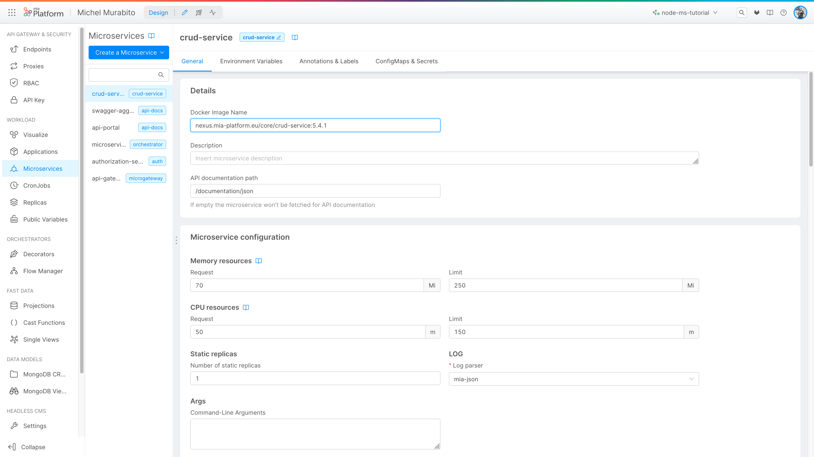
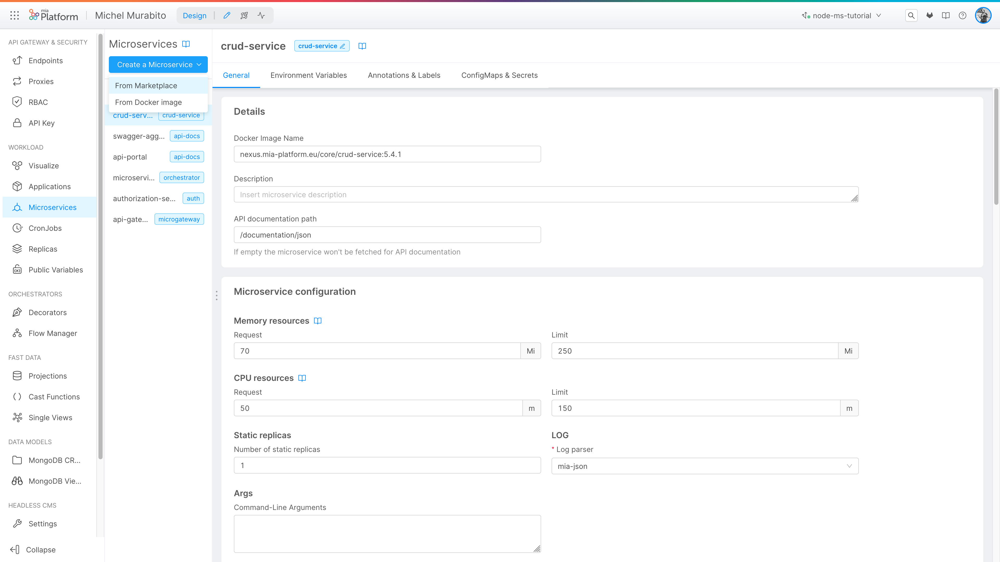
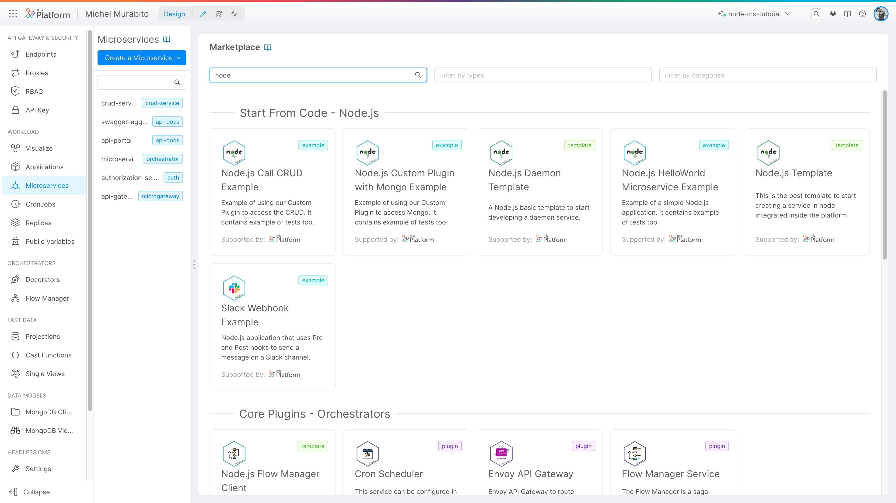
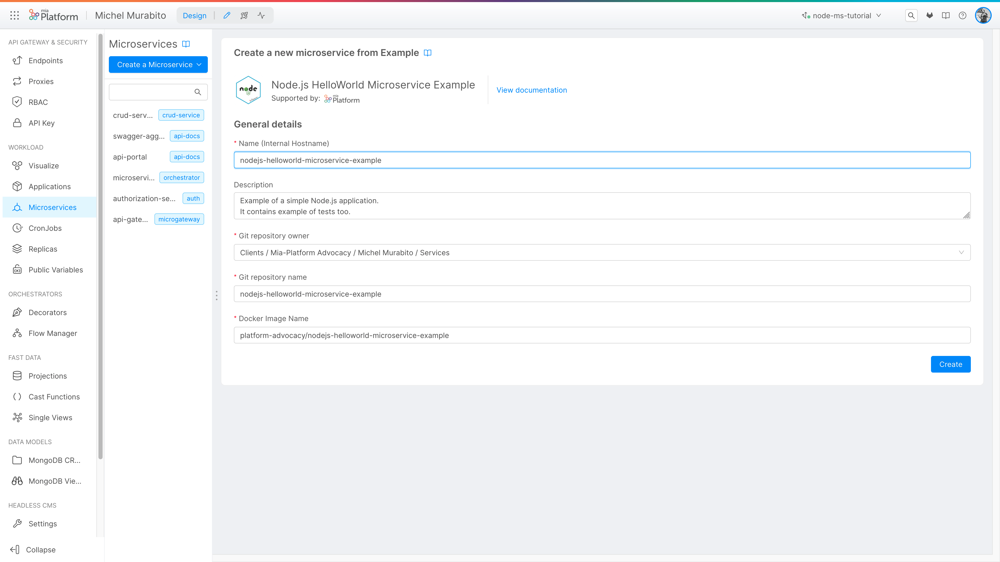
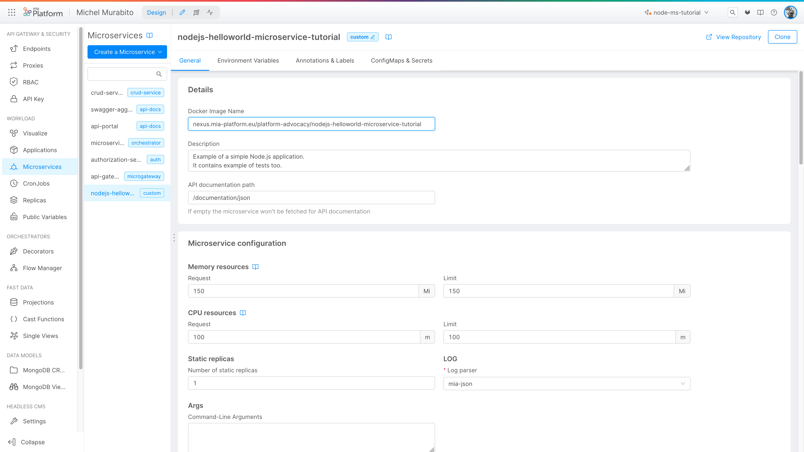
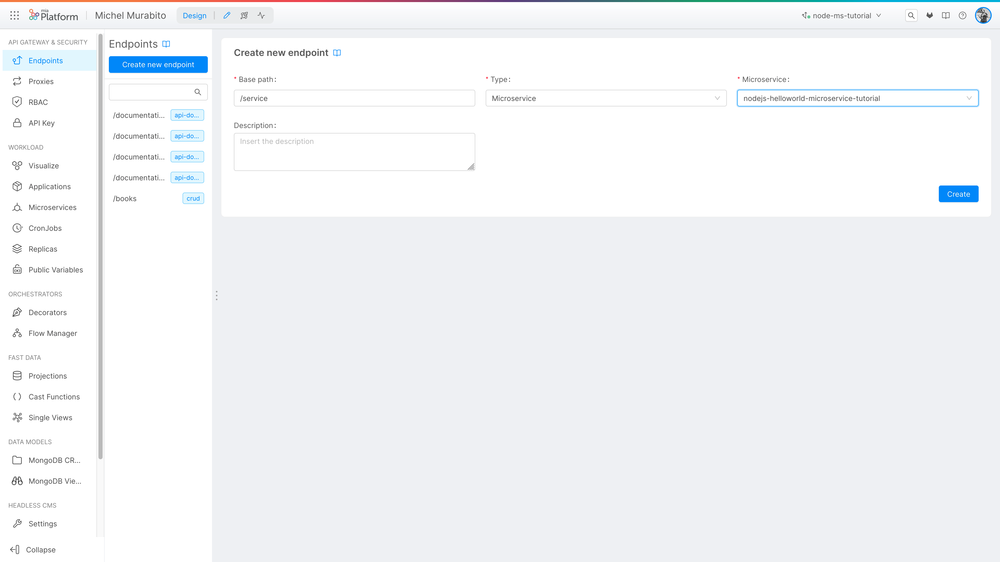

import VideoBox from './../../../src/components/VideoBox'


Microservices are used to develop software systems focusing on the creation of modules that respond to a single functionality with well-defined interfaces.
Development with microservices offers many advantages. Generally they are easy to understand, simple to deploy, quick to reuse and allow you not to bind to a single programming language or framework.

In this tutorial we'll see how to create a [microservice](../../guidelines/microservice_vademecum) in Node.js using a [marketplace](../../marketplace/overview_marketplace) template and customizing it according to our needs.

## What We’ll Build
In this tutorial we'll see how to create and expose a Node.js Microservice using [Node.js Example](../../marketplace/examples/mia_examples) from the [Marketplace](../../marketplace/overview_marketplace).

 * Create the microservice from the Marketplace Example
 * Configure the microservice
 * Implement the routes
 * Deploy the microservice
 * Test the microservice

## Prerequisites

Before starting, make sure you already have a CRUD with public endpoints correctly configured in your environment. For this example, we’ll use the books example; to replicate the case you can use the [Create a Rest API in 5 minutes](../../getting_started/quick_rest_api) guide using the following <a download target="_blank" href="/docs_files_to_download/tutorial/nodejs-microservice-tutorial-schema.json">JSON schema</a>.

We’ll assume that you have some familiarity with **Node.js** language.

Before starting:
  * You will **create a CRUD called books**, with the data schema explained before.
  * **Connect the CRUD books to the endpoints** to publicly expose your data.
  * **Insert into your CRUD some useful data** to do some tests
  * Check that the system is working properly (with CRUD request via API portal or cURL requests)

## Create the microservice from the Marketplace Template

A Microservice can be created starting from existing Example, Templates and Plugin. Starting from a Mia-Platform Example and Template or using Mia-Platform Service Libraries has many advantages and allows your microservice to be compliant with all best practices(such as testing, logging, health routes, etc).

In the [Marketplace](../../marketplace/overview_marketplace.md) you can find a list of Examples or Templates powered and supported by Mia-Platform that allows you to set-up microservices with a tested and pre-defined function.

The first step is to **create the microservice**.

Select **Microservices** from the menu on the left:


The Microservices screen is composed by four different section.  
The left section will contain **all the Microservices** created on this project.  
The right section will contain the **detail about each already created Microservices**.  

Now we can click on **"Create a Microservice"**, in the submenu we select **"From Marketplace"**.
:::info
The submenu also shows the possibility of creating a microservice starting from an already existing docker image. We won't see how to do this in this tutorial, but the Console also allows you to use existing microservices.
:::


In the **"Create a Microservice"** page we can search for **"Node.js"** and select the example **"Node.js HelloWorld Microservice Example"**.



In this tutorial we'll use an example, but you can also create a microservice starting from a template or a Plugin.  
The difference between the three options is that:  
 * the **example** a specific use-case, a ready-to-use model to create your Microservice;
 * the **template** is a base microservice that can be customized to create a new microservice; 
 * the **plugin** is a ready-to-use microservice that can be plugged into your application. 
   
For more information about the differences between the three options, you can read the [Marketplace Overview](../../marketplace/overview_marketplace). 

After selecting the example, you can configure the base information about your microservice:
  

The first thing to do is to **insert a name** for your microservice, this name will be used as internal hostname for your microservice and need to be unique in the project.  
You can add an description to describe the functionality of your microservice, useful to understand the purpose of the microservice.  
Here you can also find the information about where the code of the microservice is stored, like the git repository owner and the repository name.  
Last but not least, you can see the docker image name.  

After that, you can create the microservice by clicking on **"Create"** button, the Console will ask you to confirm the creation of the microservice. 
The confirmation remember that a new git repository will be created and if you want to revert the changes you can delete the repository manually from the git provider.

After the creation of the microservice it's recommended to save your changes, to do that click on the **"Save"** button on the top right corner of the page.

Now you can see the detail of the microservice and from here you can navigate to the git repository using the **"View Repository"** or copy the clone string to clone the repository locally clicking on the **"Clone"** button.  
In this page use the button to navigate between the **"Environment Variables"**, the **"Annotations&Labels"** and the **"ConfigMaps&Secrets"** configuration.


## Configure the microservice

After the microservice creation we need to configure the microservice.  
Into the microservice screen you can navigate in the different section to configure each setting of the microservice. For each section you can find a description of the purpose of the section and the specific configuration and starting from a template or an example you can find some default configuration already set, change the configuration to fit your needs.  

Now we'll see how expose the microservice using the endpoint.  
The procedure to configure the endpoint is the same of the CRUD, so you can read the [Create a Rest API in 5 minutes - Configure the Endpoint](../../getting_started/quick_rest_api#configure-the-endpoint) guide to learn how to configure the endpoint, 
the only difference is that you need to configure the endpoint in the microservice and not in the CRUD, so select **"Microservices"** in the **"Type"** dropdown.

  

:::info
When you expose the microservice using the endpoint, the endpoint will be exposed outside the cluster, that means that the API exposed by your microservice will be accessible from outside the cluster.
At the same time, to expose the API to the API Portal you need also to configure the """SWAGGER DOC""" in the microservice

 
Expose the microservice using the endpoint is the most common way to expose the microservice outside the cluster. 

, but you can also expose the microservice using the **"Ingress"** section.
:::
 
Now we can save the changes the new configuration clicking on the **"Save"** button on the top right corner of the page.
                                  


## Coding

Now we can start to code the microservice, the code is stored in the git repository that you can access from the microservice screen clicking on the **"View Repository"** button or Clone the repository locally using the **"Clone"** button.  
After the clone of the repository you can open the project with your favorite IDE.

### Code Structure TODO (check the title)

The code is structured in the following way:
 * **index.js** is the entry point of the microservice, here we import the routes and the configuration of the microservice
 * **handlers** folder contains the routes of the microservice, in this example we have only one route that is the **"/hello"** route
 * **tests** folder contains the test of the microservice, in this example we have only one test that check the **"/hello"** route

This **custom-plugin-lib** is a library that contains a set of functions that can be used to create a microservice in Node.js and it's already included in the package.json of the example more information about the **custom-plugin-lib** can be found in the [Node.js Custom Plugin Lib](../../development_suite/api-console/api-design/plugin_baas_4)

 
 


______________  _____________________  ___

## OLD CONTENT

## The code base

:::info
The complete code of the microservice developed in this tutorial is available on [Mia-Platform GitHub](https://github.com/mia-platform/Node.js-Microservice-Tutorial).
:::

You can get access to your newly created microservice repository from the Microservice detail page, by clicking on _View Repository_ button. The _Clone_ button allows you to easily see SSH and HTTPS urls to clone the repository in your local machine.

Let's take a look at the codebase and let's get ready to code our microservice.

Clone the repository, and open the project with your favorite IDE. The code base it's structured as follows:


The project includes the following packages:

- [@mia-platform/custom-plugin-lib](https://github.com/mia-platform/custom-plugin-lib): The [Mia service Node.js library](../../libraries/overview_service_libraries) that helps the creation and the interactions of microservices within Mia-Platform.
- [ESlint](https://eslint.org/): a lint tool with [the config for Mia-Platform JavaScript Style](https://github.com/mia-platform/eslint-config-mia). Naturally, you can use whatever you like.
- [Nock](https://github.com/nock/nock): HTTP server mocking and expectations library that helps to write tests
- [Tap](https://node-tap.org/): a test library
- [pre-commit](https://pre-commit.com/): a library for managing pre-commit hooks

The project also includes several NPM scripts, later in the course we will see when and why to run them.

## Health routes

Let's go back to the Console, specifically go to the microservice detail page. You can see several configuration fields (check out this [page](../../development_suite/api-console/api-design/services#manage-microservices) for more details), in particular the _probes_ section define the [health routes](../../guidelines/microservice_vademecum#health-routes) for the Kubernetes pod:

- The _Readiness path_ provides k8s with information about when the container is ready to receive incoming traffic. The default route is `/-/ready`.
- The _Liveness path_ provides k8s with information about when the container is in a healthy state. The default route is `/-/healthz`.

These routes are called automatically by Kubernetes and the microservice you just created has a default implementation provided by the [@mia-platform/custom-plugin-lib](https://github.com/mia-platform/custom-plugin-lib) library.

:::info
Check out [Kubernetes official documentation](https://kubernetes.io/docs/tasks/configure-pod-container/configure-liveness-readiness-startup-probes/) for more details about probes.
:::

## API Documentation

Another important field in the microservice configuration is the _API documentation path_. This is the route called to fetch the automatically generated API Documentation to be shown in the [API Portal](../../runtime_suite/api-portal/overview.md). Even in this case, you don't have to write any code, this route is already integrated in the microservice.

As of now, our microservice doesn't expose any custom route. Later we'll see how to configure documentation for any route.

Now we'll try to deploy the Console project.

## Deploy

By [deploying](../../development_suite/deploy/deploy) your Console project a new Kubernetes Pod will be created for your custom service. In this case we'll also release the previously created CRUDs:

1. Go to section _Deploy_.
2. As environment select _Development_.
3. Select the correct branch. You can see the related last commits.
4. Click _Deploy_.

A pipeline will be triggered by the Console to start the deploy of your project.

## The API Portal

After the deploy the [API Portal](../../runtime_suite/api-portal/overview.md) allows us to see the API Documentations for the chosen environments.

To access it, select the _Docs_ tab in the top menu and select `Development`, as the environment you deployed to:


For now, we can see the default exposed routes of CRUDs that we can use to read and manipulate the data of relative MongoDB collection. Later, here we'll see the routes of the microservice that we'll expose.

## How to test? Let's write tests!

Now, we have to implement the route that calculates the shipping cost for a specific order. We could have started by writing the code first, but Mia-Platform strongly encourages the use of Test Driven Development.  
Writing tests first allows us to focus on the needed requirements and in addition, makes the code easier to evolve over time. After each change, we can run tests to check if everything still works.

Let's write a simple test for `/hello` route:

Let's get back on the IDE and open `test/index.test.js` file and replace the "Insert your tests..." comment with the following code:

```js
t.test('GET /hello', (t) => {
  t.test('Correct message', async(t) => {
    const response = await fastify.inject({
      method: 'GET',
      url: '/hello',
    })
    t.equal(response.statusCode, 200)
    t.same(JSON.parse(response.payload), {
      message: 'Hello by your first microservice',
    })
  })
  t.end()
})
```

In this code, we are using the [Tap](https://node-tap.org/) library to write a test for the base success case.

Now run tests using the proper NPM script command, in your terminal enter:

```zsh
npm run test
```

The tests should fail because the route is not implemented yet.

Later in the tutorial we'll come back to write tests and exploring the topic.

:::info Node Tap
Check out the [official documentation](https://node-tap.org/docs/getting-started/) for details about Tap features
:::

## Let's code! Implement a route

Open the `index.js` file:

```js
'use strict'

const customService = require('@mia-platform/custom-plugin-lib')()

module.exports = customService(async function index(service) {
  /*
   * Insert your code here.
   */
})
```

First we import the [Mia service Node.js library](../../libraries/overview_service_libraries), which creates the infrastructure ready to accept the definition of routes and decorators. The library is **built on [Fastify](https://www.fastify.io/)**.
The function returned by require, `customService`, expects an async function to initialize and configure the `service`.

[`service`](https://www.fastify.io/docs/latest/Server/) is a Fastify instance, that is decorated by the library to help you interact with Mia-Platform resources. You can use service to register any Fastify routes, custom decorations and plugin.

`addRawCustomPlugin` is a function that requires the HTTP method, the path of the route and a handler.

First, we'll add a simple hello world route that if called simply returns a string, the `index.js`. Starting writing the route handler:

1. Create a `handlers` folder at the root of the project
1. In this folder add a file named as`hello.js` and write this code:

```js
'use strict'

async function handler() {
  return {
    message: 'Hello by your first microservice',
  }
}

const schema = {
  response: {
    200: {
      type: 'object',
      properties: {
        message: {
          type: 'string',
        },
      },
    },
  },
}

module.exports = {
  handler,
  schema,
}
```

The file must export a function, the **handler**, and optionally a **JSON schema to validate the incoming request and the response** returned by the route. This schema is used to automatically generate an error if the validation fails and to generate the API documentation for the API Portal. Check out [Fastify documentation](https://www.fastify.io/docs/v2.2.x/Validation-and-Serialization/) for more details.
In this case the response will be an object with a `message` property.  
In the handler we'll simply return the message object. **It's not necessary to specify any HTTP code**, as default if no error occurs the response will have **status code 200**.

Now let's get back to `index.js` file and add the route `GET` `/hello` handled by the function previously written:

```js
'use strict'

const customService = require('@mia-platform/custom-plugin-lib')()
const hello = require('./handlers/hello')

module.exports = customService(async function index(service) {
  service.addRawCustomPlugin('GET', '/hello', hello.handler, hello.schema)
})
```

Import `hello.js` file and use `addRawCustomPlugin` to add the route. Thus function requires the **HTTP method, the path of the route and a handler and an optionally JSON schema**.

Now that the route is completed run again the tests writing in the terminal the properly NPM script command:

```zsh
npm run test
```

Now the tests should be ok and you should see in the terminal the following messages:


## Implement the route

Now we have to implement the route `GET /get-shipping-cost`. This route will receive an `orderId` in the query string and return the correct shipping cost.

### Write the tests

Let's start writing a simple test for `GET /get-shipping-cost` route.  
To simplify we will show only one test: the correct calculation of the shipping cost for a new customer. You can find the other tests (no new customer, customer/order not found) in the [tutorial repository](https://github.com/mia-platform/Node.js-Microservice-Tutorial).

Open `test/index.test.js` file and on the top add the [Nock](https://github.com/nock/nock) module:

```js
...
const lc39 = require('@mia-platform/lc39')
const nock = require('nock')

nock.disableNetConnect()
```

We'll use it for mocks the call to the CRUD. In this way, we can simulate responses from HTTP requests. `nock.disableNetConnect()` indeed disable the real HTTP requests.

Now add the following test to `tests/index.test.js` file:

```js
const t = require('tap')
const lc39 = require('@mia-platform/lc39')
const nock = require('nock')

const NEW_CUSTOMER_SHIPPING_COST = 5000

...

  t.test('GET /get-shipping-cost', t => {
    const CRUD_URL = 'http://crud-service'

    t.test('New customer shipping cost', async t => {
      const orderId = '1'

      const mockedOrder = {
        customerId: '2',
      }

      const { customerId } = mockedOrder

      const mockedCustomer = {
        customerVATId: customerId,
        newCustomer: true,
      }

      const getOrderScope = nock(CRUD_URL)
        .get(`/orders/${orderId}`)
        .reply(200, mockedOrder)

      const getCustomerScope = nock(CRUD_URL)
        .get(`/customers/${customerId}`)
        .reply(200, mockedCustomer)

      const response = await fastify.inject({
        method: 'GET',
        url: '/get-shipping-cost',
        query: {
          orderId,
        },
      })
      t.equal(response.statusCode, 200)
      t.same(JSON.parse(response.payload), { shippingCost: NEW_CUSTOMER_SHIPPING_COST })

      // Check if the mocked requests have been really called by the handler
      getOrderScope.done()
      getCustomerScope.done()
    })
    t.end()
  })
```

In this code we have tested that the shipping cost for a new customer will be correctly returned.

### Write the handler

Now let's write the route handler: into the `handlers` folder add a file named `getShippingCost.js` as done previously.

First, define the schema for request and response:

```js
...

const schema = {
  querystring: {
    type: 'object',
    properties: {
      orderId: { type: 'string' },
    },
  },
  response: {
    '200': {
      type: 'object',
      properties: {
        shippingCost: { type: 'number' },
      },
    },
    '4xx': {
      type: 'object',
      properties: {
        error: { type: 'string' },
      },
    },
    '5xx': {
      type: 'object',
      properties: {
        error: { type: 'string' },
      },
    },
  },
}
```

The route will accept an `orderId` and return the relative shipping cost if all goes ok. In case of error, it will return an appropriate response.

Now we have to start to write the handler, specifically our function will have to:

1. Read from CRUD `orders` the order indicated by the query params
1. Read from CRUD `customers` the customer related to the order
1. If the customer document has the field `newCustomer` set as _true_ return a value, otherwise return another. For now, we'll hardcode these values, later we'll get them from environment variables.

The code will be the following:

```js
const DEFAULT_SHIPPING_COST = 1000
const NEW_CUSTOMER_SHIPPING_COST = 5000

// Get query params
const { orderId } = req.query

// Get proxy to interact with the CRUD Service
const proxy = req.getDirectServiceProxy('crud-service', { protocol: 'http' })

const allowedStatusCodes = [200]

let orderCrudRes

try {
  orderCrudRes = await proxy.get(`/orders/${orderId}`, null, {
    allowedStatusCodes,
  })
} catch (error) {
  reply.code(404).send({
    error: 'Order does not exist',
  })
  return
}

let order = orderCrudRes.payload

let customerCrudRes

try {
  customerCrudRes = await proxy.get(`/customers/${order.customerId}`, null, {
    allowedStatusCodes,
  })
} catch (error) {
  reply.code(404).send({
    error: 'Customer does not exist',
  })
  return
}

const customer = customerCrudRes.payload

const { newCustomer } = customer

return {
  shippingCost: newCustomer
    ? NEW_CUSTOMER_SHIPPING_COST
    : DEFAULT_SHIPPING_COST,
}
```

With the `getDirectServiceProxy` method we have got a proxy for a platform service without passing through the [Microservice Gateway](../../runtime_suite/microservice-gateway/overview). In this case, we have got a proxy for [CRUD Service](../../runtime_suite/crud-service/overview_and_usage) and use it to read documents from CRUDs collection.

`allowedStatusCodes` options allows to define which status codes of the response are accepted. If the response status code is not contained in this array, the promise will be rejected.

:::info CRUD Service
To take in deeper how to use API exposed by the CRUD Service check out the [CRUD Endpoints Documentation](../../runtime_suite/crud-service/overview_and_usage#crud-endpoints)
:::

### Add the route

Let's go back to `index.js` file and add the route `GET /get-shipping-cost` handled by the function written previously:

```js
'use strict'

const customService = require('@mia-platform/custom-plugin-lib')()
const hello = require('./handlers/hello')
const getShippingCost = require('./handlers/getShippingCost')

module.exports = customService(async function index(service) {
  service.addRawCustomPlugin('GET', '/hello', hello.handler, hello.schema)
  service.addRawCustomPlugin(
    'GET',
    '/get-shipping-cost',
    getShippingCost.handler,
    getShippingCost.schema
  )
})
```

Now run tests implemented previously by the properly NPM script command:

```zsh
npm run test
```

Finally commit and push changes to master.

## Try the Microservice

Now, [deploy](../../development_suite/deploy/deploy) again the Console project to try the microservice.

After the deploy open the [API Portal](../../runtime_suite/api-portal/overview.md) and use the _Orders_ and _Customers_ CRUD routes to add some test data.

Now you can try the `GET /get-shipping-cost` route:


## Environment variable

To conclude, create a new [environment variable](../../development_suite/set-up-infrastructure/env-var) to store the shipping cost for new customers.

An environment variable is a variable whose value is set outside the microservices. An environment variable is made up of a name/value pair. You can set a different value for each environment (Development, Production, etc.).

### Create an environment variable

Open your project, and create the ENV `NEW_CUSTOMER_SHIPPING_COST`. In order to do this follow these steps:

1. In the Console select your project.
1. Select the _Environments section_ and click _Add new environment variable_.
1. Insert the key `DEV_NEW_CUSTOMER_SHIPPING_COST` and enter `500` as value.
1. Add a new ENV, set the key `PROD_NEW_CUSTOMER_SHIPPING_COST` and enter `400` as value.

In this way we have created the `NEW_CUSTOMER_SHIPPING_COST` that values `500` in the _Development_ environment and `500` for _Production_.

:::info
Using `MIA_..` as a prefix in the ENV you will set the value for all environments
:::

### Add the ENV to the microservice

Now we have to add the [environment variable to the microservice:

1. Go to section [Microservices section](../../development_suite/api-console/api-design/services.md) and select the _get-shipping-cost_ service.
1. Go to section _Environment variable configuration_ click _Add Environment Variable_
1. Insert the key `NEW_CUSTOMER_SHIPPING_COST` and `{{NEW_CUSTOMER_SHIPPING_COST}}` as value.
1. Commit the changes

In this way the microservice can access to `NEW_CUSTOMER_SHIPPING_COST` ENV. Using `{{env name}}` Mia-Platform automatically interpolates the correct value for each environment where the microservice will run.

### Edit microservice

Now we have to edit the microservice to use the ENV.

First we have to edit `index.js` and set the schema of the environment variables used by the microservice:

```js
'use strict';

const customService = require('@mia-platform/custom-plugin-lib')({
  type: 'object',
  required: ['NEW_CUSTOMER_SHIPPING_COST'],
  properties: {
    NEW_CUSTOMER_SHIPPING_COST: { type: 'number' },
  },
});
...
```

Now in the `getShippingCost.js` handler use the ENV, this will be available under `config` property of the request:

Furthermore log the value of the ENV.

This will be available under `service.config` instance:

```js
async function handler(req, reply) {
  const DEFAULT_SHIPPING_COST = 1000;
  const { NEW_CUSTOMER_SHIPPING_COST } = this.config;
  req.log.info({ value: NEW_CUSTOMER_SHIPPING_COST }, 'NEW_CUSTOMER_SHIPPING_COST value')

  ...
}
```

:::info Logging
Check out the [Guidelines for logs](../../getting_started/monitoring-dashboard/dev_ops_guide/log) for more details about this topic
:::

Finally adjust the tests, let's back to `tests/index.test.js` file: in the `setupFastify` method inject the `NEW_CUSTOMER_SHIPPING_COST` ENV:

```js
t.test('get-shipping-cost', async t => {
  // silent => trace to enable logs
  const fastify = await setupFastify({
    USERID_HEADER_KEY: 'userid',
    GROUPS_HEADER_KEY: 'groups',
    CLIENTTYPE_HEADER_KEY: 'clienttype',
    BACKOFFICE_HEADER_KEY: 'backoffice',
    MICROSERVICE_GATEWAY_SERVICE_NAME: 'microservice-gateway.example.org',
    NEW_CUSTOMER_SHIPPING_COST: NEW_CUSTOMER_SHIPPING_COST,
  })
  ...
```

Now you can commit and push the code to the master branch.

## Final test

Now, [deploy](../../development_suite/deploy/deploy) the Console project to try the microservice.

After the deploy open the [Documentation Portal](https://docs.mia-platform.eu/docs/development_suite/api-portal/api-documentations) and try the `GET /get-shipping-cost` route:


## Logging

In this tutorial we have created a microservice perfectly integrated with Mia-Platform, as the last step we'll find out how to monitor microservices logs:

1. From your project go to section _Logs_.
1. From here you can see select the environment and see the list of current running pods. Select _Development_ as environment and search for `get-shipping-cost-...` pod.
1. Click on the pod name to see all logs. Here you should see the logs with the value of the `NEW_CUSTOMER_SHIPPING_COST` ENV.


## Microservice repository

You can access the complete repository of the tutorial [here](https://github.com/mia-platform/Node.js-Microservice-Tutorial).
