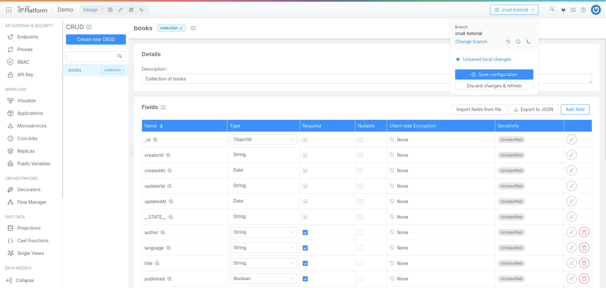

A **REST API is an application programming interface** that conforms to the constraints of REST architectural style, and allows **for interactions with RESTful web services**.
REST APIs **allow clients** (like mobile, web and other applications) **to read, write, and edit the data** of a system (like servers, databases, and many others) **hiding the implementation details** of the system itself.

In this tutorial we will see how to use **Mia-Platform Console** to **set up and expose toward the outside the cluster a REST API** to **execute CRUD operations** (Create, Read, Update, Delete) on a collection of data.

## What We’ll Build
In this tutorial we will create and expose a CRUD collection. More specifically, we will:
 * **create a CRUD collection**;
 * **insert fields** of different formats;
 * **expose the CRUD collection** using an endpoint;
 * **execute some CRUD operations** on the collection.

## Prerequisites

Before starting, we will assume that:
- you have some familiarity with **API** and **REST** concepts. More information about API is available [here](../../guidelines/rest_api_vademecum).
- you have at least `developer` role on the project you want to use to reproduce the steps 
- you have at least `maintainer` role on the environment of the project you want to deploy on
- the project you want to use to reproduce the steps includes a [swagger-aggregator](../../runtime_suite/swagger-aggregator/overview), an [api-portal](../../runtime_suite/api-portal/overview) and a [crud-service](../../runtime_suite/crud-service/overview_and_usage)

## Create a new CRUD collection
The first step is to **create a new CRUD collection** that contains the books of a library.

Select **MongoDB CRUD** from the menu on the left:  


The MongoDB CRUD screen is composed by four different section.  
The left section will contain **all the CRUD Collections** created on this project.  
The right section will contain the **detail about each already created CRUD** Collection.  

Select **"Create new CRUD"**: here you can choose the CRUD Collection name and the internal endpoint.  
By default, **the suggested name of the internal endpoint** is the same entered in the collection name. However, it is always possible to choose a custom name by simply editing the internal endpoint field. The _internal endpoint_ can be used by callers making requests directly to the `crud-service` (i.e. from the inside of the project) to execute CRUD operations on the collection we're creating.

:::info
Remember that **two CRUDs collections or two identical endpoints (with the same path) cannot exist on the same project**. So, if you import an existing collection, you will have to choose another name and path.
:::

In this example, **we will call the collection "books"** and we will use the default internal endpoint `/books`.


After clicking on **create**, you will have the CRUD collection created.


You will find some **default fields that can not be changed** because they are necessary for the proper functioning of the CRUD collection:

| Field     | Type     | Required | Description       |
|-----------|----------|----------|-------------------|
| _id       | ObjectId | Yes      | The document id   |
| creatorId | String   | Yes      | The creator id    |
| createdAt | Date     | Yes      | The creation date |
| updaterId | String   | Yes      | The updater id    |
| updatedAt | Date     | Yes      | The update date   |
| \_\_STATE\_\_ | String   | Yes      | The state         |

There is also other information for each field:
 * **Nullable**: if the field is nullable;
 * **Client-side Encryption**: if the field is client-side encrypted;
 * **Sensitivity**: the sensitivity of the field based on GDPR category.

At this point, **you have to create our DB schema** by creating the properties of your CRUD. **In this section you can add a new property by selecting Add field**. 
You can also export the already created fields in JSON format, or you can import your fields from an existing JSON file. This functionality will be described later in the tutorial. If you are interested in this part, you can [jump directly to section](../../tutorial/rest_api/quick_rest_api#export-and-import-crud-collection)..


In this interface you can add:
 * **Name** (required): the name of the field;
 * **Description**: the description of the field;
 * **Type** (required): the type of the field. Accepted values are:
   * String, Number, Boolean, Date, GeoPoint, Object, Array of String, Array of Number, Array of Object, or ObjectId;
 * **Required**: if the field is required;
 * **Nullable**: if the field is nullable;
 * **Client-side Encryption**: if the field use the client-side encryption;
 * **Allow search on encrypted field**: if the encrypted field is searchable;
 * **Sensitivity**: the GDPR sensitivity. Accepted values are:
   * Unclassified, Public, Confidential, Secret, Top Secret;
 * **GDPR Description**: the GDPR description

At bottom you can select **"create Another"** to create another field after creating the one in progress.  
Now you can save your field using the **"Create"** button.

For this example we will create the following fields:


| Field         | Type    | Required | Nullable | Description                      |
|---------------|---------|----------|----------|----------------------------------|
| author        | String  | Yes      | false    | author of the book               |
| language      | String  | Yes      | false    | language of the book             |
| title         | String  | Yes      | false    | title of the book                |
| published     | Boolean | Yes      | false    | the book it's published?         |
| salesForecast | Number  | No       | false    | expected number of copies sold | 

After adding this fields, you can read the properties in the CRUD page:


You can **edit and delete any existing field** or, if you need it, you can add other fields.

### Option 2: Import CRUD collection 

You can directly download the schema as JSON data to be used for this tutorial by using the following <a download target="_blank" href="/docs_files_to_download/tutorial/rest-api-tutorial-schema.json">Link</a>.  

The downloaded schema will be:
```json
[
  {
    "name": "_id",
    "description": "_id",
    "type": "ObjectId",
    "required": true,
    "nullable": false
  },
  {
    "name": "creatorId",
    "description": "creatorId",
    "type": "string",
    "required": true,
    "nullable": false
  },
  {
    "name": "createdAt",
    "description": "createdAt",
    "type": "Date",
    "required": true,
    "nullable": false
  },
  {
    "name": "updaterId",
    "description": "updaterId",
    "type": "string",
    "required": true,
    "nullable": false
  },
  {
    "name": "updatedAt",
    "description": "updatedAt",
    "type": "Date",
    "required": true,
    "nullable": false
  },
  {
    "name": "__STATE__",
    "description": "__STATE__",
    "type": "string",
    "required": true,
    "nullable": false
  },
  {
    "name": "author",
    "description": "author of the book",
    "type": "string",
    "required": true,
    "nullable": false,
    "sensitivityValue": 0,
    "encryptionEnabled": false,
    "encryptionSearchable": false
  },
  {
    "name": "language",
    "description": "language of the book",
    "type": "string",
    "required": true,
    "nullable": false,
    "sensitivityValue": 0,
    "encryptionEnabled": false,
    "encryptionSearchable": false
  },
  {
    "name": "title",
    "description": "title of the book",
    "type": "string",
    "required": true,
    "nullable": false,
    "sensitivityValue": 0,
    "encryptionEnabled": false,
    "encryptionSearchable": false
  },
  {
    "name": "published",
    "description": "the book it's published?",
    "type": "boolean",
    "required": true,
    "nullable": false,
    "sensitivityValue": 0,
    "encryptionEnabled": false,
    "encryptionSearchable": false
  },
  {
    "name": "salesForecast",
    "description": "in terms of the many copies sold",
    "type": "number",
    "required": false,
    "nullable": false,
    "sensitivityValue": 0,
    "encryptionEnabled": false,
    "encryptionSearchable": false
  }
]
```
 
If you want to **import the schema**, you must click on **"Import fields from file"**:


You can **select the file within your local machine** and upload it:


At this point, **you will have your CRUD collection** with exactly the same fields of the first one. You can decide to edit the new CRUD collection (adding or removing fields), to change the name, or to expose it using another endpoint.  

:::tip
You can import fields during the creation phase of a new CRUD Collection, by clicking on the "Import fields from file" button.


In this case, it will be also possible to **verify that the loaded structure** is correct and consistent, before saving by clicking on the "Create" button:

:::

## Save Changes
Save the made changes by clicking on the branch name in the top bar.



By clicking on "Save configuration", a modal will appear. Here you can insert your 


:::warning
Always remember to save your changes in order to persist them. Unsaved versions are not visible to other users and you cannot deploy them.
:::

## Expose the CRUD using an endpoint

At this point you will need to **add an endpoint** to your newly created book CRUD.  

**Select Endpoints from the menu on the left**:


The Endpoints screen is composed by four different section.  
The left section will **contain all the endpoints created on this project**. By default, here you could find the public endpoints of the API portal.  
The right section will **contain the details** about each existing endpoint.

Select **"Create new endpoint"**:


The required parameters to create a new endpoint are the following:
 * **Base path**: the endpoint base path;
 * **Type**: the endpoint type. Accepted values are:
   * CRUD, MongoDB View, Microservice, External Proxy, Cross Project Proxy, Fast Data Projection, Fast Data Single View

The following parameters depend on the type of the endpoint. If you choose CRUD, you will have to set these parameters: 
 * **CRUD Base Path**: the CRUD base path, selected from the list;
 * **Description**: an optional description of the endpoint.

After you will have create the endpoint, **by clicking the `/books` in the left side you can open the endpoint detail**, including the section:  
  
  
  
 * **Details**: here you can change the description and show the endpoint in the API Portal;
 * **Configure the microservice gateway**: here you can force the endpoint to pass through the Microservice Gateway;
 * **Security Management**: here you can enable the authentication and the User Group Permission or the CMS User Permission.


By scrolling down the page, you can find the Routes detail.  

  
  
Here, for each route, you can choose:
 * if the **authorization** is required;
 * if the **API Key** is required;
 * if you want to **expose the route to the API Portal**;
 * the **User Group Permission**;
 * the **CMS User Permission**.


Here **you can also delete the endpoint: you will have to click to the Delete button** and confirm your choice by inserting the endpoint name.


 
Now you can save the branch and deploy.

From the **API portal you will find all the API specifications** that will allow you to read, write, edit, and delete the information on your CRUD collection.
You can perform some insertions using POST call and then try to read the data using the GET request.

:::caution
Remember that when reading, the GET API will only return data whose __STATE__ is PUBLIC.  
Make sure you create the elements directly like this, or make it clear as a value when you make the POST call.
:::

Here you can find an **overview of the API Portal**:


By **expanding a method**, you will find everything you need to make an call. In this case, for example, the POST call:
  
  

## Export CRUD schema
You can also export the schema of a collection's fields.


It is possible to **export the JSON of the CRUD Collection by clicking on "Export to JSON"**. By doing so, your browser will download a JSON containing the description (schema) of your CRUD.
