A **REST API is an application programming interface** that conforms to the constraints of REST architectural style, and allows **for interactions with RESTful web services**.
REST APIs **allow clients** (like mobile, web and other applications) **to read, write, and edit the data** of a system (like servers, databases, and many others) **hiding the implementation details** of the system itself.

**Mia-Platform Console offers a system to create CRUD collections that can be connected to publicly exposed endpoints**, through an authentication and authorization system like [RBAC](../../development_suite/api-console/api-design/rbac).

## What We’ll Build
In this tutorial we will create and expose a CRUD collection. More specifically, we will:
 * **create a CRUD** collection;
 * **insert fields** of different formats;
 * **expose the CRUD** collection using an endpoint;
 * **export and import our CRUD** collection.

## Prerequisites

Before starting, we’ll assume that you have some familiarity with **API** and **REST** concepts. More information about API is available [here](../../guidelines/rest_api_vademecum).

## Create a new CRUD
The first step is to **create a new CRUD collection** that contains the books of a library.

Select **MongoDB CRUD** from the menu on the left:  
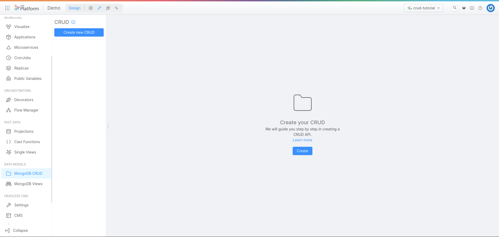

The MongoDB CRUD screen is composed by four different section.  
The left section will contain **all the CRUD Collections** created on this project.  
The right section will contain the **detail about each already created CRUD** Collection.  

Select **"Create new CRUD"**, then we can choose the CRUD Collection name and the internal endpoint.  
By default **the system will suggest the name** entered in the collection name as the name for the internal endpoint. However, it is always possible to choose a custom name by simply editing the internal endpoint field.  
We can also decide to **import the fields of the collection from a file**, we will see this option later in the tutorial, if you are interested in this part you can [jump directly to section](../../tutorial/rest_api/quick_rest_api#export-and-import-crud-collection).  

In this example **we will call the collection "books"** and we will use the default internal endpoint "/books".
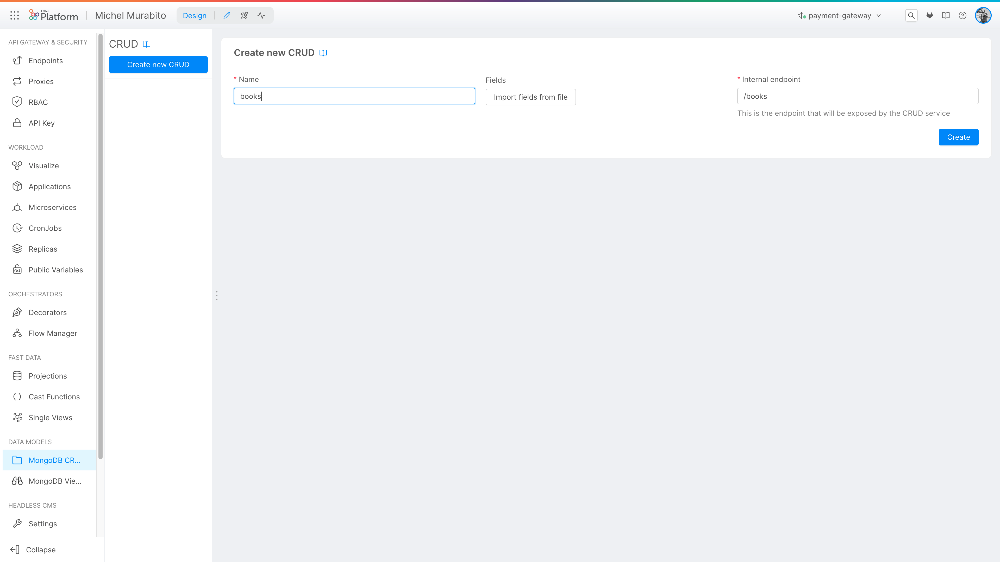

After clicking on **create**, we will have created our CRUD.

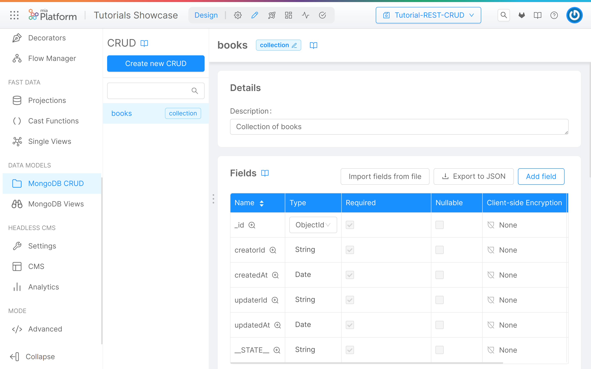

There are already default fields that can not be changed, this is because they are necessary for the proper functioning of the CRUD:

| Field     | Type     | Required | Description       |
|-----------|----------|----------|-------------------|
| _id       | ObjectId | Yes      | The document id   |
| creatorId | String   | Yes      | The creator id    |
| createdAt | Date     | Yes      | The creation date |
| updaterId | String   | Yes      | The updater id    |
| updatedAt | Date     | Yes      | The update date   |
| __STATE__ | String   | Yes      | The state         |

There is also other information for each field:
 * **Nullable**: if the field are nullable
 * **Client-side Encryption**: if the field are encrypted client-side
 * **Sensitivity**: The sensitivity of the field based on GDPR category

At this point **we have to create our DB schema** by creating the properties of our CRUD. **In this section you can add a new property by selecting Add field**. 
You can also export the already created fields in JSON format or import your fields, we will use this functionality later in the tutorial but, if you are interested in this part you can [jump directly to section](../../tutorial/rest_api/quick_rest_api#export-and-import-crud-collection)..

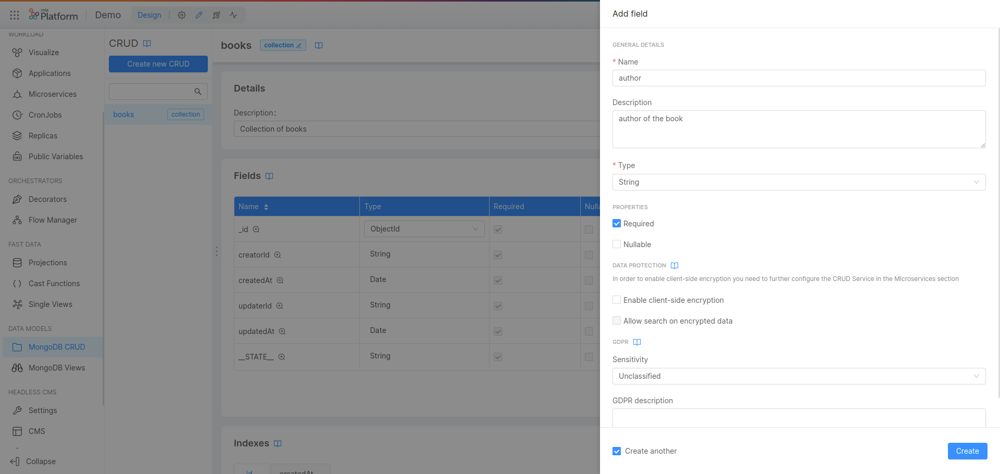

In this interface you can add:
 * **Name** (required): the field's name
 * **Description**: the field's description
 * **Type** (required): the field's type, you can use:
   * String, Number, Boolean, Date, GeoPoint, Object, Array of String, Array of Number, Array of Object or ObjectId
 * **Required**: if the field it's required
 * **Nullable**: if the field it's nullable
 * **Client-side Encryption**: if the field use the client-side encryption
 * **Allow search on encrypted field**: if the encrypted field are searchable
 * **Sensitivity**: the GDPR sensitivity, you can use:
   * Unclassified, Public, Confidential, Secret, Top Secret
 * **GDPR Description**: the GDPR description

At bottom you can select **"create Another"** to create another field after creating the one in progress.  
Now you can save your field using the **"Create"** button.

For this example we will create the following fields:


| Field         | Type    | Required | Nullable | Description                      |
|---------------|---------|----------|----------|----------------------------------|
| author        | String  | Yes      | false    | author of the book               |
| language      | String  | Yes      | false    | language of the book             |
| title         | String  | Yes      | false    | title of the book                |
| published     | Boolean | Yes      | false    | the book it's published?         |
| salesForecast | Number  | No       | false    | in terms of the many copies sold | 

After adding this fields you can read the properties in the CRUD page

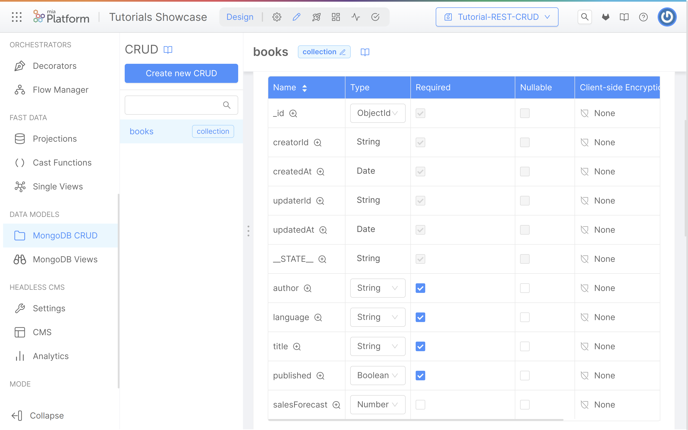

Of course, you can **edit and delete any existing field** or, if you need it, you can add other fields.

:::warning
All items in design area **are not saved** until you click **Commit & Generate**. However, you can create different entities and then save all the work only at the end

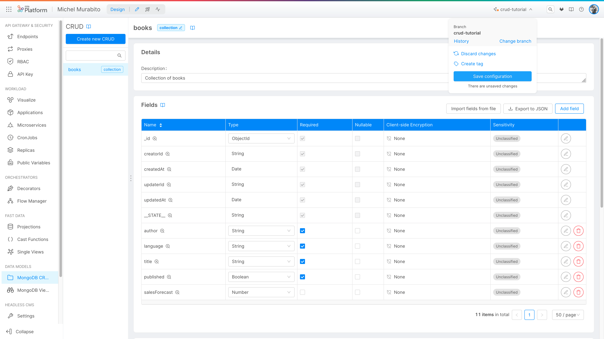

:::

## Expose the CRUD using an endpoint

At this point you will need to **add an endpoint** to your newly created book CRUD.  

**Select Endpoints from the menu on the left**:
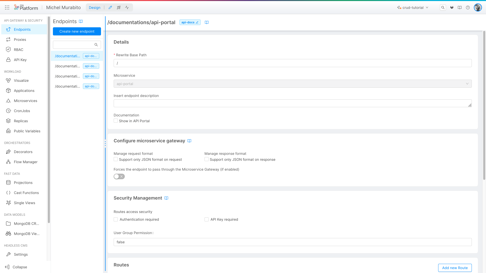

The Endpoints screen is composed by four different section.  
The left section will **contain all the endpoints created on this project**, by default here you could find the public endpoints of the API portal.  
The right section will **contain the detail** about each already created endpoints.

Select **"Create new endpoint"**

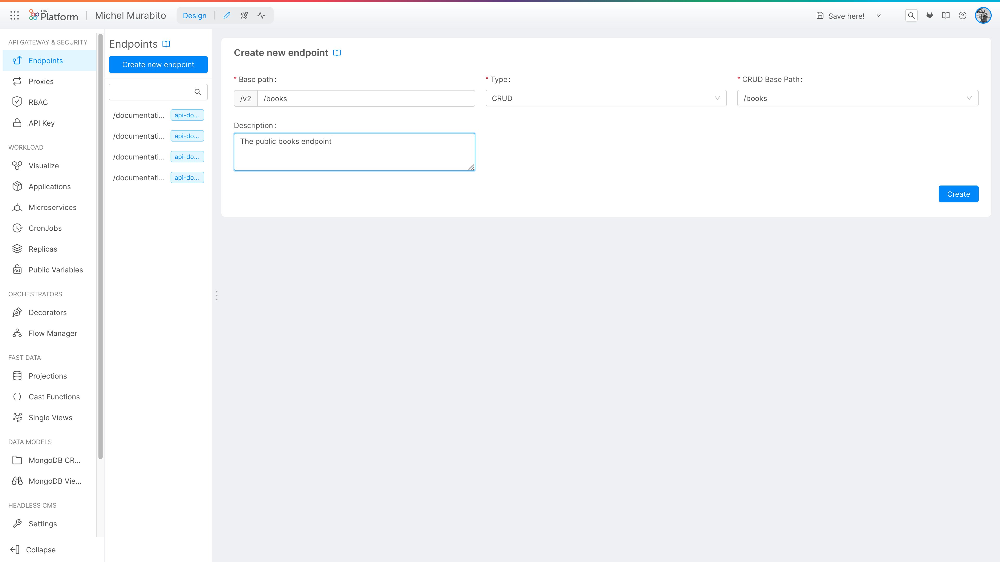

The params to create a new endpoint:
 * **Base path**: the endpoint base path
 * **Type**: the type, can be:
   * CRUD, MongoDB View, Microservice, External Proxy, Cross Project Proxy, Fast Data Projection, Fast Data Single View

The following params depend to the type, if you choose CRUD: 
 * **CRUD Base Path**: the CRUD base path, selected from the list
 * **Description**: an optional description of the endpoint

After the creation, **clicking the /books in the left side you can open the endpoint detail**, including the section:  
  
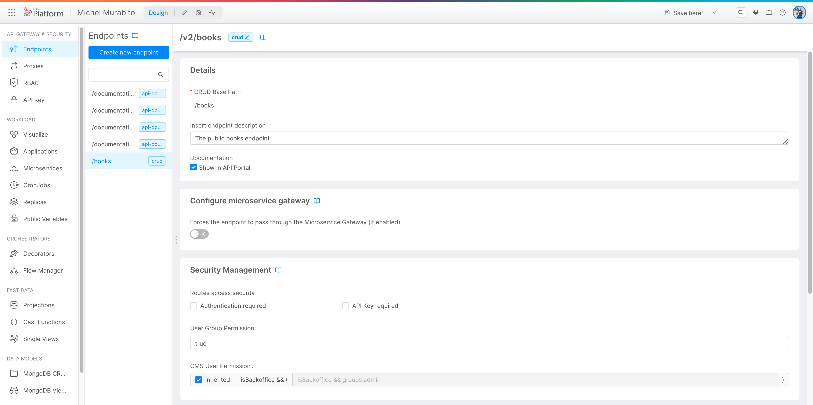  
  
 * **Details**: where you can change the description and show the the endpoint in the API Portal
 * **Configure the microservice gateway** to forces the endpoint to pass through the Microservice Gateway
 * **Security Management** where you can enable the authentication and the User Group Permission or the CMS User Permission.


By scrolling down instead you can find the Routes detail.  

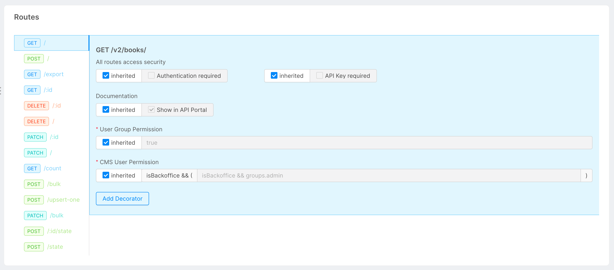  
  
**Here, for each, route you can choose**:
 * if the **authorization** it's required
 * if the **API Key** it's required
 * if **expose the route to the API Portal**
 * the **User Group Permission**
 * the **CMS User Permission** 


Of course, here **you can delete the endpoint clicking to the Delete button** and confirming inserting the endpoint name.

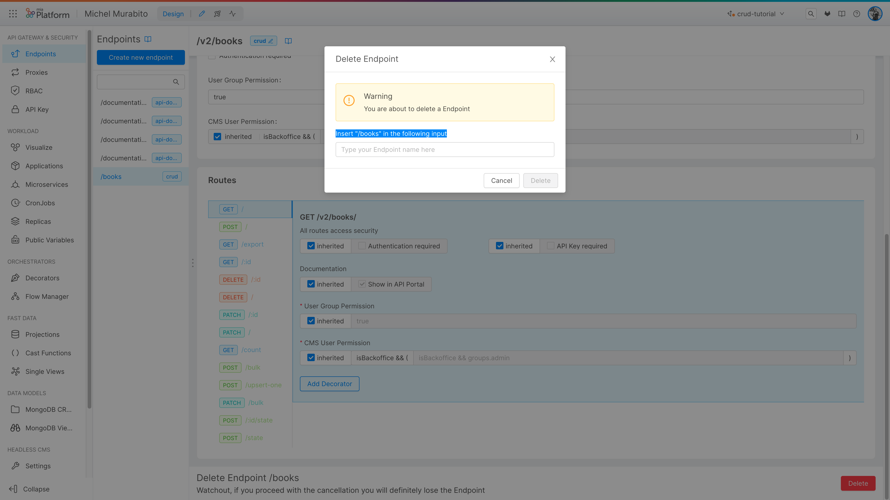
 
Now you can save the branch and deploy.

From the **API portal you will find all the api specifications** that will allow you to read, write, modify and delete the information on your CRUD collection.
You can perform some insertions using POST call and then try to read the data using the GET request.

:::caution
Remember that when reading, the only data returned by the GET API are those whose __STATE__ is PUBLIC.  
Make sure you create the elements directly like this or make it clear as a value when you POST
:::

here an **overview of the API Portal**:
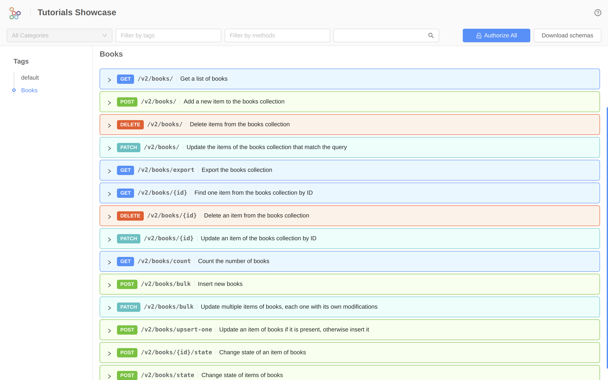

By **expanding a method** we find everything needed to make a call. In this case, for example, the POST call:
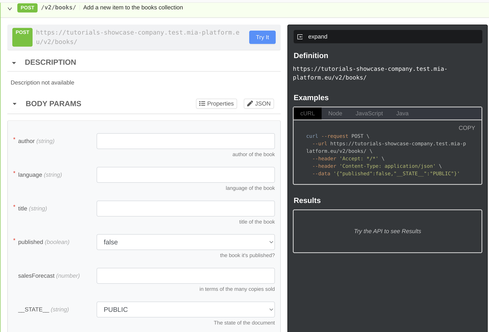  
  
## Export and Import CRUD collection  
  
Let's go back to the **CRUD section selecting our CRUD "books"**:
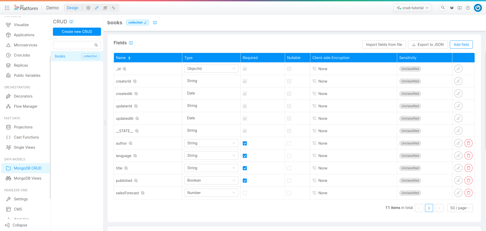

From here it is possible to **export the JSON of the CRUD Collection by clicking on "Export to JSON"**, by doing so, our browser will download a JSON containing the description (schema) of our CRUD.

In the example of this tutorial the downloaded object will be:
```json
[
  {
    "name": "_id",
    "description": "_id",
    "type": "ObjectId",
    "required": true,
    "nullable": false
  },
  {
    "name": "creatorId",
    "description": "creatorId",
    "type": "string",
    "required": true,
    "nullable": false
  },
  {
    "name": "createdAt",
    "description": "createdAt",
    "type": "Date",
    "required": true,
    "nullable": false
  },
  {
    "name": "updaterId",
    "description": "updaterId",
    "type": "string",
    "required": true,
    "nullable": false
  },
  {
    "name": "updatedAt",
    "description": "updatedAt",
    "type": "Date",
    "required": true,
    "nullable": false
  },
  {
    "name": "__STATE__",
    "description": "__STATE__",
    "type": "string",
    "required": true,
    "nullable": false
  },
  {
    "name": "author",
    "description": "author of the book",
    "type": "string",
    "required": true,
    "nullable": false,
    "sensitivityValue": 0,
    "encryptionEnabled": false,
    "encryptionSearchable": false
  },
  {
    "name": "language",
    "description": "language of the book",
    "type": "string",
    "required": true,
    "nullable": false,
    "sensitivityValue": 0,
    "encryptionEnabled": false,
    "encryptionSearchable": false
  },
  {
    "name": "title",
    "description": "title of the book",
    "type": "string",
    "required": true,
    "nullable": false,
    "sensitivityValue": 0,
    "encryptionEnabled": false,
    "encryptionSearchable": false
  },
  {
    "name": "published",
    "description": "the book it's published?",
    "type": "boolean",
    "required": true,
    "nullable": false,
    "sensitivityValue": 0,
    "encryptionEnabled": false,
    "encryptionSearchable": false
  },
  {
    "name": "salesForecast",
    "description": "in terms of the many copies sold",
    "type": "number",
    "required": false,
    "nullable": false,
    "sensitivityValue": 0,
    "encryptionEnabled": false,
    "encryptionSearchable": false
  }
]
```

You can download the JSON schema, we built in this tutorial, using the following <a download target="_blank" href="/docs_files_to_download/tutorial/rest-api-tutorial-schema.json">Link</a>.  
  
Now, if we wanted to **import our schema** we would just have to create a new CRUD (called for example books2) and at the time of generation import the fields from the JSON schema just downloaded.

Clicking on **"Imports fields from file"**:
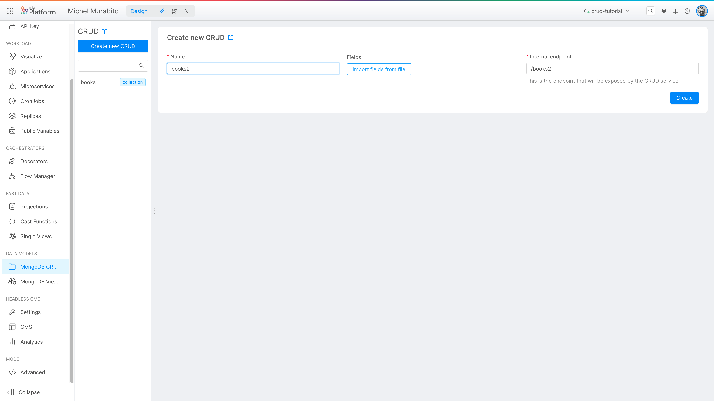

We can **select the file within our local system** and upload it:
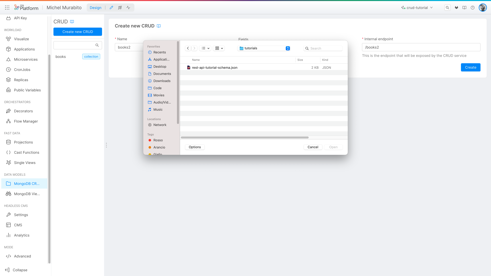

After the short loading it will be possible to **verify that the loaded structure** is correct and consistent before saving by clicking on the "Create" button:
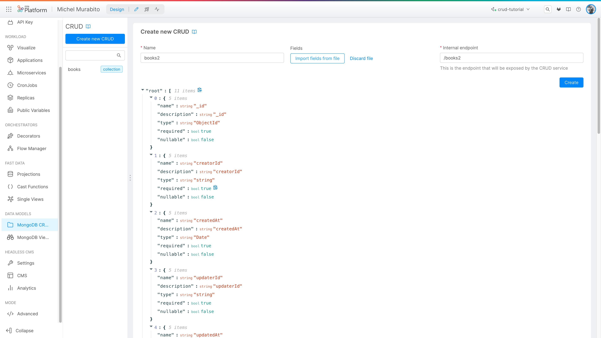

At this point **we will have built our CRUD collection** exactly the same (in terms of fields) as the first one and we could decide to modify it (adding or removing fields), change the name or to expose it using another endpoint.  
:::info
remember that two CRUDs or two identical endpoints (with the same path) cannot exist on a project so if you import an existing collection you will have to choose another name and path.
:::
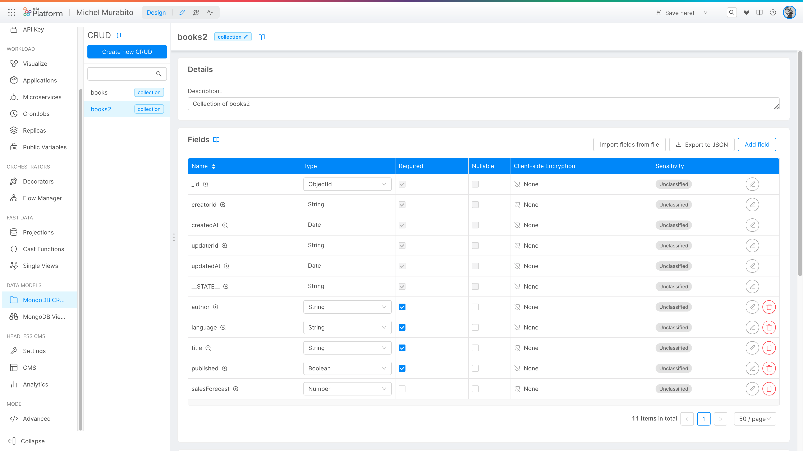
