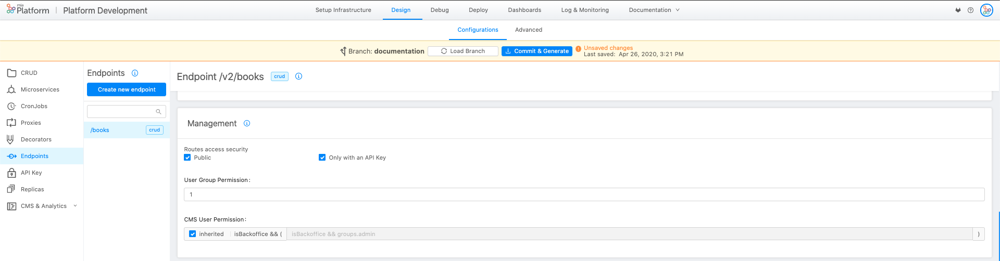

In this guide you will discover how to create and display a Rest API with simplicity.
What you need is the API Console and the CMS.

:::info
Make sure you have GIT permissions to release and install both the API Console and the CMS.
:::

We will guide you step by step in creating a CRUD API.
We will use as an example the creation of an endpoint **/books** imagining to have a library site.

The steps to follow are the following:

1. Create a CRUD.
2. Expose the endpoint.

## Create a new CRUD

So imagine that you have to create a new collection that contains the books of a library. To do this, let's see which steps need to be done:

1. To create a new CRUD, select **MongoDB CRUD** from the menu on the left of the API and select **Create new CRUD**.

2. First, you need to enter the name of the CRUD in camelCase, in this case we will insert "books". Then you will need to enter an **internal endpoint** that exposes your CRUD internally and its **default state** than could be **DRAFT** or **PUBLIC**. The default values in the console will be a path equal to /endpointname and default state equal to draft.
Default fields will appear that can not be changed: *_id*, *creatorId*, *createdAt*, *updaterId*, *updatedAt*, *_STATE_*.
At this point we have to create our DB schema by creating the properties of our CRUD. In this section you can add a new property by selecting **Add New**. Then you must complete the following fields:
  
    * **Name**: enter the property name, in camelCase, in our case we will insert "title", "author", "year" etc.

    * **Type**: the properties can be of different types: *string* if it is a classic text string (or an image); *number* if it is a number; *date* if it is a date with dd / mm / yyyy; *boolean* if it can only be true or false; *Geopoint* if you want to save a specific place; *Array* if you want to save as an ordered set of properties; *Object* if you want to insert an object.

    * If you select **required** the property is mandatory.

    * If you select **nullable**, you can give the value *null*.

    * In the **description** field you can enter a short optional description.

    For this example, we could create two properties: one for the title and one for the author of the book.
    If you want to delete a property, click the trash icon inside the related row.

1. To create the CRUD at this point just press **Commit & Generate**.

    :::warning
    All items in design area **are not saved** until you click **Commit & Generate**. However, you can create different entities and then save all the work only at the end
    :::

To **edit a CRUD** simply select the desired item from the list and edit the fields in the screen that is displayed.

## Create an endpoint

At this point you will need to add an endpoint to your newly created book CRUD.

To create an endpoint:

1. Select **Endpoints** and then **Create new endpoint**. You can configure the following properties:

    * **Basepath**: is the prefix of the route. It can be set as the base address to which the API is served, relative to the host (name or ip) that supplies the endpoint. In our case, for example, we could insert */books*.

    * **Type**: The endpoint can be of different types:

        * **CRUD**: hook your endpoint directly to one of your CRUD.
        * **Microservice**: hook your endpoint to a service with logics entirely created by you.
        * **External proxy** _Deprecated_: hook your endpoint to a proxy linked to a service outside of your cluster.
        * **Cross Projects proxy**:  hook your endpoint to a proxy linked to another project contained in your cluster.
        * **Fast Data Projection**: hook your endpoint to the service which expose the Fast Data Projection. This type is visible only if Fast Data is enabled in the Console.

2. In this case, we will create a CRUD type endpoint to which we will link our newly created CRUD.  
Endpoints of type CRUD require also to specify the CRUD Base Path which will be the **internal endpoint** that you previously defined during your new CRUD creation. You can also set an optional description.

:::info
You can find more information on CRUDs and how to create an endpoint in the [CRUD](../../development_suite/api-console/api-design/crud_advanced.md) and [endpoint](../../development_suite/api-console/api-design/endpoints.md) documentation.
:::

Your configuration should be like this one:

3. Then select *Create*.  

At this point we have created our endpoint!

## Configure the endpoint

Besides of properties previously set, you can configure permissions and security settings of the endpoint:

In the *Details* section you can set a **Default State**. If you select *PUBLIC*, the elements in the Collection will be public on the applications as soon as they are created. If you choose *DRAFT* status, the elements have to [be made public in the CMS](../../business_suite/guide_cms.md#new-content-draft-publish) before being published.

### Manage the security of your endpoints

In the *Management* section you can manage the security at the endpoint level.

If the **Authentication required** flag is unchecked you do not need to be logged in to be able to call it. Instead, if the flag is set, and an unregistered user calls it, it will return an Unauthorized error.
If the **API Key required** flag is checked, to be able to call the endpoint you need to add the Secret header with the correct API Key that you can set in **API Key** item on the left menu.

**User group permission**: It is a logical expression to determine which groups have permission to call a given route. It can also be set to 0 (none) or to 1 (all). If the expression is true, then the user can access the route.

### Routes

In this section, you can view all the paths of a CRUD endpoint that can be called. By selecting the different route, it is possible to further detail who has the permissions to do specific actions.

If **inherited** is active the field will inherit the behavior of the base endpoint, de-selecting it can set specific security rules related to this route.

For example, we can set that the post can only be reserved for a specific group of users.

## Generate and deploy ##

Now we have created the collection, hooked an endpoint and defined the permissions.
We have therefore created our Rest API.

We just have to save and release in an environment. The steps to follow are the following:

1. Click *Commit & Generate* that you can find in the right corner of the main navbar, on the top of the screen.
2. Then access the [Deploy area](../../development_suite/deploy/deploy.md) and choose an environment to release.

To populate the collection or to start testing the API you can either directly go to the [Documentation Portal](../../development_suite/api-portal/api-documentations.md) and test your API with the Swagger.
