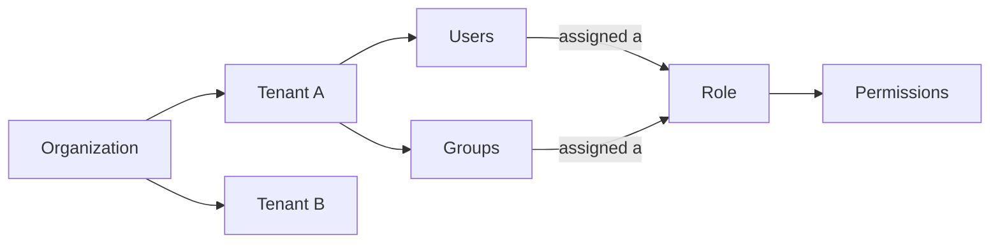

# Mia-Platform Suite - User Guide

## Introduction

### What is the Mia Platform?

The Mia-Platform Suite is your starting point every time you work on Mia-Platform. It's the web page you land on after logging in (e.g. `https://catalog-dev.mia-demo-re5gu6.gcp.mia-platform.eu/home/`), and from there you can reach every project you have access to, switch between them, manage who's allowed to do what, and get help.

### Why it exists

If your organization uses Mia-Platform for more than one project or team, you need a way to move between them without confusion, and a way to control who can see or change what. The Console gives you that in one place:

- **One homepage** to find every project and application you work with.
- **One switch** to change which project (tenant) you're currently working in.
- **One section** to manage teammates, groups, and permissions.
- **One assistant** to ask "how do I do X?" and get pointed in the right direction.

### What you can do here

| If you want to... | Go to... |
|---|---|
| See your projects and recently used items | **Homepage** |
| Switch to a different project/environment | **Tenant selector** (top of the homepage) |
| Open an application (Console, Flow, Data Fabric, P4SaMD) | **Sidebar** |
| Add or remove teammates, or change what they can access | **Administration** |
| Get quick guidance on how to do something | **AI Assistant** |
| Find supporting documentation or links | **Resources** (bottom of the page) |

## Key Concepts

A few terms you'll come across while using the Platform:

| Term | What it means for you |
|---|---|
| **Organization** | Your company's overall account on Mia-Platform. |
| **Tenant** | A project or environment inside your organization (e.g. "Mia Platform Core", "Data Platform Team"). Each one has its own content and its own team. |
| **User** | A person who logs into the Mia-Platform Suite — a teammate, essentially. |
| **Service account** | A non-human identity used by an application or automated process to access Mia-Platform on its own, without a person logging in. |
| **Group** | A named set of users (e.g. "AI Engineers"), useful when you want to give the same permissions to several people at once instead of one by one. |
| **Role** | A named set of permissions (e.g. "Admin", "Data Analyst") that says what someone is allowed to do. |
| **Permission** | One specific allowed action, e.g. "view", "create", or "edit" something in a given product. |

In short: your organization has one or more **tenants**; each tenant has its own **users** and **groups**; users or groups get **roles** assigned to them, and each role determines exactly what they can and can't do.

## Finding Your Way Around

### Overview

After logging in, you land on the **Homepage**. It's organized top to bottom as a set of clearly separated blocks: a **sidebar** on the left for navigating between products, a **welcome banner**, an **AI Assistant**, a **Daily launchpad** of shortcuts, and a **Helpful resources** section in that order.

### The sidebar (left-hand navigation)

Always visible on the left, it lists every product in the suite so you can jump straight into any of them:

- **Homepage** — brings you back to this landing page.
- **Catalog** — connect, configure, and serve context to AI.
- **AI Foundry** — manage AI playbooks.
- **Console** — automate Environment as a Service.
- **Flow** — fast prototyping with AI.
- **Data Fabric** — configure and manage fast data.
- **P4SaMD** — the compliance governance platform.

Each entry opens in its own product; the small arrow icon next to each one signals that it takes you to a separate application.

At the bottom-left of the sidebar, next to your account name/avatar, a **gear (⚙️) icon** opens **Administration**: this is where a tenant **Admin** manages users, groups, roles, and permissions for the current tenant. It's only meant for admins; regular users won't need it day-to-day.

### AI Assistant

Right below the banner, the **AI Assistant** offers a few **suggested questions** to get you started e.g. "How does the Catalog work?", "What is a Playbook?", "How many Scorecards are there in the Catalog?". You can click one of these or type your own question in the message box below.

### Daily launchpad

This section lets you **pin the tools you use every day** for one-click access, so you don't have to go through the sidebar every time. Each entry shows the product's icon, name, and a short description (e.g. "AI Foundry — Manage AI playbooks", "Console — Automate Environment as a Service", "Flow — Fast prototyping with AI", "Catalog — Connect, configure, and serve context to AI", "Data Fabric — Configure and manage fast data", "P4SaMD — Compliance governance platform"). A bell icon on each card lets you manage notifications for that product, and a **"View All"** button in the top-right expands the full list if you have more pinned tools than fit on screen.

### Helpful resources

At the bottom of the homepage, this section gathers supporting material to keep you and your team aligned:

- **Mia-Platform Docs** — product documentation, guides, and API references.
- **Community Hub** — share best practices and ask the community.
- **Webinars & Events** — upcoming webinars, demos, and customer sessions.
- **Platform Academy** — role-based learning paths for your teams.

## Understanding Access & Permissions

If you're an admin, this is how access control fits together:

- Your **organization** is made up of one or more **tenants**.
- Each tenant has its own **users** and **groups**.
- **Roles** are collections of permissions; assigning a role to a user or a group gives them exactly those permissions, and you can limit that role to a specific tenant instead of the whole organization.

## Walkthrough: Managing Access as an Admin

1. **Log in** to Mia-Platform. You land on the **Homepage**.
2. If you work across multiple projects, use the **tenant selector** at the top to pick the one you want to work in (e.g. Catalog, AI Foundry, etc.).
3. Open **Administration** from the sidebar.
4. Under **Tenants**, see the list of tenants in your organization that you can switch to.
5. Under **Administration/Users**, see existing users and when they were last active. Click a user to see their profile and how many groups they belong to.
6. Under **Administration/Groups**, see existing groups (e.g. "AI Engineers", "Research Scientists"), how many members each has, and when they were last active. Click **"New group"** to create one and add members.
7. Under **Administration/Roles**, click a role (e.g. "Admin") to see what it allows (e.g. viewing, creating, or editing specific things). Assign that role to a user or a group, and choose whether it applies everywhere or just to one tenant.
8. Stuck on something? Open the **AI Assistant** and pick a suggested question — it'll guide you to the right place.
9. Check the **Resources** section at the bottom of the page for further help and documentation.

## Getting Help

- Use the **AI Assistant** for quick, guided answers to "how do I...?" questions.
- Check the **Resources** area at the bottom of the page for documentation and links to further support.