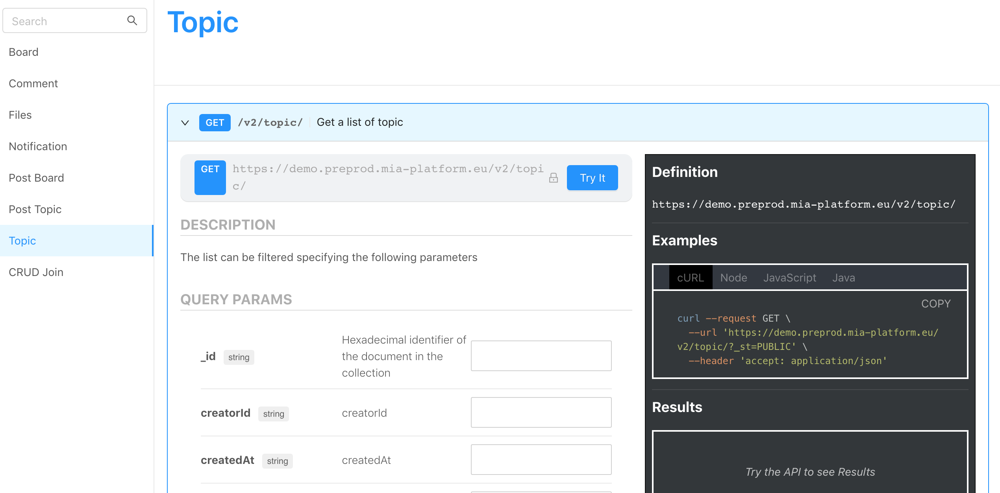

##API Portal

The API Portal section is devoted to the documentations of all the APIs.

On the left side menu, the API are grouped according to the **tag**: by clicking on one tag the user will visualize all the APIs belonging to that tag.

Once that the single API is selected, in this area it is possible to visualize the structure of the API and the data that are exposed.

It is also possible to **try out** the APIs and see the response that is given. If the APIs are protected, the user has first  to authenticate himself and then he can try the APIs out.

In the black box on the right it is possible to see the request that is sent once that the *Try out* button is clicked. The request can be seen as a cURL, in Node, in Javascript and in Java.

Finally, the response is shown.
