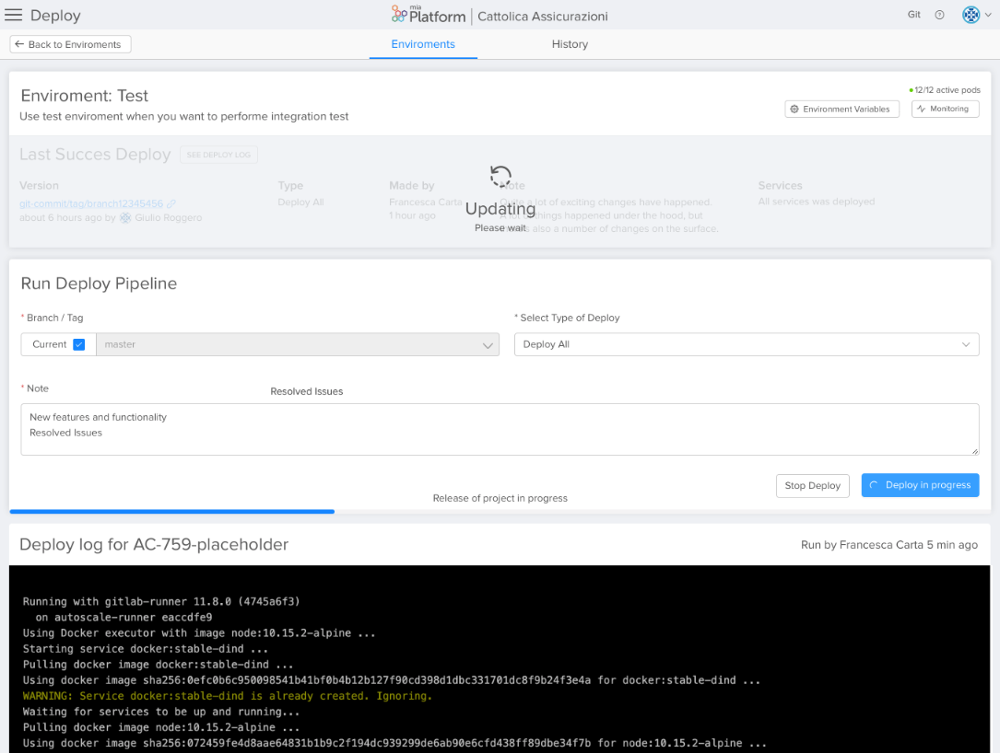
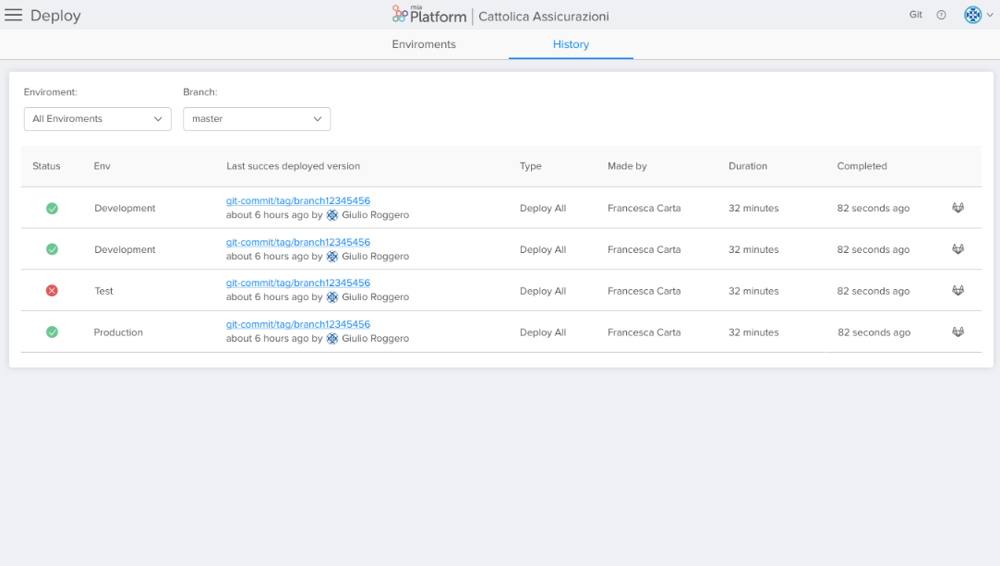

##Deploy
The Developers Console is the sections that allows developers to directly deploy your configurations in the different environments and check the past history of all the releases on that project.
Thanks to this automation the **Continuos Deploy** is more simple and immediate.
Furthermore, the deployment automatically starts the tests to verify that the branch can be released without damaging the existing project.

The Deploy section is divided into two areas: **Environments** and **History**.

When an user enters the Deploy section, he is automatically led to Environments area.
The Environments area is composed of an introductory page with an overview of the different environments and of the single pages that give the details of the specific environment.

###Overview page of all the Environments

The environments overview page shows in a table all the different environments on which it is possible to release. For each environment the user has the possibility to visualize which is the most recent deploy that was successful. This table allows the user to be able to know what has is currently deployed in every environment.

The information that are visualized are the following:
* Environment name;
* Environment description;
* Environment status that alerts the user if there is a deploy going on or if the deploy is already finished.
* The latest version that has been deployed: it gives information about the commit, how much time ago it happened and who made it;
* Deploy type (ex. if the deploy released all the service or only part of them);
* Who made the deploy.

Finally, for each row the user can also enter the **detail section** where he can actually deploy the services.

To release you must have **Owner** permissions on Gitlab.

To release the user will have to select the environment and the branch.

###Deploy Details Page

From the Environments Overview Page it is possible to directly enter the Details Page of the single Environment.

This page is divided in two areas:

1. The first section shows an **insight on the most recent deploy** and on the details of the specific environment.
 In this section the user can visualize a first set of general information:

  * Environment name;
  * Description;
  * Active PODs;
  * Links to the Monitoring section of that environment or to its configurations.

 I can also visualize all the information about the most recent successful deployment:

  * Deployed version;
  * Type;
  * Who released it and when;
  * Notes made in the deploy phase;
  * Services that were released.

2. In the second section the user can make the **actual deploy**. To make the deploy the user has first to select the branch. By default, it is proposed the branch related to the most recent commit, but it is always possible to change and select another branch to deploy. To do so, the user just needs to unflag "current" and the selection will be enabled.

Once the branch is selected, it is necessary to choose the deploy type. At the moment it is only possible to deploy all services; however, in the future more deploy types will be available.

Finally, it is possible to enrich the deploy with some notes.

By clicking the *Deploy* button, the user will immediately see that at the end of the deploy card will start a progress bar that shows the progress of the deploy.

When the Deploy starts, just below a new section is charged: **the logs**.

A user can see realtime logs that are generated during the deploy.

When the Deploy starts, in addition to the generation of the realtime logs, the section where the most recent successful deploy was described will be covered by an overlay with a loading icon to give evidence that a deploy is on going and that what is being shown is not the most recent successful deploy.

At the end of the deploy, the realtime logs remain and the section with the most recent deploy is updated if the deploy is successful.

If the deploy is not not successful, the user will see the progress bar turning red and will see error messages in the realtime logs.

###History Page

The History Page is the second area in the Deploy section. In this tab it will be possible to visualize all the released deploy.

By default this page is opened on *All the Environments* and on *master* as a branch. However, it is always possible to choose a specific Environment and a specific branch by using a drop down menù.

In the History table the user visualizes the following information:

* Status: if the deploy is successful or if the deploy is not successful;
* Environment of the deploy;
* Deployed version;
* Deploy type;
* Who made the deploy;
* How long was the deploy;
* How much time ago the deploy was released;
* Link to Git to visualize the logs of the past deploy.
