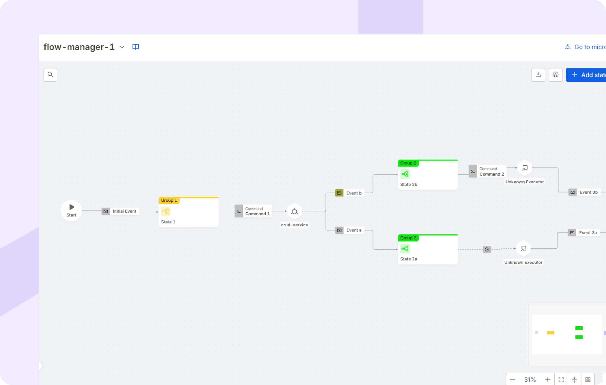
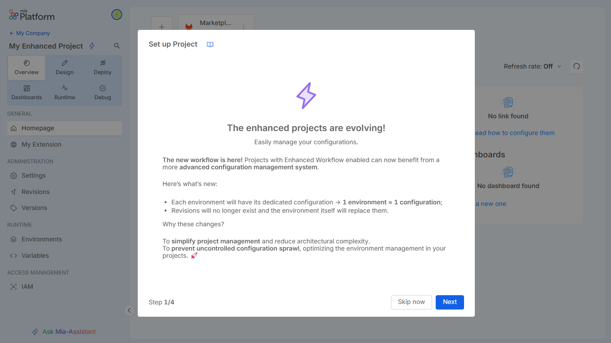

export const Highlight = ({children, color}) => (
  
    {children}
  
);

# Welcome to Mia-Platform v14!

## AI Native DevX

AI-Native Developer Experience (DevX) enhances engineering productivity by seamlessly embedding Artificial Intelligence (AI) into the developer workflow. At its core, this approach harnesses AI-powered conversational interfaces that deliver immediate, context-aware support tailored to individual developer needs. These intelligent experiences simplify the discovery and use of internal services, surface actionable insights from operational data, and foster a more empowered, efficient development environment.

This AI-Native DevX offers:
- A context-aware intelligent assistant embedded throughout the entire software development lifecycle;
- Intelligent engineering AI agents that execute, compose, and orchestrate tasks by leveraging deep platform context and operational awareness.

### AI Agent Use Cases

With the introduction of AI-Native capabilities, we’re unlocking new ways to harness the power of AI within a Platform context. As a use cases, we’re currently offering:

- **AI Agent for Service Composition:** Leveraging the context of the software catalog, this agent can understand your prompt and suggest a tailored list of existing services, also providing reference architectures. You can then quickly instantiate these services within your Projects, streamlining the setup process and accelerating development.

- **AI Agent for Faster Prototyping**: A simple, intuitive interface that helps you write source code and provides a visual preview of what you're building in real time. When combined with the Service Composition AI Agent, it significantly accelerates Project setup and prototype development.

- **AI Agent for Debugging**:  Within any Project, just type /debug in the Mia-Assistant chat to start exploring insights about your Runtime. Make sure the AI Settings toggle is enabled to grant Mia-Assistant access to your Project resources. Once activated, you can begin debugging effortlessly using Debug with Mia-Assistant.

### AI-Compliance for Data Catalog: AI-powered Data Discovery

To meet the increasing demand for accessible, reliable, and governance-oriented Data Discovery, the Data Catalog has been enhanced with an AI Assistant. Through a dedicated user interface, users - *especially non-technical roles like Data Protection Officers (DPOs)* - can interact with a chat to explore all Data Catalog metadata information using natural language.

For example, the AI Compliance Assistant allows users to ask:

- *"What categories of personal data are processed?"*
- *"Who has access to the data? Are they all internal employees or also external consultants?"*
- *"Is there any data transfer, and if so, where? Within the EU or outside?"*
- *"Which personal data assets are classified as sensitive under GDPR, and where are they stored?"*

For DPOs, it enables transparent, on-demand access to data-related information, simplifies GDPR audit preparation and documentation, and reduces dependency on technical teams, saving time and effort.

This AI-powered integration bridges the gap between legal, compliance, and data teams, making governance more inclusive, efficient, and effective.

## AI Agent Lifecycle

Effective management necessitates comprehensive oversight across the entire operational lifespan of AI agents. The Mia-Platform AI Agent Lifecycle Management framework provides this essential structure. By centralizing control mechanisms and AI Agents Orchestration, this system ensures secure operations and maintains full compliance with established standards at every stage. Concurrently, the framework facilitates seamless interaction and collaboration between diverse agents, contributing to the development of a more reliable and efficient AI ecosystem.

### AI Agents Orchestration with Flow Manager

The Flow Manager now supports seamless orchestration of AI Agents within end-to-end workflows. This powerful new capability allows users to integrate and coordinate multiple agents, enabling the automation of complex tasks with greater efficiency.

Using the Flow Manager Configurator, organizations can boost operational performance by ensuring AI agents work together intelligently—delivering faster, more accurate outcomes through streamlined collaboration.

### Mia-Platform Console MCP Server

Introducing the new Open Source [MCP Server](https://github.com/mia-platform/console-mcp-server) for Mia-Platform Console, engineered to enhance how your applications integrate with Large Language Models (LLMs). This feature acts as an intelligent, structured communication layer, following Model Context Protocol principles, allowing you to clearly organize and send instructions, history, tool definitions, and retrieved data to AI models. The MCP Server significantly accelerates the development of AI-driven features, boosts the reliability and accuracy of AI interactions, and seamlessly unlocks advanced capabilities like tool use and RAG, all natively within your Mia-Platform environment. This first version will be able to interact with Console APIs to simplify interactions with the different Console sections through a conversational interface interacting with the MCP Server.

## Self-service Applications

The Self-Service Application Development paradigm aims to significantly accelerate software delivery timelines. This acceleration is realized through the provision of a Software Catalog, which offers readily available, reusable components, coupled with access to a suite of composable and orchestrated technologies. The entire process operates within a framework of flexible governance, strategically designed to abstract underlying complexities and thereby permit development teams to dedicate their primary focus to the implementation of essential business logic.

### New Flow Manager Configurator layout

The Flow Manager Configurator layout has been redesigned to provide enhanced control and visibility, especially with the introduction of AI Agents within the sagas (see above). 

We've streamlined the interface to make it easier for users to view and manage flows, integrate external executors, and monitor commands, events, and state transitions, enhancing both the efficiency and flexibility of self-service application management.

For a complete overview of the new layout and its features, see the [Flow Manager Configurator documentation](/docs/products/console/api-console/api-design/flow-manager-configurator/overview).

### Quality Assistant for your Software Development Lifecycle

The **Quality Assistant** is the first Software Development Lifecycle tool in Mia-Platform IDP engineered to accelerate and improve the quality of generated assets for the product development in compliance with structured regulatory frameworks. 

Quality Assistant aids in defining your software system requirements and specifications, designing the software product, controlling the implementation through automatic detection of dependencies and vulnerabilities and supporting the verification process. It reduces manual operations for software design, development, release and maintenance, complemented by streamlined documentation. Furthermore, seamless tool integrations provide a single point of access to external information such as Application Lifecycle Management (ALM) data (e.g. Jira). 

Quality Assistant integrates AI-powered features to enhance Design Inputs quality such as requirements and tests, and improving the system test coverage. 

Among the range of supported industries, leveraging our Mia-Care Branch's deep expertise, the first healthcare-tailored solution of Quality Assistant is [P4SaMD](https://docs.mia-care.io/docs/p4samd/overview).

Do you want to learn more about Quality Assistant? Request a Demo [here](https://mia-platform.eu/ask-for-a-demo/?message=I%E2%80%99m%20interested%20in%20receiving%20more%20detailed%20information%20about%20the%20Quality%20Assistant%20capability%20in%20Mia-Platform%20Console).

### Clone Microservice repository via Cursor AI IDE 

Now you can easily clone your Microservice repository into the Cursor AI IDE directly from the Mia-Platform Console. This integration provides an easy way to access your service code, enabling a smoother development experience powered by the intelligence of Cursor AI, with support for both `ssh` and `https` protocols.

## Real time data integration

The Real-Time Data Integration capability is focusing on streamlining data collection processes from various sources, automatically enriching datasets with pertinent metadata for improved context and usability, and establishing governed mechanisms for controlled data access. This suite facilitates real-time decoupling between systems by enabling asynchronous data exchange, thereby providing the continuous, low-latency data flows necessary to fuel the core platform operations and power associated Artificial Intelligence functions.

### Data Lineage

Mia-Platform Data Catalog introduces **Data Lineage**, a powerful tool for understanding, visualizing, and describing the flow and transformations of data within an organization.  

This feature lets users explore data relationships on two complementary levels: **Table Lineage** and **System of Record (SoR) Lineage**, offering both detailed insights and a holistic view of data flows.  
By offering a detailed visualization of data dependencies and relationships, the **Lineage** view enables users to perform impact analyses, identify potential bottlenecks, and ensure compliance across data workflows.  
Users can enrich the lineage with **virtual assets** and **virtual jobs**, useful to fully describe the context and purpose of each data flow.  
When using [**Fast Data Control Plane**](/docs/products/fast_data/runtime_management/overview), aggregation processes configured in Fast Data Projects can be automatically captured, making Fast Data jobs visible on the Lineage canvas.

To find out how it works and all the benefits of our Data Lineage solution, please refer to the related [documentation](/docs/products/data_catalog/frontend/data_lineage).

### Integration Connector Agent

The Integration Connector Agent is a modular plugin designed to enable seamless **data integration** between external sources and sinks.  
It collects data from external systems, maps and processes it, and sends it to a defined sink. Supported ingestion sources include **webhooks** from tools like **Mia-Platform Console** and **Jira**, while **MongoDB** is the currently supported sink.  
Thanks to its pluggable architecture, it allows easy integration of new sources and sinks with minimal configuration effort.  

The Integration Connector Agent enables the collection of information from multiple sources and its storage in a centralized target destination, improving data accessibility, streamlining workflows, and supporting more effective reporting and decision-making across systems.

To learn more about all the features and how to configure it, visit the [official documentation](/docs/runtime-components/plugins/integration-connector-agent/10_overview).

### MongoDB connection support in Data Catalog

Data Catalog introduces MongoDB as a new natively supported connection provider. Once connected, in case a JSON Schema validation is defined on a retrieved collection, Data Catalog can extract field structures and types to ensure accurate metadata management.
Database and collection retrieval behavior can be tailored through multiple configuration modes to better fit user needs.  

To learn more about how to configure it, visit the [official documentation](/docs/products/data_catalog/frontend/data_catalog_connections#mongodb).

## Platform Engineering enablement

Platform Engineering enablement is fundamentally concerned with establishing clear governance frameworks, which are operationalized through the definition and promotion of standardized 'golden paths' for software delivery processes. This approach empowers development teams by providing structured self-service access to required tools and infrastructure, typically mediated through an Internal Developer Portal (IDP) and managed by a Platform Orchestrator with a significant reduction of cognitive load imposed upon developers, achieved via the effective abstraction of underlying technological and operational complexities.

### Enhancing Software Catalog and Release Management

In v14, we've significantly enhanced the Software Catalog, improving both management and precision. Key updates include comprehensive item schema reviews, ensuring all definitions are standardized, fully documented, and easily accessible to stakeholders. Additionally, the manifests for the public items in the Mia-Platform catalog are now publicly available [here](https://github.com/mia-platform-marketplace/public-catalog), offering greater transparency.
We've also revamped the **release life cycle** with new stages like `Coming soon`,`Draft`,`Published`,`Maintenance`,`Deprecated`,`Archived`, and `Deleted`. These changes provide a more structured and adaptable framework for managing catalog items, from development to retirement, making the process more efficient and reliable.

To explore all the new features and learn how to manage Software Catalog items, visit the [official documentation](/docs/products/software-catalog/overview).

### Headless Catalog

The Marketplace APIs have been optimized and are now officially published on the API portal, ensuring easy access for all users.

### Environment centric workflow for Projects (only for Enhanced Projects) <Highlight color="#e5c762">BETA</Highlight>

Mia-Platform Console now features a redesigned environment management system, significantly streamlining your Design workflow. 
The concept of branches in the Design area has been replaced, with the environment now serving as the central element for each area.   
Users will work directly within specific environments across all Mia-Platform Console sections, establishing a consistent and intuitive experience and aligning the Design area with the logical structure of other Mia-Platform Console areas.

To discover more, head to the related [documentation](/docs/products/console/set-up-infrastructure/env-based-management).

### Iframe extensions support login with Console SSO

Iframe extensions now benefit from a unified and secure authentication framework using Console Single Sign-On (SSO). This enhancement allows iframe extensions to recognize user permissions and manage authentication and authorization seamlessly. By leveraging Console SSO in your extensions, only authorized users can access and interact with specific iframe extensions, enhancing overall security and control across Mia-Platform Console.

### Auto-generated form in Infrastructure Resource Creation 

Creating new Infrastructure Resources in the Design area is now easier than ever.  
For Marketplace resources with defined JSON schemas, the system will automatically generate a user-friendly form. This form clearly displays all required properties along with helpful descriptions, guiding users through the configuration process.

### Centralized management of the Container Registries

You can now manage your container registries more effectively within your Projects. Access a dedicated section in your Project settings to view, create, and delete registries as needed. This provides centralized monitoring and control over your container registry landscape and allows you to specify the desired registry directly at the service level in the Design area.

### Monitor Audit Logs of your Company 

Stay informed and in control with our new Audit Logs feature, designed to provide clear visibility into actions performed across your Company. Effortlessly track and monitor user activities through this powerful and centralized tool. By centralizing these logs, you can significantly enhance security protocols, streamline compliance efforts, and develop a deeper understanding of your Company's operational flow.

To discover more, head to the related [documentation](/docs/products/console/identity-and-access-management/monitor-audit-logs).

## Secure Cloud Ops

Upholding high standards of service reliability and maintaining the comprehensive security posture required for business operations within complex, distributed platform environments is key for IT Organizations. This involves the implementation and management of Infrastructure resources, robust operational controls, cost and resources utilization monitoring, security measures, and resilience strategies.

### Projects for Infrastructure Provisioning <Highlight color="#e5c762">BETA</Highlight>

Take greater control over your infrastructure provisioning with the new dedicated Project category in the Mia-Platform Console. Designed for Operations teams, these specialized Projects facilitate management of infrastructure resources within the Console, aligning with Infrastructure as Code practices. Easily visualize and manage your infrastructure state, and execute provisioning actions with improved efficiency for your infrastructure-related tasks.

To discover more, head to the related [documentation](/docs/products/console/project-configuration/infrastructure-project).

### Kubernetes Import via miactl 

You can now perform a more efficient way to bring your existing Kubernetes environments into your Console Projects thanks to the new miactl project import command. This feature allows you to seamlessly onboard Kubernetes workloads by importing your YAML configurations directly into a new Project. This process significantly speeds up integration and reduces the effort of rebuilding your Kubernetes setup from the ground up within the Console.
