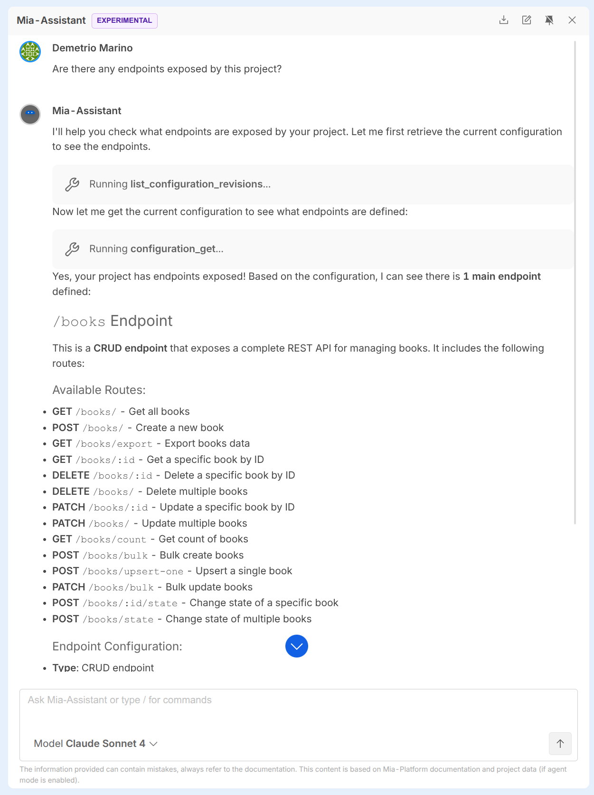
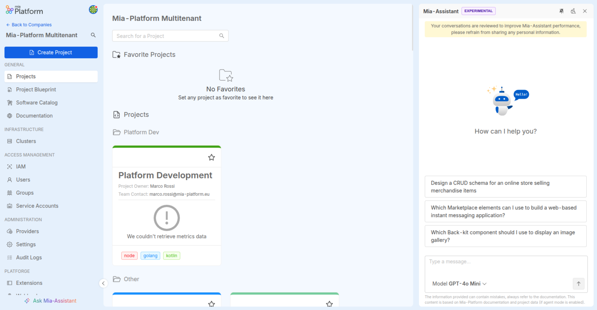
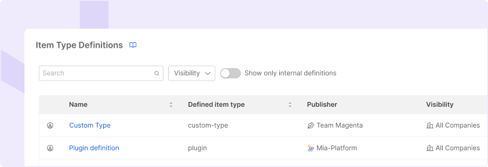
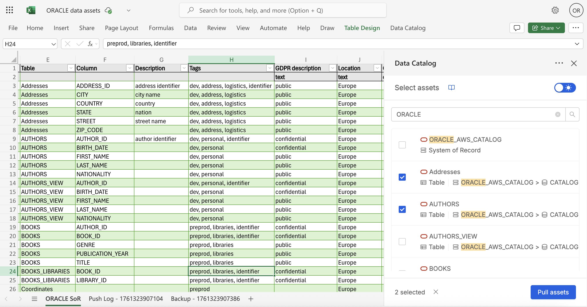
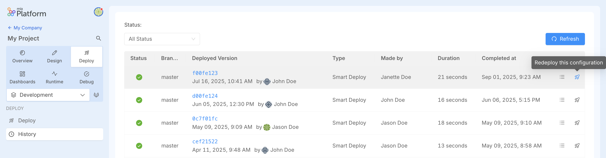

export const BetaTag = () => (
  
    { 'BETA' }
  
);

## Mia-Platform v15 Spring Edition

**Deeper insights. Broader integrations. Faster operations.**

This release brings a new wave of capabilities that deepen platform observability, extend ecosystem integrations, and streamline runtime operations.
From column-level data lineage that unlocks end-to-end data traceability, to native Bitbucket Cloud support for teams using Atlassian's ecosystem, and the new Fast Data Control Plane v2 for governing real-time data pipelines at scale.

### Data Catalog Column Lineage

The **Data Catalog** now supports **Column Lineage**, enabling users to inspect and trace upstream and downstream column relationships for a more granular, end-to-end view of their data.

While Table-level and System-of-Record-level lineage give a structural picture of how data flows across tables and systems, Column Lineage goes deeper: for each Job connecting two tables, users can now document exactly **which columns feed into which**, and **what kind of transformation** ties them together.

Discover all the details in the [Column Lineage documentation](/docs/products/data_catalog/frontend/data_lineage#column-lineage).

### Fast Data Control Plane v2

The **Fast Data Control Plane v2** is the new runtime management solution for Fast Data v2 pipelines.

It provides a general overview of all Fast Data v2 pipelines running in your environment, allowing you to monitor and govern the execution steps of your data pipelines in real time — building on the performance and modularity introduced by the Fast Data v2 workloads suite.

Discover all the capabilities and benefits of Fast Data Control Plane v2 in the [official documentation](/docs/products/fast_data_v2/runtime_management/overview).

### Bitbucket Cloud Support in Console

Console now supports **Bitbucket Cloud** as both a **Git Provider** and a **CI/CD Tool**, enabling teams that rely on Bitbucket to fully integrate their project workflows — from repository provisioning to pipeline execution.

Configuring Bitbucket Cloud as a Git Provider allows users to set up Console Projects whose Git repositories reside in a Bitbucket workspace. For CI/CD, Console will trigger Bitbucket pipeline executions on the target repository at deploy time, following the same flow already available for other supported providers.

Discover how to configure Bitbucket Cloud as a Git Provider and set up Bitbucket Pipelines in the [Configure a Provider](/docs/products/console/company-configuration/providers/management) and [Configure Bitbucket Pipelines](/docs/products/console/deploy/pipeline-based/configure-bitbucket-pipelines) documentation pages.

### New Interface for Configuration Merge

A **new interface for merging configurations** has been introduced in the Console Design Area.
The new interface aims at improving DevX in comparing and merging configurations when working on branched revisions, providing a clearer, more intuitive diff view.

To try it, go to the **Feature Preview** section inside your **Project settings** and activate it.

---

# Mia-Platform v15 - Autumn 2025

## AI-Enhanced Developer Experience

Mia-Platform continues to push the boundaries of AI-native developer tooling, embedding intelligent capabilities directly into the everyday workflow of engineering teams.

### Mia-Assistant as a Full MCP Client

Mia-Assistant is now a fully operational agent using the [Mia-Platform Console MCP Server](https://github.com/mia-platform/console-mcp-server) to access Console APIs in real time. This enables retrieving information about your Company, checking the Marketplace, debugging services, fixing problems, and automatically performing deployments — all simply by chatting.

To discover more, visit the [Mia-Assistant documentation page](/docs/products/console/assistant/overview).

### Pin Mia-Assistant for Constant Support

You can now pin the Mia-Assistant chat to keep it open while working in the Console. This allows you to interact with the AI without interrupting your workflow, making it a constant companion ready to support you throughout your daily tasks.

### Export Conversations with Mia-Assistant

You can now export your conversations with Mia-Assistant with a single click. Conversations are downloaded as a **.txt** file, making it easy to share, archive, or review past interactions at your leisure.

## Fast Data v2

Fast Data v2 introduces a new suite of workloads that take real-time data pipeline development and optimization to the next level.

The new modular architecture delivers advanced, secure stream processing and achieves **up to 10× faster aggregation performance**, ensuring scalable efficiency even for large-scale production environments.

The new workloads are:

- **[Stream Processor](/docs/products/fast_data_v2/stream_processor/overview)**: enables advanced and secure real-time data transformation, supporting both stateless and stateful processing for complex business logic.
- **[Farm Data](/docs/products/fast_data_v2/farm_data/overview)**: powers the core logic for building data products through high-performance multiple data stream aggregation.
- **[Kango](/docs/products/fast_data_v2/kango/overview)**: enables data product persistence from Kafka topics to MongoDB collections.

Discover all the benefits and capabilities of Fast Data v2 in the [official documentation](/docs/products/fast_data_v2/overview).

## Enhanced Software Catalog

The Software Catalog has received a series of significant enhancements to improve both flexibility and governance of your software assets.

### Custom Item Types

The Software Catalog now supports the definition and registration of **custom item types**, extending the system beyond predefined entities. Custom items can be cataloged and organized like any other catalog entry, making them part of a unified and consistent experience — offering greater flexibility in modeling internal tools, components, or processes.

For more details, see the [documentation](/docs/products/software-catalog/basic-concepts/items-types).

### Richer Item Management

New catalog management capabilities include:

- Adding *maintainers*, *useful links*, *labels*, and *annotations* to items.
- Mapping *relationships* between existing Catalog items, as well as defining relationships with custom entities.

These improvements provide a more powerful and adaptable catalog experience, enabling consistent governance across all your software assets.

Please refer to the [documentation](/docs/products/software-catalog/basic-concepts/items-relationships) for more information.

## Data Catalog Excel Add-in

The **Data Catalog Excel Add-in** seamlessly integrates with the Mia-Platform Data Catalog, enabling users to import asset metadata into Excel, perform bulk enrichment, and synchronize updated metadata back to the Catalog.
By bridging the gap between Excel and the Data Catalog, it simplifies advanced metadata enrichment while ensuring data quality and governance standards are maintained through pre-push validation and automatic error logging.

To discover all the benefits and how to use the Data Catalog Excel Add-in, visit the [official documentation](/docs/products/data_catalog/excel_add_in/overview).

## Platform Operations

### Manage Projects Locally with miactl

It is now possible to **manage your Project configurations locally** using the `miactl` CLI.
With the new `miactl project describe` and `miactl project apply` commands, you can export the configuration of a Project, edit it on your machine, and then apply it back to update the Project.

This enables new workflows such as troubleshooting misconfigurations, migrating Projects between Companies, creating reusable templates, or leveraging AI tools to refine configurations.

For detailed usage examples, refer to the [documentation](/docs/products/console/api-console/api-design/miactl-commands) and the [miactl project commands](/docs/products/console/cli/miactl/commands#project).

### Redeploy a Configuration from Deploy History

It is now possible to **redeploy a previously deployed configuration** directly from the **Deploy History**.
From the Deploy area, simply click the rocket icon in the table of past deployments to trigger a new deploy of that specific configuration.

### New Webhook Event: Tag Deleted

A new webhook event is now available: **`Tag Deleted`**.
This event is fired whenever a tag/version is deleted, allowing you to trigger custom automations or integrations in response.
