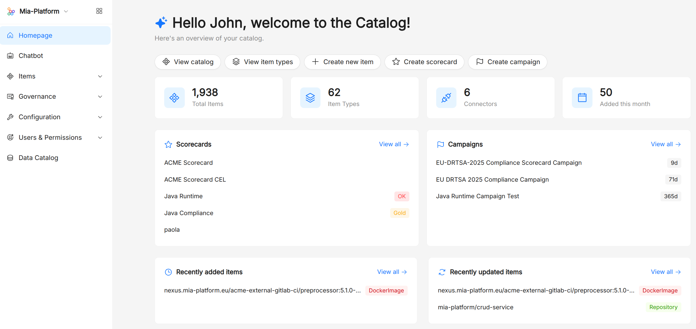
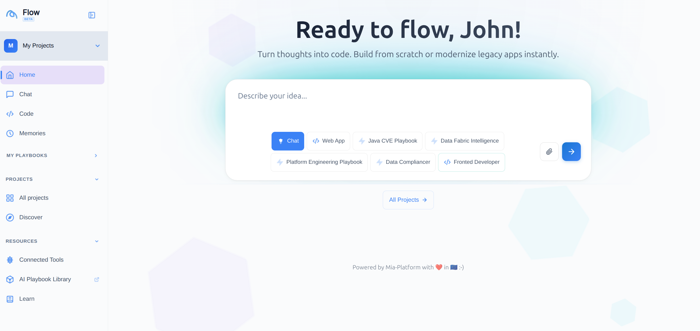
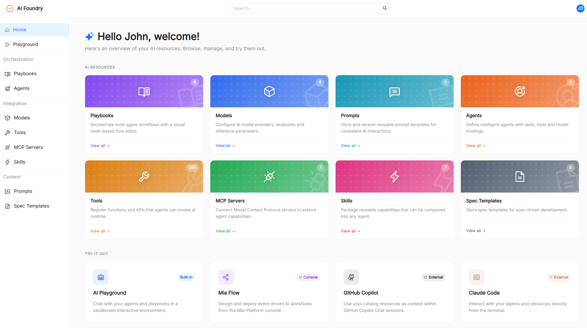
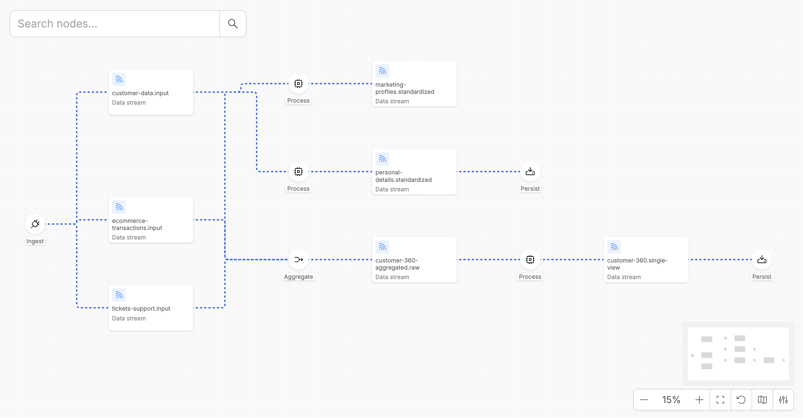
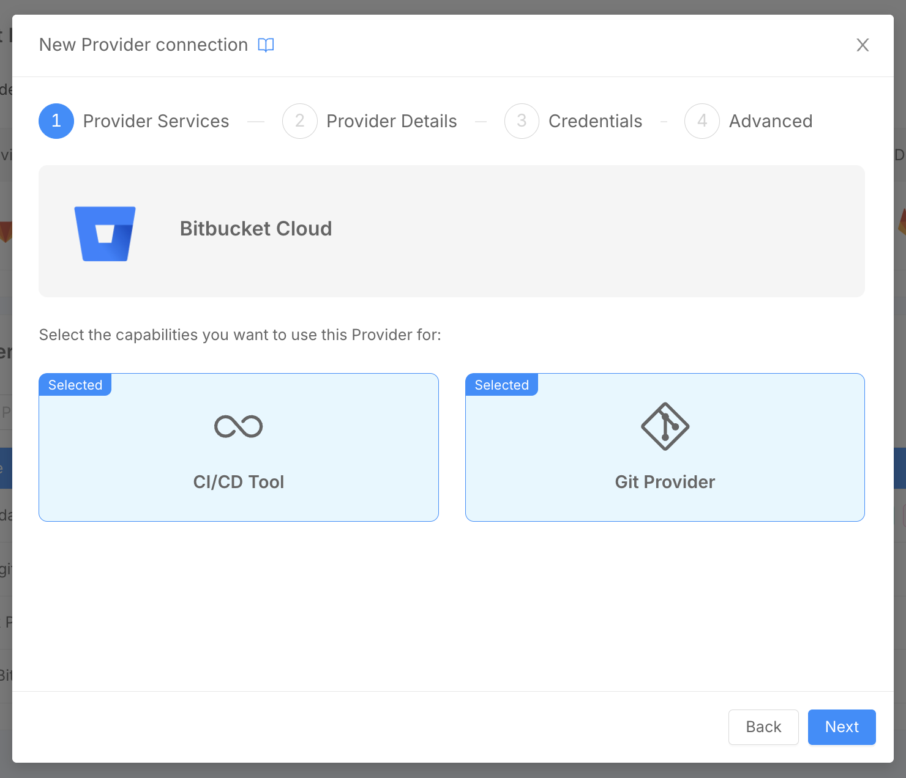
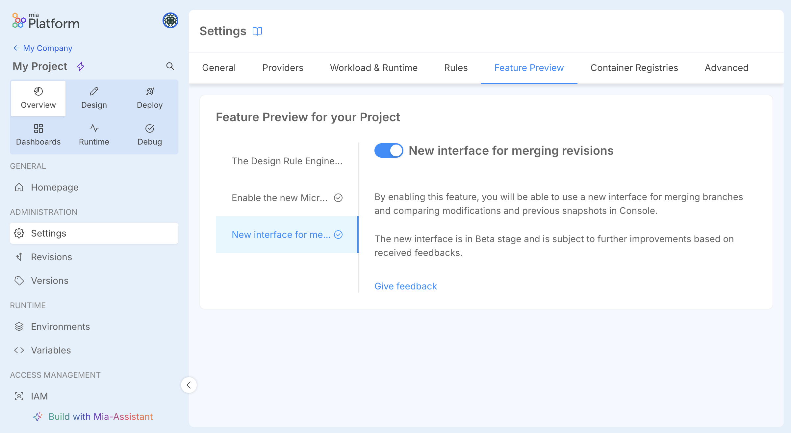

export const BetaTag = () => (
  
    { 'BETA' }
  
);

## Mia-Platform v15

**Ready to Master the Vibe?**

This release is all about giving you the context and the tools to truly master the vibe of modern, AI-driven software development: a unified place to capture and govern context for AI, smarter ways to orchestrate end-to-end workflows, and a dedicated home for building reliable AI experiences on top of your platform.

This year's headline news is the arrival of three brand-new components of Mia-Platform: **Context Catalog**, **Flow**, and **AI Foundry**, which expand the platform into context management, workflow orchestration, and AI-powered development.

But the story doesn't end there — v15 is packed with a wealth of product updates across the entire platform, from column-level data lineage that unlocks end-to-end data traceability, to native Bitbucket Cloud support for teams using Atlassian's ecosystem, to the new Fast Data Control Plane v2 for governing real-time data pipelines at scale, and much more. Read on to discover everything that's new!

### Context Catalog

We are thrilled to welcome a brand-new component to the Mia-Platform Product Suite: **Context Catalog**!

Context Catalog is the centralized place where teams record, classify, and connect any entity that exists in their organization — software components, infrastructure resources, datasets, AI assets, business processes — and make them discoverable across the platform.

Context Catalog ships with:

- A **Catalog Administration** to browse, create, and curate items, and navigate the relationship graph.
- A built-in **compliance layer** — evaluation criteria, scorecards, and campaigns — to express and enforce organizational standards (security baselines, production-readiness, ownership, …) and drive time-bounded compliance programs with notifications.
- A growing set of **connectors**, powered by the open-source [`ibdm`](https://github.com/mia-platform/ibdm) binary, that keep the catalog in sync with GitHub, GitLab, Bitbucket, Azure, Azure DevOps, Google Cloud, the Mia-Platform Console, and many other tools.
- An **MCP server** that exposes the catalog to AI agents through the [Model Context Protocol](https://modelcontextprotocol.io/), making organizational context available to AI workflows out of the box.

Discover all the details in the [Context Catalog documentation](/docs/products/context-catalog/overview).

### Flow

Say hello to **Flow**, the newest component joining Mia-Platform!

Flow is an AI-driven development environment: you open it in the browser, describe what you want to build in natural language, and the assistant generates the code, renders it in a live preview inside the Canvas, and deploys it to a Mia-Platform project when you are ready.

It connects to the tools your team already uses — GitHub, GitLab, Atlassian, Grafana, Mia-Platform Console, and any custom MCP server — and lets you manage reusable AI building blocks such as agents, skills, prompts, and playbooks directly from the interface.

Discover all the details in the [Flow documentation](/docs/products/flow/overview).

### AI Foundry

Let's introduce the third new component of this v15 release: **AI Foundry**!

AI Foundry is the new home for building, deploying, and governing AI-powered experiences on Mia-Platform. It provides a unified, web-based environment where teams can:

- Configure **Agents** backed by the LLM **Models** of their choice and equipped with curated **Tools** and **Skills**.
- Compose multi-step agentic workflows visually with the **Playbook Builder**, or author them as JSON for full control.
- Manage **Prompts** as first-class, versioned catalog assets that agents and playbooks can reference.
- Register external **MCP Servers** to dynamically expand the tool surface available to agents.
- Test everything in real time in the **AI Playground**, with streamed responses, inline tool calls, and exportable conversations.

Discover all the details in the [AI Foundry documentation](/docs/products/ai-foundry/overview).

### Data Catalog Column Lineage

The **Data Catalog** now supports **Column Lineage**, enabling users to inspect and trace upstream and downstream column relationships for a more granular, end-to-end view of their data.

While Table-level and System-of-Record-level lineage give a structural picture of how data flows across tables and systems, Column Lineage goes deeper: for each Job connecting two tables, users can now document exactly **which columns feed into which**, and **what kind of transformation** ties them together.

Discover all the details in the [Column Lineage documentation](/docs/products/data_catalog/frontend/data_lineage#column-lineage).

### Fast Data Control Plane v2

The **Fast Data Control Plane v2** is the new runtime management solution for Fast Data v2 pipelines.

It provides a general overview of all Fast Data v2 pipelines running in your environment, allowing you to monitor and govern the execution steps of your data pipelines in real time, building on the performance and modularity introduced by the Fast Data v2 workloads suite.

Discover all the capabilities and benefits of Fast Data Control Plane v2 in the [official documentation](/docs/products/fast_data_v2/runtime_management/overview).

### Bitbucket Cloud Support in Console

Console now supports **Bitbucket Cloud** as both a **Git Provider** and a **CI/CD Tool**, enabling teams that rely on Bitbucket to fully integrate their project workflows, from repository provisioning to pipeline execution.

Configuring Bitbucket Cloud as a Git Provider allows users to set up Console Projects whose Git repositories reside in a Bitbucket workspace. For CI/CD, Console will trigger Bitbucket pipeline executions on the target repository at deploy time, following the same flow already available for other supported providers.

Discover how to configure Bitbucket Cloud as a Git Provider and set up Bitbucket Pipelines in the [Configure a Provider](/docs/products/console/company-configuration/providers/management) and [Configure Bitbucket Pipelines](/docs/products/console/deploy/pipeline-based/configure-bitbucket-pipelines) documentation pages.

### Helm Charts Design and Deploy with Kustomize

The Console Design Area now includes a dedicated **Charts** section for Console Projects using the Enhanced Workflow.

In this section, teams can manage Helm Charts configurations leveraging an integrated Monaco editor that provides Helm-aware syntax highlighting, linting, schema-driven validation of `values.yaml`, and live autocompletion of `.Values.*` paths inside templates.

At deploy time, the Console generates the chart output and the pipeline applies it to the cluster using a **Kustomize-based deploy** strategy.

Discover all the details in the [Helm Chart documentation](/docs/products/console/api-console/api-design/charts).

### New Interface for Configuration Merge

A **new interface for merging configurations** has been introduced in the Console Design Area.

The new interface aims at improving DevX in comparing and merging configurations when working on branched revisions, providing a clearer, more intuitive diff view.

When working with branched revisions in the Design Area, users can now take advantage of a redesigned merge interface that provides a clearer, more intuitive diff view of the changes between revisions, making it easier to compare and merge configurations with confidence.

To try it, go to the **Feature Preview** section inside your **Project settings** and activate it!
