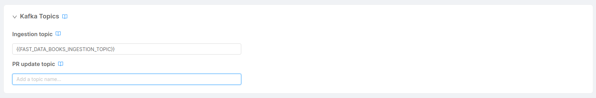

_March 15th, 2024_

## Console

### Bug Fix

This version addressed the following bugs:

* fixed a bug that caused project deployment to fail if the user was using Azure Key Vault or Vault as a secret manager;

## Fast Data

### Bug Fix

:::danger
There is a known bug regarding the management of custom cast functions on Projection Storer configuration. In particular, when using custom cast functions in your Fast Data Project, the configuration for the Projection Storer contains solely the custom cast functions related to the first projection associated to the service.

This issue has been solved in the v12.3.2 of the Console. Please refer to the [dedicated release note](/release-notes/v12/v12.3.2) for further information.
:::

This version addresses a bug that causes the automatic regeneration of Real-Time Updater config maps to use all `pr-update` topic definitions retrieved from the Console configuration, even if these definitions are left empty, as `pr-update` events are not required for these projections.

:::warning
If you have enabled the emission of `pr-update` events in a Real-Time Updater or a Projection Storer but not all projections should emit the events, make sure to clear the unused `pr-update` topic inputs inside the [details page](/docs/12.4.0/fast_data/configuration/projections#pr-update-topic) of each excluded projection.

:::

## How to update your Console

For on-premise Console installations, please contact your Mia Platform referent to know how to use the `Helm chart version 11.0.6`.
