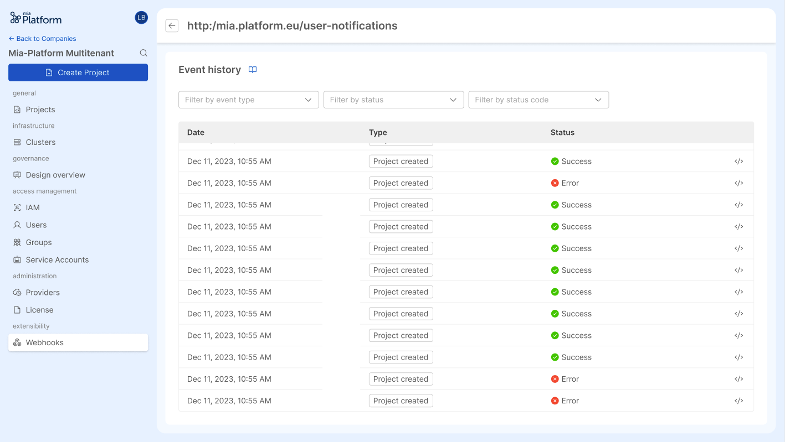
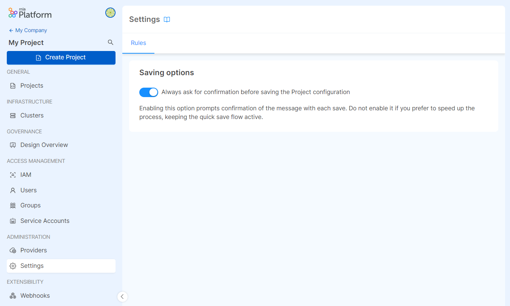

_May 02th, 2024_

## Console

### Webhook History

For each webhook configured on the Company, it is now possible to view the history of all its triggered events, with their respective status information, date and time, and body with the data that the Console sent.

### Define Rules for your Company & Projects

We have introduced a brand new tab named `Rules` where users with enough permissions can customize rules for their Company and its related Projects. This tab is present both at [Company](/docs/12.4.0/console/company-configuration/company-settings#rules) & [Project](/docs/12.4.0/console/project-configuration/project-settings#rules) level, inside the `Settings` section of each.

### Decide whether to ask for confirmation before saving or to perform a frictionless save

The first rule that we have introduced is dedicated to improve configuration save experience:  
starting from now, users with enough permission can decide whether to set a friction to ask for confirmation before saving in the Projects of a Company or to alternatively let users save their configuration in a quicker way when using the shortcut `Ctrl/Cmd + S`.

Please note that the rule is active by default on all existing Projects. To leverage the `Ctrl/Cmd + S` shortcut frictionless save experience you need to disable the rule.

For more information about the new Company Settings section, please refer to the related [documentation page](/docs/12.4.0/console/company-configuration/company-settings#rules).

### Improvements

#### Colored event labels in Flow Manager Configurator

In the [Flow Manager Configurator](/docs/12.4.0/development_suite/api-console/api-design/flow-manager-configurator/overview), event labels displayed in the canvas are colored and grouped according to the event group they belong to.

### Bug Fix

This version addressed the following bugs:

* it has been fixed a bug that did not delete side effects when a protocol on which they rely on is deleted in the Flow Manager Configurator.
* it has been fixed a bug that prevented the creation of more than 10 state or event groups in the Flow Manager Configurator.

## Fast Data

### Fast Data Configurator

#### Bug Fix

This version addressed the following bug:

* SINGLE_VIEW_NAME env var is not deleted anymore at commit when the Single View Trigger Generator is detached

## Marketplace

### Marketplace Updates

#### CRUD Service

The new version `7.0.1` of the CRUD service is available!

##### Improvements

* new environment variable `OPEN_API_SPECIFICATION` has been added. This variable allows to select which OpenAPI specification should be adopted for generating the API specification that is exposed by the service
* the bulk POST and PATCH operations have been optimized to improve performances and to avoid service crashing

## How to update your Console

For self-hosted installations, please head to the [self hosted upgrade guide](/docs/12.4.0/infrastructure/self-hosted/installation-chart/how-to-upgrade#v12---version-upgrades) or contact your Mia-Platform referent and upgrade to _Console Helm Chart_ `v13.1.0`.
