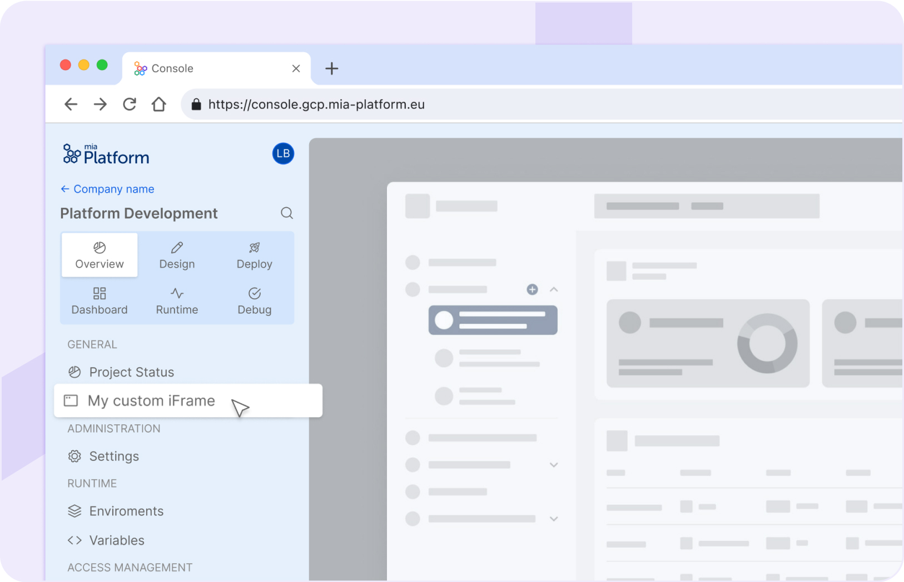
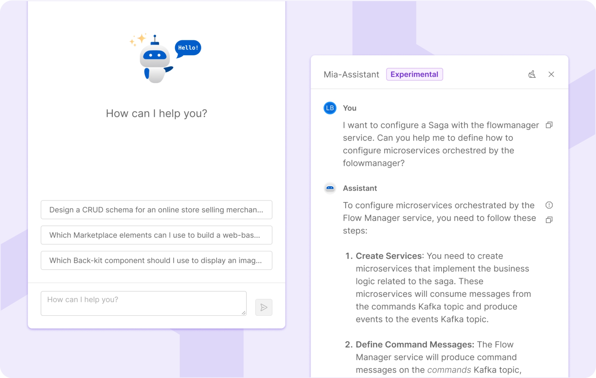
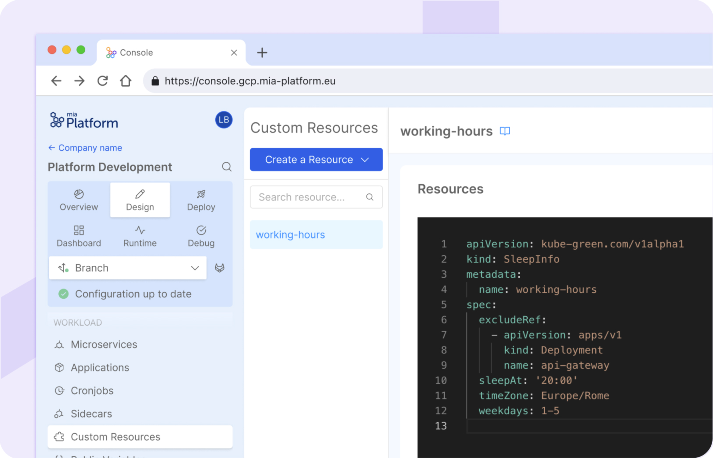
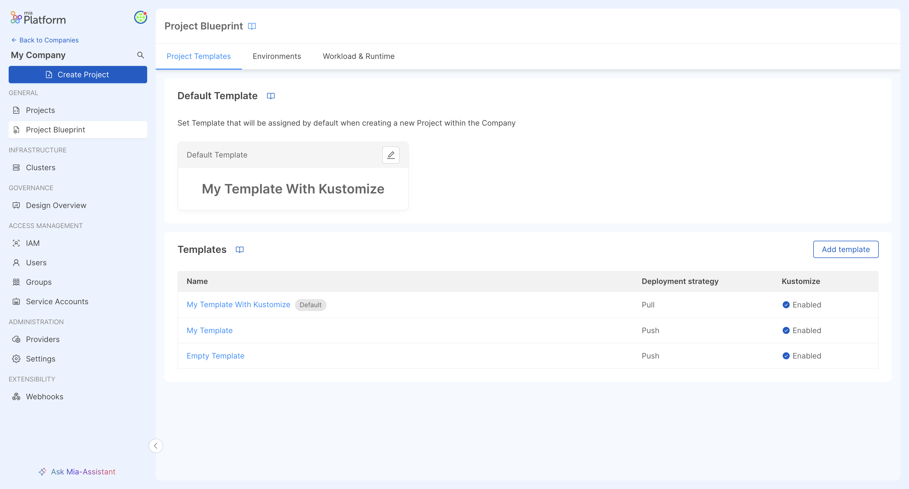
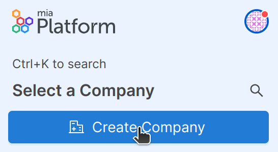
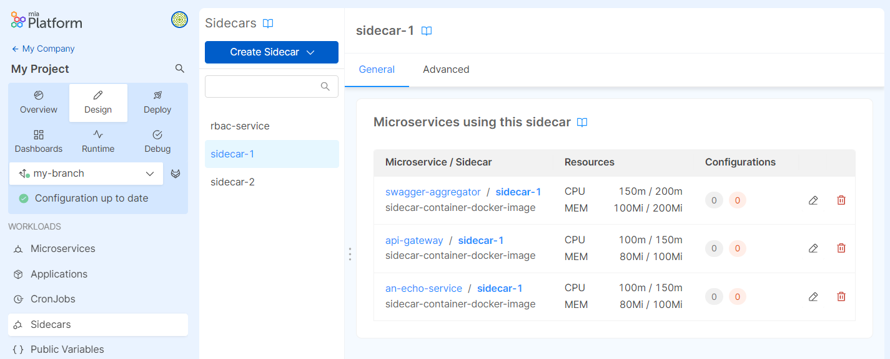
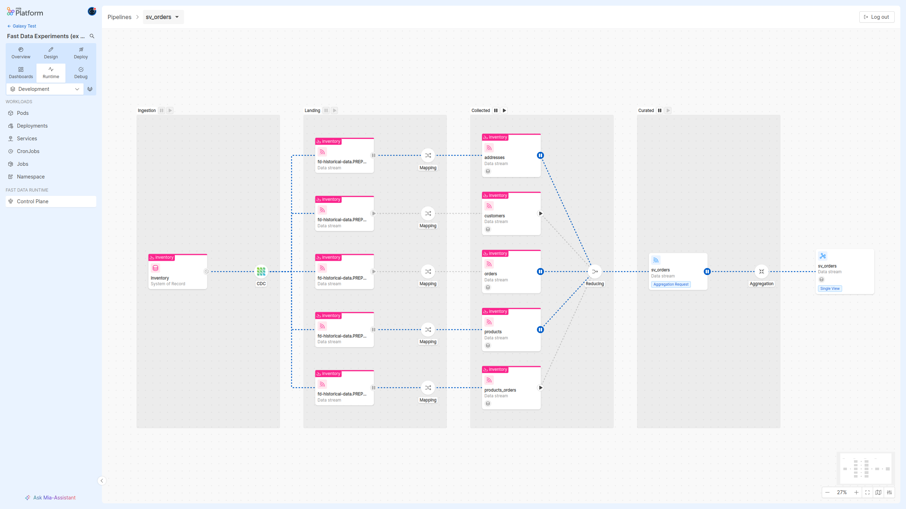

_May 30th, 2024_

:::caution
This version is affected by a bug in the Flow Manager Configurator that prevents saving the configuration if this section is not opened during the session in the Design Area before saving. This bug occurs in case the Flow Manager Configurator has been already adopted in lower Console versions. This bug has been solved in `v13.0.1`. For on-premise installations we recommend not to use this version. Please check the `v13.0.1` Release notes [here](/docs/13.x.x/release-notes/v13.0.1).
:::

**Welcome to Mia-Platform v13!**

## Console

### Support to iFrame Extensions in Console 

From now on, you can embed external web pages within Mia-Platform Console using iFrames. You can therefore register, activate and manage your extensions via API directly from our API Portal. This feature can enhance your experience and improve the customization of your working space by effortlessly integrating tools, dashboards, and other external content directly into our IDP.

The supported sections of the Console where you can add such extensions are at Company and Project level, as well as the Runtime section of your Project.



To discover more about how to register and activate an iFrame extension in Console, please refer to the related [documentation page](/docs/13.x.x/console/console-extensibility/overview).

### Mia-Assistant, the AI chatbot of Mia-Platform

Mia-Platform Console now has its own AI chatbot: let's welcome Mia-Assistant!

:::info  
Please note that this feature is still in an Experimental phase: feel free to give us feedback in order to help us improve it!
:::

From anywhere on the Console, you can interact with Mia-Assistant, an AI chatbot that will help you simplify your experience when using the Console. 
You can ask Mia-Assistant any question related to the Mia-Platform context: it will answer and provide the related Mia-Platform documentation reference, to help you retrieve all the information you need!

You only need to simply click on the new "Ask Mia-Assistant" button and try it out!



### Manage Custom Resources in Console

Inside a brand new dedicated section within the Design area, it is now possible to manage and configure custom objects that are not part of the standard Console supported resources.

This feature further expands the Console domain over the user's entire workload, enabling greater operability, governance, and control over systems.



To discover more, visit the related [documentation page](/docs/13.x.x/console/design-your-projects/custom-resources/custom-resources).

### Blueprint and Template management via User Interface

We're excited to unveil a significant enhancement to our platform: Blueprint and Template management via the User Interface. This update transforms how you handle your company's Blueprint alongside their respective Templates and settings.

With our new user-friendly interface, managing your Blueprint and Templates becomes a breeze. Say goodbye to the complexity of the CMS interface and hello to streamlined setup. This new section can simplify your project processes, gain better control over them, and seamless user experience.



To learn more about Blueprint, please refer to the related [documentation page](/docs/13.x.x/console/company-configuration/project-blueprint).

### Create Company from Console

From now on, it is possible to create a Company directly through the Console interface, via an appropriate create button. This will only be possible for users with respective instance-level root permissions.



Find more information at the related [documentation page](/docs/13.x.x/console/company-configuration/create-company).

### Manage Sidecars in Console

From now on, you can add and manage Sidecar containers in your Microservices directly from the Design area of your Project! 

We have introduced the brand new `Sidecars` section where you can view and govern all the configurations of your Sidecars. You can also manage each of those Sidecar configurations in the detail page of each of your Microservices, in a new card dedicated to the containers management. 



To discover more about this new feature, visit the related [documentation page](/docs/13.x.x/console/design-your-projects/sidecars).

### New root permission to view all user roles

The new root permission `console.root.all.view` to view all user roles among Companies has been added to the Console levels and permission. To discover more, visit the [documentation of Console root level permissions](/docs/13.x.x/development_suite/identity-and-access-management/console-levels-and-permission-management#console-root-level-permissions).

### Add decorators for MongoDB View endpoints type

From the Endpoints section of the Console you can now add decorators also for MongoDB View endpoint type.

### Improvements

#### New Flow Manager Configurator features

From now on, the Flow Manager Configurator provides the ability to search for Flow Manager services within the project and to search for states and events of the flow currently being viewed which are selected and centered within the canvas.

#### Get user roles on all Company resources 

The API to retrieve user roles on a Company now includes in the response all the resources the user has access to based on hierarchical permissions (even without a direct binding associated with it)

#### Revision/Version info available in the payload sent by the Orchestrator Generator

From now on, also the name of the Revision/Version is included in the payload sent by the Orchestrator Generator.

### Bug Fix

This version addressed the following bugs:

* the `Flow Manager Configurator` button in the microservices section correctly redirects to the right flow
* in the Flow Manager Configurator, the `isFinal` flag is automatically disabled when events are edited via drag and drop
* we fixed a wrong behavior when selecting the "Preserve files and directories already existing in the Runtime Mount Path directory" in the ConfigMaps files management
* a misconfiguration that prevented versions from being correctly deployed when using GitHub has been corrected

## Fast Data

### Fast Data Control Plane

Mia-Platform Fast Data has been empowered with a **Runtime Management solution**, let's welcome **Fast Data Control Plane**.

From Marketplace, create, configure and deploy [Fast Data Control Plane](/docs/13.x.x/runtime_suite_applications/fast-data-control-plane/10_overview) application to start monitoring and governing your Fast Data Runtime!
This Fast Data suite component provides a general overview of the Fast Data pipelines released on the runtime environment.
In addition, from its user-friendly web interface, users can _pause_ and _resume_ the consumption of data streams along **Fast Data pipelines**
with just a few clicks to strategically allocate resources consumption and efficiently utilize them during peak demand processes.



Take a look at the main **concepts** of Fast Data Runtime Management, learn about all the **benefits** Fast Data Control Plane brings to your Fast Data solution, and how to **configure** it on your Projects from the [dedicated documentation](/docs/13.x.x/fast_data/runtime_management/overview).

### Fast Data Configurator

#### Control Plane configuration card inside the Projection Storer page

A new [card](/docs/13.x.x/fast_data/runtime_management/workloads?workload=projection-storer) has been added to the Projection Storer configuration page to allow changes to the Control Plane settings.

#### Bug Fix

This version addressed the following bug:

* the `Custom` option editor on the Message Format tab has been moved into a modal to prevent unexpected focus changes while writing code

Additionally, several changes and fixes have been added to the [No Code Aggregation](/docs/13.x.x/fast_data/configuration/config_maps/aggregation#use-the-no-code):

* Aggregation mappings that contain the `__fromFile__` keyword or constant values (e.g. `__string__[]`) are no longer erased when adding a new dependency or setting a new path
* dependencies that contain the `aliasOf` keyword are now correctly handled and it is possible to map them and set Aggregation paths without raising configuration errors
* Single Views and CRUD collections can now be used as [Base Projection](/docs/13.x.x/fast_data/concepts/glossary#fast-data-terms) options inside the Aggregation placeholder or the Single View Creator `Settings` tab
* newly selected fields for Aggregation mapping are not deselected when not configured
* the warning and error icons are updated correctly when mapping a field
* Array of String fields are now handled inside the Aggregation `Advanced mode` 
* it is now possible to correctly add new dependencies for nested fields
* an info badge now appears when a selected dependency contains `Object` or `Array` type fields, guiding the use of the `__fromFile__` keyword
* the button for selecting and deselecting fields for mapping has been renamed `Edit field list` to improve clarity
* the `Set path` modal width has been adjusted

#### Deprecations

Here is reported the list of features that have been deprecated and that will be removed in the future releases.

:::caution
##### Conditional Expression on Dependencies

In the Single View aggregation configuration, the advanced functionality [conditional expression on dependencies](/docs/13.x.x/fast_data/configuration/config_maps/aggregation#using-conditional-expressions-on-dependencies-definitions-and-mappings)
(employed via `_select` keyword) has been deprecated.  
It will be replaced in the future with a better solution for pre-filtering which projections should be included in the aggregation process
:::

### Fast Data Services

#### Real Time Updater

The new version `v7.7.0` of the _Real Time Updater_ is available!

##### New Features

* introduce support for [Runtime Management](/docs/13.x.x/fast_data/runtime_management/overview) features, that is the interaction with Fast Data Control Plane. This
can be enabled adding the dedicated configuration to the service as described in the [workloads page](/docs/13.x.x/fast_data/runtime_management/workloads?workload=rtu)

#### Bug Fix

This version addressed a few bugs, here is a comprehensive list:

* the maximum number of `pr-updates` events that are produced on a topic within a single batch has been capped. In this
manner the maximum batch size is not exceeded, especially when compressing messages before sending them on the topics.

For more information check out the service [changelog](/docs/13.x.x/runtime_suite/real-time-updater/changelog).

#### Projection Storer

The new version `v1.2.1` of the _Projection Storer_ is available!

##### New Features

* introduce support for [Runtime Management](/docs/13.x.x/fast_data/runtime_management/overview) features, that is the interaction with Fast Data Control Plane. This
  can be enabled adding the dedicated configuration to the service as described in the [workloads page](/docs/13.x.x/fast_data/runtime_management/workloads?workload=projection-storer)

#### Improvements

* changed Kafka partition assigner to better handle rebalance operations
* relaxed Kafka configuration constraints to allow changing a few more properties, such as auto-topic creation. Please, notice that we recommend carefully consider the amount of partitions and settings each `ingestion` and `pr-update` topic should receive to maximize system throughput
* clarified explanation of some service [runtime errors](/docs/13.x.x/fast_data/troubleshooting/fast_data_error_codes#projection-storer), especially the one related to communication errors between internal components
* added secrets loading (plain value, from environment variable or from file) in service configuration file. More details can be found in this [page](/docs/13.x.x/fast_data/configuration/secrets_resolution)

#### Bug Fix

This version addressed a few bugs, here is a comprehensive list:

* the service does not throw anymore in case `pr-updates` topics were not provided in the configuration. Instead, it logs a warning. This enables the use case where the Projection Storer is employed as a standalone component for just ingesting change events without notifying downstream components.
* reworked the internal behavior that previously prevented the service to timely restart when an unrecoverable error was encountered

For more information check out the service [changelog](/docs/13.x.x/runtime_suite/projection-storer/changelog).

#### Single View Trigger Generator

The new version `v3.3.1` of the _Single View Trigger Generator_ is available!

##### New Features

* introduce support for [Runtime Management](/docs/13.x.x/fast_data/runtime_management/overview) features, that is the interaction with Fast Data Control Plane. This
  can be enabled adding the dedicated configuration to the service as described in the [workloads page](/docs/13.x.x/fast_data/runtime_management/workloads?workload=svtg)

##### Improvements

* added secrets loading (plain value, from environment variable or from file) in service configuration file. More details can be found in this [page](/docs/13.x.x/fast_data/configuration/secrets_resolution)

For more information check out the service [changelog](/docs/13.x.x/runtime_suite/single-view-trigger-generator/changelog).

#### Single View Creator

The new version `v6.7.1` of the _Single View Creator_ is available!

##### New Features

* introduce support for [Runtime Management](/docs/13.x.x/fast_data/runtime_management/overview) features, that is the interaction with Fast Data Control Plane. This
  can be enabled adding the dedicated configuration to the service as described in the [workloads page](/docs/13.x.x/fast_data/runtime_management/workloads?workload=svc)

##### Improvements

* introduced `KAFKA_SECURITY_PROTOCOL` to govern whether to enable SSL when
the configured connection is  authenticated

#### Bug Fix

This version addressed a few bugs, here is a comprehensive list:

* the service is now able to properly emit Kafka heartbeats even during high utilization
periods. This prevents the service to randomly restart even when no error was encountered

For more information check out the service [changelog](/docs/13.x.x/runtime_suite/single-view-creator/changelog).

## Data Catalog

### Data Catalog Agent Template

The new version `v0.5.1` of the _Data Catalog Agent_ template is available!

#### Breaking Changes

Configuration logic has been reviewed to [support secrets loading](/docs/13.x.x/runtime_suite_templates/data-catalog-agent/20_configuration#secret-support) in several locations:

* connection passwords
* connection strings
* salesforce secrets
* PEM private keys  
  
It is **breaking** on targets of type `mia-console`, which now requires private keys to be an object with the following format

  ```json
  {
    "type": "file",
    "path": "/path/to/key"
  }
  ```
instead of a plain path string.

##### New Features

[Salesforce SObjects](/docs/13.x.x/runtime_suite_templates/data-catalog-agent/20_configuration#salesforce-sobjects) have been added among the supported Data Sources, so that it is possible to configure the Agent to gather metadata from the ones deployed in your projects environments.

##### Improvements

* introduce support for insecure tls connections on all http clients
* introduce support for custom root certificates or self-signed certificates on all http clients

:::info
In order to get access to this new feature, please remember to rebuild your Data Catalog Agent image against the newer Agent template version.
:::

## Microfrontend Composer

### Configurator

#### Bug Fix

This version addressed the following bugs:

* in the Microfrontend Composer it is now possible to generate the data schema for MongoDB Views, Projections and Single Views.

### Back-Kit Library

The new version `v1.5.1` of the back-kit library is available!

Refer to back-kit [changelog](/docs/13.x.x/microfrontend-composer/back-kit/changelog) for finer-grained details of new versions.

#### Improvements

##### Export enhancement for date/time format

It is now possible to choose the date format and the timezone while exporting, both with `bk-export` or `bk-export-client` components.

##### Table height fits parent 

It is now possible to make the table fit the parent container with the `fitParentContainer` property in `bk-table`

#### Bug Fix

Fixed link URL generation with special characters

## Marketplace

### New Marketplace Components

#### AI RAG Template

The `AI RAG` template, used by our brand new AI Chatbot Mia-Assistant, is now officially available OSS in **Beta** phase! 
You can find the repository available [here](https://github.com/mia-platform/ai-rag-template). 

### Marketplace Updates

#### API Portal

The new version `1.16.14` of the API Portal is available!

##### New Features

Added support for OpenAPI 3.1 

#### CRUD Service

The new version `7.0.2` of the CRUD Service is available!

##### New Features

Added the `_exportOpts` query parameter to add the possibility to choose the CSV separator/delimiter.

## How to update your Console

For self-hosted installations, please head to the [self hosted upgrade guide](/docs/13.x.x/infrastructure/self-hosted/installation-chart/how-to-upgrade) or contact your Mia-Platform referent and upgrade to _Console Helm Chart_ `v13.2.0`.
