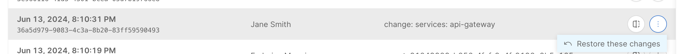
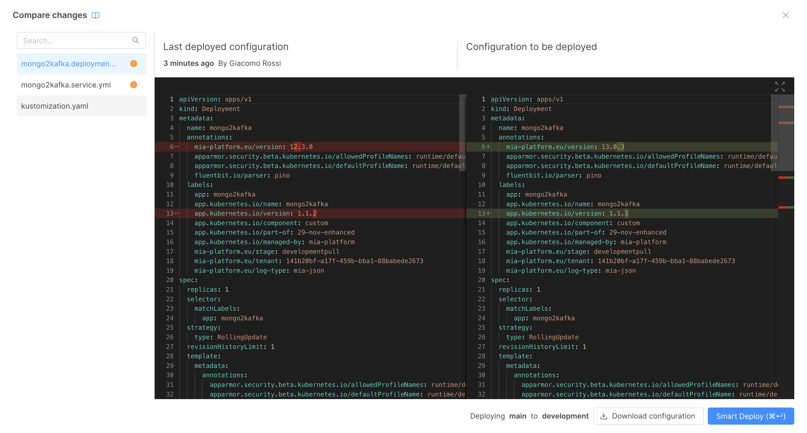

_July 04th, 2024_

## Console

### Restore previous configuration snapshots on Projects with the enhanced workflow

On Projects with enhanced workflow you can now restore a previous configuration snapshot from the revision history modal.  
All you have to do is to open the revision action popover, click on the `History` button and select the menu item "Restore these changes" on the configuration snapshot you want to restore. 

### Vote the answers provided by Mia-Assistant

From now on, you can send positive or negative feedback to the answers generated by Mia-Assistant by simply clicking the thumbs up or down at the end of each answer.  
This feedback will then be gathered and analyzed to improve the overall performance of the chatbot.

### Configure Metrics gathering for all the containers of a Microservice

Once you have configured the Runtime Monitoring system for your Project, you can now define the scraping rules for each of your Microservice containers. You can perform such action in the `Monitoring` tab of each Microservice's details page.  
For more information, visit the related [documentation page](/docs/13.7.5/development_suite/api-console/api-design/microservice-monitoring).

### Whitelabeling for Self-Hosted Clients

During a Self-Hosted installation, it is now possible to customize certain Console images to suit the client needs. 

The customizable properties are:
- Login page logo;
- Background of the login page;
- Favicon;
- Sidebar logos (in both extended and collapsed versions).

For more information, visit the related [documentation page](/docs/13.7.5/infrastructure/self-hosted/installation-chart/helm-values/whitelabeling).

### Compare changes at Deploy on Projects with the enhanced workflow on On-Premise installations

:::caution
This feature has a malfunction that causes an unexpected error when using *GitLab* and *Jenkins* as CI/CD providers on the project.
Resolution of these issues will be addressed with future versions.

If you require to disable this feature, please contact your Mia-Platform referent.
:::

For the On-Premise installations, it is now possible to compare all changes made in the configuration to be deployed with respect to the previous deployed configuration in all the Projects using the enhanced workflow. 
Users will then be able to view all configuration files and their respective changes and easily search among them.

### Bug Fix

This version addressed the following bugs:

* fixed a bug that prevented the correct view of an iFrame extension when switching among two different iFrame extensions;
* fixed a bug that caused a malfunction in the display of the Deploy area when rapidly switching among two different Projects.

## Microfrontend Composer

### Back-Kit Library

The new version `v1.5.4` of the back-kit library is available!

Refer to back-kit [changelog](/docs/13.7.5/microfrontend-composer/back-kit/changelog) for finer-grained details of new versions.

#### Improvements

##### Exposed `customEvents` property of form modal and form drawer components

It is now possible to add a new prop to the components `bk-dynamic-form-modal` and `bk-dynamic-form-drawer` called `customEvents` which takes the name of the event that the component will listen to and the mode which can be 'insert' or 'selected'.

## Marketplace

### Marketplace Updates

#### API Portal

We are excited to announce the release of API Portal version `2.0.0`! 

This new version features an upgraded interface based on Swagger UI, providing enhanced support for all functionalities of the OpenAPI 3.1 specification.  Please note that there are a few breaking changes in this release. We strongly recommend reviewing the [updated documentation](/docs/13.7.5/runtime_suite/api-portal/configuration#how-to-migrate-to-v2) to understand these changes.

:::caution
Anyone wishing to use API Portal version `2.0.0` to visualize CRUD Service documentation should update the latter to the latest patch of major 6 (`6.10.2` at the time of writing) or to the latest patch of major 7 (`7.0.3` at the time of writing), given the new, improved way of handling OpenAPI specification errors in the API Portal.
:::

#### CRUD Service

The new version `7.0.3` of the CRUD Service is available!

##### Bug Fix

* Fixed projection example in json schema generator
* `serializerCompiler` has been added to use explicitly fastifiy-fast-json, along with `AdditionalCaster`
* `$eq` operator can now be used also for array fields
* `/-/schemas` accept header defaults to `application/json`
* `/schemas` and `/-/schemas` endpoints now return also `required` property

## How to update your Console

For self-hosted installations, please head to the [self hosted upgrade guide](/docs/13.7.5/infrastructure/self-hosted/installation-chart/how-to-upgrade) or contact your Mia-Platform referent and upgrade to _Console Helm Chart_ `v13.4.0`.
