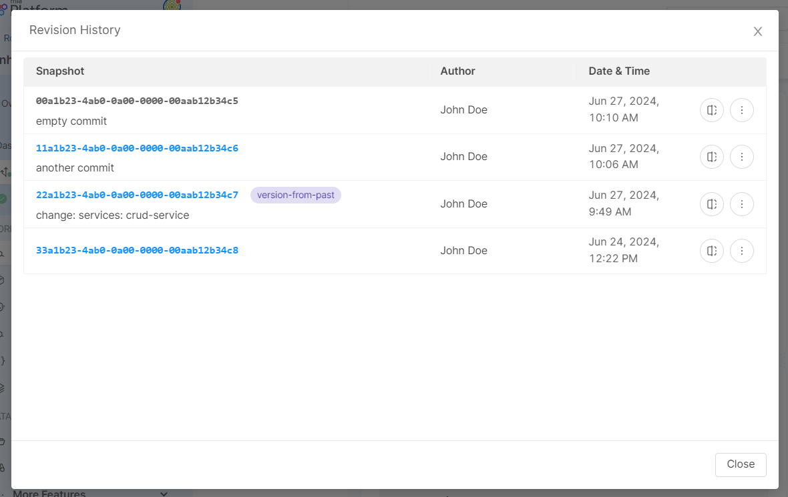

_August 01st, 2024_

## Console

### Load a previous snapshot on Projects with the enhanced workflow

From now on, you can load a previous snapshot on Projects using the enhanced workflow. Once loaded, you can edit such configuration and save on a new revision, create a new version or exit such snapshot and return to the latest.  

If you want to load a previous snapshot, you only have to open the revision action popover, click on the `History` button and head to the clickable snapshots from the revision history modal. 

### Configure environment variables from Configmap

Public variables can now also be used inside Microservices' configmap configurations. Inside the Microservice detail page you can now select or create a new configuration of type configmap.

After creating a configmap, create or select a configuration file and use public variables by including interpolated keys. Just create an object, add a field, and set the interpolated value.

For more information, visit the related [documentation page](/docs/13.x.x/development_suite/api-console/api-design/public_variables#how-to-use-a-public-variable-in-a-configmap-configuration).

### Improvements

#### Design Overview visible to Guest role

The Design Overview section, accessible at Company level, is now visible also to users with `Guest` role.  

### Bug Fix

This version addressed the following bugs:

* Fixed a bug that caused the Design Overview data and filter to not show all the available information when there were Projects within a Company having large configuration files;
* We better addressed the warning returned to users when they have an instance of an application whose original resource has been deleted from the Marketplace;
* We fixed a misconfiguration that prevented the correct refresh of Console pages with active iFrame extensions.

## Fast Data

### Fast Data Configurator

#### Bug Fix

This version addressed the following bug:

* Fixed a bug that did not allow switching the Single View Key format from JSON to JavaScript and vice versa directly from the dedicated configuration section. Now, in the Single View Key configuration modal, when activating the Advanced mode toggle, user can now choose whether to use the JSON format or the JavaScript format. For more information on how to configure the Single View Key, visit the [related documentation](/docs/13.x.x/fast_data/configuration/config_maps/singleViewKey#choose-between-json-and-javascript-format-in-advanced-mode).

## Data Catalog

Data Catalog Template `v1.3.0` is **now available**!

This new version introduces additional parameters to manage query size to ODBC sources and, for `oracle` data sources, introduces the possibility to manage the type of queries according to user permissions. To deep dive into these new features, you can refer to both template [changelog](/docs/13.x.x/runtime_suite_templates/data-catalog-agent/changelog) and [configuration]/docs/13.x.x(/runtime_suite_templates/data-catalog-agent/20_configuration) sections.

## Microfrontend Composer

### Configurator

#### Improvements

##### No-code translations managements

Easily manage translations with our new Translations section. View, edit, and configure labels for multiple languages, and if a translation configuration file already exists it can be imported by clicking the Retrieve translations button. 

Language switching is now also available in the preview section.

For further details, please refer to the [documentation](/docs/13.x.x/microfrontend-composer/composer/10_structure#translations).

##### Explore components catalog via Components Explorer

Discover our new Components Explorer! Click the "View Components" button to access a dynamic list of custom elements. Use the library filter and text search to find what you need easily. Click on any element to see detailed previews, descriptions, examples, and documentation links. 

Try it out and see the [documentation](/docs/13.x.x/microfrontend-composer/composer/10_structure#components-explorer) for more details.

### Back-Kit Library

The new version `v1.5.6` of the back-kit library is available!

Refer to back-kit [changelog](/docs/13.x.x/microfrontend-composer/back-kit/changelog) for finer-grained details of new versions.

#### Bug Fix

This version addresses the following bugs:

* fixed validation error on array object fields in accordion
* fixed date picker error on array object fields in accordion form
* fixed flag `allowNavigation` to navigate array of objects

## Marketplace

### New Marketplace Components

#### AI RAG Chat Application 

The `AI RAG Chat` Application is now available OSS in **Beta** phase! This application groups the back-end and front-end of an AI RAG template in order to facilitate the creation of a fully functioning retrieval augmented generation system. For more information, you can find its repository available [here](https://github.com/mia-platform/ai-rag-template-chat).

### Marketplace Updates

#### API Portal

##### New features

API Portal version `2.0.1` is now [served directly](/docs/13.x.x/runtime_suite/swagger-aggregator/30_apis#static-route) from Swagger Aggregator version `3.7.0`.

## How to update your Console

For self-hosted installations, please head to the [self hosted upgrade guide](/docs/13.x.x/infrastructure/self-hosted/installation-chart/how-to-upgrade) or contact your Mia-Platform referent and upgrade to _Console Helm Chart_ `v13.5.2`.
