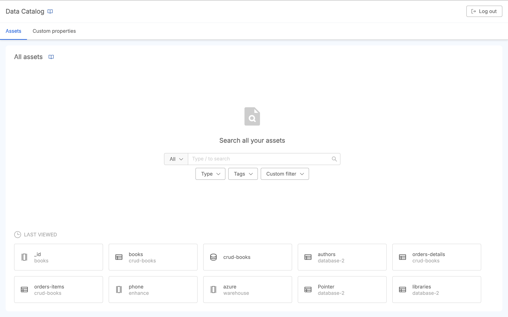
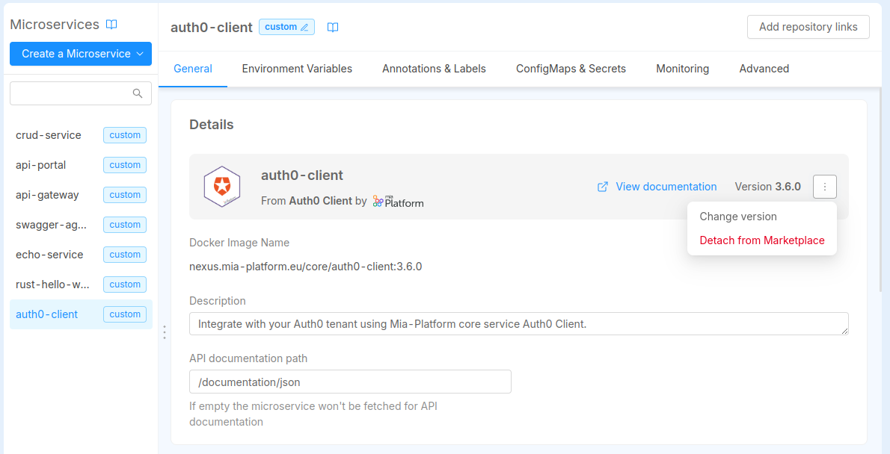
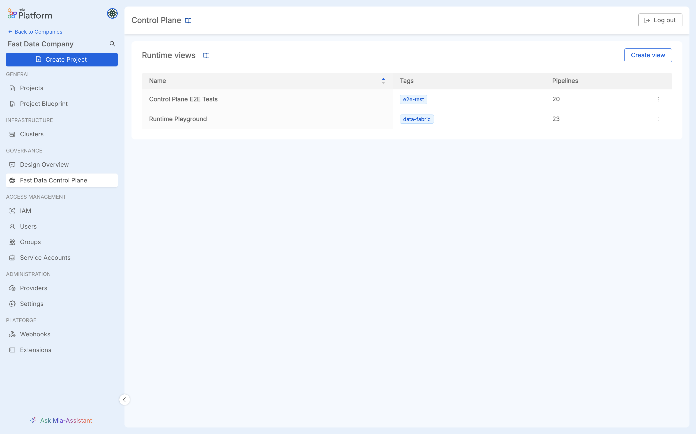

_October 10th, 2024_

## Data Catalog Application

Mia-Platform product suite is finally enriched with a new core component, the **Data Catalog** application, an essential tool for performing Data Discovery and Data Governance on your Company data assets.

Mia-Platform Data Catalog serves as a centralized repository of metadata that provides a clear and detailed overview of the Company data assets, reducing time for Data Discovery and empowering Data Governance Teams with powerful metadata management features.

Thanks to Data Catalog, it becomes easier to provide a space for your teams to share data information and knowledge, to improve data quality thanks to custom metadata enrichment capabilities and to maintain adherence to numerous data management regulations and laws, such as GDPR in Europe.

To find out how Data Catalog works and all the benefits for your Company Data Governance, visit the [official documentation](/docs/13.x.x/data_catalog/overview)!

## Console

### Versioning management for Marketplace resources (available for Microservice Plugins and Kubernetes Custom Resources)

With this release, we introduce a new way to manage your Company Marketplace resources in the Console through versioning. Marketplace Creators can now implement a structured lifecycle management system for Plugins and Kubernetes Custom Resources, giving Console users access to all available versions of these resources.  
Users can view detailed information about each version and choose the one that best fits their configuration needs from those provided by the Creator.

This means that when selecting a versioned resource from the Marketplace, users can see all available versions and choose the one they prefer. Additionally, they will always have the option to edit the version in the details of the instantiated resource, by simply clicking on the "Change version" button available in the options menu.

We believe that this new approach to managing Marketplace resources will bring significant benefits, especially when using a feature-branch design workflow.  
If you want to discover more about the potentiality of Marketplace resource versioning and how it works, head to the [dedicated section](/docs/13.x.x/software-catalog/manage-items/overview#set-controlled-versions-for-your-marketplace-resources-and-make-them-available-to-users) inside the [Company Marketplace](/docs/13.x.x/software-catalog/manage-items/overview) documentation page.

Visit also the [Plugins](/docs/13.x.x/software-catalog/manage-items/mia-ctl/create/create-item-by-type/create_plugin) and [Custom Resources](/docs/13.x.x/software-catalog/manage-items/mia-ctl/create/create-item-by-type/create_infrastructure_resource) documentations for more information about how to correctly create and manage them.

### See the original Marketplace item in your instantiated resource and the option to Detach it

Alongside the introduction of versioning for Marketplace items, we have strengthened the link between a Marketplace item and its instance in your configuration.
Now, for Microservices and Kubernetes Custom Resources in your configuration, you can view the Marketplace item reference from which they were created.

If you prefer not to maintain this connection, you can Detach the resource by clicking on the "Detach from Marketplace" button available in the options menu of the resource's details, effectively turning it into a custom item.  

This might be useful, for instance, if you have instantiated a versioned resource (e.g., a Plugin) that contains fields specific to that version and you wish to customize it (e.g., modify the Docker image).

### Bug Fix

This version addressed the following bugs:

* we corrected a wrong behavior that happened when a change to the visibility of an extension failed;
* some failure errors during the Project Creation have been improved;
* we corrected a bug during the Project Creation that was causing failures errors to not display during the process.

## Fast Data

### Centralize the governance of your Fast Data Runtime

[**Fast Data Control Plane**](/docs/13.x.x/runtime_suite_applications/fast-data-control-plane/10_overview) application has been empowered to become the single central access point for governing the Fast Data Runtime of your entire Company.

In order to be able to keep track of the state of the different Fast Data pipelines deployed in the various runtime environments of your Fast Data Projects, it is necessary to configure and release the [Control Plane Operator](/docs/13.x.x/runtime_suite/fast-data-control-plane-operator/10_overview) plugin in each of those runtime environments.  

The main responsibilities of the operator plugin are:

* To connect to the main Control Plane application instance and register itself on it to notify of its Fast Data Runtime existence
* To gather from the Fast Data services deployed in its namespace the current state for the Fast Data Runtime
* To forward collected feedbacks to the main Control Plane instance so that user can visualize the updated state

Then, from the Control Plane UI, it is possible to group Fast Data runtime environments of your Company projects into Fast Data Runtime Views accordingly to your business requirements.

To find out how Fast Data Control Plane works and all the benefits of this Runtime Management solution, visit the [official documentation](/docs/13.x.x/fast_data/runtime_management/overview).

### Fast Data Services

#### Projection Storer

The new version `v1.3.1` of the Projection Storer service is available!

##### Improvements

- Better reactivity on grpc channel interruptions for Control Plane capabilities

## Data Catalog

### Data Catalog Agent

The new version `0.6.4` of the Data Catalog Agent template is available!

#### Deprecated

[`Mia Console` target](/docs/13.x.x/runtime_suite_templates/data-catalog-agent/configuration#mia-console) has been deprecated in favour of [`mia-open-lineage` target](/docs/13.x.x/runtime_suite_templates/data-catalog-agent/configuration#mia-openlineage) to support [Data Catalog](/docs/13.x.x/data_catalog/overview) solution.

#### Added

New Data Catalog Agent [targets](/docs/13.x.x/runtime_suite_templates/data-catalog-agent/configuration#targets) has been added:

* [`mia-open-lineage` target](/docs/13.x.x/runtime_suite_templates/data-catalog-agent/configuration#mia-openlineage) to feed data from external sources to the [Data Catalog](/docs/13.x.x/data_catalog/overview) application.

To discover more about how to configure this target, visit the [related documentation](/docs/13.x.x/runtime_suite_templates/data-catalog-agent/configuration#mia-openlineage).

## Microfrontend Composer

### Back-Kit Library

The new version `v1.5.7` of the back-kit library is available!

Refer to back-kit [changelog](/docs/13.x.x/microfrontend-composer/back-kit/changelog) for finer-grained details of new versions.

#### Bug Fix

- Fixed the possibility to use the special character '+' in the bk-expanded-filters component
- Fixed the validation of integer numbers fields in bk-form-modal component
- Fixed conversion of boolean fields in csv export

## Marketplace

### Marketplace Updates

#### Appointment Manager

The new version `2.4.0` of the Appointment Manager is available!

* Node.js has been updated to v20 (LTS)

##### New features

* Add configuration option `isNotificationManagerAsync` that allows to send Notification Manager notification asynchronously

#### Care Kit

The new version `2.8.5` of the Care Kit library is available!

##### New features

* Added timeline settings component
* Added timeline component
* Added Report Collapsable card in `ck-patient-dashboard`
* Added `ck-medical-records`
* Added Patient Last Detection card
* Added Patient Data card
* Added Patient Appointment card
* Added Patient Clinical Diary card
* Added Patient Device card
* Added Patient Dashboard
* Added Patient Monitoring card

##### Bug Fix

* Fix style dashboard

#### O3 DICOM Service

The new version `0.1.5` of the O3 DICOM Service is available!

* Node.js has been updated to v20 (LTS)

##### Bug Fix

* Add SQL injection mitigation on `GET /exams` endpoint

#### Teleconsultation Service Backend

The new version `1.8.0` of the Teleconsultation Service Backend is available!

* Node.js has been updated to v20 (LTS)

##### New features

* Add optional environment variable `CUSTOM_ID_USERS_API_ENDPOINT` to allow custom user ids for teleconsultation participants

#### Therapy and Monitoring Manager

The new version `0.4.0` of the Therapy and Monitoring Manager is available!

* Node.js has been updated to v20 (LTS)

##### New features

* Add `assignedDevices` field to monitorings CRUD collection
* Add `deviceId` field to detections CRUD collection
* Add `PROTOTYPES_SERVICE_URL` env var to fetch prototypes from an external HTTP service
* Add `POST /detections/bulk` endpoint to create multiple detections
* Add `POST /detections/chart-data` endpoint to get data in a format suitable for rendering with `ck-chart` Care Kit component

##### Bug Fix

* Fixed compatibility issue with CRUD Service v6.9.0 or later causing CRUD `GET /export` endpoint to return data in JSON format instead of NDJSON with default HTTP client headers

#### CRUD Service

The new version `7.2.0` of the CRUD Service is available!

##### New Features

* Added support for Arrays of ObjectIds at root level 
* Added support for the mongo operator `size` in the `_q` parameter for fields of type `array`.

##### Bug Fixes

* Enabled bom stripping when importing CSV files
* Changed CSV _escape_ character to align it with CSV field _quote_ character, as recommended by [RFC 4180](https://datatracker.ietf.org/doc/html/rfc4180)

## How to update your Console

For self-hosted installations, please head to the [self hosted upgrade guide](/docs/13.x.x/infrastructure/self-hosted/installation-chart/how-to-upgrade) or contact your Mia-Platform referent and upgrade to _Console Helm Chart_ `v13.7.3`.
