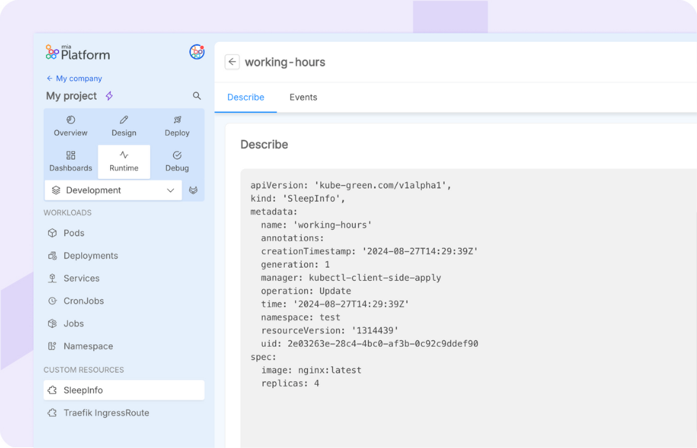
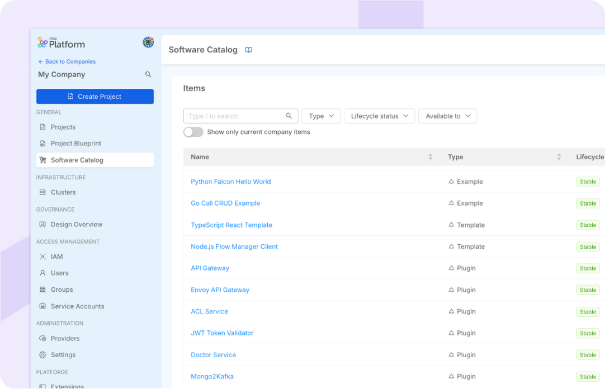
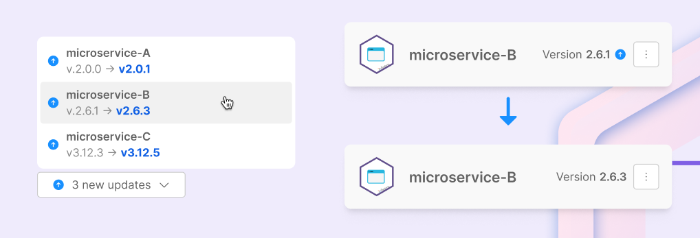

export const Highlight = ({children, color}) => (
  
    {children}
  
);

_November 18th, 2024_

## Support to all Infrastructure Resources in Design

With this release, we are excited to introduce the ability to manage infrastructure provisioning by configuring your Infrastructure Resources at the Design level.
A new "Infrastructure" section has been added within the Design of your Console, fully dedicated to Infrastructure as Code!

For more information, please visit the [documentation page](/docs/13.x.x/console/design-your-projects/custom-resources) and explore some helpful [use cases](/docs/13.x.x/console/design-your-projects/custom-resources-use-cases).

## Support to Infrastructure Kubernetes Resources in the Runtime area 

With the v13.3.0 it is now possible to monitor directly in the Runtime area all the Custom Resources deployed for your project, on each environment on it.

For each resource you will be able to access its detail where you will see the respective Describe and Events that are generated, similarly to the other resources in the Runtime Area.

To discover more, please refer to the [documentation](/docs/13.x.x/console/design-your-projects/custom-resources).

## Introducing the Mia-Platform Software Catalog

The Mia-Platform Software Catalog offers a centralized solution for tracking, managing, and documenting software resources across the company. It provides visibility into software ownership, metadata, lifecycle status, and versions, helping teams ensure accountability and avoid duplication of efforts.

For more information and to see the currently supported resources, please refer to the [documentation](/docs/13.x.x/software-catalog/overview) for detailed insights on the Software Catalog.

## View version updates of Marketplace resources in your configuration

From this release, you will be able to see, within your configuration, your Marketplace resources that have a new version update available.  
This will allow you to be notified and keep your resources updated easily and frictionlessly!

## Add External Links in Console with the Extensibility manager

We have enhanced our Platforge extensibility kit by adding external links among the supported extensions. You can now add this type of link in the sidebar from the Extension Manager in Console.

For more information about Console Extensions, please visit the related [documentation page](/docs/13.x.x/console/company-configuration/extensions).

## Extend Mia-Platform Console pages using Microfrontend Composer <Highlight color="#e5c762">BETA</Highlight>

With a view to further enhancing our Platforge toolkit dedicated to Console extensibility, we also introduced the possibility of composing Console pages using the Microfrontend Composer. 
To do this, all you have to do is go to the Extensions manager at Company level, add an extension by selecting the ‘Create with Composer’ option and start customizing the new section you want to add!

Please note that this feature has now been released in Beta. To discover more, refer to the [Extensions documentation](/docs/13.x.x/console/company-configuration/extensions).

## Support for Repository Creation in Infrastructure Resources

For Infrastructure Resources that have an associated repository defined in their template, the Console now fully supports the repository creation step.

## Console

### Improvements

#### Performance improvements

Console now features [Rönd](https://github.com/rond-authz/rond) [v1.13](https://github.com/rond-authz/rond/releases/tag/v1.13.0) which provided a significant performance boost!

#### New Flow Manager Configurator look

We have refreshed the look of the Flow Manager Configurator with updated graphics, new colors, and several design improvements to enhance the overall user experience and visual appeal.

#### Annotations & Labels Suggestions

The Console now suggests previously used Annotations & Labels when adding them to a Microservice, speeding up the process and reducing the chance of errors.

### Bug Fix

This version addressed the following bugs:

* We fixed a bug where the Design configuration wasn't displayed correctly if saved via shortcut before fully loading;
* The english translation of some validation error messages in Console has been revised

## Fast Data

### Fast Data Services

#### Projection Storer

The new version `1.3.2` of the Projection Storer service is available!

##### Improvements

* Introduced the support for connecting to the storage using TLS/SSL connection. For more information about how to configure it, visit the related SSL connection [documentation](/fast_data/configuration/projection_storer_config#ssl-connection)

## Data Catalog

### Data Catalog Application

The services of [Data Catalog Application](/docs/13.x.x/data_catalog/frontend/overview) have been updated to improve _advanced search_ performances and the overall user experience across Data Catalog UI.  
The latest services versions are reported [here](/docs/13.x.x/data_catalog/data_catalog_compatibility_matrix#service-latest-versions).  

#### Introduction of Fabric Sync cronjob

As reported in the [Migration Guides](/docs/13.x.x/data_catalog/data_catalog_open_lineage#migration-guides) paragraph of [Data Catalog Open Lineage](/docs/13.x.x/data_catalog/data_catalog_open_lineage) service, when upgrading from `v0.1.0` to `v0.1.1`, it is necessary to configure the Fabric Sync cronjob, which is responsible to keep synchronized the information displayed on Data Catalog application with the collection of datasets imported by Data Catalog Agent.

For more information about how to configure and trigger the Fabric Sync, please follow the [related documentation](/docs/13.x.x/data_catalog/data_catalog_job_runner).

## Microfrontend Composer

### Back-Kit Library

The new version `v1.5.9` of the back-kit library is available!

Refer to back-kit [changelog](/docs/13.x.x/microfrontend-composer/back-kit/changelog) for finer-grained details of new versions.

#### Improvements

##### New keyword to get the current time

It is now possible to add new key `$dateNow` in handlebars to retrieve current date time in ISO format in http requests.

## Marketplace

### Marketplace Updates

#### Teleconsultation Service

A new major version of the Teleconsultation Service - both frontend and backend - is out!

The Teleconsultation Service `v2.0.0` is officially available from October 1st, 2024 and supports the new version of the Kaleyra API (v2).

The end of life for Kaleyra API v1 is October 31st, 2024, so after that date all `v1.x.x` versions will stop working.

##### Breaking Changes

- If no company theme or logo is specified in the service configuration, no default is set and therefore no update is performed when service starts
- Endpoint `POST /teleconsultation/:roomId/participants/data` has been deleted

#### Appointment Manager

The new version `2.5.0` of the Appointment Manager is available!

In this minor version we have resolved an issue where an availability slot was incorrectly blocked if it started immediately after an exception period. Previously, if the start time of the next available slot matched the end time of the exception, the system would erroneously block that slot, even though it was intended to be available. This has now been fixed, and availability will be correctly displayed in such cases.

The fix automatically truncates start and end date to the second, so, if you are encoutering this issue, please update the affected exceptions after upgrading to `v2.5.0`.

#### Form Service BE

The new version `2.1.0` of the Form Service Backend is available!

In this minor version, we’ve added a new feature to the `FormModal` component. Now, the title can be passed as a prop, just like the message. This update offers greater flexibility for customizing modal titles based on specific needs. Moreover, we upgraded some dependencies, including Node.js to v20 and the `custom-plugin-lib` to v6.

## How to update your Console

For self-hosted installations, please head to the [self hosted upgrade guide](/docs/13.x.x/infrastructure/self-hosted/installation-chart/how-to-upgrade) or contact your Mia-Platform referent and upgrade to _Console Helm Chart_ `v13.7.5`.

