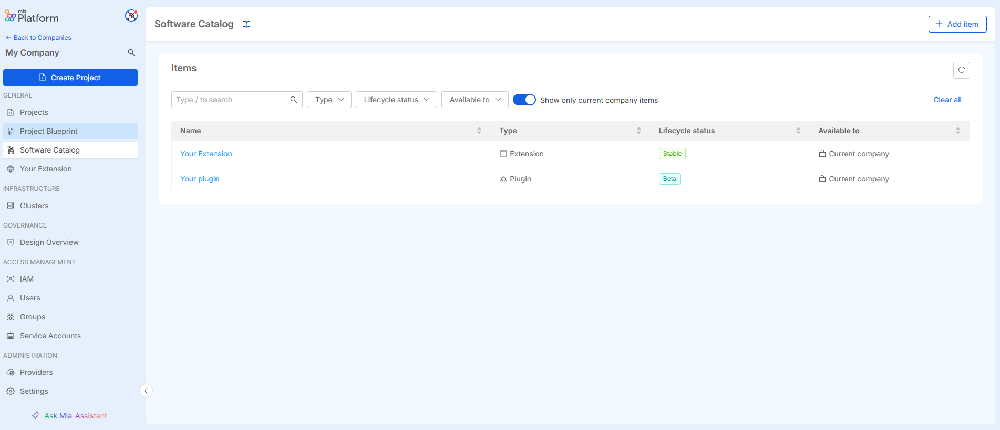

_December 05th, 2024_

## Manage your resources from Mia-Platform Software Catalog

In this release, we’ve enhanced the Software Catalog section with new features to improve resource management. Users can now create new items, as well as create new versions for items that support versioning, directly from the Console UI. Additionally, we’ve introduced the possibility to delete both individual items and their versions, offering more flexibility in managing resources within the Catalog. 

For more details, please refer to [the documentation](/docs/13.7.5/software-catalog/manage-items/software-catalog-ui/ui).

## Create versions for your Microservice Templates & Examples

You can now create and manage versions for Microservice Templates and Examples, enabling structured lifecycle management for these resource types as well.  
Users can easily view and instantiate Templates and Examples at a specific version within their configuration.

## Configuration Saved webhook

We have introduced the **Configuration Saved** webhook, which is triggered whenever the configuration for a Project is saved.  
You can easily enable it from the dedicated Webhook section in Console.

## Specificy the Rate limit for Endpoints' subroutes

For configurations using [Envoy API Gateway](/docs/13.7.5/runtime_suite/envoy-api-gateway/overview), you can now specify the rate limits for the subroutes of your Endpoints.  
This will allow for more granular control over rate limiting at the subroute level.

## Fine-Grained Access Control in Design section

:::info
This feature is currently available as a **Closed Preview**.  
For more information, head to the related [documentation page](/docs/13.7.5/development_suite/api-console/api-design/fine-grained-access-control) and contact your Mia-Platform referent to learn how to enable it.
:::

We have introduced a mechanism to restrict user actions in the Design section based on roles and predefined rules.   
Users with sufficient permissions can define granular rules to control access to specific actions, enhancing governance and security across Projects.
In this way, if a user attempts to perform a restricted action and save a configuration that violates such rules, the system will block the action and return an error message.

## Console

### Improvements

#### Monitoring of the Infrastructure Resources created from scratch

It is now possible, using the dedicated interface in the Design area, to define the parameters required to monitor an infrastructure resource created from scratch from the runtime area.

#### Changes to Extensions are shown immediately in the Console sidebar

We have improved the experience on managing the Extensions, making any changes made by the user immediately visible in the sidebar, with no need to manually refresh the page anymore.

#### Identities search case insensitive

We have enhanced the experience when searching for specific identities (Users, Service Accounts, Groups) within the Access Management section, making the search case insensitive.

### Bug Fix

This version addressed the following bugs:

* fixed a bug that made it impossible to change the type of a microservice environment variable from ‘Downward API’ to ‘Plain’;
* fixed a bug that made impossible to create a template without Kustomize
* fixed a bug that caused a wrong display of a company's cluster list has been corrected;
* fixed an issue that caused infinite loading on refresh of the History section in the Deploy area;
* fixed a bug in Flow Manager configurator that forbade having events with the same name even if they were issued by different states.

## Fast Data

### Fast Data Services

#### Projection Storer

The new version `v1.3.4` of the _Projection Storer_ is available!

#### Bug Fix

This version addressed a few bugs, here is a comprehensive list:

* following the upgrade of GraalJS version, insufficient permissions on the service image prevented the initialization of GraalVM cache and therefore the execution of any custom cast function. Now they can be properly executed again.
* the logic of provided cast function `castToDate` has been overhauled, so that dates represented as Unix timestamp in millisecond that ranges between `-2147483648` (`1969-12-07T03:28:36.352Z`) and `2147483647` (`1970-01-25T20:31:23.647Z`) are now properly converted into their expected date.

For more information check out the service [changelog](/docs/13.7.5/runtime_suite/projection-storer/changelog).

## Microfrontend Composer

### Configurator

#### Improvements

##### Support for compose page options configuration

From the applications modal it is now possible to configure the [`fetchConfigOnMount option`](https://micro-lc.io/docs/guides/applications/compose#fetchconfigonmount) to instruct micro-lc to retrieve the application configuration at each mount.

### Back-Kit Library

The new version `v1.5.10` of the back-kit library is available!

Refer to back-kit [changelog](/docs/13.7.5/microfrontend-composer/back-kit/changelog) for finer-grained details of new versions.

#### Improvements

##### New format for dates

By specifying `format: date` or `format: time` and adding the flag `isPartialFormat` to true in `formOptions` it is now possible to use dates and time as simple strings and not ISO format.

#### Bug Fix

- Fixed query for writable views' lookup
- fixed typo in italian label on export/import delimiter option

## Marketplace

### Marketplace Updates

#### Audit Trail

The first version of the Audit Trail sidecar is available now!

This sidecar allows you to collect audit logs from your microservice through a shared log file and sends them to Kafka after being processed and enriched with metadata.

Check the [Audit Trail sidecar documentation](/docs/13.7.5/runtime_suite/audit-trail/overview) for additional information about architecture, configuration and usage.

#### Care Kit

A new version `2.9.1` of Care Kit is out!

The new version includes upgrade to Node.js (now using v20) and several dependencies, plus some fixes to the existing components `ck-threshold-modal` and `add-plan-modal`. The first version of a new component `roles-and-permissions-modal` to manage roles and permissions is also introduced. 

#### FHIR Adapter

A new patch version `1.0.4` of the FHIR Adapter is out!

This version includes important updates to Node.js (now using v20) and its dependencies.

#### Form Service

A new minor version `2.1.0` of the Form Service Frontend is out!

This version introduces the ability to customize the title of the expired modal, plus brings important upgrades to its dependencies.

#### Messaging Service

The new version `1.7.1` of the Messaging Service is out!

In this release we replace automatically newline escape sequences (`\n`, `\n\r`, `\r` and `\r\n`) with  the ` ` tag in HTML email messages.

#### Notification Manager

The new version `2.4.1` of the Notification Manager is out!

This version introduces a streamlined way to display all the notification messages sent on a Backoffice page. By leveraging a MongoDB view, all the most common Backoffice features and components (table, filters and pagination) are supported out of the box.

Also, a bug has been fixed that caused notification settings to be not merged correctly when the `rule` field was not set.

#### Teleconsultation Service

The new version `2.0.1` of the Teleconsultation Service - both Backend and Frontend - is out!

This patch version includes improvements and fixes to the documentation, default security policies and UI copies.

#### Therapy and Monitoring Manager

The new version `0.5.1` of the Therapy and Monitoring Manager is out!

This minor version brings some dependency updates, plus some fixes and improvements in the integrated threshold validation, in particular now the validation results are stored alongside the detection.
Also, a new `values` field is available in the prototypes to map a human-readable name of a detection property to the object path where the corresponding value is stored, such allowing to have nested or array fields in the detection schema while keeping a more human-friendly property name to display to the user.

#### Auth0 Client - 3.7.1

This patch includes a fix to logout redirect when query parameters are set in the redirect path.

#### Auth0 Client - 3.7.0

The version `3.7.0` of the Auth0 Client is now available, adding the support for TLS connections with Redis.

#### HTTP proxy manager

The new version `3.1.0` comes with a security fix which redacts sensitive headers in logs and with the new environment variable `ADDITIONAL_HEADERS_TO_REDACT` to specify additional sensitive headers to be redacted.

## How to update your Console

For self-hosted installations, please head to the [self hosted upgrade guide](/docs/13.7.5/infrastructure/self-hosted/installation-chart/how-to-upgrade) or contact your Mia-Platform referent and upgrade to _Console Helm Chart_ `v13.8.1`.
