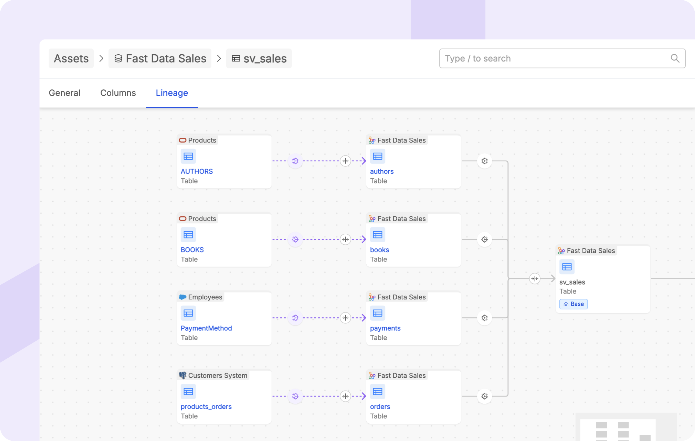
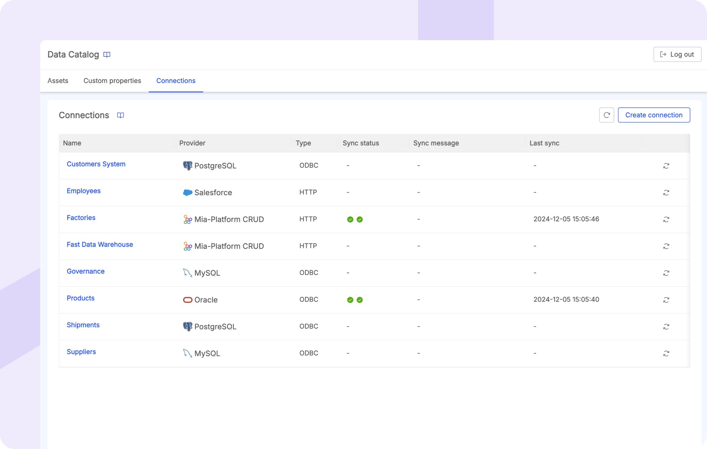
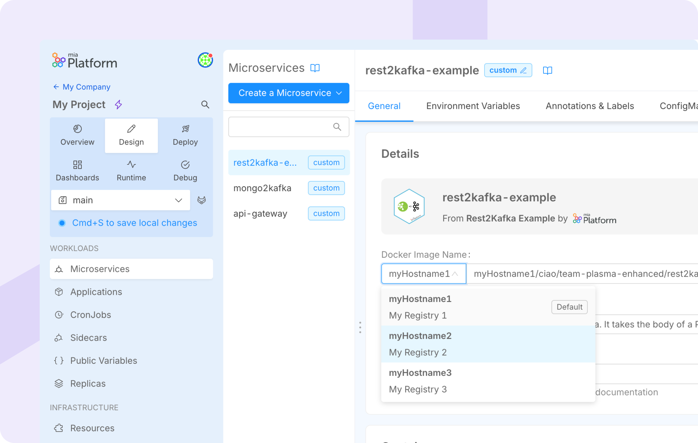
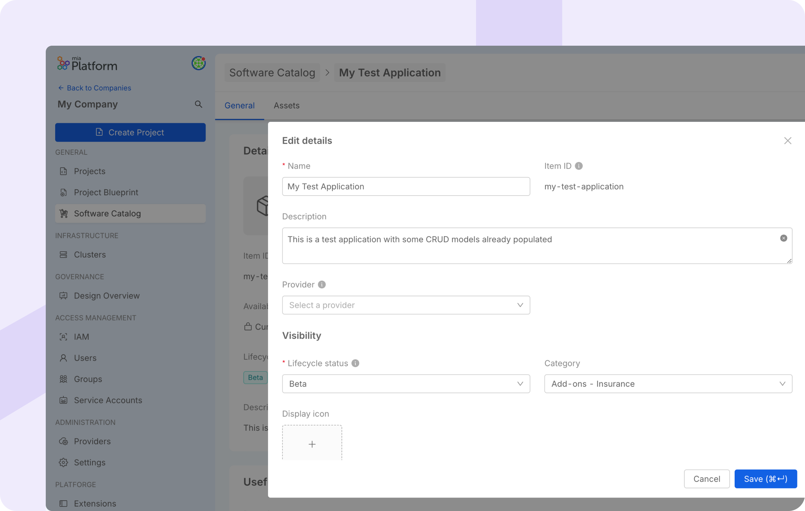

_December 19th, 2024_

## Data Lineage

Mia-Platform Data Catalog introduces the [Data Lineage](/docs/13.x.x/data_catalog/frontend/data_lineage), a powerful tool for understanding, visualizing, and describing the flow and transformations of data within an organization.  

This feature allows users to explore data relationships at two levels: **Table Lineage** and **System of Record (SoR) Lineage**, offering both detailed insights and a high-level overview. 

At the [Table-Level Lineage](/docs/13.x.x/data_catalog/frontend/data_lineage#table-level-lineage), users can dive into the interconnections between individual tables, visualizing data flows and the transformations applied along the way. Users can also enrich the lineage with virtual assets and jobs, useful to complete relationships that have not yet been automatically retrieved, ensuring that context and purpose of data flows are thoroughly captured and properly described.  
The [SoR-Level Lineage](/docs/13.x.x/data_catalog/frontend/data_lineage#system-of-record-level-lineage) shows an aggregated view of data flows across Systems of Records, simplifying the identification of dependencies and bottlenecks at a broader scale, and clarifying how various systems interact within the organization.

If you are using [Fast Data Control Plane](/fast_data/runtime_management/overview), the aggregation processes configured in your Fast Data Projects can be automatically captured in the Data Lineage, making Fast Data jobs visible on the Lineage canvas. To know more about how to acquire information from the Fast Data pipelines, visit the [related documentation](/docs/13.x.x/data_catalog/data_catalog_job_runner#fast-data-jobs-sync).

## Connections Management in Data Catalog Application

The [Connections Management](/docs/13.x.x/data_catalog/frontend/data_catalog_connections) feature in Mia-Platform Data Catalog enables users to retrieve and leverage metadata from [various supported providers](/docs/13.x.x/data_catalog/frontend/data_catalog_connections#connection-providers), supporting critical operations such as [Asset Discovery](/docs/13.x.x/data_catalog/frontend/data_catalog_assets) and [Lineage Analysis](/docs/13.x.x/data_catalog/frontend/data_lineage).  

Through the Connections Panel, users can manage the lifecycle of connections, from creation to deletion, and having access to a detailed overview of all configured connections.  
Once a connection is established, assets can be imported directly into the Data Catalog using the Data Catalog Sync feature. To know more about the processes to update the state of the Data Catalog solution, visit the [following documentation](/docs/13.x.x/data_catalog/data_catalog_job_runner#available-jobs).

## Centralized management of the Container Registries 

Gain more control over your container registries in your Projects! You can now easily manage and monitor them directly within your Project settings, where you can view, create, and delete them according to your purposes. 
This update enables centralized monitoring and control of your registries, and allows you to specify the desired registry at the service level in the Design area.

For more details, please refer to [the documentation](/docs/13.x.x/console/project-configuration/project-settings#container-registries)

## Enhanced Item Management: Edit Items in Mia-Platform Software Catalog

In this release, we’ve introduced the ability to edit items in the Software Catalog, providing more flexibility in resource management. Non-versioned items can now be fully edited, allowing users to modify all aspects of the item. For versioned items, only the metadata can be edited, while any changes to the resources will still require creating a new version.

For more details, please refer to [the documentation](/docs/13.x.x/software-catalog/manage-items/software-catalog-ui/update/overview)

## Introducing Snapshot Comparison through the history modal 

Easily track changes to your configurations! Now you can compare any two snapshots side-by-side with our new visual comparison tool. Just head to the history modal and select the snapshots you want to analyze.

For more details, please refer to [the documentation](/docs/13.x.x/development_suite/set-up-infrastructure/revisions-and-versions)

## Console

### Improvements

#### Allowing Secret key interpolation during the creation of an env variable from secret

It is now possible to use public variables to interpolate the "Secret key" field when creating new environment variables "From Secret" on a microservice. This enhancement provides greater flexibility and automation when working with secrets, especially for complex deployments where secret keys might vary across environments.

#### Infrastructure Resource

The 'resourceId' of marketplace resources can now be modified after detachment, providing increased flexibility for resource organization at Runtime level.

### Bug Fix

This version addressed the following bugs:

* fixed an issue where service/resource management badges were unavailable after a marketplace plugin/custom resource connection failed ;
* fixed an issue where release notes for the current version of an instantiated resource were not displayed initially in the change version modal.

## Fast Data

### Fast Data Runtime Management

The Fast Data Control Plane application has been updated to support the integration with Mia-Platform Data Catalog application for the [Data Lineage](#data-lineage) feature.  
For more information, visit the [compatibility matrix documentation page](/docs/13.x.x/fast_data/runtime_management/compatibility_matrix#service-latest-versions) with reported the latest service versions.

## Microfrontend Composer

### Back-Kit Library

The new version `v1.5.11` of the back-kit library is available!

Refer to back-kit [changelog](/docs/13.x.x/microfrontend-composer/back-kit/changelog) for finer-grained details of new versions.

#### Bug Fix

* Fixed bk-table height when inside bk-layout-swap

## Marketplace

### New Marketplace Components

#### CRUD SQL plugin for Oracle DB

The CRUD SQL service now supports Oracle DB. You can easily integrate with an Oracle database and expose CRUD operations through HTTP with this plugin.
You can find more information on the plugin [here](/docs/13.x.x/runtime_suite/crud-sql/10_overview).

### Marketplace Updates

#### Care Kit

A new version `2.9.2` of Care Kit is out!

The new version bring some fixes to the following components:

- `ck-patient-dashboard`: Italian localization is now available
- `ck-threshold-modal`: fixed a concurrency bug causing the component to show outdated thresholds  

#### Chat Service Backend

A new version `1.0.2` of Chat Service Backend is available!

This version upgrades Node.js to v20 and fixes some documentation links.

#### Notification Manager

A new version `2.4.2` of Notification Manager is available!

This version fixes a bug causing reminders not aborted correctly when an appointment was updated or deleted. 

#### Swagger Aggregator

##### Bug Fix

From Swagger Aggregator version `3.8.2`, the `oauthFlows.password.tokenUrl` format has changed from `uri` to `uri-reference` in the OpenApi 3.1 schema

#### Teleconsultation Service Frontend

A new version `2.0.2` of the Teleconsultation Service Frontend is available!

This version fixes a bug causing the UI language not matching sometimes the browser language.

#### User Manager Service

A new version `1.5.2` of the User Manager Service is available!

This version upgrades Node.js to v20 and several dependencies, including `custom-plugin-lib` to v6.

## How to update your Console

For self-hosted installations, please head to the [self hosted upgrade guide](/docs/13.x.x/infrastructure/self-hosted/installation-chart/how-to-upgrade) or contact your Mia-Platform referent and upgrade to _Console Helm Chart_ `v13.9.1`.
