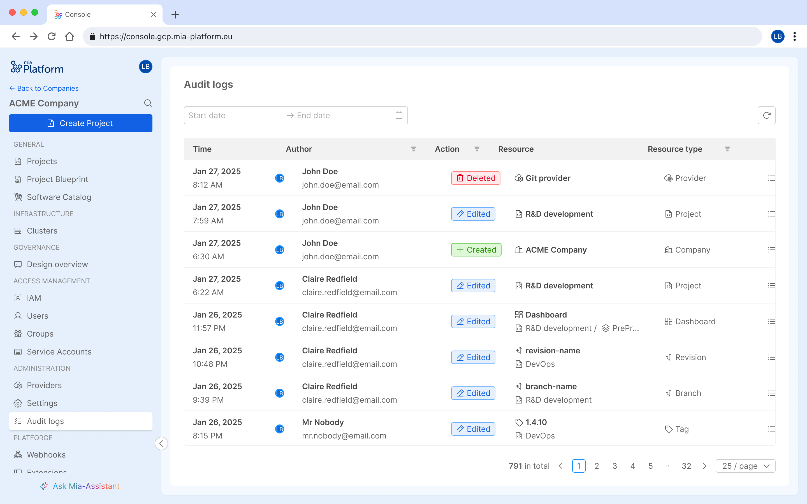

_April 03rd, 2025_

## Monitor Audit Logs of your Company

The new **Audit Logs** feature is now available, providing a powerful tool to effortlessly monitor all activities within your Company!

For more details, check out the [Audit Logs documentation](/docs/13.x.x/development_suite/identity-and-access-management/monitor-audit-logs).

To enable this feature in self-hosted installations check out the dedicated section in the [self hosted upgrade guide](/docs/13.x.x/infrastructure/self-hosted/installation-chart/how-to-upgrade#upgrade-from-v1362-to-v1370).

## Console

### Bug Fix

This version address the following bugs:

* A bug causing the graphical display of the Runtime section for Infrastructure Resources to malfunction has been resolved;
* We have resolved a bug that prevented the correct display of the 'Documentation' tab in Endpoints settings when using API Portal v2;
* We resolved a bug where the securityInfo of an endpoint was not added when a single subroute of that endpoint was exposed.

## Fast Data

### Fast Data Services

#### Single View Creator

The new versions `v6.8.1` of the _Single View Creator - MongoDB_ and _Single View Creator - Kafka_ are available!

##### Fixed

- When performing aggregation, the service now correctly handles ER-schemas that contain a condition with a `NULL` equality

For more information check out the service [changelog](/docs/13.x.x/runtime_suite/single-view-creator/changelog).

## Marketplace

### New Marketplace Components

#### Integration Connector Agent plugin

The **Integration Connector Agent** plugin enables seamless integration between external data sources and sinks. It collects data from sources like **Mia-Platform Console** and **Jira**, processes it, and sends it to sinks such as **MongoDB**.  
This can be particularly useful for centralized storage, data synchronization, and transformation, improving data accessibility across platforms and streamlining workflows for more effective reporting and decision-making.  
The Integration Connector Agent is currently available in **BETA** (v0.2.0).

To learn more about all the features and how to configure it, visit the [official documentation](/docs/13.x.x/runtime_suite/integration-connector-agent/overview).

### Marketplace Updates

#### CRUD Service

The new version `7.2.3` of the CRUD Service is available!

##### Changed

* overhauled Mongo view update logic to avoid requesting [`dropCollection`](https://www.mongodb.com/docs/manual/reference/privilege-actions/#mongodb-authaction-dropCollection) privilege action
* introduce abort controller to NodeJS stream pipeline to ensure the pipeline object is cleaned up when the response stream is destroyed

##### Fixed

* prevent a memory leak the service was experiencing when it was not able to fulfill incoming requests
* corrected a typo in option `maxIdleTimeMS` within Mongo client configuration, which prevented the environment variable `MONGODB_MAX_IDLE_TIME_MS` to take effect

## How to update your Console

For self-hosted installations, please head to the [self hosted upgrade guide](/docs/13.x.x/infrastructure/self-hosted/installation-chart/how-to-upgrade) or contact your Mia-Platform referent and upgrade to _Console Helm Chart_ `v14.0.1`.

