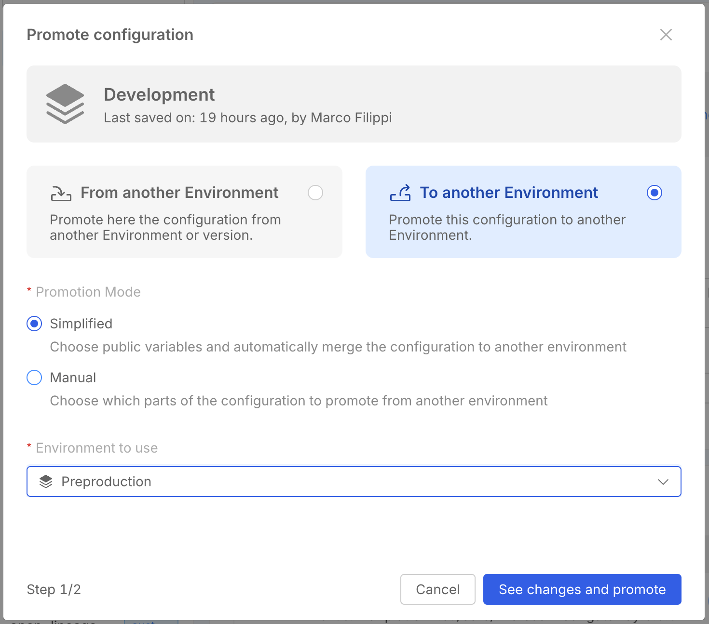

import Accordion from '@site/src/components/Accordion/index.js';
import dataAccordion from '@site/src/config/release-notes/release-note-v14-0-1.json';

_June 26th, 2025_

## Simplified Promotion flow

In a Environment Based Project, you can now decide to promote an environment with the Simplified mode, in order to speed up your flow.
When this mode is selected, once the Public variables have been chosen, the changes of the chosen Environment will be directly applied in the target Environment.

To discover more about Environment Configuration Promotion and the Simplified mode, head to the related [documentation page](/docs/products/console/set-up-infrastructure/env-based-management#simplified-mode).

## Other New Features, Improvements and Bug Fixes

<Accordion data={dataAccordion} />

## How to update your Console

For self-hosted installations, please head to the [self hosted upgrade guide](/docs/infrastructure/self-hosted/installation-chart/how-to-upgrade) or contact your Mia-Platform referent and upgrade to _Console Helm Chart_ `v14.2.2`.
