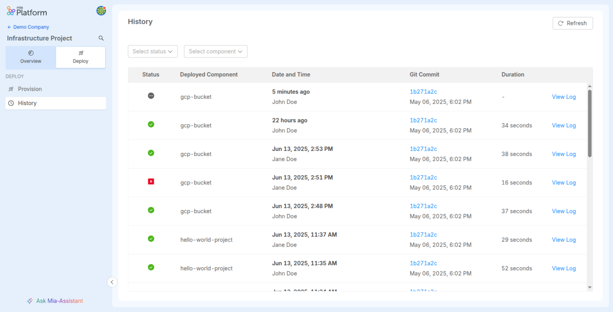

import Accordion from '@site/src/components/Accordion/index.js';
import dataAccordion from '@site/src/config/release-notes/release-note-v14-0-2.json';

_July 10th, 2025_

## Deploy History for Infrastructure Projects

From now on, Deploy history is available for Infrastructure Projects as well. You can track past deploys of your infrastructure components directly in the Deploy section, with full visibility into status, deployed component name, date & time, git commit ID, duration, and access to logs.

For more information, visit the [Infrastructure Projects documentation page](/docs/products/console/project-configuration/infrastructure-project#deploy-history)

## Other New Features, Improvements and Bug Fixes

<Accordion data={dataAccordion} />

## How to update your Console

For self-hosted installations, please head to the [self hosted upgrade guide](/docs/infrastructure/self-hosted/installation-chart/how-to-upgrade) or contact your Mia-Platform referent and upgrade to _Console Helm Chart_ `v14.2.3`.
