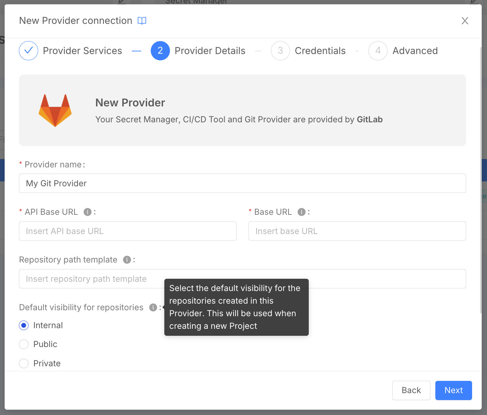

import Accordion from '@site/src/components/Accordion/index.js';
import dataAccordion from '@site/src/config/release-notes/release-note-v14-0-3.json';

_July 24th, 2025_

## Specify default Git Provider visibility for Project creation

For a Git Provider, you can now select the default visibility for the repositories created in such Provider. This will be inherited when creating a new Project.

## Other New Features, Improvements and Bug Fixes

<Accordion data={dataAccordion} />

## How to update your Console

For self-hosted installations, please head to the [self hosted upgrade guide](/docs/infrastructure/self-hosted/installation-chart/how-to-upgrade) or contact your Mia-Platform referent and upgrade to _Console Helm Chart_ `v14.2.4`.
