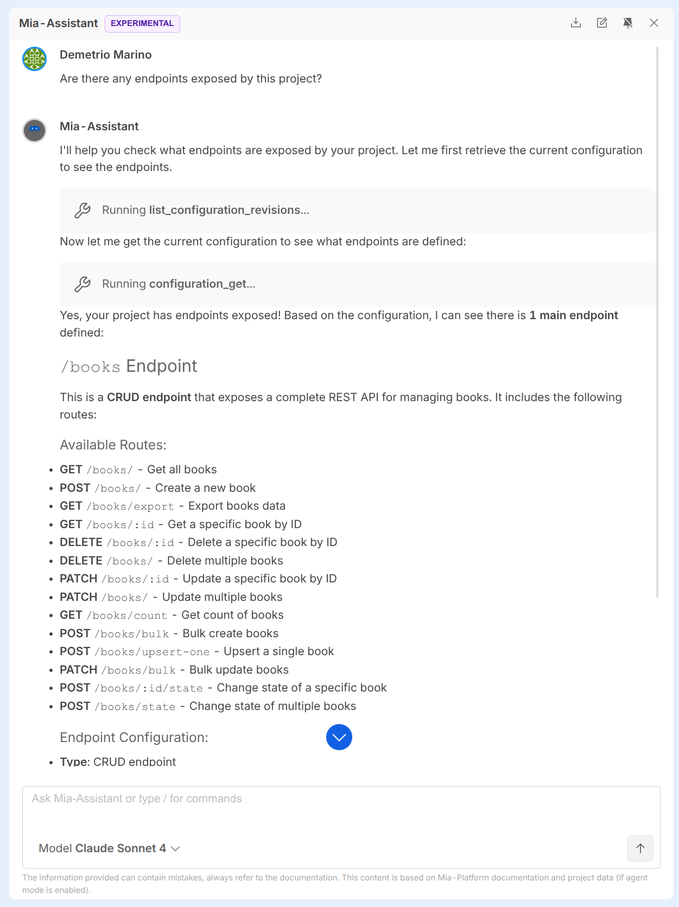
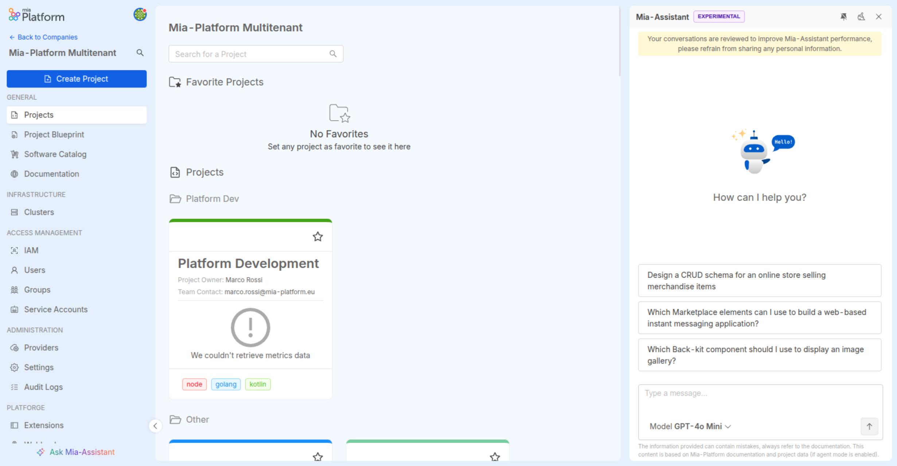
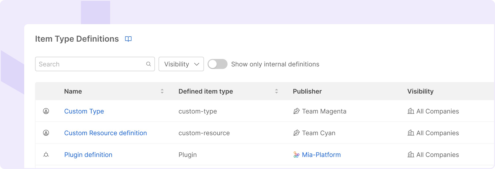

import Accordion from '@site/src/components/Accordion/index.js';
import dataAccordion from '@site/src/config/release-notes/release-note-v14-1-0.json';

_September 4th, 2025_

## Mia-Assistant gets smarter with real-time Console data via Console MCP Server

Mia-Assistant is now a fully operational agent that uses the [Mia-Platform Console MCP Server](https://github.com/mia-platform/console-mcp-server) to access the Console APIs. This enables to retrieve information about your Company, check the Marketplace, debug your services, fix problems, and automatically perform deployments, all simply by chatting.

As always, it will continue to be your helpful assistant, explaining concepts and planning strategies based on best practices and examples from the official documentation.

To discover more, visit the [Mia-Assistant documentation page](/docs/14.2.1/products/console/assistant/overview).

## Pin Mia-Assistant for Constant Support

You can now pin the Mia-Assistant chat to keep it open while you work in the Console. This allows you to interact with the AI without interrupting your workflow, making it a constant companion ready to support you throughout your daily tasks.

In addition, we have improved the visualization of Mia-Assistant's responses with better spacing and formatting. You can also download the conversation to review it at your leisure.

## Custom Item Type Definition Support in the Software Catalog

The Software Catalog now supports the definition and registration of custom item types, extending the system beyond the predefined ones.

Custom items can be cataloged and organized like any other item, making them part of the unified catalog experience. At this stage, these items are not available in the Design section of the Console and cannot be instantiated via the UI. Deployment or instantiation flows must be managed externally.
This unlocks greater flexibility in modeling and documenting internal tools, components, or processes within a consistent and centralized catalog.

For more details, see the [documentation](/docs/14.2.1/products/software-catalog/basic-concepts/items-types).

## Download the transcript of conversations with Mia-Assistant

From now on you can export your conversations with Mia-Assistant by simply clicking on a button in the chatbot.

Your conversations will be downloaded in a **.txt** file.

## Other New Features, Improvements and Bug Fixes

<Accordion data={dataAccordion} />

## How to update your Console

For self-hosted installations, please head to the [self hosted upgrade guide](/docs/14.2.1/infrastructure/self-hosted/installation-chart/how-to-upgrade) or contact your Mia-Platform referent and upgrade to _Console Helm Chart_ `v15.0.0`.
