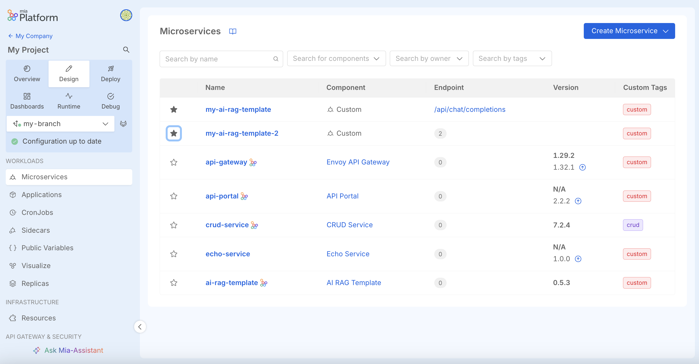

import Accordion from '@site/src/components/Accordion/index.js';
import dataAccordion from '@site/src/config/release-notes/release-note-v14-2-1.json';

_October 2nd, 2025_

## New Microservice experience as a Feature Preview

We’ve introduced a **new tabular view** for Microservices, designed to make navigation between resources more intuitive.
From this view, you can quickly see any **related endpoints**, mark Microservices as **favorites**, add **multiple custom tags**, and then filter by them to better organize your workflows.

You can enable this new experience from the Feature Preview tab on the Settings section of your Project.

## Export conversations with Mia-Assistant in PDF format

Conversations with **Mia-Assistant** can now be exported also in **PDF format**, in addition to the traditional `.txt`.
You only need to click on the format you prefer from the download button available on the top of the Mia-Assistant chatbot.
This makes it easier to choose the better option to archive, share, and review your assistant interactions whenever you need.

## Other New Features, Improvements and Bug Fixes

<Accordion data={dataAccordion} />

## How to update your Console

For self-hosted installations, please head to the [self hosted upgrade guide](/docs/infrastructure/self-hosted/installation-chart/how-to-upgrade) or contact your Mia-Platform referent and upgrade to _Console Helm Chart_ `v15.0.2`.
