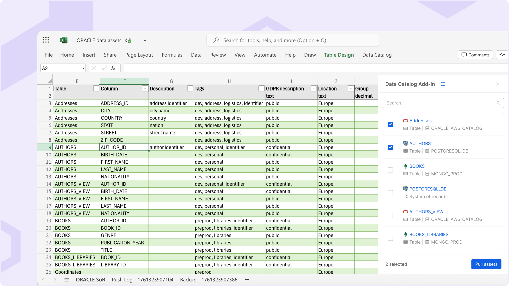

import Accordion from '@site/src/components/Accordion/index.js';
import dataAccordion from '@site/src/config/release-notes/release-note-v14-4-0.json';

_November 27th, 2025_

## Data Catalog Excel Add-in

The **Data Catalog Excel Add-in** seamlessly integrates with the Mia-Platform Data Catalog, enabling users to import asset metadata into Excel, perform bulk metadata enrichment into Excel spreadsheet, and synchronize updates back to the Catalog.  
This powerful add-in bridges the gap between Excel and the Data Catalog, simplifying large-scale metadata management while ensuring data quality and governance standards are maintained through pre-push validation and automatic error logging.

Discover all the benefits and capabilities of Data Catalog Excel Add-in in the [official documentation](/docs/14.4.0/products/data_catalog/excel_add_in/overview).

:::note
The *Inheritance of Custom Properties* feature (Beta), first introduced in [RN v13.6.0](/release-notes/v13/v13.6.0.md#metadata-inheritance), has been officially **phased out** with the [latest service updates](/docs/products/data_catalog/data_catalog_compatibility_matrix#service-latest-versions) of the Data Catalog application.  
Its functionalities are now fully addressed and empowered by the new **Data Catalog Excel Add-in**, which offers a more intuitive and flexible way to propagate and manage custom properties across related assets.
:::

## Other New Features, Improvements and Bug Fixes

<Accordion data={dataAccordion} />

## How to update your Console

For self-hosted installations, please head to the [self hosted upgrade guide](/docs/infrastructure/self-hosted/installation-chart/how-to-upgrade) or contact your Mia-Platform referent and upgrade to _Console Helm Chart_ `v15.0.5`.
