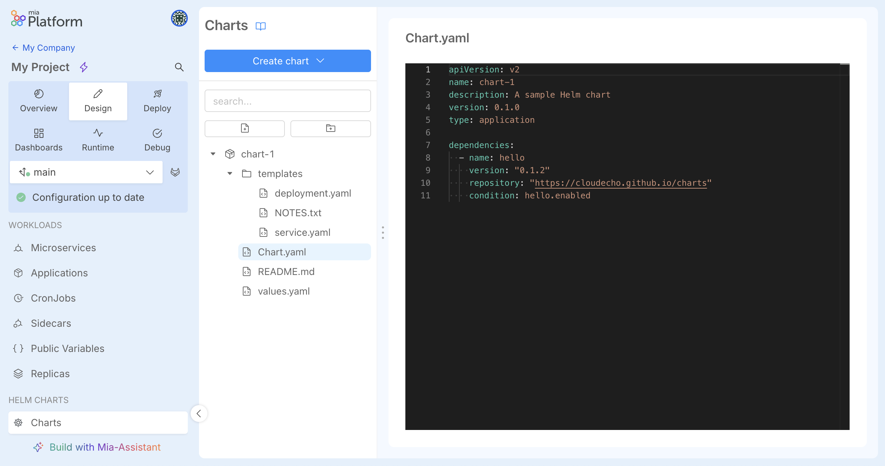

import Accordion from '@site/src/components/Accordion/index.js';
import dataAccordion from '@site/src/config/release-notes/release-note-v15-0-0.json';

_April 29th, 2026_

:::info

Mia-Platform Console v15.0.0 is **now in Preview** and will be generally available by the End of June!

Console SaaS users can try out v15.0.0 latest improvements in Preview! Open a Service Request to ask for the creation of a sandbox Company in case you do not have access to any Company.

For self-hosted installations, please read the [following guidelines](#how-to-update-your-console).
:::

## Helm Charts in Design Area

:::info
This feature is only available for projects using the **Enhanced Workflow**.
:::

Console now provides a dedicated **Charts** section in the Design Area, allowing teams to create, manage, and configure [Helm](https://helm.sh/) chart configurations directly within their Console Projects.

The entire chart lifecycle — from editing to saving, versioning, and deploying — is fully integrated with the existing Console Design and Deploy workflows.

The integrated editor provides rich Helm-specific language support, making it easier to work on complex chart configurations with confidence.

To learn more about the features available in the new Charts section of the Design Area, and to understand how Git commits of chart configuration files and their deployment are handled via Kustomize, CI/CD pipelines, and MLP, please refer to the [Configure Helm Charts documentation](/docs/products/console/api-console/api-design/charts).

## Other New Features, Improvements and Bug Fixes

<Accordion data={dataAccordion} />

## How to update your Console

For self-hosted installations, please head to the [self hosted upgrade guide](/docs/requirements/self-hosted/installation-chart/how-to-upgrade) or contact your Mia-Platform referent and upgrade to _Console Helm Chart_ `v15.0.14-beta.0`.

### Bill of materials

| Image repository                                                               |  Version  |
|--------------------------------------------------------------------------------|:---------:|
| docker.io/envoyproxy/ratelimit                                                 | 19f2079f  |
| nexus.mia-platform.eu/api-portal/website                                       |   2.2.0   |
| nexus.mia-platform.eu/back-kit/mfe-toolkit-on-prem                             |  1.3.13   |
| nexus.mia-platform.eu/backoffice/login-site                                    |   7.2.3   |
| nexus.mia-platform.eu/console/aggregated-website                               |  1.5.64   |
| nexus.mia-platform.eu/console/api-gateway                                      |   0.2.9   |
| nexus.mia-platform.eu/console/backend                                          |  33.2.0   |
| nexus.mia-platform.eu/console/catalog-service                                  |   1.7.2   |
| nexus.mia-platform.eu/console/deploy-service                                   |   8.4.0   |
| nexus.mia-platform.eu/console/environments-variables                           |   3.6.1   |
| nexus.mia-platform.eu/console/events-manager                                   |   1.5.0   |
| nexus.mia-platform.eu/console/extensibility-manager                            |   2.1.0   |
| nexus.mia-platform.eu/console/favorites-service                                |   2.3.1   |
| nexus.mia-platform.eu/console/feature-toggle-service                           |   1.3.7   |
| nexus.mia-platform.eu/console/kubernetes-service                               |   8.4.6   |
| nexus.mia-platform.eu/console/license-manager                                  |   3.0.3   |
| nexus.mia-platform.eu/console/license-metrics-generator                        |   6.0.6   |
| nexus.mia-platform.eu/console/mcp-server                                       |   1.2.1   |
| nexus.mia-platform.eu/console/mia-assistant                                    |   1.3.8   |
| nexus.mia-platform.eu/console/mia-craft-bff                                    |   1.2.5   |
| nexus.mia-platform.eu/console/notification-provider                            |   2.2.5   |
| nexus.mia-platform.eu/console/project-service                                  |   2.1.0   |
| nexus.mia-platform.eu/console/rbac-manager-bff                                 |   2.1.2   |
| nexus.mia-platform.eu/console/scripts/bindings-cleaner                         |   1.2.2   |
| nexus.mia-platform.eu/console/scripts/configuration-history-cleaner            |   0.4.1   |
| nexus.mia-platform.eu/console/scripts/marketplace-sync                         |  10.11.0  |
| nexus.mia-platform.eu/console/scripts/mia-assistant-embeddings-importer        |  latest   |
| nexus.mia-platform.eu/console/scripts/software-catalog-sync                    |  0.7.23   |
| nexus.mia-platform.eu/console/scripts/version-upgrader                         |  11.1.6   |
| nexus.mia-platform.eu/console/tenant-overview                                  |   4.1.0   |
| nexus.mia-platform.eu/core/authentication-service                              |  3.13.1   |
| nexus.mia-platform.eu/core/authorization-service                               |   2.4.3   |
| nexus.mia-platform.eu/core/client-credentials                                  |   3.4.1   |
| nexus.mia-platform.eu/core/crud-service                                        |  6.10.3   |
| nexus.mia-platform.eu/core/proxy-manager                                       |   3.5.0   |
| nexus.mia-platform.eu/core/swagger-aggregator                                  |   3.9.6   |
| nexus.mia-platform.eu/microlc/middleware                                       |   3.4.0   |
| nexus.mia-platform.eu/plugins/files-service                                    |  2.10.5   |
| nexus.mia-platform.eu/plugins/ses-mail-notification-service                    |   3.5.0   |
| nexus.mia-platform.eu/rond-authz/rond                                          |  1.14.2   |

