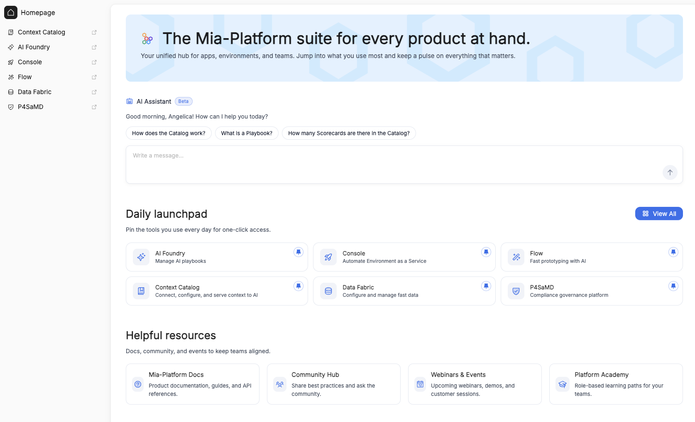
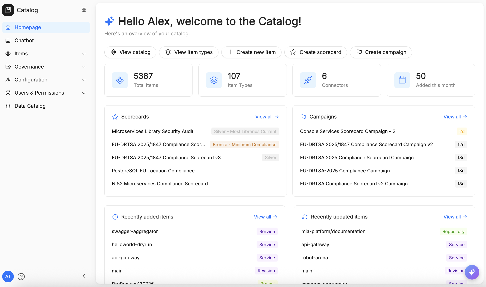
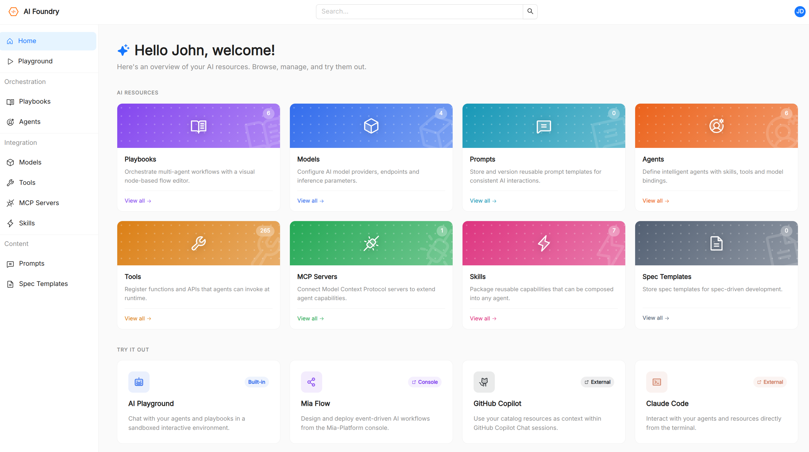
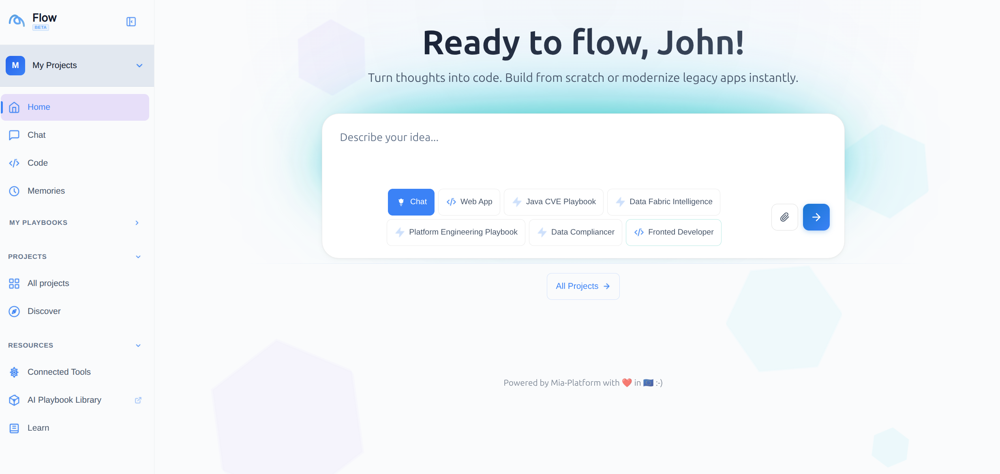
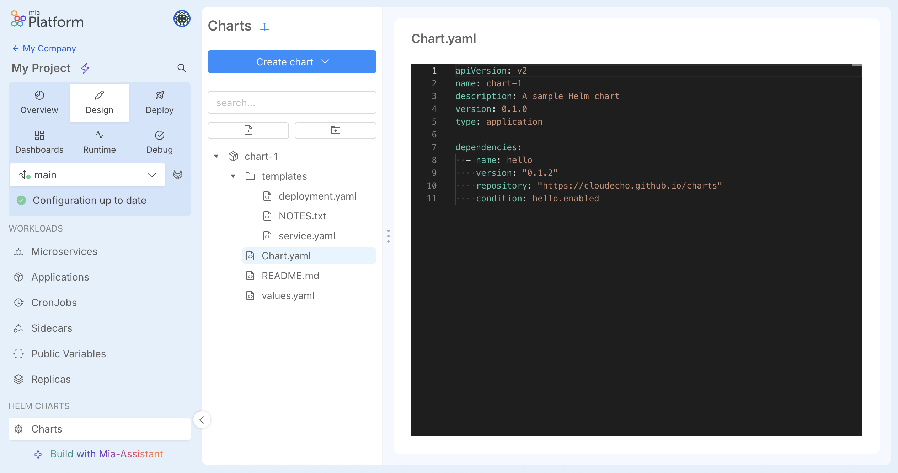

import Accordion from '@site/src/components/Accordion/index.js';
import dataAccordion from '@site/src/config/release-notes/release-note-v15-0-0.json';

_Jul 16th, 2026_

## Suite Home

The new Suite Home page provides a centralized entry point for accessing Mia-Platform Suite products and managing tenant-related settings.

Available capabilities include:

* Access to all tenants and products available for the current user.
* Recently used items for faster navigation.
* Tenant switching through the project switcher.
* Administration features for managing tenants, groups, and roles.
* Integrated AI assistant support for navigation and common user requests.
* Quick access to Suite products, including Console, Flow, Data Fabric, and P4SaMD, while preserving the selected tenant context.

### Access Control & User Management

The new RBAC Management service centralizes access control management across the Mia-Platform Suite.

It provides a unified authorization model for managing:

* Organizations.
* Tenants.
* Users and groups.
* Roles and permissions.

Roles can be assigned to individual users or groups, allowing administrators to define access rules according to their organization structure.

By introducing a centralized authorization model, Suite components can rely on a single source of truth for permissions instead of maintaining independent access configurations.

Read the documentation to understand how to manage users and add roles in Catalog and in AI Foundry.

## Catalog

We are introducing **Catalog**, a brand-new component of Mia-Platform that lets teams centralize, govern, and connect any entity that lives in their organization — services, infrastructure resources, datasets, AI assets, processes — and make them discoverable across the platform.

Catalog ships with a REST API, a web Backoffice, a typed relationship graph, a compliance layer (rules, scorecards, campaigns), a growing set of connectors that keep the catalog in sync with GitHub, GitLab, Bitbucket, Azure, Azure DevOps, Google Cloud, the Mia-Platform Console, Sonatype Nexus, and Sysdig Secure, and an MCP server that exposes the catalog to AI agents.

This release also adds automated notifications for compliance campaigns (start, completion, and progress updates) and a dedicated MCP server that lets AI assistants like Claude Desktop, VS Code, Cursor, or Windsurf query and update the Catalog through natural language.

For more information, go to the [Catalog documentation](/docs/products/catalog/overview) and visit [Mia-Platform v15 Overview](/release-notes/mia-platform-v15.mdx#context-catalog).

## AI Foundry

We are introducing **AI Foundry**, a new component of Mia-Platform for building, deploying, and governing AI-powered experiences. AI Foundry provides a unified environment to configure agents, manage LLM models, prompts, tools, and skills, compose multi-step agentic workflows through the Playbook Builder, and test everything in a live AI Playground — all governed as first-class catalog resources.

For more information, go to the [AI Foundry documentation](/docs/products/ai-foundry/overview) and visit [Mia-Platform v15 Overview](/release-notes/mia-platform-v15.mdx#ai-foundry).

## Flow

:::caution Beta

Flow is in **beta**. We are actively shaping the product, so things may change as we iterate. Your feedback is welcome.

:::

We are introducing **Flow**, a new component of Mia-Platform that brings visual workflow orchestration to the platform. Flow lets business and technical stakeholders design, execute, and monitor end-to-end processes that span microservices, data pipelines, and human-in-the-loop steps on a single canvas.

For more information, go to the [Flow documentation](/docs/products/flow/overview) and visit [Mia-Platform v15 Overview](/release-notes/mia-platform-v15.mdx#flow).

## Design Helm Charts and Deploy with Kustomize

:::info
This feature is only available for projects using the **Enhanced Workflow**.
:::

Console now provides a dedicated **Charts** section in the Design Area, allowing teams to create, manage, and configure [Helm](https://helm.sh/) chart configurations directly within their Console Projects.

The integrated editor provides rich Helm-specific language support, making it easier to work on complex chart configurations with confidence.

The entire chart lifecycle — from editing to saving, versioning, and deploying — is fully integrated with the existing Console Design and Deploy workflows.

The integrated editor provides rich Helm-specific language support, making it easier to work on complex chart configurations with confidence.

To learn more about the features available in the new Charts section of the Design Area, and to understand how Git commits of chart configuration files and their deployment are handled via Kustomize, CI/CD pipelines, and MLP, please refer to the [Configure Helm Charts documentation](/docs/products/console/api-console/api-design/charts).

## Other New Features, Improvements and Bug Fixes

<Accordion data={dataAccordion} />

## How to update

To run Mia-Platform v15.0.0, the following Helm chart versions must be installed on your cluster. For the complete installation sequence and per-product upgrade guides, see the [Installation Guidelines](/docs/requirements/installation-guidelines/overview).

### Helm chart versions

| Product | Helm Chart | Version | Upgrade guide |
|---|---|---|---|
| **Auth — Keycloak** | `keycloak-operator` | `0.5.3` | [How to upgrade](/docs/requirements/installation-guidelines/shared-services/authn/keycloak/how-to-upgrade) |
| **Auth — Realm Management** | `keycloak-realm-management` | `0.1.19` | [How to upgrade](/docs/requirements/installation-guidelines/shared-services/authn/keycloak-realm-management/how-to-upgrade) |
| **Homepage & RBAC** | `services` | `0.2.30` | [How to upgrade](/docs/requirements/installation-guidelines/shared-services/services/how-to-upgrade) |
| **Catalog** | `catalog` | `0.2.35` | [How to upgrade](/docs/requirements/installation-guidelines/catalog/how-to-upgrade) |
| **AI Foundry** | `ai-foundry` | `0.4.26` | [How to upgrade](/docs/requirements/installation-guidelines/ai-foundry/how-to-upgrade) |
| **Console** | `console` | `15.0.14-keycloak.28` | [How to upgrade](/docs/requirements/installation-guidelines/console/self-hosted/how-to-upgrade) |

:::caution
The Console version reflects the latest `feat/external-idp` development branch snapshot (Keycloak migration in progress) and is not yet a final tagged release.
:::

### Bill of materials

Click on each chart to expand its full image list.

<strong>keycloak-operator v0.5.3</strong>

| Image repository | Version |
|---|:---:|
| nexus.mia-platform.eu/platform/auth/keycloak | 0.3.1-26.6.4-postgres |
| quay.io/keycloak/keycloak-operator | 26.6.4 |

<strong>keycloak-realm-management v0.1.19</strong>

| Image repository | Version |
|---|:---:|
| docker.io/adorsys/keycloak-config-cli | latest-26.5.4 |

<strong>services v0.2.30</strong>

| Image repository | Version |
|---|:---:|
| docker.io/redis | 8.4.0 |
| nexus.mia-platform.eu/cache/envoyproxy/envoy | v1.36.2 |
| nexus.mia-platform.eu/core/swagger-aggregator | 3.9.4 |
| nexus.mia-platform.eu/platform/auth/access-control/ext-authz | 0.2.0 |
| nexus.mia-platform.eu/platform/auth/authtool/authtool-bff | 0.5.1 |
| nexus.mia-platform.eu/platform/services/homepage | latest |
| nexus.mia-platform.eu/platform/services/rbac-management | latest |

<strong>catalog v0.2.35</strong>

| Image repository | Version |
|---|:---:|
| docker.io/redis | 8.4.0 |
| nexus.mia-platform.eu/ai-foundry/adk-be-app | 0.5.0 |
| nexus.mia-platform.eu/cache/envoyproxy/envoy | v1.36.2 |
| nexus.mia-platform.eu/catalog/catalog-engine | 0.4.4 |
| nexus.mia-platform.eu/catalog/catalog-mcp-server | 0.2.1 |
| nexus.mia-platform.eu/catalog/catalog-website | 0.2.7 |
| nexus.mia-platform.eu/catalog/items-consumer | 0.1.0 |
| nexus.mia-platform.eu/catalog/items-producer | 0.1.0 |
| nexus.mia-platform.eu/core/swagger-aggregator | 3.9.4 |
| nexus.mia-platform.eu/data-fabric/stream-processor | 0.8.0-postgres |
| nexus.mia-platform.eu/p4samd/core/policy-engine | v0.8.0 |
| nexus.mia-platform.eu/platform/auth/access-control/ext-authz | 0.1.2 |
| nexus.mia-platform.eu/platform/auth/authtool/authtool-bff | 0.5.1 |
| quay.io/docling-project/docling-serve-cpu | v1.24.0 |

<strong>ai-foundry v0.4.26</strong>

| Image repository | Version |
|---|:---:|
| docker.io/redis | 8.4.0 |
| nexus.mia-platform.eu/ai-foundry/adk-be-app | 0.5.0 |
| nexus.mia-platform.eu/ai-foundry/ai-foundry-bff | 0.1.0 |
| nexus.mia-platform.eu/ai-foundry/ai-foundry-website | 0.5.0 |
| nexus.mia-platform.eu/cache/envoyproxy/envoy | v1.36.2 |
| nexus.mia-platform.eu/platform/auth/access-control/ext-authz | 0.1.2 |
| nexus.mia-platform.eu/platform/auth/authtool/authtool-bff | 0.5.1 |
| quay.io/docling-project/docling-serve-cpu | 1.21.0 |

<strong>console v15.0.14-keycloak.28</strong>

| Image repository                                                               |  Version  |
|--------------------------------------------------------------------------------|:---------:|
| docker.io/envoyproxy/ratelimit                                                 | 19f2079f  |
| nexus.mia-platform.eu/back-kit/mfe-toolkit-on-prem                             |  1.3.13   |
| nexus.mia-platform.eu/cache/envoyproxy/envoy                                   |  v1.32.1  |
| nexus.mia-platform.eu/console/aggregated-website                               |   1.6.1   |
| nexus.mia-platform.eu/console/backend                                          |  33.2.1   |
| nexus.mia-platform.eu/console/catalog-service                                  |   1.7.2   |
| nexus.mia-platform.eu/console/deploy-service                                   |   8.4.0   |
| nexus.mia-platform.eu/console/environments-variables                           |   3.6.1   |
| nexus.mia-platform.eu/console/events-manager                                   |   1.5.0   |
| nexus.mia-platform.eu/console/extensibility-manager                            |   3.0.0   |
| nexus.mia-platform.eu/console/favorites-service                                |   2.3.1   |
| nexus.mia-platform.eu/console/feature-toggle-service                           |   1.3.7   |
| nexus.mia-platform.eu/console/kubernetes-service                               |   8.4.6   |
| nexus.mia-platform.eu/console/mcp-server                                       |   1.2.1   |
| nexus.mia-platform.eu/console/mia-assistant                                    |   1.4.0   |
| nexus.mia-platform.eu/console/mia-craft-bff                                    |   1.2.5   |
| nexus.mia-platform.eu/console/notification-provider                            |   2.2.5   |
| nexus.mia-platform.eu/console/project-service                                  |   2.1.0   |
| nexus.mia-platform.eu/console/rbac-manager-bff                                 |   2.1.2   |
| nexus.mia-platform.eu/console/scripts/bindings-cleaner                         |   1.2.2   |
| nexus.mia-platform.eu/console/scripts/configuration-history-cleaner            |   0.4.1   |
| nexus.mia-platform.eu/console/scripts/marketplace-sync                         |  10.11.0  |
| nexus.mia-platform.eu/console/scripts/mia-assistant-embeddings-importer        |  latest   |
| nexus.mia-platform.eu/console/scripts/software-catalog-sync                    |  0.7.25   |
| nexus.mia-platform.eu/console/scripts/version-upgrader                         |  11.1.7   |
| nexus.mia-platform.eu/console/tenant-overview                                  |   4.2.1   |
| nexus.mia-platform.eu/core/authorization-service                               |   2.4.3   |
| nexus.mia-platform.eu/core/client-credentials                                  |   3.4.1   |
| nexus.mia-platform.eu/core/crud-service                                        |  6.10.3   |
| nexus.mia-platform.eu/core/proxy-manager                                       |   3.5.0   |
| nexus.mia-platform.eu/core/swagger-aggregator                                  |   3.9.6   |
| nexus.mia-platform.eu/microlc/middleware                                       |   3.4.0   |
| nexus.mia-platform.eu/plugins/files-service                                    |  2.10.5   |
| nexus.mia-platform.eu/plugins/ses-mail-notification-service                    |   3.5.0   |
| nexus.mia-platform.eu/platform/auth/authtool/authtool-bff                      |   0.5.1   |
| nexus.mia-platform.eu/rond-authz/rond                                          |  1.14.2   |

