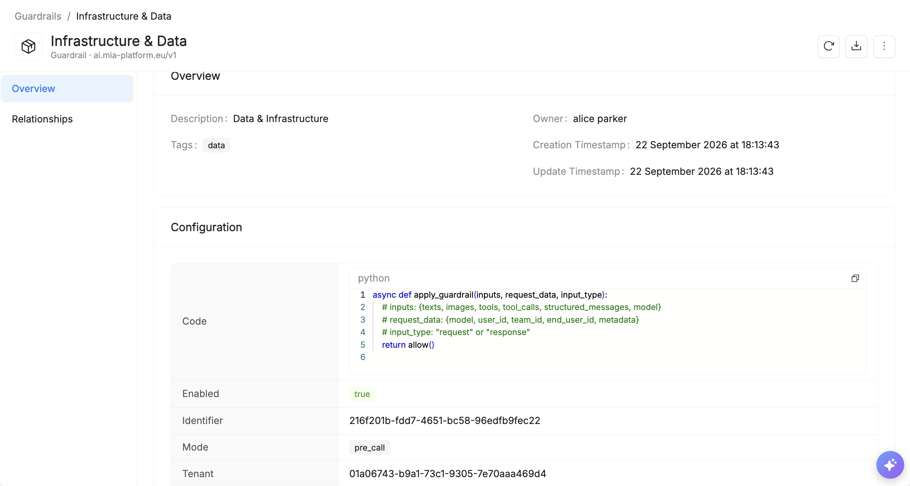
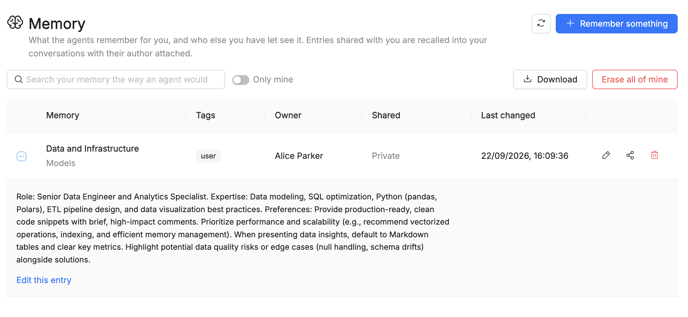

import Accordion from '@site/src/components/Accordion/index.js';
import dataAccordion from '@site/src/config/release-notes/release-note-v15-2-0.json';

_Sep 21st, 2026_

:::info
Mia-Platform v15.2.0 **Fall Release** is **now in Preview** and will be generally available on November 12!
:::

## Catalog

### Item Versioning

Items now have a **History** section that tracks their full revision history, lets you promote a revision to a named version, compare any two states with a line-by-line diff, and roll back when needed — see the official [Item Versioning documentation](/docs/15.2.0/products/catalog/basic-concepts/item-history) to discover all the available features.

### Audit Logs

Items now have an **Audit Logs** section, both tenant-wide and per Item Type, that lets Auditors review every action performed on the Catalog for security and compliance purposes — see the official [Audit Logs documentation](/docs/15.2.0/products/catalog/basic-concepts/audit-logs) to discover all the available features.

### Webhooks

Item Types now support **Webhooks**, notifying an external service whenever one of their items is created, updated, or deleted, removing the need for external systems to poll the Catalog for changes — see the official [Webhooks documentation](/docs/15.2.0/products/catalog/basic-concepts/webhooks) to discover all the available features.

## AI Foundry

### Agentic Workflow Orchestration

A new workflow engine lets you orchestrate multi-step, event-triggered processes: an item state change, a detected vulnerability, or an external webhook can kick off a workflow that enriches context, invokes specialized agents, performs remediation actions, and notifies or routes to the right team, up to an automatically opened pull request. Each run is fully traceable, with automatic halting if a governance gate fails.

### Multi-agent Support

Playbooks now support true multi-agent systems on the Agentic Flow canvas: sequential pipelines, parallel fan-out/fan-in, and supervisor/orchestrator patterns with dynamic routing and hand-off between agents, reusing existing tools, skills, MCP servers, and prompts as building blocks.

### Playbook Memory Management

Playbooks gain a memory layer: per-user memory (short-term and long-term, persisted across runs) and team-shared memory governed by RBAC, so multi-agent runs can share context and teams build on past runs. Only available within the Mia-Platform ecosystem, not for Playbooks run locally from VS Code or Claude Code.

### Observability improvements

AI Traces now surface richer **token usage** data per run, for finer-grained cost and consumption analysis alongside the existing trace details.

## Data Catalog

### Business Glossary

The Data Catalog now includes a **Business Glossary** that lets you define terms describing business concepts, metrics, or definitions, and link them to the data assets, bridging the gap between business language and technical metadata.

To discover all the available features, visit the official [Business Glossary documentation](/docs/15.2.0/products/data_catalog/frontend/data_catalog_business_glossary).  

:::info
To enable the glossary, update your Data Catalog Application services to the versions listed in the [compatibility matrix](/docs/15.2.0/products/data_catalog/data_catalog_compatibility_matrix#service-latest-versions).  
Once the new versions of Data Catalog Application have been deployed, run the fabric-admin cronjob `v0.5.7` to propertly setup the business glossary feature.
:::

## Other New Features, Improvements and Bug Fixes

<Accordion data={dataAccordion} />

## How to update

To run Mia-Platform v15.2.0, the following Helm chart versions must be installed on your cluster. For the complete installation sequence and per-product upgrade guides, see the [Installation Guidelines](/docs/15.2.0/requirements/installation-guidelines/overview).

### Helm chart versions

| Product | Helm Chart | Version | Upgrade guide |
|---|---|---|---|
| **Auth — Keycloak** | `keycloak-operator` | `v0.6.1` | [How to upgrade](/docs/15.2.0/requirements/installation-guidelines/shared-services/authn/keycloak/how-to-upgrade) |
| **Auth — Realm Management** | `keycloak-realm-management` | `v0.1.35` | [How to upgrade](/docs/15.2.0/requirements/installation-guidelines/shared-services/authn/keycloak-realm-management/how-to-upgrade) |
| **Homepage & RBAC** | `services` | `v0.3.22` | [How to upgrade](/docs/15.2.0/requirements/installation-guidelines/shared-services/services/how-to-upgrade) |
| **Catalog** | `catalog` | `v0.3.58` | [How to upgrade](/docs/15.2.0/requirements/installation-guidelines/catalog/how-to-upgrade) |
| **AI Foundry** | `ai-foundry` | `v0.5.0-beta.7` | [How to upgrade](/docs/15.2.0/requirements/installation-guidelines/ai-foundry/how-to-upgrade) |
| **AI Services** | `ai-services` | `v0.1.0-beta.4` | _Coming soon_ |
| **Console** | `console` | `v15.2.0-beta.0` | [How to upgrade](/docs/15.2.0/requirements/installation-guidelines/console/self-hosted/how-to-upgrade) |

### Bill of materials

Click on each chart to expand its full image list.

<strong>keycloak-operator v0.6.1</strong>

| Image repository | Version |
|---|:---:|
| nexus.mia-platform.eu/platform/auth/keycloak | 0.3.2-26.6.4-postgres |
| quay.io/keycloak/keycloak-operator | 26.6.4 |

<strong>keycloak-realm-management v0.1.35</strong>

| Image repository | Version |
|---|:---:|
| docker.io/adorsys/keycloak-config-cli | latest-26.5.4 |

<strong>services v0.3.22</strong>

| Image repository | Version |
|---|:---:|
| docker.io/redis | 8.4.0 |
| nexus.mia-platform.eu/ai-foundry/adk-be-app | 0.7.3 |
| nexus.mia-platform.eu/cache/envoyproxy/envoy | v1.36.2 |
| nexus.mia-platform.eu/core/swagger-aggregator | 3.9.4 |
| nexus.mia-platform.eu/platform/auth/access-control/ext-authz | 0.2.2-nocache |
| nexus.mia-platform.eu/platform/auth/authtool/authtool-bff | 0.5.2 |
| nexus.mia-platform.eu/platform/services/homepage | 0.4.7 |
| nexus.mia-platform.eu/platform/services/rbac-management | 0.3.4 |
| quay.io/docling-project/docling-serve-cpu | v1.24.0@sha256:3848073769721b92c17f34e29e06c3cc32d8bfb45cd1ad5c608219eb1d5bcb51 |
| docker.io/alpine/psql | 18.4 |
| docker.io/curlimages/curl | 8.11.1 |

<strong>catalog v0.3.58</strong>

| Image repository | Version |
|---|:---:|
| docker.io/apache/kafka | 4.2.0 |
| docker.io/redis | 8.4.0 |
| nexus.mia-platform.eu/ai-foundry/adk-be-app | 0.7.3 |
| nexus.mia-platform.eu/cache/envoyproxy/envoy | v1.36.2 |
| nexus.mia-platform.eu/catalog/catalog-engine | 0.9.3 |
| nexus.mia-platform.eu/catalog/catalog-mcp-server | 0.2.3 |
| nexus.mia-platform.eu/catalog/catalog-website | 0.5.3 |
| nexus.mia-platform.eu/catalog/items-consumer | 0.2.0 |
| nexus.mia-platform.eu/catalog/items-producer | 0.2.0 |
| nexus.mia-platform.eu/core/swagger-aggregator | 3.9.4 |
| nexus.mia-platform.eu/data-fabric/stream-processor | 0.8.1-postgres |
| nexus.mia-platform.eu/p4samd/core/policy-engine | v0.9.0 |
| nexus.mia-platform.eu/platform/auth/access-control/ext-authz | 0.2.2-nocache |
| nexus.mia-platform.eu/platform/auth/authtool/authtool-bff | 0.5.2 |
| nexus.mia-platform.eu/plugins/smtp-mail-notification-service | 3.5.1 |
| quay.io/docling-project/docling-serve-cpu | v1.24.0 |

<strong>ai-foundry v0.5.0-beta.7</strong>

| Image repository | Version |
|---|:---:|
| docker.io/redis | 8.4.0 |
| nexus.mia-platform.eu/ai-foundry/adk-be-app | 0.8.2 |
| nexus.mia-platform.eu/ai-foundry/ai-foundry-be | 0.1.1 |
| nexus.mia-platform.eu/ai-foundry/ai-foundry-bff | 0.4.1 |
| nexus.mia-platform.eu/ai-foundry/ai-foundry-provisioner | 0.1.0 |
| nexus.mia-platform.eu/ai-foundry/ai-foundry-website | 0.8.3 |
| nexus.mia-platform.eu/ai-foundry/ai-foundry-workflows | 0.1.1 |
| nexus.mia-platform.eu/ai-resources/secret-store-service | 0.1.0 |
| nexus.mia-platform.eu/ai-resources/workspace-service | 0.1.0 |
| nexus.mia-platform.eu/cache/envoyproxy/envoy | v1.36.2 |
| nexus.mia-platform.eu/platform/auth/access-control/ext-authz | 0.2.2-nocache |
| nexus.mia-platform.eu/platform/auth/authtool/authtool-bff | 0.5.2 |

<strong>ai-services v0.1.0-beta.4</strong>

| Image repository | Version |
|---|:---:|
| docker.io/nginxinc/nginx-unprivileged | 1.31.3-alpine |
| docker.io/temporalio/admin-tools | 1.29.7-tctl-1.18.4-cli-1.7.2 |
| docker.io/temporalio/server | 1.29.7 |
| docker.io/temporalio/ui | 2.53.1 |
| docker.litellm.ai/berriai/litellm | v1.97.0 |
| nexus.mia-platform.eu/ai-services/memory-service | 0.1.0 |
| nexus.mia-platform.eu/cache/envoyproxy/envoy | v1.36.2 |
| nexus.mia-platform.eu/platform/auth/access-control/ext-authz | 0.2.2-nocache |
| quay.io/docling-project/docling-serve-cpu | v1.24.0 |

<strong>console v15.2.0-beta.0</strong>

| Image repository                                                        |  Version  |
|-------------------------------------------------------------------------|:---------:|
| docker.io/envoyproxy/ratelimit                                          |  19f2079f |
| nexus.mia-platform.eu/back-kit/mfe-toolkit-on-prem                      |   1.3.13  |
| nexus.mia-platform.eu/cache/envoyproxy/envoy                            |  v1.32.1  |
| nexus.mia-platform.eu/console/aggregated-website                        |   1.6.3   |
| nexus.mia-platform.eu/console/backend                                   |   33.2.2  |
| nexus.mia-platform.eu/console/catalog-service                           |   1.7.2   |
| nexus.mia-platform.eu/console/deploy-service                            |   8.4.0   |
| nexus.mia-platform.eu/console/environments-variables                    |   3.6.1   |
| nexus.mia-platform.eu/console/events-manager                            |   1.5.0   |
| nexus.mia-platform.eu/console/extensibility-manager                     |   3.0.0   |
| nexus.mia-platform.eu/console/favorites-service                         |   2.3.1   |
| nexus.mia-platform.eu/console/feature-toggle-service                    |   1.3.7   |
| nexus.mia-platform.eu/console/kubernetes-service                        |   8.4.6   |
| nexus.mia-platform.eu/console/mcp-server                                |   1.3.0   |
| nexus.mia-platform.eu/console/mia-assistant                             |   2.0.0   |
| nexus.mia-platform.eu/console/mia-craft-bff                             |   1.2.5   |
| nexus.mia-platform.eu/console/notification-provider                     |   2.2.5   |
| nexus.mia-platform.eu/console/project-service                           |   2.1.0   |
| nexus.mia-platform.eu/console/rbac-manager-bff                          |   2.1.2   |
| nexus.mia-platform.eu/console/scripts/bindings-cleaner                  |   1.2.2   |
| nexus.mia-platform.eu/console/scripts/configuration-history-cleaner     |   0.4.1   |
| nexus.mia-platform.eu/console/scripts/marketplace-sync                  |  10.11.0  |
| nexus.mia-platform.eu/console/scripts/mia-assistant-embeddings-importer | 15.2.0-text-embedding-3-large |
| nexus.mia-platform.eu/console/scripts/software-catalog-sync             |   0.7.28  |
| nexus.mia-platform.eu/console/scripts/version-upgrader                  |   11.2.0  |
| nexus.mia-platform.eu/console/tenant-overview                           |   4.2.1   |
| nexus.mia-platform.eu/core/authorization-service                        |   2.4.3   |
| nexus.mia-platform.eu/core/client-credentials                           |   3.4.1   |
| nexus.mia-platform.eu/core/crud-service                                 |   6.10.3  |
| nexus.mia-platform.eu/core/proxy-manager                                |   3.5.0   |
| nexus.mia-platform.eu/core/swagger-aggregator                           |   3.9.6   |
| nexus.mia-platform.eu/microlc/middleware                                |   3.4.0   |
| nexus.mia-platform.eu/platform/auth/authtool/authtool-bff               |   0.5.2   |
| nexus.mia-platform.eu/plugins/files-service                             |   2.10.5  |
| nexus.mia-platform.eu/plugins/ses-mail-notification-service             |   3.5.0   |
| nexus.mia-platform.eu/rond-authz/rond                                   |   1.14.2  |

