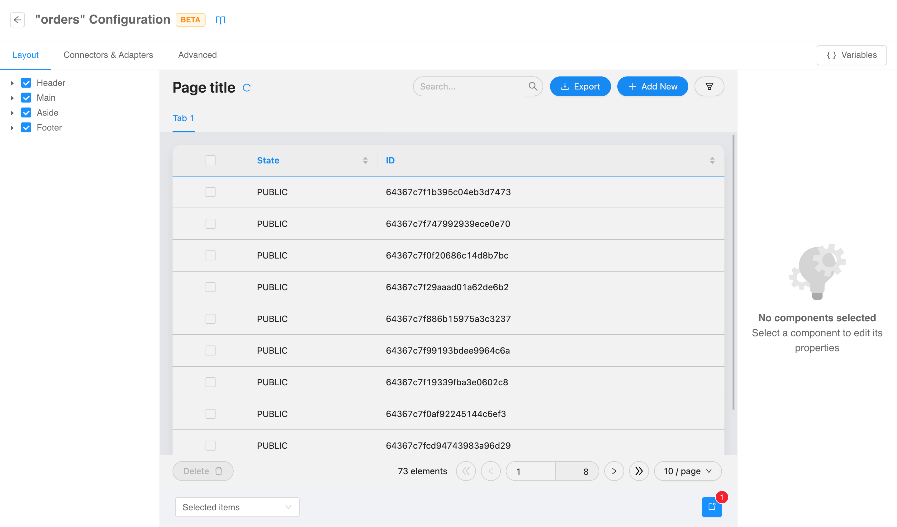
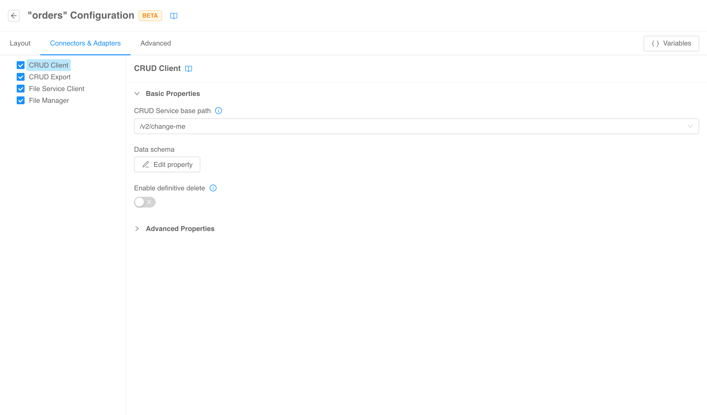
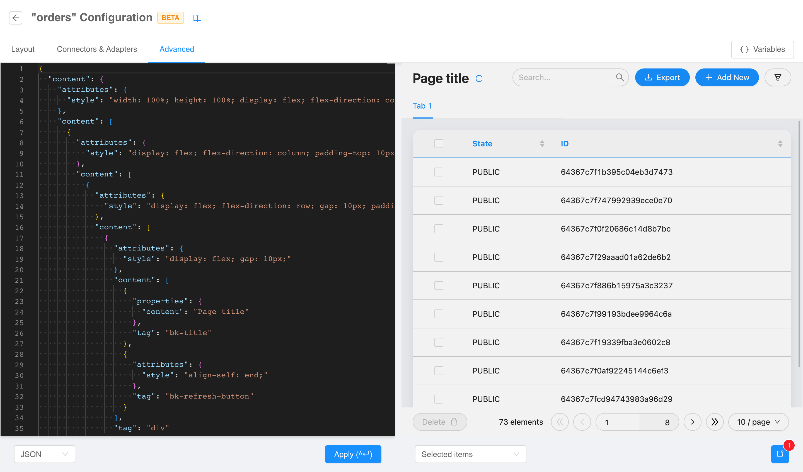

:::caution
This is a **BETA** feature and, as such, is currently under **active development**. Pay attention using this section.
:::

The pages of type [_compose_](./structure.md#page-type) can be configured in a **dedicated section**
accessible via _edit page_ option in pages [context menu](./structure.md#edit-page).

:::tip
You can refer the [micro-lc documentation](https://micro-lc.io/docs/guides/applications/compose) on how to properly
configure a compose page.
:::

## Layout

From the first tab you can configure in a no-code fashion the components that **renders something** on the page (
as opposed to the merely logical components configurable in the [connectors & adapters](#connectors--adapters) tab).

This section works just as the layout tab of Backoffice Configurator. The
**left menu** allows viewing, selecting, and hiding the custom components composing the page, the **live central preview** shows 
how the final page will look like, and from the **right menu** components properties can be consulted and edited.

For more technical insights, visit the [Layout section](./structure.md#layout) where all the behaviors are explained in deep.

## Connectors & Adapters

The second tab is equivalent to the first in terms of functionalities. However, it will show only **logical** components
(i.e., components that do not render anything). For this reason, no live preview will be shown.

## Advanced

The third and last tab works like the advanced tab of the [structure section](./structure.md#advanced-configuration):
the **whole configuration** of the page can be edited from a code editor with a live preview on the right.

