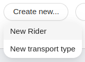

<!-- 
  Everything is is attached to the documentation as description
-->

Buttons are scoped by their signature event and often start event-driven processing notifying the `eventBus` about user actions.


## bk-add-filter-button

Notifies other components that a filter needs to be created. Such event could be collected by a `bk-filter-drawer`.

```html
<bk-add-filter-button></bk-add-filter-button>
```


### Properties & Attributes


| property | attribute | type | default | description |
|----------|-----------|------|---------|-------------|


### Listens to


| event | action | emits | on error |
|-------|--------|-------|----------|
|[loading-data](../events#loading-data)|sets internal loading state| - | - |
|[nested-navigation-state/back](../events#nested-navigation-state---back)|keeps track of navigation steps| - | - |
|[nested-navigation-state/push](../events#nested-navigation-state---push)|keeps track of navigation steps| - | - |

### Emits


| event | description |
|-------|-------------|
|[filter](../events#filter)|notifies the request for creating a filter|

### Bootstrap

None

## bk-add-new-button

this button creates a new item

```html
<bk-add-new-button></bk-add-new-button>
```


### Properties & Attributes


| property | attribute | type | default | description |
|----------|-----------|------|---------|-------------|
|`browseOnButtonClick`| - |ClickPayload|{}|when provided with a valid schema, overrides the button JavaScript `onclick` listener handler allowing an `href` linking|
|`initialValues`| - |Payload|{}|arguments to pass upon click |

### Listens to


| event | action | emits | on error |
|-------|--------|-------|----------|
|[loading-data](../events#loading-data)|sets internal loading state| - | - |
|[nested-navigation-state/back](../events#nested-navigation-state---back)|keeps track of navigation steps| - | - |
|[nested-navigation-state/push](../events#nested-navigation-state---push)|keeps track of navigation steps| - | - |

### Emits


| event | description |
|-------|-------------|
|[add-new](../events#add-new)|notifies the request for creating a new item|

### Bootstrap

None

## bk-bulk-actions

This component allows to change the value of a object key in all the selected objects

```html
<bk-bulk-actions></bk-bulk-actions>
```

:::info
It works only with **enum or boolean** data and it appears once one or more items are selected.
Remember to pass the dataschema in the configuration file.
:::

### How it works

1. It reads the dataschema to look for the properties that can be changed, so the ones with enum or boolean type.
2. It listens to `selected-data-bulk` which is often called when one or more rows in a table are selected.
3. Once one or more rows are selected, it appears in the UI.
4. Now it is possible to interact with the left side of the component (three dots) and select the property to change the value to.
5. Once a property is selected, it checks if each selected row has the same value. If it does, it shows the property name with the common value, otherwise it shows the property name with '\*various\*'.
6. Now it is also possible to interact with the right side of the component and select the value to assign to the property
7. Once selected the value, a `bulk-update` event is emitted and data are updated.


### Configuration

This component is reachable as `bk-bulk-actions`.
Add the component's configuration wherever you want to display it.
```json
  ...
  {
    "type": "element",
    "tag": "bk-bulk-actions",
    "properties": {
      "dataSchema": {
        "$ref": "dataSchema"
      }
    }
  },
  ...
```

### Confirmation dialog on selected value

It is possible to ask for confirmation on selected value, and also customize the dialog texts.

It can be done using the `requireConfirmation` prop. It accepts three different values and it is defaulted as `false`:

#### 1. Boolean type

It can be set as `true` to open the dialog on close or as `false` otherwise.

#### 2. Object of type RequireConfirmOpts

An object such as:
```typescript
{
  cancelText?: any; // cancel button text
  okText?: any; // ok button text
  content?: any; // the content text
  title?: any; // the title text
}
```
to customize the dialog texts. They can also be localized, passing an object containing the language acronymous key and the text as value, for example:

```json
{
  "content": {
    "it": "Verrà creato un nuovo elemento, procedere?",
    "en": "A new element will be created, continue?"
  }
}
```


### Properties & Attributes


| property | attribute | type | default | description |
|----------|-----------|------|---------|-------------|
|`requireConfirm`| - |boolean \| `RequireConfirmOpts`|false|whether or not the button should ask for confirmation before updating all the selected data with the chosen value|
|`dataSchema`| - |ExtendedJSONSchema7Definition| - |[data schema](../page_layout#data-schema) describing the fields of the collection |

### Listens to


| event | action | emits | on error |
|-------|--------|-------|----------|
|[select-data-bulk](../events#select-data-bulk)|keeps track of user selections to prompt `selected` export option configuration| - | - |

### Emits


| event | description |
|-------|-------------|
|[bulk-update]|notifies the client to update more items at the same time with a specific value|

### Bootstrap

None

## bk-bulk-delete

this button creates a new item

```html
<bk-bulk-delete></bk-bulk-delete>
```

This component allows to delete one or more items at the same time.


### How it works

1. A disabled button is displayed.
2. It listens to `selected-data-bulk` which is often called when one or more rows in a table are selected.
3. Once one or more rows are selected, it activates.
4. If the button is clicked, emits a `require-confirm` event to open a dialog to ask for confirmation.
5. If the action is confirmed, it emits a `delete-data` event to delete all the selected items.

:::warning
Items in 'PUBLIC' or 'DRAFT' \_\_STATE\_\_, change the state to 'TRASH' while items in 'TRASH' \_\_STATE\_\_ change the state to 'DELETED'.
:::


### Configuration

This component is reachable as `bk-bulk-delete`.
Add the component's configuration wherever you want to display it.
```json
  ...
  {
    "type": "element",
    "tag": "bk-confirmation-modal"
  },
  ...
```

:::warning
Remember to add the `bk-confirmation-modal` component to the configuration otherwise the `bk-bulk-delete` won't work properly
```json
  ...
  {
    "type": "element",
    "tag": "bk-confirmation-modal"
  },
  ...
```
:::

### Properties & Attributes


| property | attribute | type | default | description |
|----------|-----------|------|---------|-------------|


### Listens to


| event | action | emits | on error |
|-------|--------|-------|----------|
|[select-data-bulk](../events#select-data-bulk)|keeps track of user selections to prompt `selected` export option configuration| - | - |

### Emits


| event | description |
|-------|-------------|
|[require-confirm]|opens a dialog to ask for confirmation|
|[delete-data]|deletes selected data|

### Bootstrap

None

## bk-button

A button that is configurable in order to execute a specific action when the onClick event is fired.

:::info

The possible actions are:

- event: push an event into the eventBus
- href: perform a redirect
- push: push a value into browser state
- http: perform an http request

:::

```html
<bk-button></bk-button>
```

`bk-button` is configurable to define an action to be fired when upon clicking.

:::warning
`clickConfig` property is deprecated from version 1.3.4 and will be completely replaced by `action` property in future releases. [A guide](#migrating-from-clickconfig-to-action) is provided explaining how to update configurations.
:::

### Migrating from `clickConfig` to `action`

`action` property follows the [Action](../actions.md) configuration schema. It expands the range of actions that can be performed using `clickConfig`, particularly:
  - introduces a new action type, allowing to copy text to clipboard
  - allows greater freedom in chaining actions

The main steps to follow for transitioning from `clickConfig` to `action` consist of:
  - `actionConfig` key is renamed `config`
  - `triggeredBy` field is not set by default by `bk-button` in success/fail events, it should be specified in `action.config`
  - `returnEvent` key is not present in actions. Rather, `hooks` key should be used, chaining actions
  - each action individually controls whether the onclick event should propagate, instead of using `stopPropagationOnClick` property of `bk-button`
  - actions of type `event` and `file-upload` implement a slightly different interface

In particular:

#### Event

Actions of type `event` replace `actionConfig` key with `config.events`:

```json
{
  "clickConfig": {
    "type": "event",
    "actionConfig": ...
  }
}
```
becomes:
```json
{
  "action": {
    "type": "event",
    "config": {
      "events": {
        ...
      }
    }
  }
}
```

#### File upload

For actions of type `file-upload`:

  - `fileFormKey` property is to be specified inside the action configuration, rather than being a property of `bk-button`:
    ```json
    {
      "tag": "bk-button",
      "properties": {
        ...
        "fileFormKey": "file-key",
        "clickConfig": {
          "type": "file-upload",
          "actionConfig": {
            "url": "/url/upload"
          }
        }
      }
    }
    ```
    becomes:
    ```json
    {
      "tag": "bk-button",
      "properties": {
        ...
        "action": {
          "type": "file-upload",
          "config": {
            "url": "/url/upload",
            "fileFormKey": "file-key"
          }
        }
      }
    }
    ```

  - key `actionConfig.config.headers` is replaced with `config.headers`:
    ```json
    {
      "clickConfig": {
        "type": "file-upload",
        "actionConfig": {
          "url": "/url/upload",
          "config": {
            "headers": ...
          }
        }
      }
    }
    ```
    becomes:
    ```json
    {
      "action": {
        "type": "file-upload",
        "config": {
          "url": "/url/upload",
          "headers": ...
        }
      }
    }
    ```


#### Key `returnEvent`

Multiple actions can be chained using [hooks](../actions.md#action-chaining). `returnEvent` key is not supported by `action` property, but the same result can be achieved using hooks.

```json
{
  "clickConfig": {
    "type": "...",
    "actionConfig": {
      ...
      "returnEvent": "return-event"
    }
  }
}
```
becomes:
```json
{
  "action": {
    "type": "...",
    "config": ...,
    "hooks": {
      "onSuccess": {
        "type": "event",
        "config": {
          "events": {
            "label": "return-events",
            "payload": "{{rawObject data}}"
          }
        }
      }
    }
  }
}
```

Note how the payload of the chained action is not automatically set to the response of the first action, but rather has to be specified. `data` is the default key used by most actions to reference the value that was returned by the previous action (if any); [rawObject](../core_concepts.md#rawobject) keyword prevents the interpolated data from being converted to string.

#### Key `triggeredBy`

Actions of type `http` and `file-upload` might emit [success](../events.md#success) or [error](../events.md#error) events, notifying success/failure in their execution. Field `meta` of such events might include key `triggeredBy`, which could be used by other components - for instance, [bk-notifications](./misc.md#bk-notifications) uses this key to display success/fail notifications to the user.

Using `clickConfig`, `bk-button` automatically injects values for `triggeredBy` key:

| action type | `triggeredBy` value |
|-------------|---------------------|
| `http` (GET) | `get-http-generic-button` |
| `http` (POST) | `post-http-generic-button` |
| `http` (DELETE) | `delete-http-generic-button` |
| `file-upload` | `bk-button-file-upload` |

Using `action` property, however, `triggeredBy` should be specified for actions of type `http` and `file-upload` inside `config` field. For instance:

```json
{
  "clickConfig": {
    "type": "http",
    "actionConfig": {
      ...
      "method": "POST"
    }
  }
}
```
becomes:
```json
{
  "action": {
    "type": "http",
    "config": {
      ...
      "method": "POST",
      "triggeredBy": "post-http-generic-button"
    }
  }
}
```

and
```json
{
  "clickConfig": {
    "type": "file-upload",
    "actionConfig": ...
  }
}
```
becomes:
```json
{
  "clickConfig": {
    "type": "file-upload",
    "actionConfig": {
      ...,
      "triggeredBy": "bk-button-file-upload"
    }
  }
}
```

Naturally, any other string could be specified for `config.triggeredBy`, allowing greater possibility for custom behavior. For instance, using `bk-notifications` components, two actions of the same type could trigger different notifications, which would not be possible using `clickConfig`.

For instance:
```json
{
  ...
  {
    "tag": "bk-notifications",
    "properties": {
      ...
      "successEventMap": {
        "post-1": {
          ...
          "content": "Post 1 was successful"
        },
        "post-2": {
          ...
          "content": "Post 2 was successful"
        }
      }
    }
  },
  {
    "tag": "bk-button",
    "properties": {
      ...
      "action": {
        "type": "http",
        "config": {
          ...
          "method": "POST",
          "triggeredBy": "post-1"
        }
      }
    }
  },
  {
    "tag": "bk-button",
    "properties": {
      ...
      "action": {
        "type": "http",
        "config": {
          ...
          "method": "POST",
          "triggeredBy": "post-2"
        }
      }
    }
  }
  ...
}
```


#### Key `stopPropagation`

Key `config.stopPropagation` can be specified for each action, replacing `stopPropagationOnClick` property of `bk-button`:
```json
{
  "tag": "bk-button",
  "properties": {
    ...
    "stopPropagationOnClick": false,
    "clickConfig": ...
  } 
}
```
becomes:
```json
{
  "tag": "bk-button",
  "properties": {
    ...
    "action": {
      ...
      "config": {
        "stopPropagation": false,
        ...
      }
    }
  } 
}
```

By default, `config.stopPropagation` is set to true, same as `stopPropagationOnClick` property of `bk-button`.

### Actions

The `action` property allows to configure an [Action](../actions.md) that should be implemented by the button upon clicking.

Each action in the component is executed with the following context:
```typescript
{
  pathnameParams: ..., // parameters extracted from pathname part of URL. Requires `urlMask` property to be specified.
  searchParams: ..., // parameters extracted from search part of URL. Requires `urlMask` property to be specified.
  currentUser: ..., // data relative to the current user.
  selectedData: ..., // currently selected data. Requires `bulkButton` property to be true.
  context: ... // extra context set by mounting component
}
```
which allows for dynamic configurations through [handlebars syntax](https://handlebarsjs.com/guide/expressions.html).

For instance, the following is a valid configuration for property `action`:
```json
{
  "tag": "bk-button",
  "properties": {
    ...
    "urlMask": "/url/:id",
    "action": {
      "type": "http",
      "config": {
        "url": "/example",
        "method": "POST",
        "body": {
          "id": "{{pathnameParams.params.id}}",
          "nickname": "{{currentUser.nickname}}"
        }
      }
    }
  }
}
```

The resulting component is a button that, on click, performs a POST request to `/example`, with body containing information extracted from the current page url and from the current user.

#### Action context

- `currentUser`, contains information about the current user, for example name and email.

- `pathnameParams`, contains information about the pathname of the current page. It contains the property `params` with the keys specified in the [`urlMask`](../core_concepts.md#extracting-data-from-url---urlmask) and the property `path` with the full path.

```json
{
  "params": {...},
  "path": "/currentPath"
}
```

- `searchParams`, contains information about the URL query parameters. It contains the property `params` with the keys specified in the [`urlMask`](../core_concepts.md#extracting-data-from-url---urlmask) and the property `path` with the full query parameters string.

```json
{
  "params": {...},
  "path": "?query1=value1"
}
```

The two objects `pathnameParams` and `searchParams` can be accessed by specifing the [`urlMask`](../core_concepts.md#extracting-data-from-url---urlmask) property of the `bk-button` component. With no `urlMask` specified (or without a match between URL and `urlMask`), they will be empty. 

Example of configuration:

```json
{
  ...
  "tag": "bk-button",
  "properties": {
    "content": "Example button",
    "urlMask": "\\?pageNumber=:myPageNumber",
    "stopPropagationOnClick": true,
    "clickConfig": {
      "type": "event",
      "actionConfig": {
        "label": "add-new",
        "payload": {"pageNumber": "{{searchParams.params.myPageNumber}}"}
      }
    }
  }
}
```

In this configuration the property `urlMask` is specified to get the value of the first query parameter `pageNumber` and is saved in the `myPageNumber` key of the `searchParams.params` object. The example configuration will create a button that on click action will emit a `add-new` event with the information about the current page number in the payload.

`urlMask` allows to specify different masks for pathname and search fields. For instance:
```json
{
  ...
  "tag": "bk-button",
  "properties": {
    ...
    "urlMask": {
      "pathname": "current-url/:id",
      "search": "\\?pageNumber=:myPageNumber"
    }
  }
}
```

- `selectedData`, contains an array of objects representation of the selected data. Requires the button to be [bulk mode](#bulk-button) - that is, property `bulkButton` to be true. Selected data is then accessible through `{{rawObject selectedData}}`.

- extra context. `bk-button` supports extra context, which could be set by the user using `context` property, or, most of the times, by a parent component that mounts the button. For instance, [bk-table](./data_visualization.md#bk-table) component renders a table that mounts `bk-button` components inside its cells. `bk-table` provides the mounted buttons with [extra context](./data_visualization.md#dynamic-properties-interpolation) which can be used in action configuration.

### Require confirmation before executing an action

It is possible to ask for confirmation before executing an action using a [require-confirm](../events.md#require-confirm) event and nesting the desired action inside its configuration. This approach requires a component such as [bk-confirmation-modal](./misc.md#bk-confirmation-modal) to be included in the plugin.

#### Example

```json
{
  ...
  "clickConfig": {
    "type": "event",
    "config": {
      "events": {
        "label": "require-confirm",
        "payload": {
          "configOk": {
            "tag": "bk-button",
            "properties": {
              "content": "Delete",
              "action": {
                "type": "http",
                "config": {
                  "url": "/order-service/{{args.[1]._id}}",
                  "method": "DELETE",
                  "body": {}
                }
              }
            }
          }
        }
      }
    }
  }
}
```

If `bk-confirmation-modal` component is included in the plugin, it will react to the `require-confirm` event emitted by the button, using the `configOk` key in the payload for determining what action should be executed upon confirmation.

Note, in such configuration, `loadingOnAction` and `disableOnAction` should not be set to true, as the button will enter loading / disabled status without ever leaving it - more information on `loadingOnAction` and `disableOnAction` properties [follow](#loading-/-disable-on-action).

### Bulk button

It is possible to create a button that listens to [selected-data-bulk](../events.md#selected-data-bulk) event by setting `bulkButton` property to true.
Selected data can be referenced in actions using `{{rawObject selectedData}}`.

#### Example - an HTTP request

```json
{
  ...
  "bulkButton": true,
  "action": {
    "type": "http",
    "config": {
      "url": "/v2/users/",
      "method": "POST",
      "body": "{{rawObject selectedData}}"
    }
  }
}
```

#### Example - event

```json
{
  ...
  "bulkButton": true,
  "action": {
    "type": "event",
    "config": {
      "events": {
        "label": "display-data",
        "payload": {"data": "{{rawObject selectedData}}"}
      }
    }
  }
}
```

#### Example - deselect bk-table rows after action

If the `selected-data-bulk` events are emitted by a [bk-table](./data_visualization.md#bk-table) component, its rows might still be selected after the action is executed. It is possible to deselect them by piping a [change-query](../events.md#change-query) event with an empty payload after the main action.

Example of configuration:

```json
{
  ...
  "bulkButton": true,
  "action": {
    "type": "http",
    "config": {
      "url": "/v2/users/",
      "method": "POST",
      "body": "{{rawObject selectedData}}",
    },
    "hooks": {
      "onSuccess": {
        "type": "event",
        "config": {
          "events": {
            "label": "change-query",
            "payload": {}
          }
        }
      }
    }
  }
}
```


### Loading / disable on action

Properties `loadingOnAction` and `disableOnAction` put the button in loading/disabled state when an action of type `event`, `http`, `file-upload` is executed.
The button will disable loading/disabled status once any result event is received about the outcome of the action. Result events are: [success](../events.md#success), [error](../events.md#error), [cancel](../events.md#cancel).

Note that for actions of type `event`, result events are not emitted by `bk-button` itself, but rather require other components to do so - typically clients, like[bk-crud-client](./clients.md#bk-crud-client). Generally, clients emit result events after performing http requests.
Consequently, in order to avoid entering loading/disabled status without ever leaving it, a `bk-button` component that emits events should only have `loadingOnAction` or `disableOnAction` set to true if a following result event is eventually triggered - that is, if the button sends events that triggers an http call from clients. For instance, [create-data](../events.md#create-data), [update-data](../events.md#update-data), [delete-data](../events.md#delete-data) for `bk-crud-client`.


#### Example

```json
{
  ...
  {
    "tag": "bk-crd-client",
    "properties": ...
  },
  {
    "tag": "bk-button",
    "properties": {
      ...
      "loadingOnAction": true,
      "action": {
        "type": "http",
        "config": {
          "url": "/test-url",
          "method": "GET"
        },
        "hooks": {
          "type": "event",
          "config": {
            "events": {
              "label": "create-data",
              "payload": ...
            }
          }
        }
      }
    }
  }
}
```

with such configuration, the button will enter loading state twice, once for each [chained action](../actions.md#action-chaining), upon clicking. In particular, the following steps will happen:

  1) `bk-button` enters loading state
  2) `bk-button` performs an http post call
  3) `bk-button` emits a [success](../events.md#success) or [error](../events.md#error) event depending on the result of the call
  4) `bk-button` dismisses loading state, and emits an event with label `create-data` and specified payload
  5) `bk-button` enters loading state (caused by emitting the `create-data` event on step 4)
  6) `bk-crud-client` listens to the `create-data` event, which triggers an http post request
  7) `bk-crud-client` emits a [success](../events.md#success) or [error](../events.md#error) event depending on the result of the call
  8) `bk-button` dismisses loading state after listening to the event emitted by `bk-crud-client` on step 7

`bk-button` thus enters and dismisses loading state twice.

### `clickConfig` - **deprecated**

:::warning
`clickConfig` property is deprecated from version 1.3.4 and will be completely replaced by `action` property in future releases. [A guide](#migrating-from-clickconfig-to-action) is provided explaining how to update configurations.
:::

`clickConfig` allows to define an action to be fired when the button is clicked. The possible actions are:

- event: push an event into the eventBus
- href: perform a redirect
- push: push a value into browser state
- http: perform an http request
- file-upload: perform an XHR multipart/form-data file upload

In some cases the configurable onClick action can receive args as parameters that are used to enrich the request, actually the args are managed in this way:

- for event the args are added to the eventBus payload
- for http the args are used as post payload if the config is not provided

#### Dynamic configurations

All the parameters inside `clickConfig` can be dynamically interpolated into the WebComponent properties throw handlebars. With this syntax it is possible to access information about the current user or the URL of the page. Specifically, there are 3 objects available:

- `currentUser`, contains information about the current user, for example name and email.
- `pathnameParams`, contains information about the pathname of the current page. It contains the property `params` with the keys specified in the `urlMask` and the property `path` with the full path.

```json
{
  "params": {...},
  "path": "/currentPath"
}
```

- `searchParams`, contains information about the URL query parameters. It contains the property `params` with the keys specified in the `urlMask` and the property `path` with the full query parameters string.

```json
{
  "params": {...},
  "path": "?query1=value1"
}
```

The two objects `pathnameParams` and `searchParams` can be accessed by specifing the `urlMask` property of the `bk-button` component. With no `urlMask` specified (or without a match between URL and `urlMask`), they will be empty. 

Example of configuration:

```json
{
  "type": "element",
  "tag": "bk-generic-button",
  "properties": {
    "content": "Example button",
    "urlMask": "\\?pageNumber=:myPageNumber",
    "stopPropagationOnClick": true,
    "clickConfig": {
      "type": "event",
      "actionConfig": {
        "label": "add-new",
        "payload": {"pageNumber": "{{searchParams.params.myPageNumber}}"}
      }
    }
  }
}
```

In this configuration the property `urlMask` is specified to get the value of the first query parameter `pageNumber` and is saved in the `myPageNumber` key of the `searchParams.params` object. The example configuration will create a button that on click action will emit a `add-new` event with the information about the current page number in the payload.

#### HTTP Request

There are 3 available configurations on `clickConfig` with `type` `http`

- `GET`
- `POST`
- `DELETE`

`POST` and `DELETE` are allowed to parse a body from configuration beside any other `http-client` configuration

For instance an `http` configuration con be set as

```json
{
  "clickConfig": {
    "type": "http",
    "actionConfig": {
      "url": "/v2/users/",
      "method": "POST",
      "body": "some body"
    }
  }
}
```

Query params can be specified in the `config` property:
```json
{
  "clickConfig": {
    "type": "http",
    "actionConfig": {
      "url": "/v2/users/",
      "method": "POST",
      "body": "some body",
      "config": {
        "params": {
          "some": "query-params"
        }
      }
    }
  }
}
```


If the button is mounted on a component which provides context, say a `bk-table`, it is possible to achieve body dynamic construction as per

```json
{
  "clickConfig": {
    "type": "http",
    "actionConfig": {
      "url": "/v2/users/",
      "method": "POST",
      "body": "{{rawObject args.[1]}}"
    }
  }
}
```

#### File Upload

By setting `clickConfig` type to `file-upload`, on click the button perform and automatic file upload post. When clicking, browser opens its
native upload dialog allowing the user to pick a file from local file system. Once a file is picked, an automatic `POST` is performed by using
XMLHTTPRequest facility and  the file is appended to a brand new FormData with the key `file` unless overridden by the `fileFormKey` property on
`bk-button`.

For instance a `file-upload` configuration con be set as

```json
{
  "clickConfig": {
    "type": "file-upload",
    "actionConfig": {
      "url": "/v2/img-upload"
    }
  }
}
```

This config can be extended by using the `config` key enclosed by `actionConfig` which allows setting headers

```json
{
  "actionConfig": {
    ...
    "config": {
      "headers": {
        "key": "value"
      }
    }
  }
}
```

in case an event should be piped when upload is successful, `actionConfig` contains a key `returnEvent` which 
takes either a `string`, an `array` of `string`s, an `Event` or an `array` of `Event`s that will follow `success` event into the pipeline.
For instance if a plugin reload is required after successful upload one could pipe a [change-query](../events.md#change-query)

```json
{
  "clickConfig": {
    "type": "file-upload",
    "actionConfig": {
      "url": "/v2/img-upload",
      "returnEvent": "change-query"
    }
  }
}
```

#### File Download

By setting `clickConfig` type to `file-download`, on click the button perform a browser native file download.
For instance a `file-download` configuration con be set as

```json
{
  "clickConfig": {
    "type": "file-download",
    "actionConfig": {
      "url": "/v2/image.png"
    }
  }
}
```

in case an event should be piped when upload is successful, `actionConfig` contains a key `returnEvent` which 
takes either a `string`, an `array` of `string`s, an `Event` or an `array` of `Event`s that will follow `success` event into the pipeline.
For instance if a plugin reload is required after successful upload one could pipe a [change-query](../events.md#change-query)

```json
{
  "clickConfig": {
    "type": "file-download",
    "actionConfig": {
      "url": "/v2/imgage.png",
      "returnEvent": "change-query"
    }
  }
}
```

File download can be also executed configuring an [HTTP request](#http-request), adding `downloadAsFile` to the `config` property in `actionConfig`. It works with `GET` and `POST` requests.

For example:
```json
{
  "clickConfig": {
    "type": "http",
    "actionConfig": {
      "url": "/v2/users/",
      "method": "POST",
      "body": "some body",
      "config": {
        "downloadAsFile": true
      }
    }
  }
}
```


### Properties & Attributes


| property | attribute | type | default | description |
|----------|-----------|------|---------|-------------|
|`content`| - |[LocalizedText](../core_concepts.md#localization-and-i18n)|{}|button content |
|`danger`|`danger`|boolean| - |danger flag |
|`disableOnAction`|`disable-on-action`|boolean|false|configures the button to be disabled while action is in progress |
|`disabled`|`disabled`|boolean|false|button disabled property |
|`fileFormKey`|`file-form-key`|string|'file'|when `clickConfig` is of `type` `file-upload`, file is set to this key when appending values to the multipart/form-data that is sent |
|`iconId`|`icon-id`|string| - |defines which icon should be rendered into the button, if this property is not defined or doesn't match any icon no icon will be rendered |
|`iconPlacement`| - |"default" \| "left" \| "right"|"default"|defines where icon should be rendered, either left or right defaulting on left |
|`listenToLoadingData`|`listen-to-loading-data`|boolean|false|configures the button to be loading when trigger by a loading-data event |
|`loading`|`loading`|boolean|false|button loading property |
|`loadingDebounce`|`loading-debounce`|number|400|min time in milliseconds between loading swaps (when less it doesn't trigger `loading` rendering) |
|`loadingOnAction`|`loading-on-action`|boolean|false|configures the button to be loading while action is in progress |
|`navigationStrategy`| - |"disable" \| "hide"| - |determines the button behavior upon navigating nested objects. Allowed values are 'disable' and 'hide'. By default, the button does not react to navigation events. |
|`pathnameParams`| - |Record\<string, string\>|{}|property to inject the object-like source from URL pathname |
|`searchParams`| - |Record\<string, string\>|{}|property to inject the object-like source from URL search params |
|`shape`|`shape`|string|'round'|button shape property |
|`stopPropagationOnClick`|`stop-propagation-on-click`|boolean|true|configures the onClick to disable propagation when action is fired |
|`type`|`type`|string|'primary'|button type property |
|`urlMask`|`url-mask`|[UrlMask](../core_concepts.md#extracting-data-from-url---urlmask)|''|url mask to apply to the current path to extract dynamic parameters |
|`clickConfig`| - |ClickConfig| - | schema describing how to configure onClick event **NOTE** - this property is **deprecated**, [use `action` instead](#migrating-from-clickconfig-to-action) |
|`action`| - |[Action](../actions.md)| - | schema describing how to configure onClick event |
|`bulkButton`| - | boolean | false | whether to use it as a bulk button or not. If set to true, it listens to selected-data-bulk event |
### Listens to

This component listens to no event.

### Emits


| event | description |
|-------|-------------|
|`configurable-label`|generic event configurable through the event type configuration|
|[error](../events#error)|contains error messages for an http event|
|[success](../events#success)|notifies a successful http request|

### Bootstrap

None


## bk-dropdown

Generic dropdown with custom actions for each element of the menu.

```html
<bk-dropdown></bk-dropdown>
```



### Configuration

Through `menuItems` property, it is possible to configure the dropdown items. For each item choose a `label` ([LocalizedText](../core_concepts.md#localization-and-i18n)) and an `action` to be execute on click. For actions configuration, read [actions documentation](../actions.md#actions).

:::info
Each action has only `currentUser` as context.
:::


#### Example

```json
...
  {
    "tag": "bk-dropdown",
    "properties": {
      "label": {
        "en": "Create new...",
        "it": "Crea nuovo..."
      },
      "menuItems": [
        {
          "label": {
            "en": "New rider",
            "it": "Nuovo fattorino"
          },
          "action": {
            "type": "event",
            "config": {
              "events": "add-new"
            }
          }
        },
        {
          "label": "New transport type",
          "action": {
            "type": "push",
            "config": {
              "url": "/transport-type"
            }
          }
        }
      ]
    }
  }
  ...
```

### Properties & Attributes


| property | attribute | type | default | description |
|----------|-----------|------|---------|-------------|
|`label`| - |[LocalizedText](../core_concepts.md#localization-and-i18n)|{}|dropdown label |
|`iconId`|`icon-id`|string| - |defines which icon should be rendered in the dropdown, if this property is not defined or doesn't match any icon no icon will be rendered |
|`iconPlacement`| - |"default" \| "left" \| "right"|"default"|defines where icon should be rendered, either left or right defaulting on left |
|`listenToLoadingData`|`listen-to-loading-data`|boolean|false|configures the dropdown to be loading when trigger by a loading-data event |
|`shape`|`shape`|string|'round'|dropdown button shape property |
|`type`|`type`|string|'primary'|dropdown button type property |
|`menuItem`|-|DropdownItem|-|dropdown menu items configuration |

### Listens to


| event | action | emits | on error |
|-------|--------|-------|----------|

### Emits


| event | description |
|-------|-------------|

### Bootstrap

None


## bk-navigation-back-arrow

allows to go back one step in the navigation path. It is not visible at the top page.

```html
<bk-navigation-back-arrow></bk-navigation-back-arrow>
```


### Properties & Attributes


| property | attribute | type | default | description |
|----------|-----------|------|---------|-------------|


### Listens to


| event | action | emits | on error |
|-------|--------|-------|----------|
|[nested-navigation-state/push](../events#nested-navigation-state---push)|updates internal representation of the current navigation path by adding one step| - | - |
|[nested-navigation-state/back](../events#nested-navigation-state---back)|updates internal representation of the current navigation path by removing the specified number of steps| - | - |

### Emits


| event | description |
|-------|-------------|
|[nested-navigation-state/back](../events#nested-navigation-state---back)|notifies to go back one step in the navigation path|

### Bootstrap

None

## bk-refresh-button

Allows refreshing some resource

```html
<bk-refresh-button></bk-refresh-button>
```


### Properties & Attributes


| property | attribute | type | default | description |
|----------|-----------|------|---------|-------------|


### Listens to


| event | action | emits | on error |
|-------|--------|-------|----------|
|[loading-data](../events#loading-data)|sets internal loading state| - | - |

### Emits


| event | description |
|-------|-------------|
|[change-query](../events#change-query)|requires refresh without modifying current `CRUD` query by attaching an empty payload|

### Bootstrap

None
