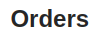

## bk-title

renders a header title.

```html
<bk-title></bk-title>
```




### Properties & Attributes


| property | attribute | type | default | description |
|----------|-----------|------|---------|-------------|
|`content`| - |[LocalizedText](../core_concepts#localization-and-i18n)|{}|title localized content |

### Listens to

This component listens to no event.

### Emits

This component emits no event.

### Bootstrap

None
