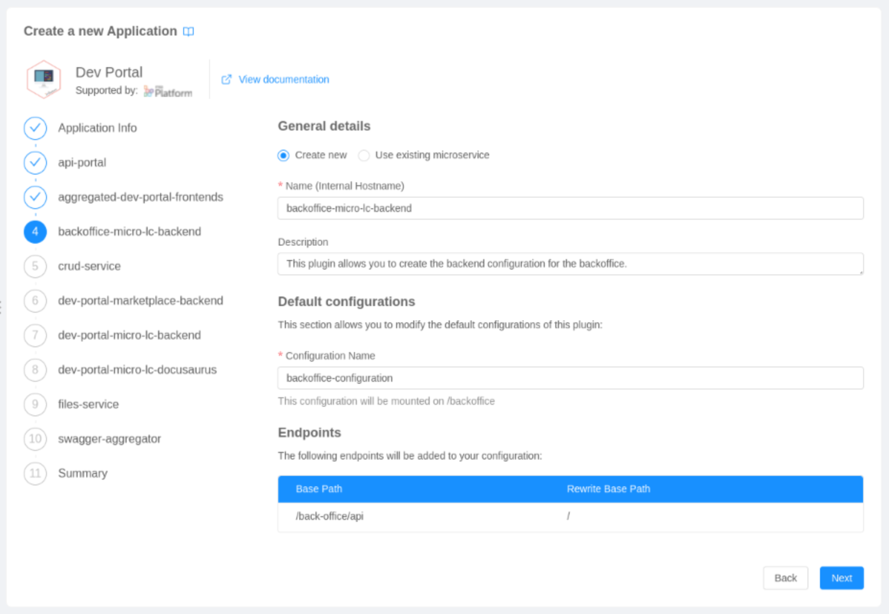

Creating the Developer Portal using the Mia-Platform Console is extremely simple. With just a few clicks and almost no configuration, you will be able to create all the necessary resources composing the Dev Portal architecture.

## Integration requirements

To integrate the Dev Portal, you only need to be able to access the project from which it will be exposed.

## Integration steps

To deploy a Dev Portal instance on the Mia Platform Console, you will have to:
- create the Dev Portal [application](/marketplace/applications/mia_applications.md);
- configure the theming properties of [micro-lc](https://microlc.io/documentation/docs/micro-lc);
- configure redirects;
- configure API documentation, authentication, and notifications (optional).

### 1. Create Dev Portal Application 

The first fundamental requirement for a correct Dev Portal configuration is creating the Dev Portal application through the [Marketplace](/marketplace/overview_marketplace.md).

The following steps will lead you to create an instance of the Dev Portal application:

1. Open the `Design` area of your project
2. Move to the `Application` section;
3. Create a new application using the **Dev Portal** application available in the `Core Plugins - Dev Portal` section of the marketplace:

   

4. Configure the name and the description for both the application and all the microservices composing it:

   

5. Review the creation of all the resources composing the application (microservices, endpoints, collections and public variables):

   

6. Complete the creation of the Dev Portal application by clicking `Create`.

### 2. Configure `dev-portal-micro-lc-backend`

After creating the Dev Portal application, you will be able to customize it with your **logos** and default **theme colors**. 

The following steps will lead you to the configuration of the theming properties used by the Dev Portal.

1. Go to the `Microservices` section 
2. Open the detail of the microservice originally named `dev-portal-micro-lc-backend`;
   
3. Move to the `ConfigMaps` section
4. Edit the [theming](https://microlc.io/documentation/docs/micro-lc/core_configuration#theming) property of the file `configuration.json`;
   
   :::caution
   The remaining configurations are already set for the `Dev Portal`: to know more about their purpose, please consult the [`Core Configuration`](https://microlc.io/documentation/docs/micro-lc/core_configuration) section of `micro-lc`. 
   :::

### 3. Configure Redirects

For this configuration step, move to the **Advanced** section of the console and select the `api-gateway` microservice.

:::info
These endpoints allow the two micro-lc instances, created respectively for the Backoffice and Dev Portal sections, to exist simultaneously without conflicts.
:::

Search for the following files and paste the content below:

- **maps-proxyUrl.before.map**
```json
# micro-lc Dev Portal
"~^\w+-/dev-portal/.+/api/v1/microlc(?<path>[/\?].*|$)$" "/v1/microlc$path";

# micro-lc Backoffice
"~^\w+-/back-office/.+/api/v1/microlc(?<path>[/\?].*|$)$" "/v1/microlc$path";

# micro-lc user info
"~^\w+-/.+/userinfo(?<path>[/\?].*|$)$" "/userinfo$path";
```

- **maps-proxyName.before.map**
```json
# micro-lc Dev Portal
"~^(secreted|unsecreted)-1-GET-/dev-portal/.*/api/v1/microlc/.*" "dev-portal-micro-lc-backend";

# micro-lc Backoffice
"~^(secreted|unsecreted)-1-GET-/back-office/.*/api/v1/microlc/.*" "backoffice-micro-lc-backend";

# micro-lc user info
"~^(secreted|unsecreted)-1-\w+-/.*/userinfo([/\?].*|$)$" "auth0-client";
```

- **root-location-extension.conf**
```json
location = / {
  include /etc/nginx/customization.d/header-debug.conf;

  return 302 '$original_request_scheme://$original_request_host/dev-portal/';
}

location = /dev-portal {
  include /etc/nginx/customization.d/header-debug.conf;

  return 302 '$original_request_scheme://$original_request_host/dev-portal/';
}

location = /back-office {
  include /etc/nginx/customization.d/header-debug.conf;

  return 302 '$original_request_scheme://$original_request_host/back-office/';
}
```

<br/>

:::caution
Please ignore any red feedback that may appear when pasting this content within the advanced section files.
:::

## Final result

At the end of these steps, the configuration of your project should include all the resources listed in the following sections. 

### Microservices
The complete configuration of the Developer Portal will include the following microservices: 

<table style={{textAlign:'left'}}>
  <tr>
    <th width='32%'>Microservice</th>
    <th width='10%'>Version</th>
    <th width='60%'>Description</th>
  </tr>
  <tr>
    <td>API Gateway</td>
    <td>5.0.0</td>
    <td>routes requests to the correct service and verifies the need of authentication.</td>
  </tr>
  <tr>
    <td>API Portal</td>
    <td>1.16.3</td>
    <td>shows the exposed APIs' documentation in the Dev Portal section.</td>
  </tr>
  <tr>
    <td>Aggregated Dev Portal Frontends</td>
    <td>0.4.2</td>
    <td>present graphically both the Backoffice and the Dev Portal sections.</td>
  </tr>	
  <tr>
    <td>Backoffice Micro-lc Backend</td>
    <td>0.7.0</td>
    <td>manage the Backoffice section.</td>
  </tr>	
  <tr>
    <td>Crud Service</td>
    <td>5.2.2</td>
    <td>manage the crud operations.</td>
  </tr>	
  <tr>
    <td>Dev Portal Marketplace Backend</td>
    <td>0.2.1</td>
    <td>manage the API marketplace section.</td>
  </tr>	
  <tr>
    <td>Dev Portal Micro-lc Backend</td>
    <td>0.7.0</td>
    <td>manage the Dev Portal section.</td>
  </tr>	
  <tr>
    <td>Dev Portal Micro-lc Docusaurus</td>
    <td>x.x.x</td>
    <td>displays the documentation inside the Dev Portal.</td>
  </tr>	
  <tr>
    <td>Files Service</td>
    <td>2.3.4</td>
    <td>handles files upload and download operations in the Backoffice section.</td>
  </tr>	
  <tr>  
    <td>Microservice Gateway</td>
    <td>6.0.6</td>
    <td>provides the ability to specify HTTP hooks to be invoked before and after each request.</td>
  </tr>	
  <tr>
    <td>Swagger Aggregator</td>
    <td>3.4.4</td>
    <td>expose the APIs' documentations of your microservices.</td>
  </tr>	
</table>

:::caution
When you create a Dev Portal application with already existing services, the version of these services will not be automatically upgraded.

Make sure the microservices in your project use the versions specified above. A Dev Portal application deployed with different versions may not be able to work properly.
:::

### Endpoints
The complete configuration of the Developer Portal will include the following endpoints: 

#### Aggregated Frontend Plugins

The APIs necessary for the Dev Portal frontend:

<table style={{textAlign:'left'}}>
  <tr>
    <th width='1%'>Endpoint</th>
    <th width='1%'>Microservice</th>
    <th width='1%'>Rewrite Base Path</th>
  </tr>
  <tr>
    <td>/</td>
    <td>aggregated-dev-portal-frontends</td>
    <td>/</td>
  </tr>
</table>

#### Backoffice

The APIs necessary for the management of the Backoffice section:

<table style={{textAlign:'left'}}>
  <tr>
    <th width='1%'>Endpoint</th>
    <th width='1%'>Microservice</th>
    <th width='1%'>Rewrite Base Path</th>
  </tr>
  <tr>
    <td>/back-office/api</td>
    <td>backoffice-micro-lc-backend</td>
    <td>/</td>
  </tr>
  <tr>
    <td>/files</td>
    <td>files-service</td>
    <td>/</td>
  </tr>
</table>

#### Dev Portal

The APIs necessary for the management of the Dev Portal section:

<table style={{textAlign:'left'}}>
  <tr>
    <th width='1%'>Endpoint</th>
    <th width='2.1%'>Microservice</th>
    <th width='2%'>Rewrite Base Path</th>
  </tr>
  <tr>
    <td>/dev-portal/api</td>
    <td>dev-portal-micro-lc-backend</td>
    <td>/</td>
  </tr>
  <tr>
    <td>/bff</td>
    <td>dev-portal-marketplace-backend</td>
    <td>/</td>
  </tr>
  <tr>
    <td>/docusaurus</td>
    <td>dev-portal-micro-lc-docusaurus</td>
    <td>/</td>
  </tr>
  <tr>
    <td>/documentation/assets</td>
    <td>dev-portal-micro-lc-docusaurus</td>
    <td>/assets</td>
  </tr>
  <tr>
    <td>/dev-portal/documentation/assets</td>
    <td>dev-portal-micro-lc-docusaurus</td>
    <td>/assets</td>
  </tr>
  <tr>
    <td>/dev-portal/api-portal/api</td>
    <td>swagger aggregator</td>
    <td>/</td>
  </tr>
  <tr>
    <td>/dev-portal/documentation/search-index.json</td>
    <td>dev-portal-micro-lc-docusaurus</td>
    <td>/search-index.json</td>
  </tr>
</table>

#### CRUD Endpoints

The APIs necessary for the management of the CRUD operations:

<table style={{textAlign:'left'}}>
  <tr>
    <th width='1%'>Endpoint</th>
    <th width='1%'>CRUD Collection</th>
  </tr>
  <tr>
    <td>/components</td>
    <td>components</td>
  </tr>
  <tr>
    <td>/categories</td>
    <td>categories</td>
  </tr>
  <tr>
    <td>/tags</td>
    <td>tags</td>
  </tr>
  <tr>
    <td>/requests</td>
    <td>requests</td>
  </tr>
  <tr>
    <td>/icons</td>
    <td>icons</td>
  </tr>
</table>

### CRUD Collections

The data model used for the management of the Developer Portal will include four collections: 
- [components](#components) 
- [categories](#categories)
- [tags](#tags)
- [requests](#requests)
- [icons](#icons)

#### Components
This collection is used to store the components that will be displayed in the marketplace. Excluding the default properties of the CRUD (_id, creatorId, createdAt, updaterId, updatedAt, __STATE__), the defined fields are:
- ***title***: the title of the component;
- ***icon***: the object that contains the file icon definition. For more detail, refer to the [icons section](#icons);
- ***type***: the type of the component (API, Event...);
- ***category***: the category to which the component belongs;
- ***tags***: the tags to which the component is associated to;
- ***description***: the description of the component, that will be displayed in the component detail;
- ***linkApiPortal***: the URL used to redirect the user to the API portal;
- ***linkDocumentation***: the URL used to redirect the documentation portal;
- ***supporterName***: name of the entity that supports the component;
- ***supporterIcon***: the object that contains the supporter icon definition. For more detail, refer to the [icons section](#icons).

#### Categories
This collection is used to save the name and description of the categories that can be used to group your components inside the marketplace. Excluding the default properties of the CRUD (_id, creatorId, createdAt, updaterId, updatedAt, __STATE__), the defined fields are:
- ***name***: Contains the name of the category;
- ***description***: Contains the description of the category.

#### Tags
This collection is used to save the name and description of the tags that can be used to enrich your components inside the Marketplace. Excluding the default properties of the CRUD (_id, creatorId, createdAt, updaterId, updatedAt, __STATE__), the defined fields are:
- ***name***: Contains the name of the tag;
- ***description***: Contains the description of the tag.

#### Requests
This collection is used to save the access requests to your components, made from the components marketplace. Excluding the default properties of the CRUD (_id, creatorId, createdAt, updaterId, updatedAt, __STATE__), the defined fields are:
- ***userEmail***: the email of the user that is requesting the access;
- ***userName***: the name of the user that is requesting the access;
- ***status***: the current status of the request (open, completed...);
- ***userOrganization***: the organization to which the user belongs to;
- ***requestedComponentId***: ID of the component that the user wants to access;
- ***publicKey***: the RSA public key of the user that is requesting the access;
- ***additionalDescription***: an additional description field to include further details regarding the request.

#### Icons
This collection is used to save the icons associated with each component. Excluding the default properties of the CRUD (_id, creatorId, createdAt, updaterId, updatedAt, __STATE__), the defined fields are:
- ***name***: the original name of the uploaded file;
- ***size***: the size of the uploaded file;
- ***location***: the location of the file on the bucket;
- ***file***: the name of the file on the bucket.

### Public Variables

The complete configuration of the Developer Portal will include the following public variables: 

<table style={{textAlign:'left'}}>
  <tr>
    <th width='1%'>Variable</th>
    <th width='15%'>Description</th>
  </tr>
  <tr>
    <td>BACKOFFICE_WEB_COMPONENTS_VERSION</td>
    <td>the version of the Backoffice components used in the `backoffice-micro-lc-backend` configurations.	</td>
  </tr>
</table>
