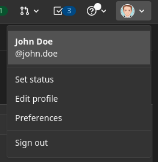

Each user in the console has an avatar image that can be configured on the authentication provider.

## GitLab

For GitLab, you should go in the `Edit profile` section, reachable from the top right corner.

Then, you can choose a new one in the `Public avatar` area.

## Okta

Okta does not manage any profile picture.

To make up for this lack, [Gravatar](https://gravatar.com/) is used as fallback: register to this service in order to set up a profile picture while using Okta provider.

Follow these steps: 

* Create an account on Gravatar
* Set a gravatar on your email 
* Go on the section "My Profile" - "Website" and add the Console url 
