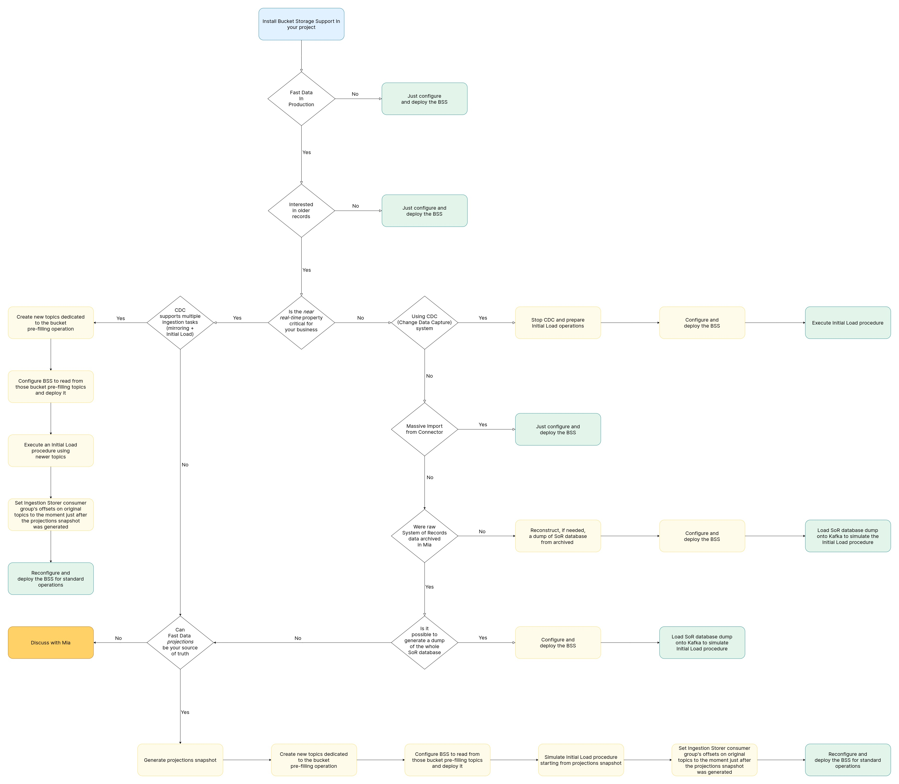

In this page, a description of all the possible scenarios supported for the installation of the Bucket Storage Support is provided. Try to identify your use case going through the steps of the [possible architectural setups](#possible-architectural-setups) and find your correct path. In every single paragraph the proper [possible procedure](#possible-procedures) is linked.

In the following diagram it is possible to find a summary of all the possible deployment paths, represented as a decision tree.

# Possible architectural setups

Below are described the possible architectural configurations that you may have in your Fast Data setup.

## Parallel deployment in a greenfield within Fast Data

When deploying the Bucket Storage Support within the Fast Data Solution, no particular configuration is required. You can proceed having a look to the [simple deployment section](#simple-deployment).

## Deployment in already existing Fast Data environment

There could be many different scenarios when deploying the Bucket Storage Support in an already existing Fast Data Environment. 

### Data preceding Bucket Storage Support installation doesn't need to be stored in the Bucket Storage

If you are not interested in storing in the Bucket the already existing data in the Fast Data, you can check out the [simple deployment section](#simple-deployment).

### Near Real Time critical

If the Near Real Time feature is critical for your systems, continue reading below, otherwise go to the [Near Real Time Non Critical section](#near-real-time-not-critical).

#### Using CDC

If you are using a CDC to feed the Fast Data then there could be different solutions:

- If the CDC supports multiple ingestion tasks go to the section [CDC supports multiple ingestion topics](#cdc-supports-multiple-ingestion-topics)
- If the CDC **does not** support multiple ingestion tasks try to look at the [Fast Data Projections as the Bucket Storage initialization input](#fast-data-projections-as-the-bucket-storage-initialization-input) section.

### Near Real Time not critical

If the Near Real Time feature is **not** critical for your systems, continue reading here below to identify your use case.

#### Using CDC

- If you are using a CDC to feed the Fast Data, go to [Stopping CDC and initialize Bucket Storage](#stopping-cdc-and-initialize-bucket-storage). 
- If you are not using a CDC go to the next section.

#### Using massive import from a connector

- If you are using a Connector using a scheduled massive import (e.g. importing data from a CSV file once a day), go to [Simple deployment section](#simple-deployment).
- If you are not using a Connector, go to next section.

#### System of Record data are not archived in Mia-Platform systems

- If raw data **are not** archived in Mia-Platform systems, go to [Raw Data dump Generation section](#raw-data-dump-generation)
- If raw data are stored in Mia-Platform systems, go to the next section.

#### System of Record data are archived in Mia-Platform systems and a dump is possible

- If raw data are archived in Mia-Platform systems, go to [Raw Data in Mia-Platform Systems dump generation section](#raw-data-in-mia-platform-systems-dump-generation)
- If a dump is not possible go to the next section.

#### System of Record data are archived in Mia-Platform systems but a dump is not possible

If a dump of the data stored in Mia-Platform systems is not possible, go to [Fast Data Projections as the Bucket Storage initialization input section](#fast-data-projections-as-the-bucket-storage-initialization-input)

:::tip
If none of these paths are satisfying your needs, please contact your System Administrator to find out the best solution for your use case.
:::

# Possible Procedures

Here below, all the possible procedures of the installation and initialization of the Bucket Storage Support are provided.

:::tip
Remember to identify the procedure following the proper use case needed reading the [Possible Architectural Setups](#possible-architectural-setups) section.
:::

## Simple deployment

For the simple deployment procedure, you just need to properly configure and deploy the services of the Bucket Storage Support ([Ingestion Storer](/fast_data/bucket_storage_support/configuration/ingestion_storer.md) and [Ingestion Reloader](/fast_data/bucket_storage_support/configuration/ingestion_reloader.md)).

## CDC supports multiple ingestion topics

To configure the CDC with multiple ingestion topics, the following steps are needed:

- Create new specific topics on Kafka dedicated to the Bucket initialization
- Configure the Bucket Storage Support to read from the above created topics and then follow the [Simple deployment](#simple-deployment) procedure.
- Execute an Initial Load procedure using the above created topics
- Set the Ingestion Storer consumer group's offsets to the moment just after the projections snapshot is generated
- Reconfigure the Bucket Storage Support for standard operations as explained in the [Simple deployment](#simple-deployment) procedure.

## Fast Data Projections as the Bucket Storage initialization input

To use Fast Data Projection as the Bucket Storage initialization input, the following steps are needed:

- Generate a Projections snapshot
- Create new specific topics on Kafka dedicated to the Bucket initialization
- Configure the Bucket Storage Support to read from the above created topics and then follow the [Simple deployment](#simple-deployment) procedure.
- Simulate Initial Load Procedure starting from the Projections snapshot
- Set the Ingestion Storer consumer group's offsets to the moment just after the projections snapshot is generated
- Reconfigure the Bucket Storage Support for standard operations as explained in the [Simple deployment](#simple-deployment) procedure.

## Stopping CDC and initialize Bucket Storage 

To initialize the Bucket Storage exploiting the CDC topics, the following steps are needed:

- Stop the CDC and prepare the Initial Load operations
- Configure the Bucket Storage Support as in the [Simple deployment](#simple-deployment) procedure.
- Execute Initial Load Procedure

## Raw Data in Mia-Platform Systems dump generation

- Configure the Bucket Storage Support as in the [Simple deployment](#simple-deployment) procedure.
- Load the System of Record database dump into Kafka to simulate Initial Load procedure

## Raw Data dump generation

- Reconstruct a dump of the System of Record Database from the archived data
- Configure the Bucket Storage Support as in the [Simple deployment](#simple-deployment) procedure.
- Load the System of Record database dump into Kafka to simulate Initial Load procedure
