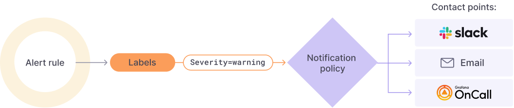
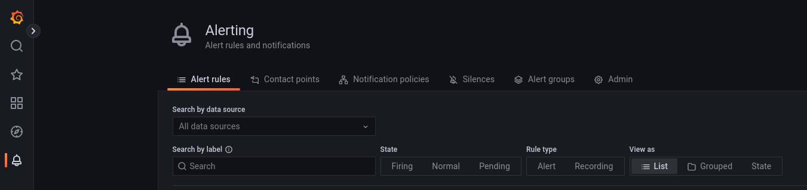

Grafana Alerting allows you to learn about problems in your systems moments after they occur [[1](https://grafana.com/docs/grafana/latest/alerting/)].

But how does the Grafana Alerting system works?

- **Alert Rules**:
  The evaluation criteria that will fire an alert instance. It is formed by:
  - one or more queries and expressions
  - a condition
  - the frequency of evaluation
  - (optional) the duration over which the condition is met
- **Labels**:
  A label matches an Alert Rule and its set of notification policies and silences
- **Notification policies**: 
  Here you can set where, when and how the alerts get routed.
- **Contact points**: 
  Define how the alerts are notified to your team

# Create An Alert

To create an alert we need to create the necessary components.

## Create an Alert Rule

- Select 'New Alert Rule' from the side menu (in the 'Alerting' section)
- Step 0: Select 'Grafana managed alert' or 'Mimir or Loki alert'
  
If you selected 'Grafana managed alert':
- Step 1: use query or expression to create your rule:
  - If you need to use a query, select the data source;
  - Add query and expressions;
  - Click 'Run queries' to check the correctness of the query;
- Step 2: Set an evaluation behavior (The interval and duration of queries valuation);
- Step 3: Add details:
  - The name, where to store the rule and annotations;
- Step 4: Specify custom labels to enable contact points.

If you selected 'Mimir or Loki alert':
- Step 1: Select a compatible data source (Loki/Prometheus) and write your LogQL/PromQL expression;
- Step 2: Set an evaluation behavior (Duration of time in which the query needs to have a 'true' value before firing the alert);
- Step 3: Add details:
  - The name, where to store the rule and annotations;
- Step 4: Specify custom labels to enable contact points.

## Suggested Alarm rules
We suggest to add the following rules to your infrastructure to have a basic control on faulting services.

**Crashloopbackoff pods**
To create an Alarm that detects if one or more pods in your system is in a CrashLoopBackOff state:

- Create a new Alert Rule (Grafana managed alert)
- Insert `kube_pod_container_status_waiting_reason{reason="CrashLoopBackOff"}` as Query A
- Insert an Expression B with:
  - Operation: Classic condition
  - When: last()
  - OF: A
  - IS ABOVE: 0
- Set alert condition: B-expression
- Manage as needed the rest of the configuration (details and contact points)

**Throttling pods**

- Create a new Alert Rule (Grafana managed alert)
- Insert `container_cpu_cfs_throttled_periods_total / container_cpu_cfs_periods_total` as Query A
- Insert a Expression B with:
  - Operation: Math
  - Expression: `$A > 0.8`
- Set alert condition: B-expression
- Manage as needed the rest of the configuration (details and contact points). You can use `{{ $labels.pod}}` to refer to the pod that is throttling.

:::note
  The value in the Expression B will fire if the utilization is above 80%. This value can be changed at will.
:::

**CPU limits percentage**

- Create a new Alert Rule (Grafana managed alert)
- Insert `sum(rate(container_cpu_usage_seconds_total{image!="", pod !="", container!="POD"}[5m])) by (pod, container) / sum(container_spec_cpu_quota{image!="", container!="POD"}/container_spec_cpu_period{image!="", pod !="", container!="POD"}) by (pod, container)` as Query A
- Insert an Expression B with:
  - Operation: Reduce
  - Function: Mean
  - Input: A
  - Mode: Strict 
- Insert an Expression C with:
  - Operation: Math
  - Expression: `$B > 0.8`
- Set alert condition: C-expression
- Manage as needed the rest of the configuration (details and contact points). You can use `{{ $labels.pod}}, {{ $labels.container }}` to refer to the pod that is throttling.
 
:::note
  The value in the Expression B will fire if the utilization is above 80%. This value can be changed at will.
:::

# Manage contact points (chatOps)

This section defines how to set up and manage the services where you want to send your alert notifications.

- In the alerting section of Grafana, click 'contact points' and 'New Contact Point';
- Select an alertmanager ('Grafana managed alert' or 'Mimir or Loki alert');
- Choose a name for the contact point and fill out the mandatory fields of your selected 'Contact point type'.

## Example: set up Google chat contact point

To set up a connection with Google chat, in the 'New contact point' menu:
- Select Google Hangouts Chat
- Generate a webhook Url and fill out the corresponding field:
  - Go to the Google chat where you want to receive the alerts.
  - Click on the downward triangle next to the Chat name and select 'Manage Webhooks'
  - Add another webhook, copy the Url given by Google chat and insert it in the Grafana Field.

