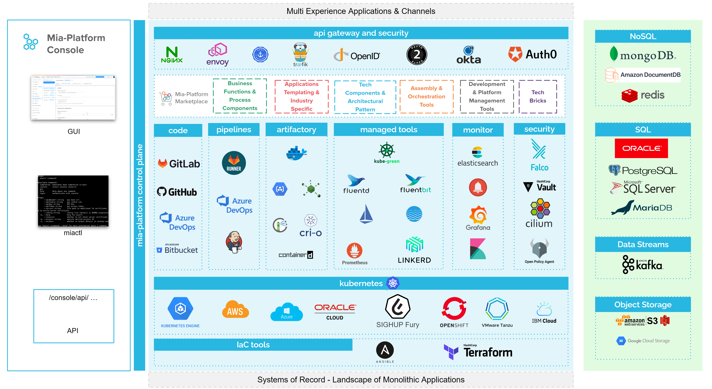

Mia-Platform PaaS (Platform as a Service) is a **cloud application platform** that runs on top of infrastructure as a service and hosts software applications. It provides a fast, easy, and scalable way to run applications in the cloud, whether it is public, private, or hybrid cloud.

Mia-Platform allows organizations to focus on two main things: their **customers** and their **code**.
PaaS will take care about all the system administration details of setting up servers - usually those needed for application development. All the benefits with none of the commitment.

Mia-Platform PaaS frees developers from installing in-house hardware and software. It usually incorporates various underlying infrastructure components - like operating systems, servers, databases, middleware, networking equipment, and storage services. All these components are owned, operated, configured, and maintained by the service provider, not the business. The business just provides the data and applications.

## Mia-Platform PaaS benefits  

The primary benefits of PaaS are **simplicity** and **convenience** for users, but it also ensures other benefits, like the following ones:

* Decrease infrastructure management;
* Automate or eliminate maintenance tasks;
* Remove the complexity of load balancing, scaling, and distributing dependent services;
* Adopt new offerings and technologies without problems.

### Mia-Platform PaaS services  

At Mia-Platform we are always empowering developers to be able to work with the latest available technology, when developing their applications. Our R&D Team is continuously adding new features and tools to the platform, so that you can always adopt the technology that fits you best.

Mia-Platform PaaS includes all the following services:

* Infrastructure Monitoring, 24/7 availability, fast fixes activities;
* Fully managed updates of any components behind Mia-Platform;
* Mia-Platform transparent updates;
* Immediate security patching;
* Backup and disaster recovery;
* Regular penetration and performance tests;
* GDPR compliance.

## Updates and Upgrades  

Mia-Platform PaaS (Platform as a Service) solution helps the teams to focus on their core business while the whole infrastructure and hosting is totally managed by Mia-Platform. Infrastructure and software upgrades are therefore managed by our internal team.  

Maintenance windows for upgrades are regularly scheduled every 3 months with at least 2 weeks notice to all the customers. Extraordinary unscheduled maintenance with shorter notice can happen in case of emergency security fixes of the infrastructure.  

Our software and infrastructure updates include:

* GitLab;
* Grafana;
* Kafka;
* Kubernetes;
* MongoDB;
* Nexus.
