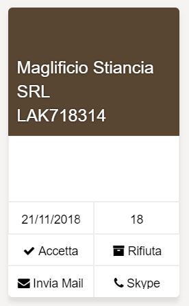
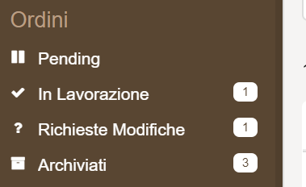
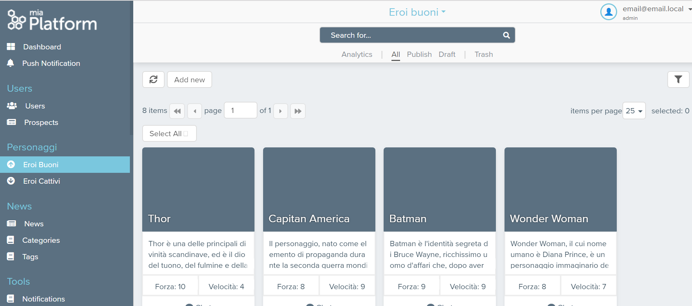
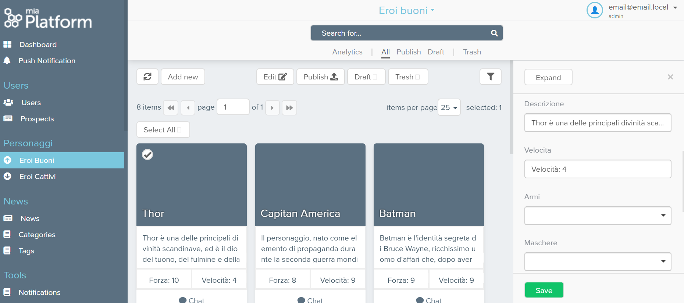
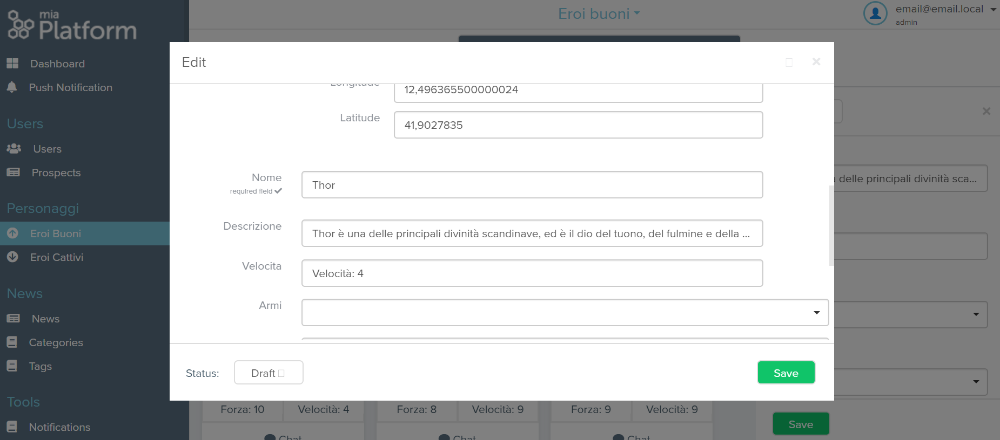
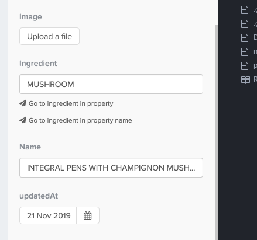

## CMS extensions

All previous configurations are automatically managed by the Console. However, there are some extensions that can not yet be configured from the front end but are managed by a component: the **config-extension**.

The extensions are the following:

- [CMS extensions](#cms-extensions)
- [CMS configuration files](#cms-configuration-files)
- [General CMS configuration](#general-cms-configuration)
  - [Example](#example)
- [Configure pages](#configure-pages)
  - [cmsProperties](#cmsproperties)
  - [properties](#properties)
- [Configure extensions](#configure-extensions)
  - [Configure the Card Layout](#configure-the-card-layout)
    - [Example](#example-1)
    - [Final example](#final-example)
  - [Configure notifications](#configure-notifications)
    - [Example](#example-2)
  - [Configure the highlights](#configure-the-highlights)
    - [Example](#example-3)
  - [Set conditional visibility of a property](#set-conditional-visibility-of-a-property)
    - [Example](#example-4)
  - [Access control on groups](#access-control-on-groups)
    - [Example](#example-5)
  - [Navigation between collection with link](#navigation-between-collection-with-link)
  - [Confirmation message for each action](#confirmation-message-for-each-action)
  - [Hide the search bar](#hide-the-search-bar)
  - [Configure the Gallery](#configure-the-gallery)
- [Configuration full example](#configuration-full-example)

## CMS configuration files

You can view and edit the content of configuration files directly from the Console: go to the *Design area* and click on the `Advanced` tab, from the list expand `cms-backend` item to see and edit each single configuration files.  

The configuration files are the following:

* `cmsProperties.json`
* `analyticsConfig.json`
* `dashboardConfig.json`
* `cmsConfiguration.json`

:::info
If the `cms-backend` item doesn't exist you can create it from project configuration repository: inside the `config-extension` folder you should create the `cms-backend` folder that will contain all CMS configuration files
:::

:::caution
The configurations files are JSON, so they can't be empty. When you create a file for the first time you will **need to insert an empty object**: `{}`
:::

## General CMS configuration

Through the `cmsConfiguration.json` file you can configure general aspects of CMS.  
The following table reports keys and related acceptable values:

 key | type | Comment
------- | ------- | -------
`hideAnalyticsDashboard` | boolean | Set true to hide dashboard panel in cms-site
`landingPage` | string | Define the default landing page providing the CMS page endpoint without the initial slash
`cmsMenu` | Object | Object to define the cmsMenu configuration
`cmsMenu.label` | string | Define a label for the cmsMenu section on the sidebar. Used to override the `Service` label that is used as default

### Example

```json
{
  "hideAnalyticsDashboard": true,
  "landingPage": "orders"
  "cmsMenu": {
    "label": "My custom label"
  }
}
```

## Configure pages

Through the `cmsProperties.json` file you can configure CMS extension for **each page**.  

When you want to add custom configurations to a page, **you have to add** its `<page id>` (the **CMS page endpoint without the initial slash**) key where you can define the following properties:

* `cmsProperties` where you can configure general page settings in the CMS
* `properties` where you can configure every single property as it can be viewed and managed.

You can configure a CMS page using a **fast-data-projection** endpoint, its `<page id>`, and then configure the `cmsProperties` and `properties` correctly.

:::info
A CMS page connected to a projection can **not** be edited, it is **read-only**.
The property `cmsEditable` must be `false` for each properties of the collection.
The property `cmsProperties.blocked` should be `true`.
:::

### cmsProperties

Let's assume we are within the **heroes** collection and want to configure our CMS heroes page.

The object identified by `cmsProperties` key can have the following properties:

key | example value | Comment
------- | ------- | -------
`label` | Heroes | label is the label that allows you to choose the name of your collection in the CMS menu. in our case we will write Heroes
`layoutType` | table | you can decide the layout you want to give to your collection. **table** is the most classic table view mode. **tableUser** is the display mode for users. It has in fact a special Reset Password field at the beginning of the table. **tablePush** instead is the perfect table for push notification or to send notifications to customers. Next to the table you will always find a push button to inject the content to your customers. If you select **card** each item will be represented similar to a card. **gallery** is instead the perfect representation for images
`defaultStatus` | draft | it can instead be either **draft** or **publish**. If you write draft once you upload an item it will not be published automatically on your applications, but you will have to give it the public command later. If you write publish instead whenever you edit or load an item it will be published automatically. In our case we will put draft.
`defDelete` | false, | if it is **true** the elements once deleted by trash will be permanently deleted. if it is **false** you can retrieve them from Mongo, but they will not appear on the CMS
`category` | | here you can configure the menu category in which to display your collection.
`category.name` | General | this is the name of the category that will appear in the CMS
`category.order` | 10 | this is the order of the category in the menu. We advise you to always put the order in the tens. In fact, you will want to insert other collections or categories in the future. If before, for example, we would already have a category in order 3 to place this we would have to change all the others in cascade. With the tens, however, just put an intermediate number.
`hidden` | false, | bringing this field to **true** you can choose not to show the collection in the CMS
`blocked` | false | bringing this field to **true** you can choose to block the collection. No one will be able to create new fields.
`icon` | book | in this [link](https://fontawesome.com/icons) you will be able to see all the available icons to display in your menu
`order` | 10 | indicates the order of a collection within a category. With 10 will be the first to appear. It is advisable to follow the tens rule here too.
`baseQuery` | "" | base query allows you to apply a general filter of visibility - It must follow the rules of logical expressions. An example would be: to hide the FOO BAR property from associations and services. it will be written like this: {"idAssocServices": {"$ne": "FOO BAR"}}
`highlight` | "" | in this string you can enter the name of a collection property (boolean only) that when it is true will be highlighted in the CMS.
`confirmBeforeEdit` | "" | if true, enable double check before save
`imageLinkBaseUrl` | "" | a custom URL used to replace the base URL
`filesCollection` | "files" | the collection that will be used to save the related files of your collection (**default**: "files")

So the final JSON file will look like

```json
{
  "heroes": {
    "cmsProperties": {
      "label": "heroes",
      "layoutType": "table",
      "cardType": "",
      "defaultStatus": "draft",
      "defDelete": false,
      "category": {
        "name": "General",
        "order": 0
      },
      "hidden": false,
      "blocked": false,
      "icon": "book",
      "order": 0,
      "confirmBeforeEdit": true,
      "imageLinkBaseUrl": "https://example.com",
      "filesCollection": "files2"   
    }
  } 
}
```

### properties

The `properties` property contains all the CRUD fields exposed in the CMS page endpoint. Each field has a similar structure.

By default there will be the fields: `_id`, `created_at`, `updated_at`.

The object identified by `properties` key contains all the fields in the collection. Each field has a similar structure and can have the following properties:

key | example value | Comment
------- | ------- | -------
`id` | name | property id
`type` | "string", | the types can be: string, number, boolean, geopoint, date, object, array
`required` | false, | **true** if you want the data to be mandatory
`label` | Name | it's the label you want to give to your property
`cmsVisibility` | | cmsVisibility allows you to decide at what level you want to show a property. The four levels can be: **0** and is not visible; **1** and is visible in the main table; **2** and is visible when you click in the table, in the right area of your CMS; **3** and is visible in the modal section that appears large in the center of the page when you click on "expand". At the **3** level, explanations of information appearing on the other levels. At level **2** we tend to put non-priority information, but which bring value, insights. In our case we will put **1** in when the information is a priority. The visibility property can also be configured to be visible only in some cases, via **"new"** and **"edit"**. Both are objects that contain a query, so they allow you to set complex conditions. **"new"** allows you to make visible the property being created, **"edit"** allows you to make visible the property being edited.
`cmsVisibility.level` | 1 | The four levels can be: **0** and is not visible; **1** and is visible in the main table; **2** and is visible when you click in the table, in the right area of your CMS; **3** and is visible in the modal section that appears large in the center of the page when you click on "expand". At the **3** level, explanations of information appearing on the other levels. At level **2** we tend to put non-priority information, but which bring value, insights. In our case we will put **1** in when the information is a priority.
`cmsOrder` | 10 | it is the order that you want to give it within the collection. in our case it will be the first, so we will write 10
`cmsEditable` | true | **true** if you want it to be editable by CMS
`hidden` | false | if you want the property to be invisible
`description` | "" | if you want to add a description
`cmsCardPosition` | 0 | indicates the location of the property in the Card layout
`interfaceType` | string | the properties can be of different types: **string** if it is a classic text string; **number** if it is a number; **date** if it is a date with dd / mm / yyyy; **datetime** is instead a complete date with hours, minutes and seconds; **boolean** if it can only be true or false; **text** if we want the content to be read as html; **textArea** if it is a text field, then for example a description; **cmslookup** are used to select some values ​​or between a range of values chosen by me or between a range of values taken from another collection. **cmsmultilookup** if you want to select multiple values; **array** if you want to save it as an ordered set of properties; **object** is an unordered property set; **geopoint** if you want me to save a specific place; **Files** if it is a file such as an image or a pdf. In our case we will choose string simply wanting to write the name of the title.

the final json in our property **name** which is the name of the heroes will therefore be:

```json
"heroes": {
  "properties": {
    "name": {
      "id": "name",
      "type": "string",
      "required": false,
      "label": "name",
      "cmsVisibility": {
        "level": 1,
        "edit": {
          "query": {
            "name": {
              "$exists": true,
              "$ne": ""
            }
          }
        },
        "new": {
          "query": {
            "name": {
              "$exists": true,
              "$ne": ""
            }
          }
        }
      },
      "cmsOrder": 10,
      "readonly": false,
      "cmsEditable": true,
      "hidden": false,
      "description": "",
      "cmsCardPosition":0,
      "interfaceType": "string"
    }
  }
}
```

## Configure extensions

You can configure extensions for every single page by modifying `cmsProperties.json` file. As said before for each page you have to add a `<page id>` (the **CMS page endpoint without the initial slash**) key.

### Configure the Card Layout

Cards allow you to view your data no longer in the table, but in the form of Card.

For each page that you want to display as cards you have to define the card object inside the `cmsProperties` key as explained below.

:::caution
Although cards are an extension, remember that the CMS page you want to display as a card must have the **display type set to card** in its general settings.
:::

The card object is composed of two keys:

1. `cardHeader` which represents the top structure of the card and is an object that requires three properties:

 key | type | Comment
------- | ------- | -------
`title` | string | The field of the collection from which get the title
`subtitle` | string | The field of the collection from which get the sub title
`image` | string | The field of the collection from which get the image

:::note
The 3 fields are mandatory in configuration but can be left empty.
If no image is associated with the image, the card will be colored with the side menu color
:::

#### Example

```json
"cardHeader": {
  "titleProperty": "laboratory",
  "subTitleProperty": "productId",
  "imageProperty": "image"
}
```

2. `cardContentRows` instead is an array entirely customizable. Each object can be a one of the following widgets:

   * **textArea** - is a multi-line text field ideal for properties that require high space (eg. notes, description)
   * **text** - is a small text field, it can generally be used to show simple properties
   * **button** - allows you to configure buttons within your cardType. The endpoint to which you want to connect must be specified in the "routes" key.
   * **link** - allows you to configure buttons that refer to a URL, in order to automatically open an application. In the configuration of the link buttons, it is necessary to specify in the "linksType" key the link to be obtained by pressing the button. Furthermore, in this type of widget it is possible to insert icons to be displayed on the button.  
   At the moment there are already three link buttons that can be used:
      * **Send Mail**, which allows you to send an email. To configure this button it is necessary to insert **"email"** in the configuration of the card in the "linksType" field.

      * **Call Skype**, which allows you to start a Skype call. To configure this button it is necessary to insert **"skypeCall"** in the card configuration in the "linksType" field.

      * **Skype Chat**, which allows you to automatically log in to Skype chat. To configure this button it is necessary to insert **"skypeChat"** in the card configuration in the "linksType" field.

Each widget can consist of multiple properties of the same type. For example. If I choose a text widget within it I can display more properties of type text. The cars based on the number of elements present divide the card space.

:::tip
Here is an example of card content rows - With this view you will see below the header a field notes, two properties, two buttons and two links.
:::

```json
"cardContentRows": [{
  "type": "textarea",
  "properties": ["note"]
  },
  {
    "type": "text",
    "properties": ["newExpirationDate", "newItemNumber"]
  },
  {
    "labels": ["Accept", "Refuse"],
    "type": "button",
    "routes": ["/api/change-request/accept", "/api/change-request/refuse"],
    "ids": ["accept", "refuse"],
    "icons": ["check", "archive"]
  },
  {
    "type": "link",
    "labels": ["Mail", "Skype"],
    "icons": ["at", "skype"],
    "linksType": ["email", "skypeCall"],
    "properties": ["mail", "skypeId"]
  }]
```

 To insert the card into a collection, write the name of the collection exactly and then insert the card into cmsProperties:

#### Final example

Here is an example of a final card within the change-requests collection:

```json
"change-requests": {
   "cmsProperties": {
     "cardHeader": {
       "titleProperty": "laboratory",
       "subTitleProperty": "productId",
       "imageProperty": ""
     },
     "cardContentRows": [{
       "type": "textarea",
       "properties": ["note"]
     },
     {
       "type": "text",
       "properties": ["newExpirationDate", "newItemNumber"]
     },
     {
       "labels": ["Accept", "Refuse"],
       "type": "button",
       "routes": ["/api/change-request/accept", "/api/change-request/refuse"],
       "ids": ["accept", "refuse"],
       "icons": ["check", "archive"]
     },
     {
       "type": "link",
       "labels": ["Mail", "Skype"],
       "icons": ["at", "skype"],
       "linksType": ["email", "skypeCall"],
       "properties": ["mail", "skypeId"]
     }
     ],
    "notification": {
     "query":
     {"responseReceived": "false", "trash": 0}
   }
  }
 },
 "our-properties": {
   "cmsProperties": {
     "cardHeader": {
       "titleProperty": "name",
       "subTitleProperty": "",
       "imageProperty": "image"
     },
     "cardContentRows": [{
         "type": "textarea",
       "properties": ["description"]
      },
      {
       "type": "link",
       "labels": ["Mail", "Skype"],
       "icons": ["at", "skype"],
       "linksType": ["email", "skypeCall"],
       "properties": ["mail", "skypeId"]
     }
    ]
   }
 }
```

Here are some examples of realized cards

 

In the example we have therefore:

* two buttons - accepts and refuses;

* two links - mail and skype, which allow you to automatically open the e-mail and skype applications.

### Configure notifications

:::info
You can easily configure notifies directly from Console.  
Check out the [related section](config_cms.md#configure-the-general-settings) to know how do it
:::

The notifications in the side menu allow you to display the number of elements that satisfy a condition in the notification form.

To configure notifications you have to define an object inside the `cmsProperties` key as explain following. The object is composed of only one element: a **query**. Within the query you must specify the condition for which the single data is counted.

#### Example

```json
"notification": {
  "query": {
    "isLate": true, 
    "state": "working", 
    "trash": 0
  }
}
```

The display will be as follows:



In the example, the notification shows the number of delayed elements in the current state.

### Configure the highlights

:::info
You can configure the highlights directly from Console.  
Check out the [related section](config_cms.md#configure-the-general-settings) to know how do it
:::

The highlights allow you to highlight rows in the tables. You have to define an object inside the `cmsProperties` key as explain following. A highlight is an object composed of three parameters:

* **query**, ie the condition to be satisfied for the table row to be highlighted;

* **color**, text type parameter that configures the text color;

* **backgroundColor**, which configures the background color. You can enter any valid HTML colors, using the name or the hexadecimal value.

#### Example

```json
"highlight": {
  "query": {
    "isLate": true,
    "state": "working", 
    "trash": 0
  },
  "color": "white",
  "backgroundColor": "#d55d5f"
}
```

### Set conditional visibility of a property

Conditional visibility allows you to view a property only under a certain condition. From CMS the user has the possibility to view a property of a collection in two moments:

* in the creation phase, when the user creates a new item in a collection using the "add new" button;

* when editing, when the user modifies an existing element from the right side menu.

Conditional visibility can be set to a property at either time, or only in one of the two, depending on the need.

To set the conditional visibility, write the name of the collection and in `properties` specify the name of the property.

#### Example

Here is an example of a complete configuration:

```json
"heroes": {
  "aclExpression":"groups.admin",
  "analytics": [{
    "id": "statistics",
    "order": 10,
    "width": 12
  }],
  "properties": {
    "strength": {
    "cmsVisibility": {
      "visibility" :0,
      "edit": {
          "query": {
            "name":"Thor"
          }
      },
      "new": {
          "query": {
            "name":"Thor"
          }
      }
    }
  }
}
```

In **"properties"** the properties to be conditioned are listed (in the example, only "force"). The only configuration of conditioned visibility is as follows:

```json
"cmsVisibility": {
  "visibility" :0,
  "edit": {
    "query": {
      "name":"Thor"
    }
  },
  "new": {
    "query": {
      "name":"Thor"
    }
  }
}
```

The **visibility** field is used to define the level at which the property is to be viewed. The possibilities of the values are:

* 0, to hide the property;

* 1, to display the property on the main page of the collection;



* 2, to display the property in the right side menu when clicking on the item;



* 3, to display the property in the modal section that appears large in the center of the page when you click on "expand".



**"Edit"** is used to set the conditioned visibility on the property when editing an element, the **"new"** field is used to set it when creating the element. In the example, conditional visibility is set in both phases.

After "edit" or "new" you insert a **"query"** to specify the condition that determines the visibility of the property. In the example the condition is simply that the name is Thor. The query is a mongoquery: you can have support to write the mongoquery to the following [link](https://docs.mongodb.com/manual/tutorial/query-documents/).

### Access control on groups

This extension allows you to **control access to CMS collections**, depending on the group. In fact it is possible that various groups of users access the same CMS, but that not all information is visible to everyone.

When in json, the ACL on groups fits into all the collections that want to be controlled. **In the ACL property you enter the name of the groups that can see that collection.** The syntax is as follows:

```json
"<page id>": {
  "aclExpression": "groups.groupname"
}
```

In the rest of the JSON, all the other properties of the collection are configured. The group to which access is reserved is expressed with "groups.groupname". If the property is not configured, the default collection is visible to everyone.

#### Example

```json
"heroes": {
  "aclExpression":"groups.admin",
  "analytics": [{
  "id": "Statistics",
  "order": 10,
  "width": 12
  }],
  "properties": {
    "strength": {
      "cmsVisibility": {
        "visibility" :0,
        "edit": {
          "query": {
            "name":"Thor"
          }
        },
        "new": {
          "query": {
            "name":"Thor"
          }
        }
      }
    }
  }
```

In this case the Heroes collection is only visible to administrators.

### Navigation between collection with link

The goal of this feature is to speed up browsing between collections; to give an example: within an order I have a reference to a user for whom I need to find additional information to contact him. I can configure a link that takes me directly to the users collection looking for or filtering for the specific user who was saved in the order.

**Configuration**

To set the navigation links, you have to define an object inside the `properties` key as as shown in the example
 write the name of the collection and in properties specify the name of the property.

```json
"properties": {
  "<field_name>" {
    "cmsLinks": [{
      "collectionIdTarget": "yourCollectionId", in our example: users
      // collectionPropertyIdTarget is not required: if not present the navigation will search the value within the search and not within the filters ///
      "collectionPropertyIdTarget": "yourPropertyId", in our example maybe the name of the user
      // the possible values are equals (eq) or contains (ct); the default value is equal; ///
      "operator": "eq"
    }],
  }
}
```



### Confirmation message for each action

Some collections are very delicate and need to be sure you want to change some data. with this configuration it will be possible to request a double confirmation for each action.

**Configuration**

```json
"confirmBeforeEdit": true,
```

### Hide the search bar

With this configuration it is possible to hide the search bar

**Configuration**

```json
"hiddenSearchBar": true,
```

### Configure the Gallery

Gallery layout allows you to show images and files in the CMS. The image is downloadable by clicking the proper icon.

You can also copy the link and share it directly. There are some different scenarios:

* if the file location is saved as a URL, its value is copied directly
* if file location is saved as path, instead, the copied URL is relative to CMS host
* the base URL can be configured to differ from the CMS host, you can customize it by passing the `imageLinkBaseUrl` property in the CMS collection configuration (NB: this base Url is only used when the file location is not a URL itself)

To configure this layout you have to define an object inside the `cmsProperties` key as shown in the example. This configuration will override the default `imageLinkBaseUrl` property to `http://myUrl.it`:

```json
{
  "label": "labelName",
  "layoutType": "gallery",
  "defaultStatus": "publish",
  "imageLinkBaseUrl": "http://myUrl.it",
  ...
}
```

When the copy icon is clicked, the following URL will be saved in your clipboard: `http://myUrl.it/path/to/the/image`.

## Configuration full example

```json
{
  "<page id>": {
    "cmsProperties": {
      // Managed by Console ///
      "label": "heroes",
      "layoutType": "table",
      "cardType": "",
      "defaultStatus": "draft",
      "defDelete": false,
      "category": {
        "name": "General",
        "order": 0
      },
      "hidden": false,
      "blocked": false,
      "icon": "book",
      "order": 0,
      "aclExpression": "groups.admin",
      "confirmBeforeEdit": true,
      "baseQuery": {
        "isLate": true,
        "state": "working",
        "trash": 0
      },
      "notification": {
        "query": {
          "isLate": true,
          "state": "working",
          "trash": 0
        }
      },
      "highlight": {
        "query": {
          "isLate": true,
          "state": "working",
          "trash": 0
        },
        "color": "white",
        "backgroundColor": "#d55d5f"
      },
      // Extension for hide search bar ///
      "hiddenSearchBar": true,
      // Extension for confirm each action ///
      "confirmBeforeEdit": true,
      // Extension for create cards ///
      "cardHeader": {
        "titleProperty": "laboratory",
        "subTitleProperty": "productId",
        "imageProperty": ""
      },
      "cardContentRows": [
        {
          "type": "textarea",
          "properties": ["note"]
        },
        {
          "type": "text",
          "properties": ["newExpirationDate", "newItemNumber"]
        },
        {
          "labels": ["Accept", "Refuses"],
          "type": "button",
          "routes": ["/api/change-request/accept", "/api/change-request/refuse"],
          "ids": ["accept", "refuses"],
          "icons": ["check", "archive"]
        },
        {
          "type": "link",
          "labels": ["Mail", "Skype"],
          "icons": ["at", "skype"],
          "linksType": ["email", "skypeCall"],
          "properties": ["mail", "skypeId"]
        }
      ],
      // PROPERTIES AREA 
      "properties": {
        "name": {
         // Managed by Console ///
          "id": "name",
          "type": "string",
          "required": false,
          "label": "Name",
          "cmsVisibility": {
            "level": 1,
            "edit": {
              "query": {
                "name": "Thor"
              }
            },
            "new": {
              "query": {
                "name": "Thor"
              }
            }
          },
          "cmsOrder": 10,
          "readonly": false,
          "cmsEditable": true,
          "hidden": false,
          "description": "",
          "cmsCardPosition": 0,
          "interfaceType": "string",
          ///acl for properties ///
          "aclExpression": "groups.admin",
          // if interfaceType = cmslookup or cmsmultilookup ///
          "cmsLookup": {
            "text": {
              "sources": [
                "name"
              ],
              "delimiters": []
            },
            "value": "id",
            "autoSelect": false,
            "reset": false,
            "limit": 5,
            "query": "",
            "searchLive": false,
            "collectionIdSource": "brands"
          },
          // button configurations ///
          "actions": [
            {
              "id": "sendInvoice",
              "label": "Send Invoice",
              "route": "/sendinvoice",
              "icon": "paper-plane"
            }
          ],
          // navigation between collection with links ///
          "cmsLinks": [
            {
              "collectionIdTarget": "yourCollectionId",
              // collectionPropertyIdTarget is not required: if not present the navigation will search the value within the search and not within the filters ///
              "collectionPropertyIdTarget": "yourPropertyId",
              // the possible values are equals (eq) or contains (ct); the default value is equal; ///
              "operator": "eq",
              // if you wanna navigate to a custom front-end in the service category you should add the following properties ///:
              "targetType": "service",
              "serviceIdTarget": "name of the custom frontend",
              "queryStringKey": "select"(this is an example, here you can put whatever you custom frontend accepts as parameter in a query)
            }
          ],
        }
      }
    }
  }
}
```
