A Content Management System (CMS) is used to post, process, publish, delete content that is shown in an app or site.

## Access the CMS

To access the CMS simply connect from a normal browser to the cms URL.
This is the initial screen where to enter the credentials: mail, password, key and secret.

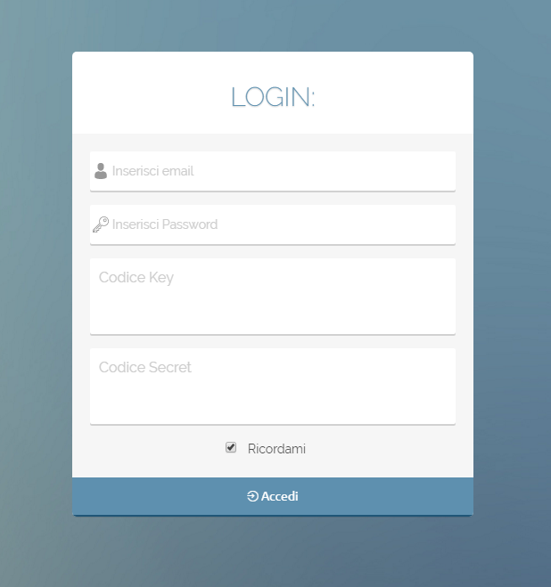

## Key and Secret

These two keys, together with user and password, are necessary to access the CMS and will be provided by Mia.

Key example:

KEY:
771c47d353e1bd737c3927aa12a9337dabd7f5c48e69d243caaaa8b9801251a5ec4ea24d0827019dbcff21cfe39e3089ae2b42ff505992b7fe0c72641a8117e9173cedecab3b75cc9c284d8fbaae366bf91f851f3393ac6e9c15eab1819933eeaa006dc61bb7e08570e3baa9e2ea1f10ed32e169e4b60285d4ba97b159d4ad2ff266ae68d1acb25da8cc81a91f9245fb8111f101bd2ccebf62aa1229a95ca8e1f263b58ecae9a10dc9ed752d1c9b55422fe4ca3ed5a20c9e858a8f6c13504b5950143879f71acd5c5ec1a731f8978df66bd082f59cf49b381d04371bd6934b45050e4740b34a4dd62dcab34cf678771022cba1383458215e7c9e2bda672a852f

SECRET:
6a84d1a0e92bbce2ee47bcfc138710b731e14572f5cd12b7d52d2fc003ea229487cd4fd7d495991ce90a98cfda779ee533562894b4f78e38e7ce9481165dc033b4c17e2572f8df5330d2c5794767f084fd3f278446695789911da8fc7627cd86409e0922d0413b033bde651bfd9bb76c87eb63e5e0820260ba6f2fc1aafac54c45c2ee28cce7bf01dd207dd501347627a8ebe67a9cae1d24716519757c440ae94b66172cee6777497f4f14b08a78e1c182be7149b65246e9c28756aaf65375dc148e0c7820eee3adcca14a8d20b8a641cab8c48d92ab0c811913f47da978c98f5a844db7b40e7c66fa692b249481b580cbf184b2e70460f007d064dfb4afade8

**N.B.** It is important that in the copy / paste of the two keys no spaces or wrap are added, otherwise it will not be possible to access the CMS.

# Users

## Types of users

Only users *admin can access the CMS*

There are two types of users on the CMS: users (all users of the app or site) and admin (users of the app enabled to access the CMS).

When defining the project it is possible to decide to create more user groups. Having a segmentation of users in multiple groups can be useful for certain marketing activities and for sending push notifications to specific groups.

The topic Push notifications will be detailed in the dedicated paragraph.

## Adding and editing users

To add a user you will need to enter the Users collection and then click on Add New.

The following window will appear, in which the fields describing our user must be completed. In particular, in this window you decide which type of access to give: if only user (service user) or even admin (user with access to the cms).

When a user is created, he is also assigned a password, which the user can modify at the first access and which can not be changed from CMS.

From CMS you can send a push notification to reset it by clicking on Reset Password.

At any time users can be modified by enabling or disabling the admin function from the editing window.

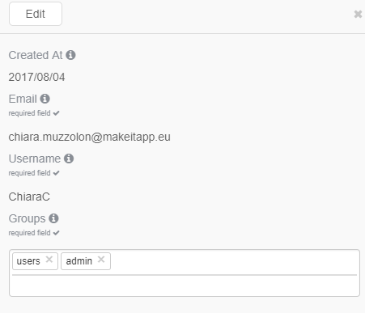

## Content management

In the CMS side menu there is a list of *collections* organized into *categories*.

A collection is a set of data shared by some properties. A category is nothing more than a set that contains collections and is only useful for the visual ordering of the CMS.

To make the use of the CMS more immediate, consider the following example: a CMS for managing the contents of a library app with the active books loan service.

The following diagram exemplifies the CMS skeleton, composed of categories, collections and properties, applying it to a hypothetical library.

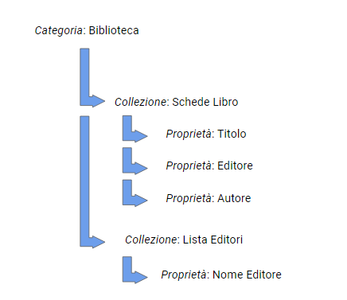

When logged in to the CMS, the side menu shows the list of manageable collections.

The Library category collects the collections of the Books Cards, Loans Books and the List of Publishers; the Users category contains the Users and Reviews collections; Tools includes the Media collection.

Each collection presents a set of data that share some properties:

for example, in the Books Cards collection the books shared by the properties are collected: title, genre, author, plot, cover image, publication date, publisher.

### News, Categories and Tags: the CMS default collections

There are some collections on the CMS: News, Categories, Tags.
These collections are already configured and therefore ready to be used.

These three collections work as a common blog, and then in News you will have the text of the news (or post), the title, the date of publication on the site or in the app and then the category and tags.

Still following the example of the library, in **News** we could announce the presentation event of the new book by John Smith.

In **Categories** you will have all the categories to which to associate a News (see paragraph lookup for the configuration / creation of the category fields), and then in this case you can associate to the category Presentations.

In **Tags** you will have all the tags, the topics, associated to the news / post and that will be useful to index it and to find it again.

In the example of the presentation of the book by John Smith you will therefore have:

* News: John Smith presents its new book in Milan on December 6th *

* Categories: Presentations *

* Tags: John Smith, Novels, Milan, etc. *

The properties of a collection can be viewed in the first table and in the detail tab of the single object that appears on the right when selected on an element (as in the image below).

In the example of the library app, in the side menu some additional fields appear that you chose to hide from the main view of the contents of the collection because secondary properties or was not useful or functional to see in the first table, as the plot or image of cover.

| ↑                                     | ↑                                                                                 | ↑                                      |
|---------------------------------------|-----------------------------------------------------------------------------------|----------------------------------------|
| navigation menu between collections | main view with the list of content of selected collection | detail view of the single object |

### New content (draft / publish)

For example, if you want to add the card of a new book you will proceed in this way:

* Collection of Books Cards

* Click on "add new" on the top left

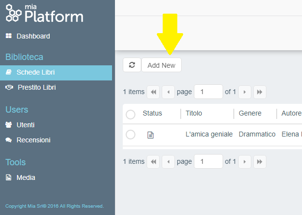

A window will open in which you will need to fill in all the fields useful for publishing the book form in the app (properties).

Remember that:

* Fields with an asterisk are required.

* Passing the mouse on the "i" one reads the tooltip, that is the description of that field.

Once the book form has been created and saved, it will be in draft or directly published.

It is recognized by the symbol(draft) or  (publish) .

Depending on the type of item to be published, it will be useful to have it first in draft or directly published.

*Example*: a new book card that once published goes directly into the app will be better to have it first in draft, so you can create several and publish them later. A new editor in the publishers list (see Section Lookup etc.) can be directly published because only this way will appear in the list of another collection.

When the *publish* or *draft* symbol of the relevant line is selected, 4 buttons will appear: **edit**, **trash**, **draft**, **publish**.

### Changing the individual content (edit)

Clicking on **edit** will open the window with all the editable fields.

The x in the upper right corner closes the window without making any changes.

The Back button works like x.

The Trash key deletes the line.

The Save button saves the changes made.

### Delete the single content (trash)

To delete a line click on **trash**. In this way the line will not be permanently deleted: it can be retrieved by clicking on trash at the top below the search bar.

Any content deleted from the trash folder, then it will no longer be recoverable.

### Massive selection of contents

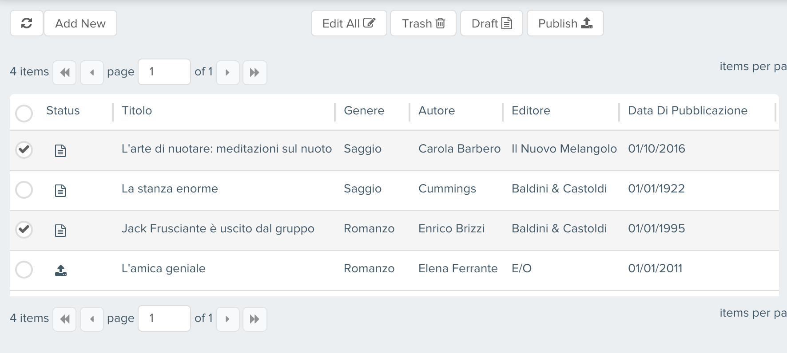

**Edit all** makes the change to all the selected elements.

To change the genre to multiple tabs, simply select all the tabs you need and click on Edit All.

The following window will open, where you can select the fields to be modified and which will be applied to all elements.

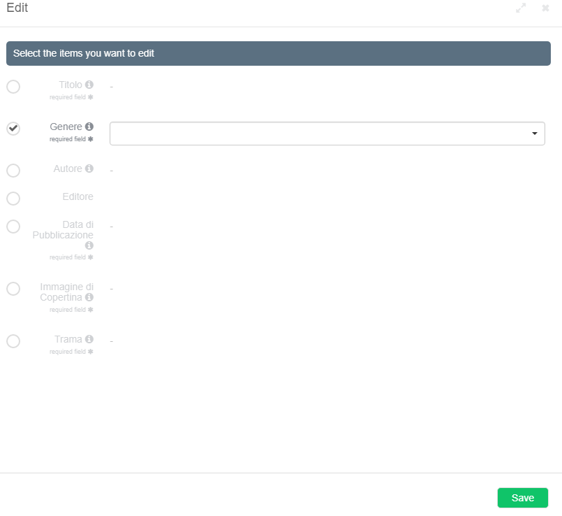

## Le Lookup

Lookups are used to fill in the fields of a property by crossing information from the properties of other collections.

Here are the various use cases:

* Pre-set menu **

The lookups can be used to create drop-down menus that can be very useful to avoid errors in the compilation of the fields. The selection of the menu items takes place during the definition phase of the project.

* Editable drop-down menu *

You may need to add items to a drop down menu over time.

This is the case of the Editors list in the example: by creating a new element in the List of Editors collection, this will appear in the drop down menu of the Publisher property of the Books Cards collection.

This avoids that there are compilation errors and therefore duplicates of editors.

*Example*: if as editor you write Smith & Smith for a book and then Doe & Doe for another, the associated books will be considered by two different publishers.

*Precompiled information*

In the property field of a collection you may want to see only certain information. No longer a drop-down menu then, but a field that is automatically populated by taking information from the property of another collection.

Taking again the example of the Library: users will subscribe to the platform with e-mail and username, but usually in the app they will be recognizable through username only and with this they will be able to write the reviews of the books.

The staff who will manage the contents on the CMS will also be able to automatically see the e-mail address, not just the username. In this case, therefore, the e-mail field of the Reviews collection will be populated thanks to a lookup that crosses the e-mail addresses associated with the username from the Users collection.

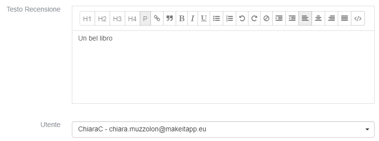

## Import / Export content

In the CMS you can **import / export** data from CSV or JSON files by clicking on the triangle next to the collection name at the top of the CMS. A pop-up will appear from which to choose whether to import or export data.

When you export data, you can also choose two settings:

1. whether to display in the file the **id** or the **label**. To give an example if my id is **createdAt** and my label is **Creation Date** maybe to a third party the label is clearer.

2. you can choose to download a file with delimiter **,** or **;**. **;** is useful if you export a file in .csv format and you want to view it with excel

The import feature can work both as insertion and as update:

* If the imported documents do have the field **id** then the documents of the existing collection matching that **id** will be updated.
* If the imported documents do not have the field **id** then new documents are added to the collection.

**To import a .csv file you need to follow some guidelines.**

Download the *"Template"* to be completed. Open the Template in Excel. If the file is not automatically in separate columns go to "Data", click "Text in columns", select "Delimited", select as "comma" delimitation, and click on Next.
At this point the file will be ready to be compiled
The fields from **ID** to **TRASH** are NOT to be completed because they are fields that are automatically generated by the system.
The other cells must be filled according to how the *Data Modeller* has been set (go to your Data Modeller - select the collection - go to tools - properties - show default properties).

Each property has been assigned a specific type of data.
The main types can be:

* String
* Number
* Object
* Array

For each property you need to fill in the file with a specific formatting. The "" are fundamental and must be without thanks (ie not "")

* string = normal text
* number = 113213
* array = ["" value "", 2],
* object = {"" key "": "" value ""}

At this point you can import the file.

## Display the contents

Where there is a lot of content, such as the many library book tabs, you can use the **tab filters** at the top of the search bar.

You can view all (All), only published elements (Publish), only elements in drafts (Draft) and finally items in the trash (Trash).

** **

### Use search filters

By clicking on the filter symbol at the top right you can do an advanced search, very useful when you have a lot of data to consult.

From here you can search for specific properties.

For example, if you want to look for all the books published by Smith & Smith, proceed as follows:

* First field: click on Publisher, which is the property concerned

* Second field: selection of a comparator, which in this case will be *equals*

* Third field: I type Smith & Smith which is the publisher I want to search.

The results of the research will appear in the table, above will be dynamically present the different active filters on the current research.

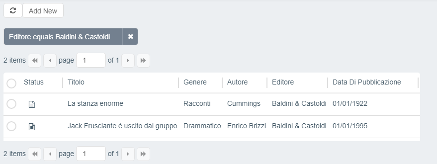

You can also add additional search filters that will be added to the one just made.

* Example *: the search for all books by Smith & Smith published since 1995.

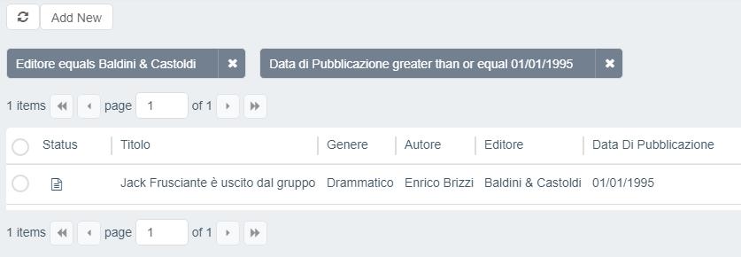

#### How a filter of an empty property works

Nowadays, it is possible to filter a property field to retrieve only the empty ones by using the ***isEmpty*** operator.
We consider the following value as empty:

* `null` null value, regarding all the filterable types
* `""` empty string, regarding filterable `string` type
* `[]` empty array, regarding filterable `array` type
* `{}` empty object, regarding filterable `object` type

:::note
Not all the fields are filterable, for example an `array` type using a ***interfaceType*** equals to `rawarray` is not displayed
in the list of properties to choose.
:::

### Save search filters

Once created, search filters can be saved for future usage.

With one or more filters active, click on the `+` button to the left of the *add filter* button, and you will be prompt with
a dialog where you can define the following properties:

* `Display label`: the displayed name of the filter
* `Display by default`: whether the filter will be selected by default when the page is opened.

If you have at least one filter saved, a button with the list icon will appear next to the *add filter* button. By clicking
on it, you can view, apply, modify, and delete all the saved filters.

#### How to enable the feature

To enable this feature in your CMS you have to
[create a CRUD](../development_suite/api-console/api-design/crud_advanced) named
`cmsfilters` with the following properties (all not required and not nullable):

* `collection` (String)
* `values` (Array of object)
* `default` (Boolean)
* `label` (String)
* `userId` (String)

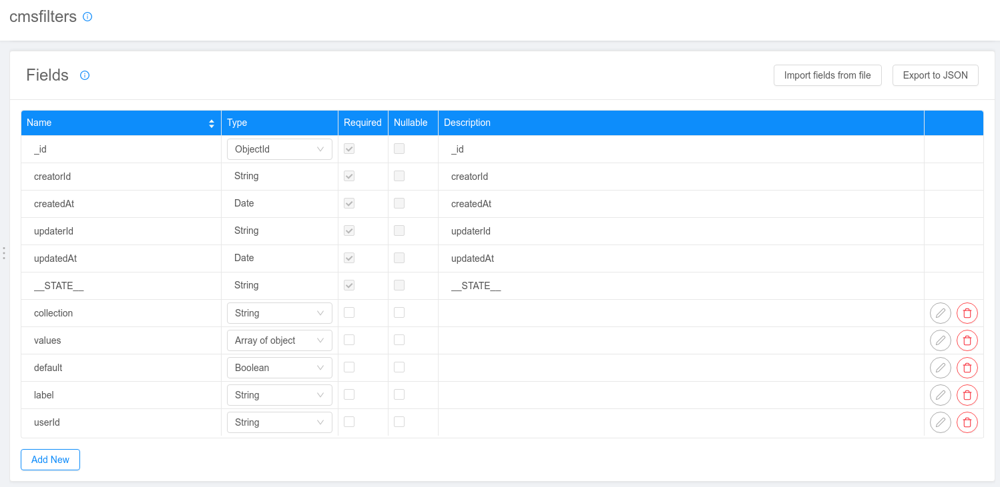

Once the CRUD is created, you have to
[expose it](../development_suite/api-console/api-design/endpoints#crud)
through an endpoint with base path `/cmsfilters`.

## Media management

In the Media collection all *uploads* are managed on the CMS: images, video, pdf and other attachments that can be recalled in the other collections, or that have been uploaded to other collections and are collected here.

For example, you will find all the covers of books from the collection of books.

As with other content, even in the media you can select an item and decide whether to publish it, keep it in draft or delete it. You can also enlarge the preview with the symbol  or re-download the file with the symbol .

## Push notifications

The CMS is enabled to send push notifications to users' devices in two ways.

* From the Push Notification collection. Clicking on Push Notification will open a window to fill in with the title, the push message and the group of users to send it to.

* From the *send push* key within a collection. It is used to send a notification about a specific item. Also in this case you will have to choose the group of users to send the notification.
Example: sending of the news related to the presentation of the new book by Smith (see paragraph News, Categories and Tags)

If, during the definition of the project, it was decided to create more user groups, then the push will also be enabled for other functions.

For example, you can decide to create dynamic groups to send a notification two days after delivery of the book.

### Text entry

### Selection fields

### Required fields

These are the mandatory fields which, if not populated, prevent the element from being saved. They are marked with an asterisk.

### The tooltips

The "i" next to the name of a field indicates the presence of a tip (tooltip): passing over it with the mouse appears the description of that field or the instructions on how to populate it.

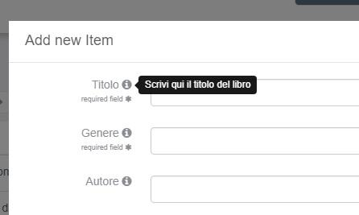

### The date fields

### Attachment upload button

### Pagination

In the lower part of the screens there are the pagination controls useful to consult the catalog of contents in the current collection.

### The logout button

By clicking on the arrow next to the username, the logout pop-up will appear to log out from the CMS.

