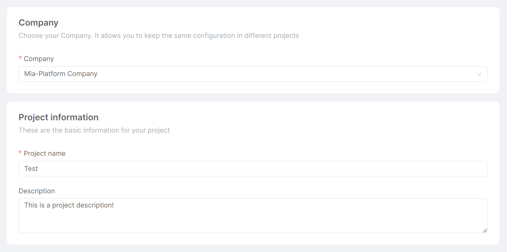
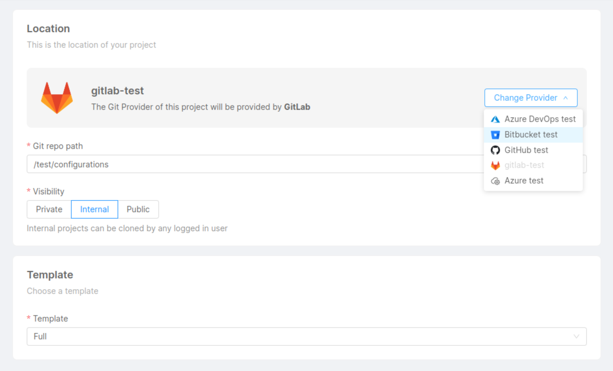
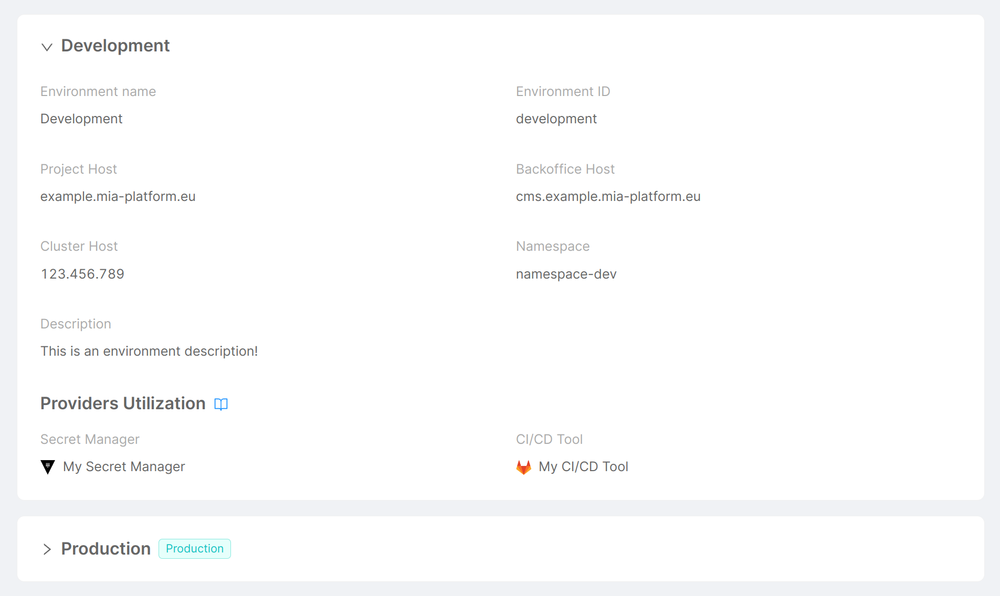

import Tabs from "@theme/Tabs";
import TabItem from "@theme/TabItem";

A Project is a resource composed of a set of APIs, microservices, and applications whose lifecycle can be entirely managed and developed through the areas of the Console.
When you create a new Project, you will be able to configure it from scratch.

## Requirements

This section informs you about the requirements needed to create a new Project.
In particular, you need to have already set up your Console and configured these three resources:

- **Company**: a company is a resource that has governance on all the projects it contains.
  It also provides the default information (providers, environments, CI/CD integration, and cluster information) that will be inherited by newly created projects.
  To create a company, please refer to the [create company guide](/development_suite/company/create.md).

- **Git Provider**: the Git Provider is the resource that will be used by the Console to correctly retrieve the third-party service configurations needed by your projects.
  You can create a Git Provider for your company by following the procedure described [here](/console/company-configuration/providers/configure-provider.mdx).

- **Template**: a template is a repository with pre-filled configurations. Each company can have one or more templates.
  The template allows you to pre-fill resources in your Project and start similar projects with the same configurations.
  In short, it constitutes a base from which your Project will be created. [Here](/development_suite/company/project-templates.md) you can find a guide on how to handle Project templates.

Once you have at least a provider, a company, and a template correctly configured, you will be able to create a new Project.

:::info
To create a new Project, you must have the permission `console.company.project.create`.
:::

## Creation process

The Project creation process is divided into three phases:
1. **General**: in this phase, you will be asked to insert general information about your Project:

  

   * **Company** (_required_): the company that you want to create your Project into, selected from a list of pre-configured companies. As mentioned before, selecting a specific company allows you to keep the same configuration for different projects;
   * **Project name** (_required_): the name of your Project. It will be shown in the Project card in the Home section of the Console;
   * **Description**: the description of your Project. It will be shown in the Project card in the Home section of the Console.

 

2. **Repository**: in this phase, you will be asked to choose the basic configurations of the repository associated with your Project and the template to start the Project from. You also will be asked to select a Git Provider, starting from the default one configured for the company:

  

   * **Git provider**: one of the supported Git Provider types. Check out the complete list of [supported providers](/console/company-configuration/providers/overview.md);

    :::caution
    At least one Git Provider must be configured at the company level in order to create the Project.
    :::

    If there are no configured Git Providers for the company, an informative modal is displayed, and you will not be able to continue.

   * **Git repo path**: the path, calculated from Project name and company, where the configuration will be saved on the Git Provider. It specifies the location of your Project on the Git Provider website;

    :::caution
    Make sure the selected Git Provider has the right permissions for creating projects on the configured path.
    :::

    Here are some tips on how to correctly configure the _basePath_ property, grouped by Git Provider:

    <Tabs>

    <TabItem value="gitlab" label="GitLab" default>

      It corresponds to the **basePath of the group** where to create the Project.

      If the group does not exist, the Project will be created only if the user has the needed permission to create the group in its parent.

      For example, if your group is reachable at the URL **`https://my-gitlab-host.eu/mia-platform/projects`**,  
      then the `basePath` must be **`mia-platform/projects`**.

      If your group does not exist (in the example groupB):

      - /groupA/groupB -> if the user has permission to create groups in groupA, then groupB will be created;
      - /groupA/groupB -> if the user has no permission to create groups in groupA, then groupB will NOT be created;
      - /groupA/groupB -> if groupA does not exist, then it will NOT be created any group.

    </TabItem>

    <TabItem value="github" label="GitHub">

      It corresponds to the **path of an existing organization**.

      If the path does not exist, the Project will not be created.

      For example, if your organization is reachable at the URL **`https://github.com/mia-platform`**,  
      then the `basePath` must be **`mia-platform`**

    </TabItem>

    <TabItem value="azure-devops" label="Azure DevOps">

      There are two different possibilities: use an already existent Azure DevOps Project with multiple
      Console Project inside it or create an Azure DevOps Project for each Console Project.

      #### A single Azure DevOps Project with multiple configurations repository

      It corresponds to the **path where your Azure Project is reachable**: the pattern is _organization-name/project-name_.

      For example, if your Project is reachable at the URL **`https://dev.azure.com/mia-platform-devops/Test`**,  
      then the `basePath` must be **`mia-platform-devops/Test`**.

      #### An Azure DevOps Project for each Console Project

      It corresponds to the **organization where to create the Project**: the pattern is organization-name_.

      For example, if your organization is reachable at the URL **`https://dev.azure.com/mia-platform-devops`**,  
      then the `basePath` must be **`mia-platform-devops`**.

    </TabItem>

    <TabItem value="bitbucket" label="Bitbucket">

      It corresponds to the **path where your Bitbucket Project is reachable**: the pattern is _projects/project-code_.

      For example, if your Project is reachable at the URL **`https://bitbucket.mia-platform.eu/projects/Test`**,  
      then the `basePath` must be **`projects/Test`**.

    </TabItem>

    </Tabs>

   * **Visibility**: the visibility states the status of your Project once it will be saved on the Git Provider. Either one of the following:

      - `public`: the repository can be accessed and viewed by anyone, including non-authenticated users;
      - `internal`: the repository can be accessed and viewed by any authenticated user within the same Git Provider instance or organization;
      - `private`: the repository can only be accessed and viewed by users who have been explicitly granted access by the repository owner.

   * **Template** (_required_): the template used by your Project, selected from a list of pre-configured templates. It adds pre-filled configurations to your Project.

 

3. ** Environments**: in this phase, you will be asked to review all the details regarding the environments that will be created for the Project:

  

   * **Environment name**: the name given to your environment;
   * **Environment ID**: the human-readable ID set to your environment;
   * **Project Host**: the host which exposes documentation and APIs;
   * **Backoffice Host**: the host which exposes CMS and backoffice APIs;
   * **Cluster Host**: the IP of the Kubernetes cluster where the Project will be deployed;
   * **Namespace**: the namespace taken from Kubernetes;
   * **Description**: the description of your environment;
   * **Secret Manager**: the provider configured as a Secret Manager for the environment;
   * **CI/CD Tool**: the provider configured as a CI/CD Tool for the environment.

 

Once your Project has been created, you will be redirected to the **Project Overview** area.

Here you will be able to see the [Project basic settings](/console/project-configuration/project-settings.md), the [Project environments](/console/project-configuration/manage-runtime-environments/index.md) and a list of [environment variables](/console/project-configuration/manage-environment-variables/index.md):

### Environment Variables

Once you create a new Project, your Project will already include variables.

Some variables will be already pre-filled from the Project or the company default settings, such as `_CMS_IMAGE_NAME_`, `_LOG_LEVEL_`, and `_CRUD_LIMIT_CONSTRAINT_ENABLED_`, while others will not be pre-filled, such as `_NOTIFICATIONS_COLLECTION_ROUTES_` and `_NOTIFICATIONS_SERVICE_PATH_`.

:::info
All variables are **mandatory**, except for:
* `_CRUD_LIMIT_CONSTRAINT_ENABLED_`;
* `_NOTIFICATIONS_SERVICE_PATH_`;
* `_NOTIFICATIONS_COLLECTION_ROUTES_`.
:::

All mandatory variables that are not pre-filled, such as `_MONGODB_SHORT_URL_`, `_MONGODB_URL_`, and `_REDIS_HOSTS_`, need to be manually configured.

### Namespaces

The Console automatically tries to create the namespace for each environment in the Project, and if the creation is successful it also sets the following labels in the namespace:

| Label                         | Value       |
| ----------------------------- | ----------- |
| `mia-platform.eu/company`     | `tenantId`  |
| `mia-platform.eu/environment` | `envId`     |
| `mia-platform.eu/project`     | `projectId` |

After the Project creation phase, you have to commit and deploy your new Project to effectively conclude the process.

### Project Metrics

When a production environment is defined for a Project, a preview of its **Kubernetes Metrics** will be rendered inside the related card on the Home Page. These metrics will show the following information:

- Environment name;
- Status (healthy, down);
- Number of pods up and running;
- CPU usage;
- RAM usage.
