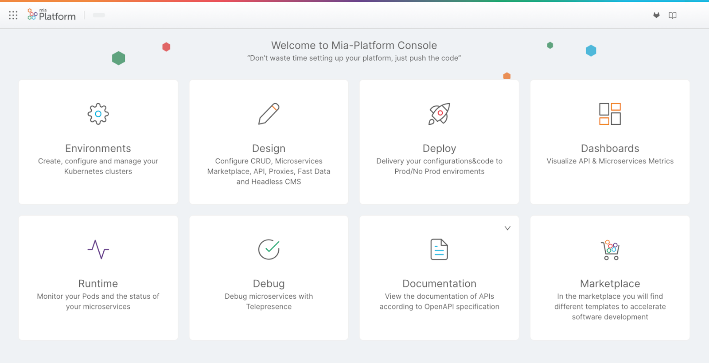
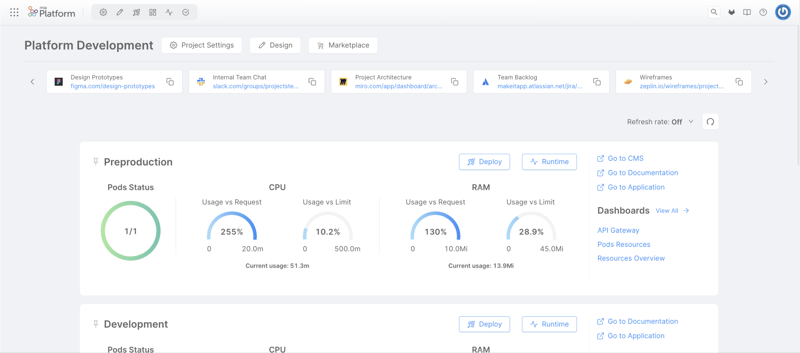
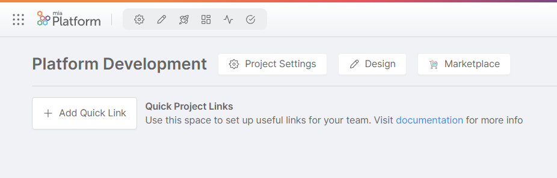
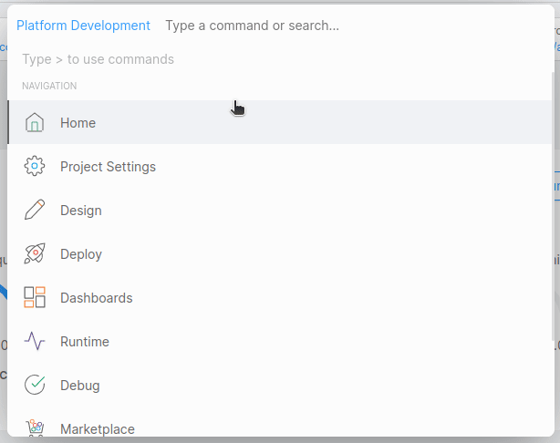
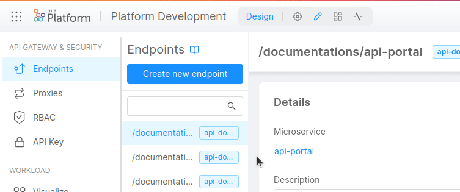
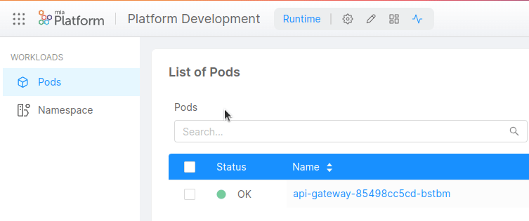
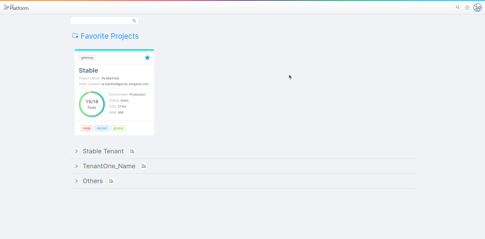
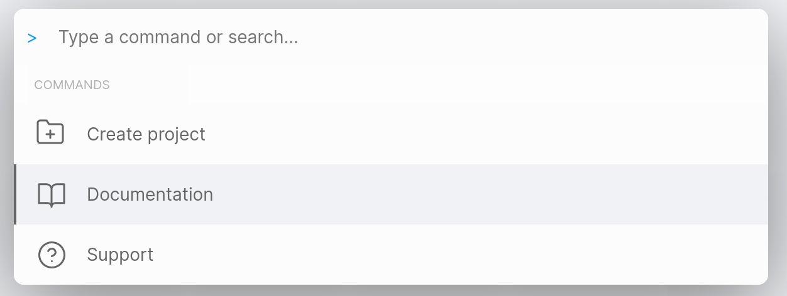

In Mia-Platform, a "Project" is not merely a collection of microservices. Instead, it's a structured aggregation of microservices, configurations, and data. This grouping might represent an entire digital ecosystem or just a specific component within it.  
  
Within the platform's hierarchy, a "Project" sits beneath a "Company", allowing a single business entity to have an overarching view and manage multiple projects simultaneously. Such an arrangement provides organizations with unique flexibility, facilitating the adaptation and scalability of their projects based on specific operational and strategic needs.

The Project is structured into various sections, each with a specific purpose to manage the application's lifecycle. 

## Homepage

There are two different Homepages:

* [The Basic Homepage](#basic-homepage) allows you to view the various features offered by the Console and navigate them easily by clicking on one of the cards.
* [The Homepage Metrics](#metrics-homepage) allows you to view the status of the project, including environments, pods status, and requests / limits of CPU and RAM.

:::info
You can switch between the Homepages using the `⌘ + K` (alternatively, `ctrl + K`) keyboard shortcut.
:::

### Basic Homepage

  
The Basic Homepage allows users to quickly access the relevant information of each project developed on Mia-Platform. Moreover, the user can easily be redirected to the most used Areas in the Console. This visualization is great for Console newcomers who will benefit from always having all the Console Areas displayed at once.

### Metrics Homepage

  
The Metrics Homepage is structured in different cards, and each card represents a different environment of your project. You can pin to top one card at a time using the button at the left of the environment name. For each card, the user can see:

* The time of the last deployment;
* The [Pods Status](#pods-status);
* The [CPU and RAM](#cpu-and-ram) resources;
* The navigation to the Deploy, Runtime, and to other [Project links and Dashboards](#project-links-and-dashboards).

Data can be manually or automatically refreshed. The manual refresh updates data on user request, while the automatic refresh allows you to set a time rate for automatically update data.

* **Manual refresh**: click the refresh button on the top-right corner;
* **Automatic refresh**: click the dropdown menu on the left of the refresh button and choose the time rate. By default the refresh rate is Off.

In addition, above the previously mentioned cards, there is a space in which the Project Administrator (or Company Owner) can set up and manage other kinds of links related to the project. When the links are configured they will be visible as a carousel of small clickable cards to all Project users.

#### Pods status

Pods status shows how many pods related to the project environment are ready. A warning notification will appear if there is at least one pod not ready or restarted. This warning notification links to the list of warning pods in the Runtime Area.

#### CPU and RAM

CPU and RAM show infographics about main KPIs:

* **Usage vs Requests**: shows the percentage of used resources compared to the requested ones. The percentage value can be above 100%, meaning that you are currently using more resources than are requested.
* **Usage vs Limits**: shows the actual usage of resources compared to the limits set for your microservices. The graph color will become yellow to warn you that the usage has exceeded the 75% of the limits you have set. This means that you have almost reached the maximum amount that you want to be allocated for that resource.

The CPU usage is measured in millicores, the RAM capacity is measured in mebibytes.

If no threshold has been set for all your microservices, the graphs will display NA (Not Available).  
At the bottom of the graphs, it is possible to see the current usage, which represents the usage of CPU or RAM when you loaded the homepage.

:::info
Limit and Request are calculated as the sum of all the containers limits and requests of each pod respectively. For this reason, [HPA](/development_suite/api-console/api-design/replicas.md#what-needs-the-replicas-for) changes are taken into account.
:::

#### Project links and Dashboards

On the right side of each Environment card, you can find links specific to each environment, that can be configured to redirect you to your project Documentation, CMS and Application. In addition, in the Dashboards section - visible on the right side of each environmental card - you can find the names of the first dashboards created in your project. By clicking on one of them, you will be redirected to the corresponding dashboard in the Dashboards Area. You can also click on "View all" to see all of the available dashboards.

:::info
To learn how to configure the environment links of your project, visit [this page](/console/project-configuration/manage-runtime-environments/index.md#environment-links-configuration).
:::

Moreover, above the Environment cards, the Project Administrator (or Company Owner) can set up other useful links that make it easy for you to access other tools related to your project. These quick links will appear at the top of the Metrics Homepage as a carousel of small clickable cards.

Since these links will be visible to all the project members, this functionality may facilitate the admin in better structuring workflows and speeding up team processes. In this regard, we suggest setting up - even at an early stage - all those links that should generally be considered necessary by default for every project. For instance, it might be useful to have quick access to shared drives (Google Drive, Office, etc), project documentation pages, an issue tracking board (Jira, Trello, etc), design graphics and so on. To configure the links for the first time, the Project Administrator/Company Owner only needs to click on the "Add Quick Link" button displayed on top of the Metrics Homepage.

Another way to retrieve the project links is to use the `⌘ + K` (alternatively, `ctrl + K`) interface and click on the "Project Links" section.

## Console Sections

Mia-Platform Console is divided in many different sections that help you manage the full lifecycle of your digital projects, from the set up of your K8s clusters to APIs and microservices design. Run your CI/CD pipelines, deploy on every kind of environment and monitor the performances of your runtime applications.

### Sections Navigation

All the sections can be reached using Mia-Platform Console Homepage or by using the pop-up menu in the left side of the topbar.

If you wish, you can add up to 6 sections to your Favorites sections, you just need to click con the associated star. That will make them always accessible from the top navbar. You can remove a section from the favorites ones by clicking again on its star.

Another option to easily switch among Console sections, or to select a specific project, is to use the `⌘ + K` (alternatively, `ctrl + K`) interface. This interface can also be opened using the menu on the right side of the topbar.

Once opened the interface, you can also type `>` and a selection of useful commands will be displayed.

### Environments & Private Variables

The Environments & Private Variables section contains all the information about the environments on which your applications are deployed and executed. Nowadays, it is common to have multiple runtime environments: for example, you can set an environment for tests and another environment for production. The Console is built with this concept in mind, and thus provides support and tools for you to easily manage multiple runtime environments.

You can deploy the same codebase to different runtime environments, obtaining different behaviors based on some environment configuration, like environment variables. Another notable change is the actual hardware on which the runtime environment runs, which is usually more performant for production environments.

[More information about Environments & Private Variables here](/console/project-configuration/manage-runtime-environments/index.md)

### Design

The Design section allows you to modify the configuration and architecture of your project by customizing the use of various resources. From this section you can add, edit and delete resources such as CRUD, Microservices, Endpoints and much more.

You will be able to define the limits of each microservice, the variables to be used, define the RBAC rules, and configure any other aspect related to the creation of your digital platform.

[More information about Design here](/development_suite/api-console/api-design/overview.md)

### Deploy

The Deploy section is the Console area that allows developers to deploy configurations of a specific project on different runtime environments. It can also be used to visualize the history of previous releases on that project.

This section allows you to follow in a simple and effective way a Continuous Deployment approach, integrating automated tests and releasing new code versions without damaging the existing project.

The Deploy Area is divided into two Sections: Deploy and History. When a user enters the Deploy Area, they are automatically led to Deploy Section.

[More information about Deploy here](/development_suite/deploy/overview.md)

### Dashboards

The Dashboard section allows you to keep the tools you use to monitor your project close to its configuration. In this section, which is accessible from the main menu, you can visualize the dashboards you created with your monitoring tools (such as Grafana, Kibana, etc.).

From this section, you can add, edit, and delete dashboards. Each environment has its own dashboards, since you usually want to monitor a specific environment. Changes to dashboards in one environment will not affect dashboards in the other environments.

[More information about Dashboards here](/development_suite/monitoring/dashboard.md)

### Runtime

The Runtime section is the Developer Console area dedicated to the control and monitoring of its infrastructure.

The area has a subsection for each environment existing in the specific project. In the top-right dropdown, it is possible to change the environment to monitor. Within each environment, you can view all the workloads that you can monitor, such as pods, using the sidebar on the left.

From here you are able to access individual pod logs. If necessary, you can manually select and restart pods.

[More information about Runtime here](/development_suite/monitoring/introduction.md)

### Debug

The Debug section shows the list of all the microservices developed with the Developer Console.
At the first level you have the necessary information to understand the health of the service: whether it is active or not, and the memory levels used.

The real potential of the debug area is its connection with telepresence. Pressing the "Debug" button will in fact display a string to be pasted on your terminal that simulates the behavior of your microservice in a real context. Telepresence is an open source tool that lets you run a single service locally, while connecting that service to a remote Kubernetes cluster.

[More information about Debug here](/development_suite/debugging/telepresence.md)

### Documentation

The Documentation section is a vital part of any Restful API in order to drive consistency and discipline across your API development workflow.

The Documentation section in the Developer Console area exposes the Open API documentation of all services and CRUDs that you have defined and exposed. In this way, you will be able to obtain information about the routes exposed by your resources from a single section, and to test the correct functioning of each of them. You can share API documentation both internally within your company, and externally to partners and suppliers.

To test each API, you can access your tags on the right side of the screen, where the APIs are grouped according to their tags: by clicking on one tag, you will visualize all the APIs that belong to that tag.

[More information about Documentation here](/console/project-configuration/documentation-portal.md)

### Marketplace

The Marketplace section contains several code resources to develop your microservices. You can also access Mia-Platform Marketplace from the Design area of Console, when you are creating a new microservice.

You will see a set of Plugins, Examples, Templates and Applications that you can choose from to easily set-up a single microservice or a bundle of microservices with predefined and tested functionalities.

You can start from a:

* Plugin: a ready-to-use Microservice powered by Mia-Platform or a Certified Partner;
* Template: a base repository (open source in the Mia-Platform Marketplace GitHub page) from which you can start to create a new Microservice;
* Example: a specific use-case, a ready-to-use model to create your Microservice;
* Application: a bundle of resources including Plugins, Templates and Examples, or resources like CRUD, Endpoints, etc;
* Docker Image Name: an existing Docker image of a Microservice.

[More information about Marketplace here](/marketplace/overview_marketplace.md)

### What's new

The **What's new section** is a valuable resource to stay updated with the latest developments and news about the Console. Whenever a new feature is introduced or there is relevant information to share, it will be displayed in this section.  
You can access it by clicking on the question mark icon located in the top bar of the Console interface. To ensure you never miss any important updates, a notification symbol will alert you whenever there are new unread items.

The primary purpose of this section is to keep you informed about significant enhancements and announcements accompanying each version upgrade of the Console. By regularly checking this section, you can stay up to date with the latest improvements, new features, and other useful updates that can enhance your experience and maximize the benefits of using the product.
