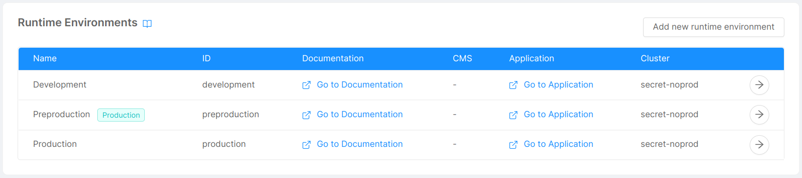
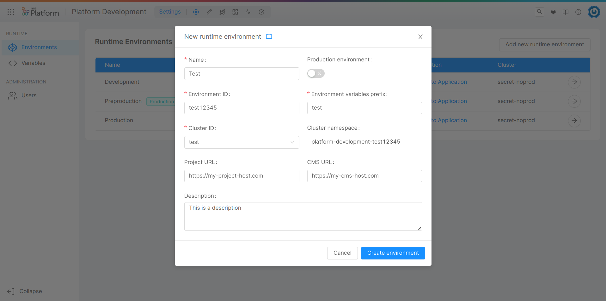
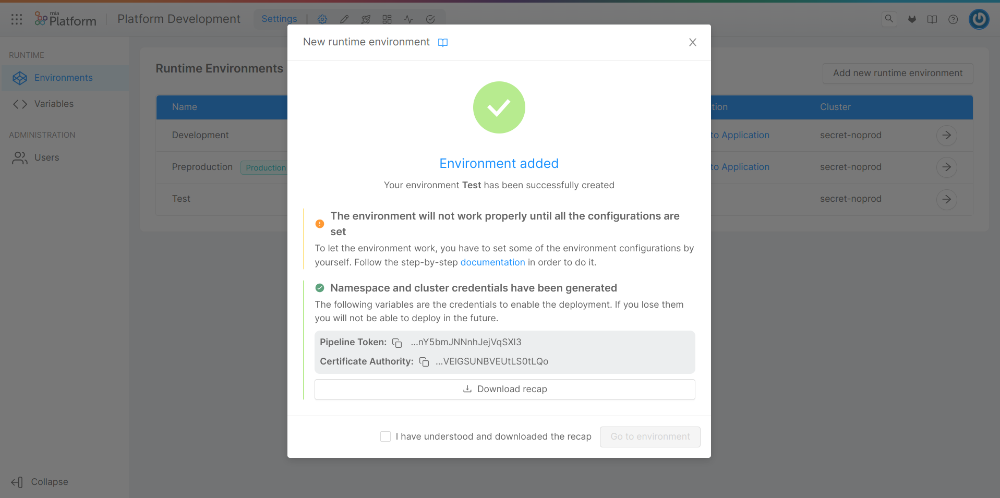
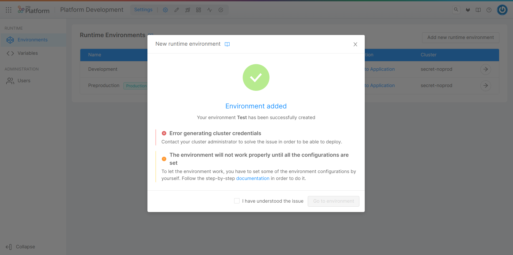
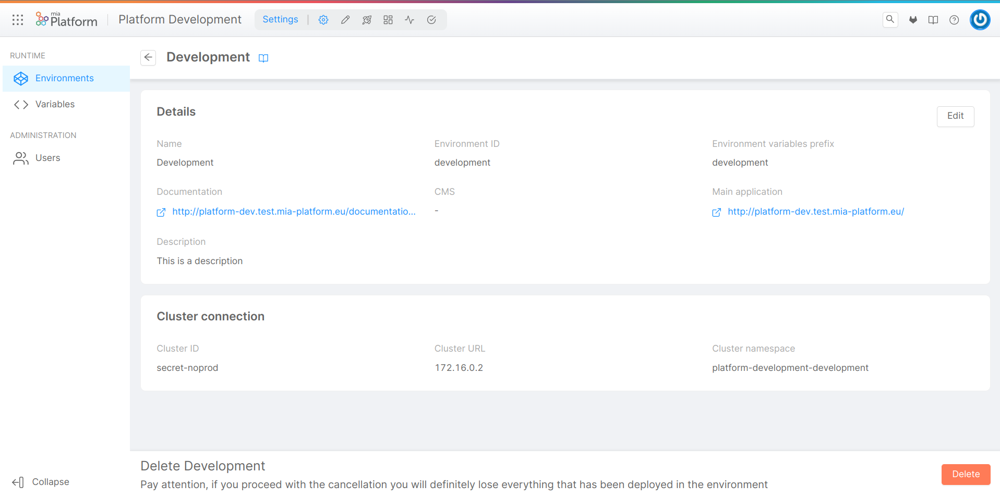
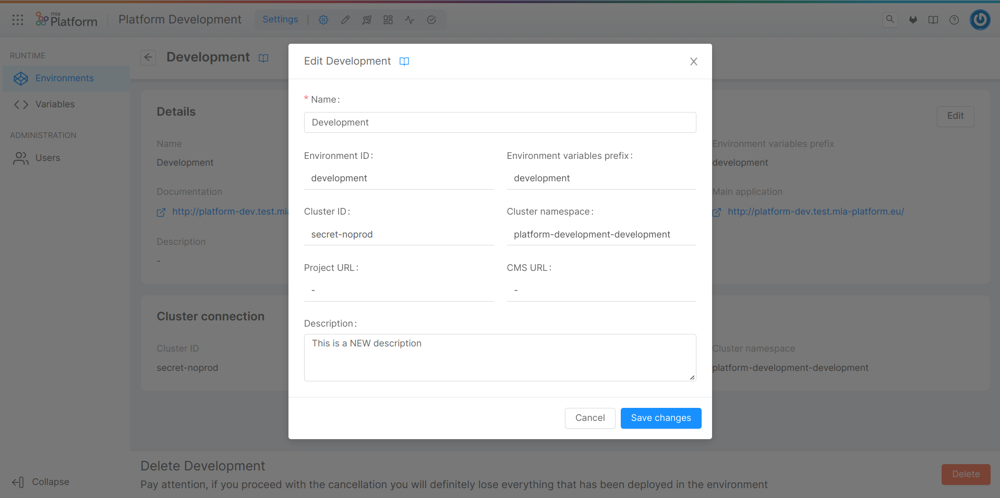
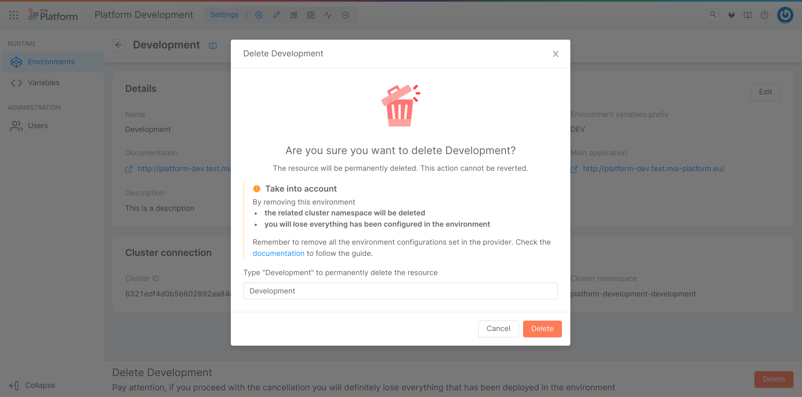

Runtime environments are the set of computer systems, servers, networks, storage, etc. where the applications are released and executed. Nowadays, it is common to have multiple runtime environments with different connotations - for example, one dedicated to production and one for testing bugs or new features. The Console is built with this concept in mind, and thus provides support and tools to easily manage multiple environments.

You can deploy the same codebase to different environments obtaining different behaviors based on some configurations like via [environment variables](/console/project-configuration/manage-environment-variables/index.md). Another notable difference is that different environments may differ in hardware resource usage, and it is therefore possible to maintain more resources (or the more performant ones)for production environments and not for testing environments.

The Console handles environments in a project-specific manner. When creating a new project, it will inherit the runtime environments configured in the company it belongs to. After creating a project it is possible to add, edit and remove them for the specific project. Each runtime environment runs in a dedicated Kubernetes namespace in the configured cluster.

In the Overview area, you can have an overview of the runtime environments configured for the project through a Runtime Environments card, which displays a table with a row for each environment, as shown in the picture below.



The table displays information in the following columns:

* **Name**: a label given by the user to recognize the runtime environment;
* **ID**: the human-readable ID of the runtime environment;
* **Documentation**: a link to the main documentation deployed in the runtime environment;
* **CMS**: a link to the main CMS deployed in the runtime environment;
* **Application**: a link to the main application deployed in the runtime environment;
* **Cluster**: the ID of the cluster to which the runtime environment is linked.

A label also appears next to the name to identify production environments.

## Add an Environment

You can add a new environment by clicking on the "Add new runtime environment" button, located in the top right corner of the page. A modal will show up, and you will be asked to fill a form containing some information related to the environment:

* **Name** (*required*): a label given by the user to recognize the runtime environment;
* **Production environment**: a toggle that specifies whether or not the runtime environment is a production environment;
* **Environment ID** (*required*): the human-readable ID of the runtime environment;
* **Environment variables prefix** (*required*): a string used as a prefix for environment variables related to the runtime environment;
* **Cluster ID** (*required*): ID of the Kubernetes cluster on which the runtime environment runs (if you want to run the environment on a new cluster you need to [add the cluster](/development_suite/clusters-management/connect-and-manage-cluster.mdx) first);
* **Cluster namespace**: the namespace of the Kubernetes cluster the runtime environment runs on (automatically generated from Company ID and Environment ID);
* **Project URL**: the URL - consisting of protocol + host (final slash '/' optional) - on which the project itself is exposed, together with API Portal and Dev Portal (e.g., [https://my-project-host.com](https://my-project-host.com));
* **CMS URL**: the URL - consisting of protocol + host (final slash '/' optional) - on which the CMS of the project is exposed (e.g., [https://my-cms-host.com](https://my-cms-host.com));
* **Description**: a brief description of the runtime environment.



By clicking on "Create environment", the new runtime environment will be generated, and it will appear as a new entry in the table.  

:::info
If the Console service account has proper permissions, the namespace on the Kubernetes cluster will be created as well. If not given the permissions, the project will be created but not the namespace (this could be useful for some environment where the namespaces must be created following a specific process).
:::

:::warning
After you have created the runtime environment from the Console, you must properly configure your project on your Git provider to allow the Console to successfully run the deploy task. Click [here](/console/project-configuration/manage-runtime-environments/configure-a-new-environment.mdx) for more information.
:::

### What happens behind the scenes?

When the user requests the creation of a new runtime environment, the following operations are performed:

1. Further validation on environment ID and namespace format;
2. Update of the reference project, in which the new environment is added;
3. Retrieval of the credentials of the Kubernetes cluster on which the environment will be created;
4. Creation of the namespace associated with the environment;
5. Creation of the service account for the newly created namespace;
6. Creation of the secret associated with the service account, which includes Pipeline Token and Certificate Authority;
7. Creation of the role binding to assign the service account the ability to deploy.

If there are no errors, the creation modal will display a successful feedback containing the credentials (Pipeline Token and Certificate Authority) required for deployment. It is possible to manually copy the credentials, or download them in JSON format using the "Download recap" button.



:::info
If the Kubernetes cluster has not been properly prepared (and consequently does not have a reference service account that can be associated with the new namespace), steps 4-7 are skipped, and the successful feedback is shown to the user without credentials. The user will then **not** be able to deploy without further actions on the cluster.

[Here](/development_suite/clusters-management/cluster-setup.mdx#cluster-preparation) you can find more information on how to setup your cluster.
:::

The action of creating the environment will instead result in an error if problems occur in steps 1-3. In case of issues in steps 4-7, the modal will still show a successful feedback, along with an error warning prompting the user to contact their cluster administrator.



## View Environment Information

By clicking on the arrow button located in the rightmost column of an environment entry in the table, a new page will show up, displaying information about the specific runtime environment through 2 cards:

* **Details**: this card shows information inserted by the user when creating a new environment, along with the links to Documentation, CMS, and Application, automatically generated and previously shown in the respective table entry, and allows to modify some information through the "Edit" button in the top right corner, as further explained [below](#edit-an-environment).

* **Cluster connection**: this card simply shows information (ID, URL, namespace) about the Kubernetes cluster the runtime environment runs on. This information is not editable.



## Edit an Environment

As mentioned in the previous section, through the "Edit" button in the top right corner of the Details card, it is possible to modify some information inserted by the user while creating the runtime environment. A click on the button opens a modal very similar to the one seen when creating the environment, but in which all the fields are read-only except for Name and Description. By clicking on "Save changes", the environment information will be updated.



## Remove an Environment

In the bottom part of the page, there is a footer which allows to delete the runtime environment from the Console. By clicking on the "Delete" button, a modal will be displayed, asking for confirmation of the deletion.



After entering the name in the input field and clicking "Delete," a loading and finally a feedback of successful removal will be shown. Closing the modal will then redirect you to the environments table. In case of errors, an informative feedback will be shown instead, and the "Close" button will not perform any redirection.

:::warning
As mentioned in the warning displayed in the deletion modal, the runtime environment deletion implies the deletion of the related cluster namespace and all resources configured within the environment.
:::
:::warning
After you have deleted the runtime environment from the Console, you are tasked with properly cleanup your project on your Git provider from the resources and pipelines needed for that environment. Click [here](/console/project-configuration/manage-runtime-environments/delete-an-environment.md) for more information.
:::

## Manage Runtime Environments via CMS

In this section, you will learn how to manage your runtime environments using the CMS. In case you don't have access to it, please contact your Mia-Platform referent.

Using the CMS, it is possible to create, update, and delete runtime environments. More about the creation process can be found [here](/console/project-configuration/create-a-project.mdx#step-3-environments), while information about editing from the CMS can be found [here](/console/project-configuration/create-a-project.mdx#step-6-customize-the-project-with-additional-information-optional).

In order to edit the information available in the Runtime Environments table (you can edit environment properties, add new links or change the current ones), you need to access your `Project` properties. There, you will find the objects `Environments` and `links`, whose schema is described below. You only need to edit them through the dedicated drawer or modal and save your changes.

### Environments configuration

```js
   [
    {
      label: 'Your Environment Name',
      envId: 'your-env-id',
      hosts: [{
        host: 'your.env.test.host',
        isBackoffice: false
      }, {
        host: 'your.env.prod.host',
        isBackoffice: false
      }],
      cluster: {
        hostname: '123.456.789',
        namespace: 'your.cluster.namespace'
      },
      description: 'your cluster description'
    },
    {
      label: 'Your Second Environment Name',
      envId: 'your-second-env-id',
      hosts: [{
        host: 'your.second.env.test.host',
        isBackoffice: false
      }],
      cluster: {
        hostname: '123.456.789',
        namespace: 'your.second.cluster.namespace'
      },
    }
  ]
```

### Environment Links configuration

```js
{
  cms: {
    path: 'my/cms/path',
    isBackoffice: true
  },
  application: {
    path: 'my/application/path',
    isBackoffice: false
  },
  documentation: {
    path: 'my/documentation/path',
    isBackoffice: false
  },
  custom: {
    path: 'my/custom/path',
    isBackoffice: false
  }
}
```

Every link specifies a path that is going to be concatenated to a base URL defined in the environment host if their `isBackoffice` property matches. This means that you only need to specify the path of these links once, and the system will automatically generate the correct links for the environment, which will be shown in the table. In case you have multiple hosts for the same environment, you will get one link for each host of each environment.

In case your link has an `isBackoffice` property set to a value which doesn't match any of the hosts `isBackoffice` property values, then a default value will be displayed.

:::info
If the `isBackoffice` property is not set, it is considered to be falsy.
:::

More specifically, the defaults based on the link types are:

* **Documentation**: the host with `isBackoffice` property set to `false` concatenated with `/documentations/api-portal`;
* **CMS**: the host with `isBackoffice` property set to `true`;
* **Application**: no default value is present.

The `custom` element can be named as you wish, and you can have any number of custom links. The name you write in the configuration will be the label of the link in the table.
